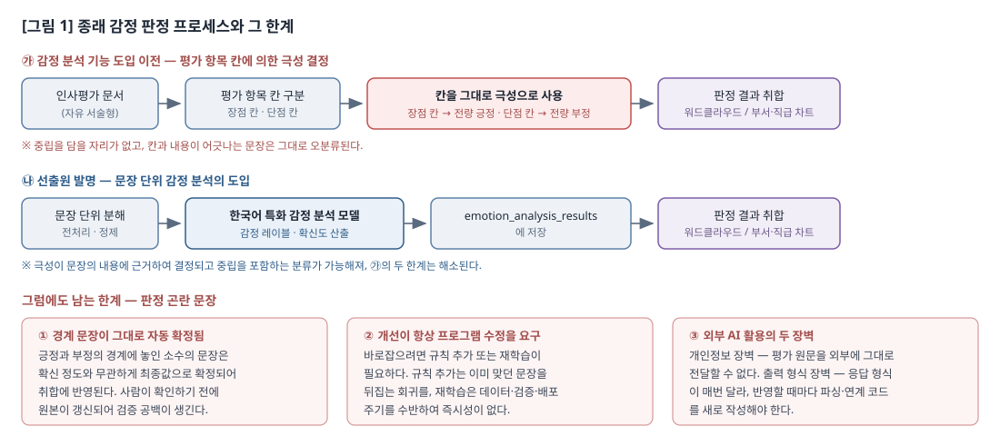
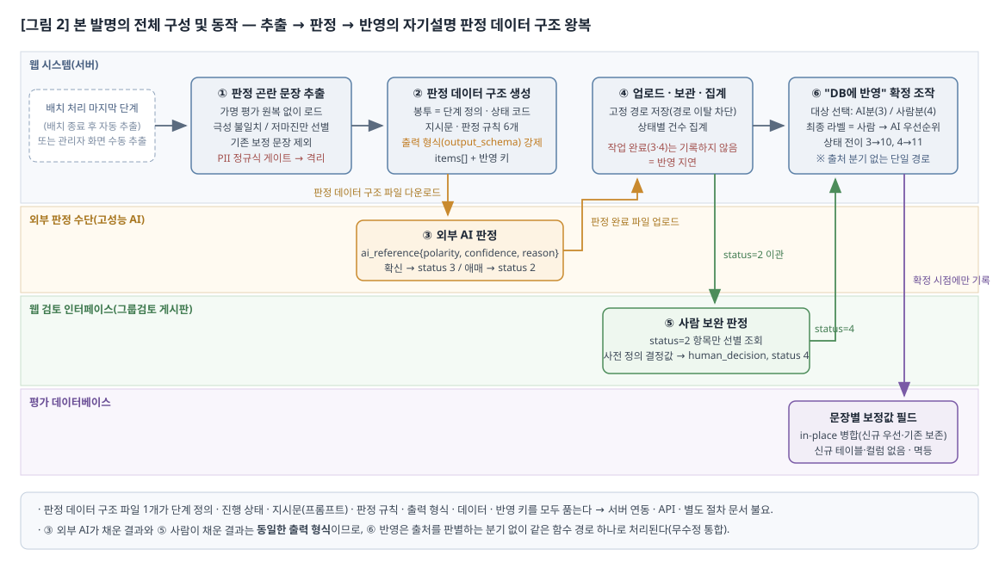
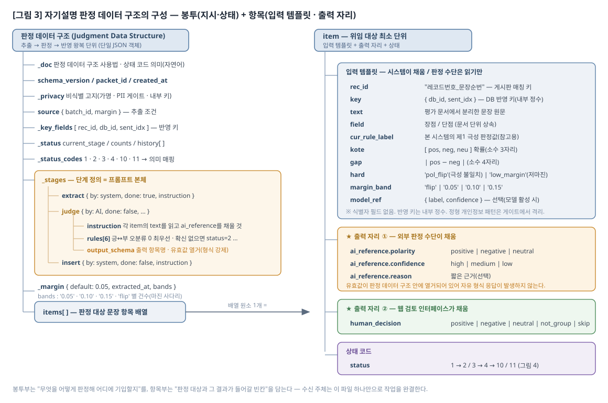
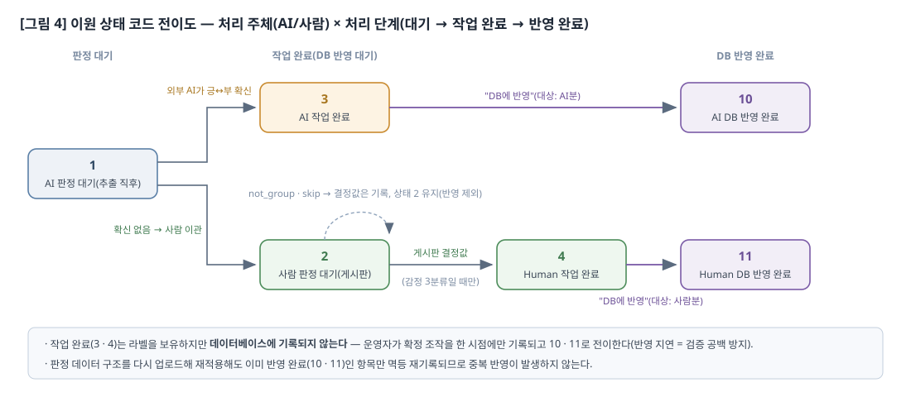
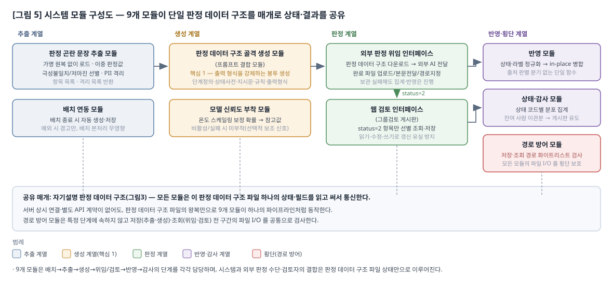
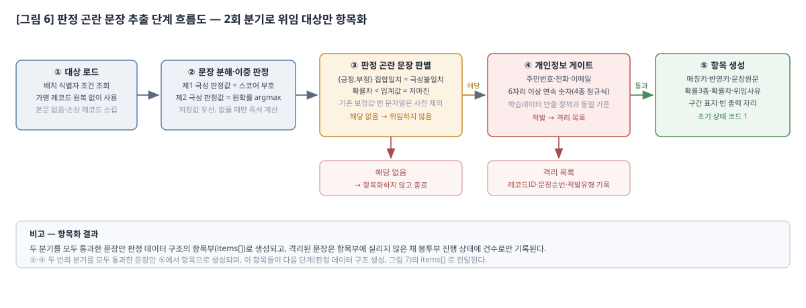
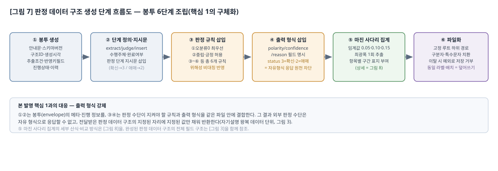
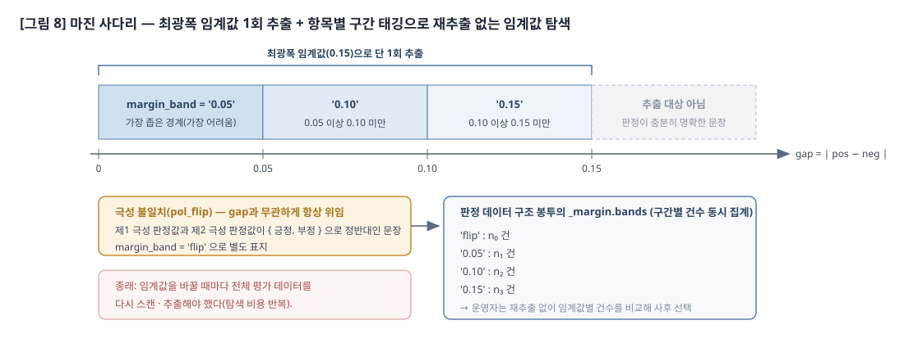
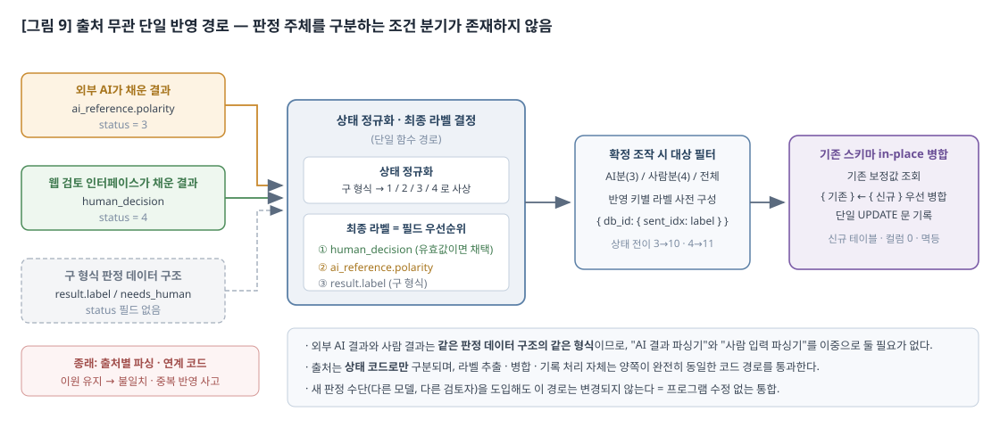

> `rev-260811-03` — 최초 발행 2026-07-27 · 최종 개정 2026-08-11 (당일 제3차)
>
> **제출본에서는 이 블록을 제거한다.** 사내 발명신고서 양식은 4항목 고정이라 이력을 본문 항목으로 둘 수 없으나, 그것이 이력을 생략할 사유는 아니다(`.clinerules/common/core/22-doc-numbering.md` NUM-9 RV-2·RV-4). 청구항·근거 대사표 쪽 이력은 `_내부검토_청구범위-근거대사표_260806_수정안.md` 머리말에 있다.
>
> **개정 이력** — 아래 1~5는 260811 에 **소급 복원**한 행이다. 원본 `../발명신고서_260727.md` 와 본 파일을 직접 대조해 확인한 항목은 「실측」으로 표시하고, 그 밖의 항목은 출처 문서를 밝힌다.
>
> | # | 개정일 | 위치 | 변경 전 | 변경 후 | 사유 |
> |---|---|---|---|---|---|
> | 1 | 260807 | 2항·3항·4항 본문 | 한계 7항목 · 효과 7항목 | **한계 8항목 · 효과 8항목**(1:1 대응 유지, **실측**: 현 파일 한계 8·효과 8 + 확장성 1) · §2 소제목 환원 및 장점 인정 문장 복원 · 시대 구분 분리 · 가명 기재 정정 2개소 · §3(1) 「항상」 완화 · 「하드케이스」 제거 · 표 2개 → 트리 블록 · 입력/출력 템플릿 정의 · 굵은 글씨 19개소 제거 · 기호 계층 28개소 복원 | 발명신고서 양식 정본 준수 및 검수 지적 반영. 출처: 계획서 `07_01_patent-fix-plan.md` 209행 이행분 |
> | 2 | 260807 | 도면 전체 | 그림 1~6 (`fig5`=마진 사다리, `fig6`=단일 반영 경로) | 그림 1~9 — 본문 등장 순서로 번호 재부여(구 9·8·7·5·6 → 신 5·6·7·8·9), 파일명 동시 변경 | 도면 9개가 전량 존재하는데 번호가 등장 순서와 불일치 (대사표 260807 #18·260806 #6) |
> | 3 | 260810 | 1. 발명의 명칭 | 감정 판정 곤란 문장의 **외부 AI 위임 처리를 위한** 자기설명 판정 **패킷 기반** 방법 및 시스템 | **자기설명 판정 데이터 구조를 이용한** 감정 판정 곤란 문장의 **위임 판정 및 통합 처리** 방법 및 시스템 | ⑴ 청구항 1 결어와 어순 정렬 ⑵ 「외부 AI」는 청구범위 등장 0회 ⑶ 필수 구성인 사람 판정 경로를 「외부 AI 위임」이 배제 (대사표 260810 #19) |
> | 4 | 260810 | 본문 전체 용어 | 「(자기설명 판정) **패킷**」 — 원본 57회 | 「자기설명 **판정 데이터 구조**」 — 본 파일 「패킷」 0회 | 청구항 용어와 불일치 시 특허법 §42(4)(1) 뒷받침 흠결 소지 (대사표 260806 #1) |
> | 5 | 260810 | 도면 내부 텍스트·캡션 | 「하드케이스」·「제1/제2 판정값」이 SVG 내부에 노출 | 본문 용어로 통일 — 본 파일 「하드케이스」 0회, `figures/*.svg` 내 「하드케이스」·「패킷」 0회 | 도면 내부 텍스트가 본문 용어와 갈라져 있었음 (대사표 260810 #26) |
> | 6 | 260811 | 본 머리말 및 개정 이력 절 | 없음 | 신설 | RV-2(개정 회차 머리말)·RV-4(개정 이력 절) 미준수 상태였음. 8/10 개정분이 무엇이었는지 본 문서가 스스로 밝히지 못했다 |
> | 7 | 260811 (제2차) | §3(1) 「본 발명의 핵심」 | 「○ 본 발명의 핵심은 다음 **두 가지**이며, 전자가 후자를 가능하게 하는 인과 관계에 있다.」 + 핵심 1·2 | 「○ 본 발명의 핵심은 다음 **세 가지**이며, 핵심 1이 핵심 2와 핵심 3을 각각 가능하게 하는 인과 관계에 있다.」 + **핵심 3(확정의 유예와 그 유예 상태의 동봉)** 신설. 구 「보조 원리」의 ⑥ 이원 상태 코드와 반영 지연·⑦ 마진 사다리(임계값 동시 태깅) 2개 항목을 핵심 3 산하 「원본 반영의 유예」·「선별 기준의 유예」로 이동(문언 승계) | 선행기술조사에서 「차별화 여지 있음」으로 평가된 4개 구성 중 ⑥⑦만 보조 계층에 있었고 청구항도 전부 청구항 1 종속이어서, 독립항 1이 무너지면 함께 떨어졌다. ⑥⑦을 개별 기법으로 올리면 §2에서 각각 공지로 자인한 대상과 1:1로 마주 서므로, 「유예 상태를 판정 데이터 구조가 싣고 이동한다」는 하나의 상위 원리로 묶어 §2 반박 축(핵심 1 의존)과 일치시켰다 |
> | 8 | 260811 (제2차) | §3(1) 잔여 구성의 도입 문장 | 「○ 위 두 핵심을 실제 데이터 처리에서 성립시키기 위해 다음 **보조 원리**를 함께 사용한다.」 | 「○ 위 세 핵심은 다음 각 구성을 통하여 실제 데이터 처리에서 성립한다.」 (잔여 5개 구성의 「보조」 계층 표현 제거) | 명세서가 자기 구성에 등급을 매겨 얻는 이득이 없고, 심사에서 종속항 구성을 끌어올려 보정할 때 「보조」 자인이 불리하게 작용한다. 서술 순서는 그대로 두어 순서의 이점은 유지 |
> | 9 | 260811 (제2차) | §3(1) 「핵심 기술적 특징 요약」 | 「○ 이원 상태 코드 및 반영 지연 커밋」·「○ 마진 사다리에 의한 1회 추출·다중 임계값 비교」 2개 항목 | 「○ 확정의 유예와 그 유예 상태의 동봉」 1개 항목 산하의 「- 선별 기준의 유예」·「- 원본 반영의 유예」 + 「별도의 상태 테이블·연동 규약 불요」 3행. 각 항목의 자기설명 요소 표기(⑤·②)는 그대로 승계하고 총괄행에 (요소 ①②⑤) 부여 | 요약이 핵심 3을 반영하지 아니하면 「핵심」이 문서 안에서 두 뜻으로 갈라진다 |
> | 10 | 260811 (제2차) | §3(1) 「구성 간 결합의 인과 관계」 | 「- 상태 코드가 판정 데이터 구조 안에 실려 있고 … 연동이 다시 필요해진다.」 (1→2 인과만 존재) | 앞에 「- 위와 같은 결합 구조에 의하여, 임계값 구간 표지와 상태 코드 역시 … 결합 구조라는 하나의 원인이 출처 무관 단일 반영 경로와 확정의 유예라는 두 결과를 함께 낳는다.」 1행 신설, 기존 행 말미에 구간 표지 미동봉 시 재추출이 필요해진다는 서술 추가 | 핵심 3을 세우고 인과 사슬을 1→2 로만 두면 핵심 3이 사슬 밖에 남아, 「어느 하나를 떼어내면 그 뒤가 성립하지 아니한다」는 리드 문장과 어긋난다 |
> | 11 | 260811 (제2차) | §2 인접 기법 반박 문단(「확신도가 낮은 건을 사람 검토로 넘기는 기법 …」) | 「… 앞의 "판정 품질 자체의 개선이 언제나 프로그램 수정을 요구함"이라는 한계는 그대로 남는다.」 로 종결 | 위 문장을 **그대로 유지**한 뒤, 유예된 상태·선택지를 시스템 측 별도 저장소가 보유함을 전제한다는 서술과 「확정을 미루는 것 자체는 알려져 있으나, 미뤄진 동안의 상태와 선택지가 판정 대상 데이터와 같은 이동 단위에 실려 함께 왕복하는지는 별개의 문제이다」를 추가 | 핵심 3의 반박 축을 §2에 연결. **공지 자인(승인 시점 확정 분리·표본 선별 기법)은 삭제·완화하지 아니하였다** — 자인을 철회하면 그 자체가 결함이 된다 |
> | 12 | 260810 (**소급 등재**) | §2 인접 기법 반박 문단(현 「어려운 표본을 선별하는 기법 …」 이하 3문단) | 문단 없음 (구판 `../발명신고서_260727.md` 에 「알려져 있으나」 **0회** — 실측) | 인접 기술분야 공지기법(표본 선별·출력 형식 강제·확신도 기반 사람 이관·지연 커밋·개인정보 정규식 게이트)의 명시적 인정 및 각각에 대한 반박 논리 3문단 신설 | RV-4 결손분. 이력에 없어 어느 개정이 신설했는지 문서가 스스로 밝히지 못했다. 개정일 260810 은 **추정**이며 근거는 `../../../../../확인수정필요항목_260811.md` §0 의 반영 완료 항목이다 — 원 개정 세션의 기록이 남아 있지 않아 확정하지 못한다 |
> | 13 | 260811 (제3차) | 1항 아래 관련 출원 문단 | 「※ **관련 출원**(자기 인용) : … 을 **선출원·등록하였다**」 | 「※ **관련 선행 발명**(자기 인용) : … 을 **선행하여 발명신고하였으며, 현재 특허출원을 추진 중이다**」 | **사실 오기재 정정.** 확인 사실 대장 `27_03_completion-report/result/_FACTS.md` **F-027**(사용자 구두 확인 2026-08-10) = 사내 발명심의 통과·특허청 출원 추진 중(**출원 미완**), 저장소 내 출원 증적 없음. **F-028** 이 이 오기재를 🔴 로 등재하고 「외부 제출 전 정정 필요」라 적었으나 이후 2회 개정을 거치고도 남아 있었다. 출원번호·출원일은 미확보이므로 적지 아니한다 |
> | 14 | 260811 (제3차) | §3(2) 시스템 개요 | 「**위임과 통합의 두 국면**이 모두 동일한 판정 데이터 구조 하나를 매개로 이루어진다는 점이 본 발명의 **기본 구성이다**」 | 「위임·통합, 그리고 아직 확정하지 아니한 선택지와 진행 상태를 함께 실어 나름으로써 확정을 사후로 미루는 **유예의 세 국면**이 … 이루어진다는 점을 본 발명의 **가장 중요한 특징으로 한다**」 | 핵심을 셋으로 늘렸는데 기본 구성 정의가 둘로 남아 있었다. 아울러 양식(`patent-disclosure-form.md`)이 §3(2)에 요구하는 요지 못박기 형태를 함께 적용 |
> | 15 | 260811 (제3차) | §4 총괄 리드 · 효과 7(검증 전 오염 방지) · 효과 8(임계값 탐색 비용 제거) | 지연 커밋·1회 추출의 효과만 서술 — §2 에서 공지로 자인한 범위 안 | 세 곳에 각각 1문장 추가 — 유예된 상태·구간 표지가 **시스템 측 별도 테이블이 아니라 판정 데이터 구조 자체에 실려 이동**하므로 상태 조회·재조회 연동이 불요하다는 차별화 축 | **핵심 3 을 §3 과 청구범위에는 세웠으나 §4 가 따라오지 않아**, §2 74행에서 새로 세운 차별화 축이 효과에 전혀 나타나지 않았다. 대사표 개정 #23 이 고친 「명세서 축과 청구범위의 단절」과 같은 유형(방향만 반대) |
> | 16 | 260811 (제3차) | 본문 용어 **9개소** | 상위 개념을 뜻하는 자리의 「외부 AI」 (효과 제목 2 · 구현 단계 제목 1 · 도면 캡션 2 · 본문 4) | 「외부 판정 수단」 | 청구범위 용어는 「외부 판정 수단」 단일이다. 다만 §2 정의문이 「외부 AI」를 **그 대표적 실시 형태**로 정의하고 있으므로 **표기 흔들림이 아니라 상위·하위 개념**이며, 정의문·종래 실무 서술·실시 예 서술의 **7개소는 존치**하였다(전건 치환하면 정의문 자체가 소멸한다) |
> | 17 | 260811 (제3차) | §3(1) 잔여 구성 도입 문장 · 핵심 3 말미 · 요약 | 「위 **세** 핵심」·「**두** 유예」 등 서수 상호참조 | 「위 **핵심 1 내지 3**」·「**선별 기준의 유예와 원본 반영의 유예**」 등 이름 기반 참조 (3개소) | 개정으로 개수가 바뀔 때마다 서수 참조가 깨진다. 이번 개정에서 실제로 「두 가지」→「세 가지」 갱신이 필요했다 |

발명신고서

1.  발명의 명칭  
    □ 자기설명 판정 데이터 구조를 이용한 감정 판정 곤란 문장의 위임 판정 및 통합 처리 방법 및 시스템

※ 관련 선행 발명(자기 인용) : 본 출원인은 "다면평가 처리를 위한 통합 인사데이터 프레임워크 설계 방법 및 시스템"을 선행하여 발명신고하였으며, 현재 특허출원을 추진 중이다. 선행 발명은 인사평가 데이터를 기본 인사데이터·통합 인사데이터의 이원 JSON 구조로 통합 관리하고, 그 안의 emotion\_analysis\_results 객체에 감정 라벨·확신도를 저장하며, 그 저장 결과로부터 감정별 워드클라우드 및 부서·직급별 차트를 생성하는 프레임워크에 관한 것이다. 본 발명은 그 emotion\_analysis\_results 를 채우는 과정에서 발생하는 '판정 곤란 문장'을 외부 판정 수단 및 사람에게 위임하고 그 결과를 프로그램 수정 없이 흡수하는 별개의 구성에 관한 것으로, 선행 발명에는 산출 근거가 서로 다른 두 극성 판정값의 이원화 및 그 불일치를 판정 난이도 신호로 사용하는 구성, 위임 판정, 자기설명 판정 데이터 구조, 출처 무관 통합에 관한 기재가 없다.

2.  종래 기술의 설명 및 문제점  
    □ 현행 시스템 설명

○ 감정 분석 기능이 도입되기 이전의 인사평가 분석에서는, 취합·표출에 사용되는 극성이 문장의 내용이 아니라 해당 문장이 기재된 평가 항목 칸(장점/단점)에 의하여 결정되었다. 즉 작성자가 장점 칸에는 긍정적 내용을, 단점 칸에는 부정적 내용을 그 목적에 맞게 기재하였다는 가정에 의존하는 것으로서, 극성은 칸의 개수에 대응하는 긍정·부정 두 가지로 한정되어 중립을 담을 자리가 없고, 칸과 내용이 어긋나는 문장은 그대로 오분류되었다.

○ 선출원 발명은 이러한 한계를 해소하기 위하여, 인사평가 데이터를 기본 인사데이터·통합 인사데이터의 이원 JSON 구조로 통합 관리하고, 한국어 특화 감정 분석 모델에 문장을 입력하여 얻은 감정 레이블·확신도(confidence\_score)를 emotion\_analysis\_results 객체에 저장하며, 그 저장 결과를 기반으로 감정별 워드클라우드 및 부서·직급별 차트를 생성하는 파이프라인을 제공하였다.

○ 이로써 극성은 기재된 칸이 아니라 문장의 내용에 근거하여 결정된다. 선출원 발명의 명세서에 기재된 범위는 감정 레이블과 확신도를 산출·저장하는 프레임워크이며, 이 프레임워크 위에서 운영되는 시스템은 극성을 긍정·부정·중립의 3분류로 판정한다.

○ 평가 레코드에는 문장 순번별 최종 라벨을 담을 수 있는 문장별 보정값 저장 필드(sentiment\_corrections)가 부속되어 있다.

□ 현행 시스템의 문제점  
○ 현행 시스템은 대량의 평가 문서를 자동으로 처리하고 시각화까지 일관되게 연결한다는 큰 장점을 가지며 실무에서 지속적으로 사용되고 있다. 그러나 문장의 내용에 근거한 감정 판정이 가능하게 된 뒤에도, 산출된 판정은 그 확신의 정도와 무관하게 즉시 최종값으로 확정되어 취합에 반영된다. 그리고 어떠한 판정 수단을 사용하더라도 긍정과 부정의 경계에 놓여 판정이 본질적으로 어려운 소수의 문장(이하 '판정 곤란 문장')은 남는다. 예컨대 단점 칸에 기재된 "보완필요점에 대해서는 특별히 없음"과 같은 약점 부재 선언, 개선 요구에 해당하지 아니하는 사실 서술, 긍정과 부정의 표현이 한 문장에 혼재하는 서술이 이에 해당한다.

○ 따라서 판정 곤란 문장을 그대로 자동 확정하지 아니하고 별도로 다루는 수단이 요구되나, 종래에는 이들 문장에 관하여 다음의 한계가 존재하였다. 이하 본 명세서에서, 시스템 외부에 두어 판정을 맡기는 자연어 처리 수단을 '외부 판정 수단'이라 하고, 그 대표적 실시 형태인 외부의 고성능 인공지능 서비스를 '외부 AI'라 한다.

- 단일 판정 계통의 내부 확신도만으로는 경계 문장이 드러나지 아니함  
    · 판정 곤란 문장을 별도로 다루려면 먼저 어느 문장이 어려운지를 식별하여야 하나, 종래에는 하나의 판정 계통이 스스로 산출한 확신도 외에 참조할 수 있는 신호가 없었다. 확신도는 그 계통 자신의 기준에 의하여 계산되는 값이므로, 계통이 잘못 판정한 문장이 오히려 높은 확신도를 동반하는 경우 그 문장은 선별 대상에서 빠진다. 즉 가장 걸러내야 할 문장이 가장 걸러지지 아니하며, 확신도의 임계값을 낮추어 선별 범위를 넓히더라도 이 성질 자체는 해소되지 아니한다.

- 확신 정도와 무관한 즉시 확정  
    · 현행 운영 방식에서는 판정이 확신의 정도와 무관하게 즉시 최종값으로 확정되므로, 판정 곤란 문장에 대하여 확정을 유보하거나 사람의 확인을 거치게 할 지점이 구조상 존재하지 아니한다. 인사평가 도메인에서는 긍정을 부정으로, 부정을 긍정으로 잘못 집계하는 오류가 피평가자에게 직접적인 불이익 또는 왜곡된 피드백을 초래하여 중립과 긍정을 혼동하는 오류에 비해 위해성이 현저히 크므로, 위해성이 가장 큰 유형의 오류가 걸러지지 아니한 채 확정된다.

- 판정 품질 자체의 개선이 언제나 프로그램 수정을 요구함  
    · 선행 발명은 인사데이터 스키마에 필드를 추가하는 것만으로 새로운 분석 모듈을 파이프라인에 통합할 수 있게 하였으나, 이는 분석 기능의 확장에 관한 것이고 이미 산출된 판정의 품질 자체를 고치는 문제는 별개이다. 판정 곤란 문장을 바로잡으려면 규칙(감정 사전·표지어)을 추가하거나 모델을 재학습해야 하며, 이는 소스 코드 또는 학습 파이프라인의 변경을 수반한다. 규칙 추가는 이미 올바르게 판정되던 다른 문장의 결과를 뒤집는 회귀를 유발할 수 있고, 재학습은 데이터 축적·검증·배포 주기를 필요로 하여 즉시성이 없다. 즉 "몇 건의 어려운 문장"을 고치기 위해 "시스템 전체"를 건드려야 하는 비대칭이 발생한다.

- 외부 고성능 AI 활용의 개인정보 장벽  
    · 인사평가 원문에는 개인 식별 가능 정보가 포함될 수 있어 외부 서비스에 그대로 전달할 수 없다. 판정 곤란 문장에 한하여 외부의 더 강력한 판정 능력을 빌리려 하여도, 원문을 반출할 수 없다는 제약이 선행하여 활용 자체가 막힌다.

- 외부 고성능 AI 활용의 출력 형식 장벽  
    · 외부 AI에 자연어로 판정을 의뢰하면 응답이 산문·표·임의 JSON 등 매번 다른 형태로 반환되므로, 이를 시스템에 반영하려면 응답 형식마다 별도의 파싱 코드와 연계 코드를 새로 작성해야 한다. 결국 외부 AI를 한 번 쓸 때마다 프로그램을 수정해야 하므로, 위 "판정 품질 자체의 개선이 언제나 프로그램 수정을 요구함" 한계가 해소되지 않고 오히려 가중된다.

- AI 판정 경로와 사람 판정 경로의 이원화  
    · AI도 확신하지 못하는 문장은 결국 사람이 판단해야 한다. 그러나 AI가 반환한 결과와 사람이 입력한 결과는 형식이 서로 다르므로, 시스템은 "AI 결과를 읽어 반영하는 코드"와 "사람 입력을 읽어 반영하는 코드"를 각각 보유·유지해야 한다. 두 경로가 분기되면 반영 규칙의 불일치, 중복 반영, 한쪽 경로만 수정되는 유지보수 사고가 발생하기 쉽다.

- 판정 결과의 즉시 반영으로 인한 검증 공백  
    · 외부에서 받은 판정을 곧바로 데이터베이스에 기록하면, 판정 품질을 사람이 확인하기 전에 원본 데이터가 갱신되어 버린다. 어느 건이 AI 판정이고 어느 건이 사람 판정인지, 어느 건이 이미 반영되었는지를 사후에 구분할 수단도 없다.

- 임계값 탐색의 반복 비용  
    · 판정 곤란 문장을 "긍정 확률과 부정 확률의 차이가 임계값 미만인 문장"으로 정의할 때, 적정 임계값은 사전에 알기 어렵다. 임계값을 바꿀 때마다 전체 평가 데이터를 다시 스캔·추출해야 하므로 탐색 비용이 크다.

○ 위 한계 중 일부에 대하여는 인접 기술 분야에 개별적으로 알려진 기법이 존재하나, 그 기법들을 각각 도입하는 것만으로는 위 한계가 해소되지 아니한다.

- 어려운 표본을 선별하는 기법(두 분류기의 예측이 어긋나는 표본이나 상위 두 확률의 차이가 작은 표본을 고르는 방식)은 기계학습 분야에 알려져 있으나, 이는 어느 문장을 고를 것인가의 문제만을 다룰 뿐, 골라낸 문장을 어디에 어떻게 보내어 그 결과를 어떻게 되돌려 받을 것인가에 대하여는 아무것도 정하지 아니한다. 또한 통상의 방식은 서로 다른 복수의 모델을 별도로 학습·추론시켜야 하므로, 선별을 위한 추가 추론 비용이 새로 발생한다.

- 판정 수단의 출력을 지정한 형식으로 강제하는 기법 역시 알려져 있으나, 이는 응답 한 건의 형식을 고정할 뿐이다. 그 응답을 원 시스템의 어느 레코드에 어떤 키로 기록할 것인지, 확신하지 못한 항목을 누가 이어받을 것인지, 언제 확정할 것인지는 여전히 시스템 측 코드가 별도로 알고 있어야 하므로, 판정 수단을 바꿀 때마다 그 코드가 함께 바뀐다.

- 확신도가 낮은 건을 사람 검토로 넘기는 기법, 처리 완료와 실제 반영을 분리하여 승인 시점에만 확정하는 기법, 정형 개인정보를 정규식으로 걸러내는 기법도 각각 알려져 있으나, 이들은 모두 시스템과 판정 수단이 연동 규약(API)으로 결합되어 있음을 전제한다. 연동 규약이 존재하는 한 판정 수단의 교체는 곧 연동 코드의 교체이며, 앞의 "판정 품질 자체의 개선이 언제나 프로그램 수정을 요구함"이라는 한계는 그대로 남는다. 나아가 승인 시점까지 반영을 미루는 기법이나 선별 기준을 바꾸어 가며 대상을 다시 고르는 기법은, 아직 확정되지 아니한 진행 상태와 선택지를 시스템 측의 별도 저장소가 보유함을 전제한다. 그 결과 유예된 상태는 판정 대상 데이터와 분리되어 남고, 외부의 판정 주체가 그 상태를 알기 위해서는 다시 상태 조회를 위한 연동이 필요하며, 선별 기준을 바꾸면 추출을 처음부터 다시 수행하여야 한다. 즉 확정을 미루는 것 자체는 알려져 있으나, 미뤄진 동안의 상태와 선택지가 판정 대상 데이터와 같은 이동 단위에 실려 함께 왕복하는지는 별개의 문제이다.

○ 즉 개별 기법들이 공통으로 전제하는 것은 "처리 절차·지시·규칙·양식은 시스템 코드가 보유하고, 데이터만 오간다"는 분리이다. 위 한계들은 이 분리 자체에서 비롯되므로, 절차와 지시와 양식과 데이터와 반영 키를 하나의 이동 가능한 단위 안에 함께 담아 그 단위만으로 작업이 완결되도록 하는 구조가 없는 한 해소되지 아니한다.

○ 이러한 한계는, 문장 단위 판정 수단에 의한 자동 처리 성능을 유지하면서도 판정이 어려운 소수 문장에 한하여 외부의 더 강력한 판정 능력과 사람의 최종 판단을 "프로그램 수정 없이" 끌어들일 수 있는 새로운 구조가 필요함을 시사한다.



그림 1: 종래 감정 판정 프로세스와 그 한계 — ㉮ 감정 분석 기능 도입 이전에는 기재된 평가 항목 칸(장점/단점)을 그대로 극성으로 사용하였으므로, 칸과 내용이 어긋나는 문장이 그대로 오분류가 되고 중립을 담을 분류가 존재하지 않았다. ㉯ 선출원 발명이 문장 단위 감정 분석을 도입하여 이 두 한계는 해소되었으나, 긍정과 부정의 경계에 놓인 판정 곤란 문장은 여전히 남아 확신 정도와 무관하게 자동 확정되며, 판정 품질 자체의 개선은 항상 프로그램 수정을 요구하며, 외부 AI 활용에는 개인정보·출력 형식의 두 장벽이 존재한다.  

3.  발명의 상세한 설명  
    (1) 종래 기술의 문제점을 해결하기 위한 발명의 기술적 원리 요약  
    □ 기술 원리

○ 본 발명에서 '자기설명 판정 데이터 구조(self-describing judgment data structure, 이하 '판정 데이터 구조')'란 단순한 데이터 전달 파일과 달리,

- ① 처리 단계의 정의,  
- ② 현재 진행 상태,  
- ③ 판정 수단에게 내리는 지시문(프롬프트)과 판정 규칙,  
- ④ 판정 결과가 기입되어야 할 출력 항목의 형식과 유효값,  
- ⑤ 판정 대상 데이터와 그 반영 키  

○ 위 다섯 가지를 하나의 JSON 객체에 결합하여, 이를 수신한 주체가 외부 문서나 별도 설명 없이 판정 데이터 구조 자체만 읽고 작업을 수행·반환할 수 있도록 구성한 자기설명(self-describing) 왕복 데이터 단위를 의미한다. 이하 본 명세서에서 위 다섯 가지를 '자기설명 요소 ①~⑤'라 하고, 각 요소가 판정 데이터 구조의 어느 부분으로 구현되는지를 후술한다.

○ 본 명세서에서 '판정 데이터 구조'는 하나의 처리 단위를 구성하는 지시·규칙·양식·데이터를 결합하여 파일 형태로 주고받는 단일 객체를 가리키며, 특정 통신 규약이나 전송 단위를 전제하지 아니한다. 후술하는 봉투(envelope)부와 항목부의 구분은 메시지 설계 기법에서 착안한 구조적 표현일 뿐, 통신 프로토콜상의 계층을 의미하지 아니한다.

○ 통상의 자기설명 데이터 형식이 자신의 구조와 형식만을 데이터와 함께 기술하는 데 그치는 것과 달리, 본 판정 데이터 구조는 수신 주체가 수행하여야 할 작업의 지시와 준수 규칙, 그 결과를 기입할 자리까지 함께 담아 외부 문서 없이 작업이 완결되도록 한다는 점에서 자기완결적(self-contained)이다. 이 점이 단순한 데이터 전달 파일 및 통상의 자기설명 형식과 본 발명을 구분하는 기준이 된다.

○ 본 발명의 핵심은 다음 세 가지이며, 핵심 1이 핵심 2와 핵심 3을 각각 가능하게 하는 인과 관계에 있다.

- 핵심 1 : 요구 조건에 정확히 부합하는 출력을 강제하는 프롬프트 구성  
    · 판정 대상 문장과 함께, 판정 시 준수해야 할 규칙 목록과 판정 결과를 기입할 출력 항목의 형식(항목명·유효값 열거)을 같은 파일 안에 결합한다. 외부 판정 수단은 자유 형식으로 응답하는 것이 아니라, 전달받은 파일 안의 지정된 자리에 지정된 값만 채워 넣는다. 그 결과 외부 판정 수단의 산출물은 시스템이 이미 알고 있는 단 하나의 형식을 따르도록 구조적으로 유도되며, 유효값 이외의 값이 기입된 항목은 반영 단계에서 기록하지 않고 건너뜀으로 집계된다.  
    · 규칙은 도메인 위해성 비대칭을 그대로 반영한다. 즉 "긍정↔부정 오분류 0을 최우선으로 하고, 확신이 없으면 확정하지 말고 사람 판정 대기 상태로 남길 것", "중립↔긍정 혼동은 허용하되 과도하게 부정으로 내리지 말 것" 등을 지시함으로써, 판정 수단이 스스로 자신의 불확실성을 신고하도록 만든다.

- 핵심 2 : 프로그램 수정 없는 무수정 통합  
    · 핵심 1에 의해 외부 판정 수단의 출력 형식이 사람 검토 인터페이스의 출력 형식과 동형(同形)으로 강제되므로, 시스템은 판정 결과의 출처가 외부 판정 수단인지 검토 인터페이스인지 구분하는 별도의 분기 로직을 가질 필요가 없다. 결과적으로 운영자는 입력 데이터 파일을 그대로 외부 AI에게 넘겨 수정하게 하고, 수정된 파일을 그대로 다시 업로드하는 것만으로 웹 시스템의 데이터베이스를 갱신할 수 있다. 새 판정 수단(다른 모델, 다른 검토자)을 도입하더라도 시스템 코드는 변경되지 않는다.

- 핵심 3 : 확정의 유예와 그 유예 상태의 동봉  
    · 되돌리기 어려운 결정을 관측 시점에 확정하지 아니하고 뒤로 미루되, 미뤄진 동안의 선택지와 진행 상태를 판정 데이터 구조 자체가 싣고 이동한다. 본 발명에서 이러한 유예는 다음 두 가지로 구현된다.  
    · 선별 기준의 유예 — 복수의 임계값 중 가장 넓은 값으로 단 1회 추출하면서, 각 문장에 그 문장이 속하는 임계값 구간 표지를 함께 부여한다. 운영자는 재추출 없이 임계값별 건수를 비교하여 적정 임계값을 사후에 선택할 수 있으므로, 어느 임계값을 채택할 것인지의 확정이 추출 시점이 아니라 사후로 미루어진다.  
    · 원본 반영의 유예 — 각 문장 항목은 처리 주체(AI/사람)와 처리 단계(판정 대기 → 작업 완료 → 데이터베이스 반영 완료)의 조합에 대응하는 상태 코드로 관리된다. 작업이 완료되어도 데이터베이스에는 즉시 기록되지 않으며, 운영자가 "DB에 반영" 조작을 수행한 시점에 비로소 기록되고 상태 코드가 반영 완료로 전이한다. 이로써 검증 전 데이터 오염을 방지하고, 사후에 어느 건이 어느 주체에 의해 언제 반영되었는지 추적할 수 있다.  
    · 선별 기준의 유예와 원본 반영의 유예는 모두 판정 데이터 구조의 필드(임계값 구간 표지·상태 코드)로만 관리되며, 유예된 상태 그 자체가 판정 대상 데이터와 같은 단위에 실려 함께 이동한다. 따라서 어느 항목이 어느 구간에 속하는지, 어느 단계까지 처리되었는지를 조회·관리하기 위한 별도의 상태 테이블이나 시스템과 판정 수단 사이의 연동 규약이 필요하지 아니하다. 이 점에서 핵심 3은 핵심 1의 결합 구조에 의존한다.

○ 위 핵심 1 내지 3은 다음 각 구성을 통하여 실제 데이터 처리에서 성립한다.

- 판정 계통의 이원화와 그 불일치의 난이도 신호화  
    · 본 발명은 문장 단위 판정을 산출 근거가 서로 다른 두 계통으로 도출하고, 두 계통의 어긋남 자체를 판정 난이도의 신호로 사용한다.  
    · 제1 극성 판정값은 시스템이 실제로 채택·표시하는 문장 스코어의 부호(양수=긍정, 음수=부정, 0=중립)로부터 도출된다. 이 스코어는 도메인 파인튜닝된 감정 분류 모델이 활성화된 경우에는 그 모델의 문장 라벨에 좁은 범위의 고정밀 보정(요청 표지 화행으로 인한 긍정 오검출을 중립으로 내리는 보정으로서, 긍정↔부정을 새로 만들지 않는다)을 얹어 결정되고, 모델이 비활성이거나 추론에 실패한 경우에는 한국어 감정 분석 모델의 원 확률에 감정 사전·반전 표지어 등 규칙 보정을 적용하여 결정된다.  
    · 제2 극성 판정값은 한국어 감정 분석 모델이 문장별로 출력한 긍정·부정·중립 원 확률의 최댓값(argmax)으로부터 도출된다. 이 확률은 배치 처리 시점에 문장 단위로 저장된 값을 재사용하므로, 판정 곤란 문장을 선별할 때 원 확률 산출 모델을 다시 추론시키지 않는다.  
    · 두 계통은 보정의 적용 여부와 산출 근거가 다르므로, 두 값이 긍정과 부정으로 상반되는 문장은 어느 한 계통의 내부 확신도만으로는 드러나지 않는 난이도를 외부에서 관측 가능한 형태로 노출한다.

- 판정 곤란 문장의 선별 위임  
    · 전체 문장을 외부에 위임하지 않고,  
    ① 제1 극성 판정값과 제2 극성 판정값의 집합이 {긍정, 부정}과 정확히 일치하는 문장(극성 불일치 — 어느 한쪽이 중립이면 해당하지 않는다),  
    또는 ② 긍정 확률과 부정 확률의 차이가 임계값 미만인 문장(저마진)만을 골라 위임한다. 이미 사람 또는 이전 판정으로 확정되어 보정값을 보유한 문장 순번은 판별 이전에 제외한다. 이로써 위임 비용과 외부 전달 데이터량을 최소화한다.  
    · 선별은 배치 처리의 마지막 단계에서 자동으로 1회 수행되어 판정 데이터 구조가 서버에 저장되며, 관리자 화면에서 조건을 지정해 수동으로 추출할 수도 있다. 자동 추출이 실패하더라도 배치 본 처리에는 영향을 주지 않는다.

- 선택적 모델 신뢰도 참고값의 부착  
    · 앞의 위해성 비대칭 억제는 판정 수단이 스스로 확신 여부를 신고할 때에만 작동하나, 판정 수단은 자신이 확신하지 못한다는 사실을 항상 정확히 알지는 못한다. 이에 별도의 분류 모델이 활성화되어 있는 경우에 한하여, 각 항목에 그 모델의 예측 라벨과 눈금이 보정된 신뢰도를 참고값으로 부착하여, 판정 수단이 자신의 내부 기준 외에 외부의 신뢰도 신호를 함께 보고 보수적으로 사람 판정 대기로 이관할 수 있게 한다. 이 참고값은 최종 판정을 결정하지 아니하며, 모델이 부재·비활성·실패인 경우에는 부착하지 않고 그대로 진행하므로 위임 절차의 성립 요건이 되지 아니한다.

- 가명 데이터 및 개인정보 게이트  
    · 대상자 식별자가 가명으로 치환되어 저장된 데이터를 원복하지 않고 그대로 사용하며, 판정 데이터 구조에는 식별자 필드 자체가 실리지 아니하므로 원본 식별자가 존재하지 않는다. 다만 가명 치환은 대상자 식별자 필드에 대하여 수행되는 것으로서, 문장 본문에 대한 별도의 치환은 수행하지 아니한다. 반영 키는 내부 정수(레코드 일련번호와 문장 순번)만을 사용하여 그 자체로 개인을 식별하지 않는다. 추가로 주민등록번호·전화번호·전자우편 주소·6자리 이상 연속 숫자에 대한 고신뢰 정규식 게이트를 적용하여, 적발된 문장은 판정 데이터 구조에 싣지 않고 격리 목록으로 분리한다. 다만 이 게이트는 열거된 정형 패턴을 대상으로 하므로, 문장 본문에 자연어로 기재된 인명 등 비정형 식별 표현까지 제거하는 것을 보장하지는 않는다.

- 기존 스키마 재사용에 의한 무침습 반영  
    · 판정 결과는 신규 테이블·신규 컬럼을 만들지 않고, 기존 평가 레코드의 문장별 보정값 필드에 병합(merge) 방식으로 in-place 기록된다. 신규 판정을 우선하되 기존 인덱스는 보존하므로, 반복 반영에도 결과가 동일한 멱등성이 유지된다.

    □ 핵심 기술적 특징 요약

○ 이하의 각 특징은 모두 판정 데이터 구조의 특정 부분으로 구현되며, 그 부분이 없으면 해당 특징이 성립하지 아니한다. 각 항목의 말미에 그 특징이 어느 자기설명 요소에 대응하는지를 함께 적는다.

○ 자기설명 판정 데이터 구조(총론)

- 단계 정의·진행 상태·지시문·판정 규칙·출력 항목 형식·데이터·반영 키를 단일 JSON 객체에 결합하여, 수신 주체가 파일 하나만으로 작업을 완결할 수 있게 한다. 서버 연결·API 연동·별도 지침 문서가 필요 없다. (자기설명 요소 ①~⑤ 전부)

○ 판정 계통 이원화에 의한 난이도 신호화

- 산출 근거가 서로 다른 두 극성 판정값을 도출하고, 두 값이 긍정과 부정으로 상반된다는 사실 자체를 위임 대상 선별 신호로 사용한다. 두 값은 모두 이미 시스템 내부에 존재하는 산출 경로의 결과이고 제2 값의 근거가 되는 확률은 배치 시점에 저장된 값을 재사용하므로, 선별을 위한 별도 모델의 학습·추론이 발생하지 아니한다. 두 판정값은 판정 데이터 구조의 항목부에 그대로 실려 외부 판정 수단에게도 그대로 제시된다. (요소 ⑤)

○ 출력 형식 강제형 프롬프트

- 판정 규칙과 출력 항목의 형식·유효값 열거를 데이터와 같은 파일 안에 배치하여, 외부 판정 수단이 자유 형식이 아닌 지정 형식으로만 응답하도록 구성한다. (요소 ③④)

○ 불확실성 자기 신고 규칙

- 확신이 없는 항목은 판정을 확정하지 말고 사람 판정 대기 상태로 표시하도록 지시함으로써, 위해성이 큰 긍정↔부정 오분류를 구조적으로 억제한다. (요소 ③)

○ 절차의 자기설명성 — 단계 정의와 진행 상태의 동봉

- 추출·판정·반영의 각 단계에 대하여 수행 주체·완료 여부·해당 단계의 지시문을 정의한 단계 정의부와, 현재 단계 및 단계별 처리 이력을 담은 진행 상태부가 판정 데이터 구조 자체에 실려 데이터와 함께 이동한다. 이로써 수신 주체는 자신이 무엇을 이어받았고 무엇을 해야 하며 다음이 누구인지를 파일 하나로 알 수 있고, 시스템과 외부 주체 사이에 절차를 알려 주는 별도의 문서나 상태 조회 연동이 필요하지 아니하다. (요소 ①②)

○ 출처 무관 단일 반영 경로

- 최종 라벨은 "사람 결정값이 있으면 그 값, 없으면 AI 판정값"이라는 필드 우선순위만으로 결정되며, 주체를 판별하는 조건 분기가 존재하지 않는다. AI 결과와 사람 결과는 완전히 동일한 함수 경로를 통과하여 데이터베이스에 병합된다. (요소 ④⑤)

○ 저확신 항목의 웹 검토 인터페이스 이관

- 외부 판정 수단이 저확신으로 표시한 항목만을 웹 검토 게시판이 선별 조회하고, 사전 정의된 결정값 집합 중 하나만 입력받아 같은 판정 데이터 구조 파일에 기록한다. (요소 ②④)

○ 확정의 유예와 그 유예 상태의 동봉

- 선별 기준의 유예(마진 사다리에 의한 1회 추출·다중 임계값 비교) — 최광폭 임계값 1회 추출 + 항목별 구간 태깅으로 재추출 없는 임계값 탐색을 지원한다. 구간 표지는 항목부에, 구간별 건수는 봉투부에 함께 기록되어 추출을 다시 수행하지 않고도 비교가 가능하다. (요소 ⑤)
- 원본 반영의 유예(이원 상태 코드 및 반영 지연 커밋) — 처리 주체 × 처리 단계의 2차원 상태 코드와, 운영자 확정 조작 시점에만 데이터베이스에 기록하는 지연 커밋으로 검증 공백과 추적 불가 문제를 해소한다. 상태 코드가 판정 데이터 구조 안에 있으므로, 어느 건이 어느 주체에 의해 어느 단계까지 처리되었는지가 파일 자체로 보존된다. (요소 ②)
- 선별 기준의 유예와 원본 반영의 유예는 모두 판정 데이터 구조의 필드로만 관리되므로, 유예된 상태를 조회·관리하기 위한 별도의 상태 테이블이나 시스템과 판정 수단 사이의 연동 규약이 요구되지 아니한다. (요소 ①②⑤)

○ 비식별 왕복

- 대상자 식별자가 가명으로 치환되어 저장된 레코드에서 추출한 문장과 내부 정수 키만으로 왕복한다. 판정 데이터 구조에는 식별자 필드 자체가 정의되어 있지 아니하므로, 외부로 나가는 단위 안에 원본 식별자가 담길 자리가 존재하지 않는다. (요소 ⑤)

    □ 구성 간 결합의 인과 관계

○ 위 특징들은 나란히 놓인 별개의 기능이 아니라, 판정 데이터 구조를 매개로 앞의 것이 뒤의 것을 성립시키는 사슬을 이룬다. 어느 하나를 떼어내면 그 뒤의 것이 성립하지 아니한다.

- 이원화된 두 극성 판정값이 이미 시스템 내부에 존재하고 그 확률이 저장되어 재사용되기 때문에, 위임 대상의 선별이 추가 추론 없이 이루어지고 위임 비용이 실제 운용 가능한 수준으로 낮아진다. 선별 비용이 낮지 아니하면 소수 문장만을 골라 외부에 맡긴다는 전제 자체가 성립하지 아니한다.

- 판정 규칙과 출력 항목 형식이 데이터와 같은 단위 안에 결합되어 있기 때문에, 외부 판정 수단의 산출물이 사람 검토 인터페이스의 산출물과 동형으로 강제된다. 이 동형성이 없으면 뒤의 단일 반영 경로는 성립할 수 없고, 출처별 파싱기를 각각 보유하여야 한다.

- 두 출처의 산출물이 동형이기 때문에, 최종 라벨 결정과 병합 처리에 판정 주체를 식별하는 분기를 두지 아니할 수 있다. 분기가 없기 때문에 판정 수단을 교체하거나 추가하여도 반영 절차의 코드가 변경되지 아니하며, 이것이 "프로그램 수정 없는 판정 품질 개선"의 실질적 근거가 된다.

- 위와 같은 결합 구조에 의하여, 임계값 구간 표지와 상태 코드 역시 판정 데이터 구조의 필드로서 데이터와 함께 이동한다. 즉 핵심 1의 결합 구조는 이미 확정된 형식만이 아니라 아직 확정하지 아니한 선택지와 진행 상태까지 같은 단위에 담는 데에 미치며, 이로써 임계값의 확정과 데이터베이스 반영의 확정을 모두 뒤로 미룰 수 있게 된다. 결합 구조라는 하나의 원인이 출처 무관 단일 반영 경로와 확정의 유예라는 두 결과를 함께 낳는다.

- 상태 코드가 판정 데이터 구조 안에 실려 있고 그 값이 출처와 단계를 함께 지시하기 때문에, 반영 지연과 사후 감사가 주체와 무관한 동일 로직으로 작동한다. 상태가 시스템 측 별도 테이블에만 있다면 외부를 왕복하는 파일은 자신의 처리 단계를 알지 못하므로, 절차 안내와 상태 조회를 위한 연동이 다시 필요해진다. 마찬가지로 구간 표지가 각 항목에 실려 있지 아니하면 임계값을 바꿀 때마다 추출을 다시 수행하여야 하므로, 선별 기준의 확정을 사후로 미루는 것 자체가 성립하지 아니한다.

- 단계 정의와 진행 상태가 같은 단위 안에서 함께 이동하기 때문에, 위 사슬 전체가 별도의 절차 문서나 연동 규약 없이 파일 왕복만으로 수행된다. 즉 자기설명 판정 데이터 구조는 여러 구성 중 하나가 아니라, 나머지 구성이 성립하기 위한 공통의 매개이다.

(2) 발명의 구성 및 전반적인 동작원리에 대한 자세한 설명  
□ 시스템 개요  
○ 본 발명은 인사평가 감정 판정 시스템에서 자동 판정이 곤란한 문장만을 선별하여 자기설명 판정 데이터 구조에 실어 외부 판정 수단 및 사람에게 위임하고, 그 판정 결과와 사람의 보완 판정 결과를 출처의 구분 없이 프로그램 수정 없이 원 시스템에 통합하는 방법 및 시스템이다. 위임·통합, 그리고 아직 확정하지 아니한 선택지와 진행 상태를 함께 실어 나름으로써 확정을 사후로 미루는 유예의 세 국면이 모두 동일한 판정 데이터 구조 하나를 매개로 이루어진다는 점을 본 발명의 가장 중요한 특징으로 한다.  
○ 전체 동작은 추출(extract) → 판정(judge) → 반영(insert)의 3단계 왕복으로 구성되며, 세 단계의 정의와 각 단계의 수행 주체·지시문·완료 여부가 판정 데이터 구조 내부에 함께 기록되어 이동한다. 따라서 운영자는 단계별 매뉴얼을 참조할 필요 없이 파일만 주고받으면 된다.  
○ 판정 단계는 외부 판정 수단(고성능 자연어 처리 모델)이 수행하되, 해당 수단이 확신하지 못한 항목은 자동으로 웹 검토 인터페이스(그룹검토 게시판)로 이관되어 사람의 결정으로 보완된다. 두 경로의 산출물은 같은 형식으로 같은 파일에 기록되므로, 반영 단계는 하나의 처리 절차만을 가진다.



그림 2: 본 발명의 전체 구성 및 동작  
— 추출 → 판정 → 반영의 3단계가 하나의 판정 데이터 구조 파일 왕복으로 이루어진다. 외부 판정 수단이 저확신으로 표시한 항목만 웹 검토 인터페이스로 이관되며, 두 경로의 산출물은 같은 형식이므로 반영은 단일 경로로 처리된다. 업로드 시점에는 기록하지 않고 운영자의 확정 조작 시점에만 데이터베이스에 기록된다.  
□ 상세 설명  

○ 본 발명의 데이터 구조는 '판정 데이터 구조' 단일 객체이며, 메타데이터·지시사항을 실제 처리 대상 데이터(payload)와 구분하는 메시지 설계 기법(예: SOAP 메시지의 Envelope/Body 구조)에서 착안하여, 다음과 같이 봉투(envelope, 메타·지시)부와 항목(데이터)부로 구성된다.



그림 3: 자기설명 판정 데이터 구조의 구성 — 봉투부는 단계 정의·진행 상태·지시문·판정 규칙·출력 항목 형식을, 항목부는 입력 템플릿(시스템이 채우고 판정 수단은 읽기만 하는 필드)과 출력 템플릿이 정의하는 두 개의 기입 자리(외부 판정 수단용·웹 검토 인터페이스용)를 담는다. 판정 수단이 채워야 할 항목명과 유효값이 같은 파일 안에 열거되어 있으므로 자유 형식 응답이 발생하지 않는다.

○ 봉투부(메타·지시) 필드 명세 — 판정 데이터 구조 1개당 1회 존재한다. 아래에 예시한 필드명(`packet_id` 등)은 하나의 구현 예에서 사용한 식별자 표기이며, 본 발명의 구성을 한정하지 아니한다.

```
judgment_packet (봉투부)
├── _doc: string                 # 판정 데이터 구조 사용법 자연어 설명(상태 코드 의미·진행 방법)
├── schema_version: string       # 판정 데이터 구조 스키마 버전
├── packet_id: string            # 판정 데이터 구조 식별자(추출 조건 + 생성 시각 기반)
├── created_at: string           # 생성 시각(UTC ISO8601)
├── _privacy: string             # 비식별 고지(가명·개인정보 게이트·내부 키·in-place 반영)
├── source: object               # 추출 조건
│   ├── batch_id: string         #   배치 식별자
│   └── margin: number           #   임계값
├── _key_fields: array           # 반영 키 필드명 목록(rec_id, db_id, sent_idx)
├── _status: object              # 진행 상태
│   ├── current_stage: string    #   현재 단계
│   ├── counts: object           #   추출·격리·사람결정 건수 및 향후 확장을 위한 예약 항목
│   └── history: array           #   단계·주체·시각·건수 이력
├── _status_codes: object        # 상태 코드 → 의미 매핑(1, 2, 3, 4, 10, 11)
├── _stages: object              # 단계 정의 = 프롬프트 본체
│   ├── extract: object          #   by, done, instruction
│   ├── judge: object            #   by, done, instruction, rules[], output_schema
│   └── insert: object           #   by, done, instruction
├── _margin: object              # 마진 사다리 요약
│   ├── default: number          #   기본 임계값
│   ├── extracted_at: number     #   이번 추출에 실제 사용된 임계값
│   └── bands: object            #   임계값 구간별 건수(극성 불일치 구간 포함)
└── items: array                 # 판정 대상 문장 항목 배열
```

○ 항목부(item) 필드 명세 — 위임 대상 최소 단위이다. 이하, 판정 수단이 읽기만 하고 값을 기입하지 아니하는 필드군을 '입력 템플릿'이라 하고, 판정 결과가 기입되어야 할 필드군 및 그 항목의 형식과 유효값 범위를 정의하는 부분을 '출력 템플릿'이라 한다.

```
items[] (항목부)
├── rec_id: string               # [입력 템플릿] 게시판 매칭 키("레코드번호_문장순번")
├── key: object                  # [입력 템플릿] 데이터베이스 반영 키
│   ├── db_id: number            #   평가 레코드 내부 일련번호(개인 식별정보 아님)
│   └── sent_idx: number         #   문서 내 문장 순번
├── text: string                 # [입력 템플릿] 평가 문서에서 분리한 문장 원문(식별자 필드는 실리지 않는다)
├── field: string                # [입력 템플릿] 평가 항목 구분(장점/단점, 문서 단위 상속)
├── cur_rule_label: string       # [입력 템플릿] 본 시스템의 제1 극성 판정값(참고용)
├── kote: array                  # [입력 템플릿] [긍정, 부정, 중립] 확률(소수 3자리)
├── gap: number                  # [입력 템플릿] |긍정 확률 − 부정 확률|(소수 4자리)
├── hard: string                 # [입력 템플릿] 위임 사유 — 'pol_flip'(극성 불일치) | 'low_margin'(저마진)
├── margin_band: string          # [입력 템플릿] 임계값 구간 표지 — 'flip' | '0.05' | '0.10' | '0.15'
├── model_ref: object            # [입력 템플릿, 선택] 파인튜닝 모델의 신뢰도 {label, confidence}
├── ai_reference: object         # [출력 템플릿 ①] 외부 판정 수단이 채우는 자리
│   ├── polarity: string         #   positive | negative | neutral
│   ├── confidence: string       #   high | medium | low
│   └── reason: string           #   짧은 근거(선택)
├── human_decision: string       # [출력 템플릿 ②] 웹 검토 인터페이스가 채우는 자리
│                                #   positive | negative | neutral | not_group | skip
└── status: number               # 상태 코드(1→2/3→4→10/11)
```

○ 앞의 (1)에서 정의한 자기설명 요소 ①~⑤ 는 위 두 명세의 각 부분으로 다음과 같이 구현된다. 이 대응에 의하여, 판정 데이터 구조를 수신한 주체는 외부 문서를 참조하지 아니하고도 자신이 수행할 작업과 그 결과를 기입할 자리를 모두 알 수 있다.

- 요소 ① 처리 단계의 정의 — 봉투부의 단계 정의부. 추출·판정·반영 각 단계에 대하여 수행 주체, 완료 여부, 해당 단계의 지시문을 담는다.

- 요소 ② 현재 진행 상태 — 봉투부의 진행 상태부(현재 단계·건수·단계별 이력)와 상태 코드 사전, 그리고 항목부의 상태 코드 필드. 전자는 판정 데이터 구조 전체의 진행을, 후자는 개별 항목의 진행을 나타낸다.

- 요소 ③ 지시문과 판정 규칙 — 봉투부 단계 정의부 중 판정 단계의 지시문 및 규칙 목록.

- 요소 ④ 출력 항목의 형식과 유효값 — 봉투부 단계 정의부 중 판정 단계의 출력 형식 정의(출력 템플릿)와, 그에 대응하여 항목부에 비어 있는 상태로 미리 마련된 두 개의 기입 자리.

- 요소 ⑤ 판정 대상 데이터와 반영 키 — 항목부의 입력 템플릿 필드군(문장 원문·평가 항목 구분·두 극성 판정값·확률·확률 차이·위임 사유·구간 표지)과 반영 키 필드, 그리고 봉투부의 반영 키 필드명 목록.

○ 상태 코드 체계는 처리 주체와 처리 단계의 2차원으로 정의된다.

- 1 : AI 판정 대기 (추출 직후 초기값)

- 2 : 사람 판정 대기 (외부 판정 수단이 확신하지 못해 이관한 상태 / 그룹검토 게시판 노출 대상)

- 3 : AI 작업 완료 (판정값 보유, 데이터베이스 반영 대기)

- 4 : Human 작업 완료 (사람 결정값 보유, 데이터베이스 반영 대기)

- 10 : AI 판정 데이터베이스 반영 완료

- 11 : Human 판정 데이터베이스 반영 완료



그림 4: 이원 상태 코드 전이도 — 추출 직후 모든 항목은 1이며, 외부 판정 수단이 확신 여부에 따라 3 또는 2로 나눈다. 2는 웹 검토 인터페이스에서 4로 올라가고, 3·4는 운영자의 확정 조작 시점에만 각각 10·11로 전이하면서 데이터베이스에 기록된다. 검토자가 감정 3분류가 아닌 결정값(비대상·보류)을 선택한 항목은 결정값만 기록되고 상태는 2로 유지되어 반영 대상에서 빠진다.

○ 본 시스템은 다음 모듈로 구성되며, 모든 모듈은 위 단일 판정 데이터 구조를 매개로 상태와 결과를 공유한다.



그림 5: 시스템 모듈 구성도 — 9개 모듈이 추출·생성·판정·반영·감사 계열로 나뉘어 각자의 역할을 수행하며, 시스템과 외부 판정 수단·검토자 사이의 결합은 자기설명 판정 데이터 구조(그림 3) 파일의 상태·필드만을 매개로 이루어진다. 경로 방어 모듈은 특정 단계에 속하지 않고 전 모듈의 파일 저장·조회를 횡단하여 보호한다.

- 판정 곤란 문장 추출 모듈  
    · 가명 저장된 평가 레코드를 원복 없이 로드하고, 문장 단위 스코어·확률을 산출하여 극성 불일치 또는 저마진에 해당하는 문장만 항목으로 적재한다. 확률은 배치 시점에 저장된 문장 단위 값을 재사용하므로 원 확률 산출 모델의 재추론이 발생하지 않으며, 저장된 값이 없는 구 데이터에 대해서만 즉석 계산으로 대체한다. 이미 보정값이 존재하는 문장은 제외하며, 개인정보 게이트에 적발된 문장은 격리 목록으로 분리한다. 본 실시 예에서 평가 한 건을 입력으로 항목 목록과 격리 목록을 반환하는 부분은 데이터베이스 접속 없이 동작하도록 분리되어 있으나, 이는 구현상의 한 형태로서 본 발명의 구성을 한정하지 아니한다.

- 배치 연동 모듈  
    · 배치 처리의 마지막 단계에서 방금 처리된 배치 식별자를 조건으로 판정 데이터 구조를 자동 생성하여 지정 라벨 폴더에 저장하고, 추출 건수와 임계값 구간별 건수를 배치 진행 상태로 노출한다. 이 단계에서 예외가 발생해도 경고만 남기고 배치 본 처리는 정상 종료되므로, 위임 기능이 기존 처리의 가용성을 낮추지 않는다.

- 판정 데이터 구조 골격 생성 모듈(프롬프트 결합 모듈)  
    · 단계 정의·상태 코드 사전·판정 지시문·판정 규칙 목록·출력 항목 형식을 결합한 봉투를 생성한다. 본 발명의 핵심 1에 해당하는 구성으로, 여기서 생성되는 출력 항목 형식이 이후 모든 판정 주체의 산출물 형식을 강제한다.

- 모델 신뢰도 부착 모듈  
    · 파인튜닝된 감정 분류 모델이 활성화되어 있는 경우에 한하여, 각 항목에 온도 스케일링으로 눈금이 보정된 확률에서 얻은 예측 라벨과 신뢰도를 참고값으로 부착한다. 온도 스케일링은 최댓값의 위치를 바꾸지 않으므로 라벨 자체는 변하지 않고 신뢰도 수치만 보정된다. 모델이 비활성·부재·실패이거나 반환 개수가 항목 수와 다른 경우에는 아무것도 부착하지 않고 정상 진행하므로, 기존 처리에 영향을 주지 않는 선택적 보조 신호로 동작한다. 이 값은 최종 판정을 결정하지 않으며 이관 판단의 참고로만 사용된다.

- 외부 판정 위임 인터페이스  
    · 생성된 판정 데이터 구조를 파일로 내려받아 외부 판정 수단에 전달하고, 판정 결과가 기입된 파일을 그대로 업로드받는다. 입력은 파일 업로드, 요청 본문에 실린 판정 데이터 구조, 이미 서버에 보관된 판정 데이터 구조의 경로 지정 중 어느 방식이든 동일하게 처리된다. 업로드된 판정 데이터 구조는 서버의 고정 경로에 보관되어, 남은 사람 판정 대기 항목을 웹 검토 인터페이스가 이어서 처리할 수 있게 한다. 보관에 실패하더라도 집계·반영 처리는 그대로 진행된다.

- 웹 검토 인터페이스(그룹검토 게시판)  
    · 검토 대상 파일 목록에 보관된 판정 데이터 구조를 함께 노출하되, 각 판정 데이터 구조의 표시 건수는 '사람 판정 대기' 항목 수로 산출한다. 선택된 판정 데이터 구조에서 상태 코드가 '사람 판정 대기'인 항목만을 선별 조회하여 문장 원문·평가 항목 구분·제1 극성 판정값·외부 판정 수단의 참고 판정과 함께 화면에 표시하고, 사전 정의된 결정값 집합 중 하나만 선택하여 저장받는다. 저장은 한 요청에 포함된 여러 행의 결정을 한 번의 읽기-수정-쓰기로 묶어 처리하여, 요청 내 일부만 반영되는 부분 갱신을 방지한다.

- 반영 모듈  
    · 항목의 상태와 최종 라벨을 정규화하고, 반영 대상만을 모아 기존 문장별 보정값 필드에 병합한다. 최종 라벨 결정과 병합 처리에는 판정 주체를 구분하는 분기가 존재하지 않는다.

- 상태·감사 모듈  
    · 보관된 판정 데이터 구조 목록과 상태 코드별 분포(AI 대기·사람 대기·AI 작업완료·Human 작업완료·AI 반영완료·Human 반영완료)를 집계하여 제공하고, AI 반영 직후 사람 이관분이 남아 있는 경우 검토 게시판으로 유도한다.

- 경로 방어 모듈(부수 구성)  
    · 본 모듈은 판정 데이터 구조 파일의 보관·조회에 관한 부수적 구현 구성으로서, 앞서 설명한 자기설명 왕복 자체에는 관여하지 아니한다. 판정 데이터 구조를 저장할 때와 외부에서 지정된 판정 데이터 구조 파일을 읽을 때 모두, 경로가 사전 지정된 보관 루트 하위의 확장자 일치 파일인지를 검사하여 그 밖의 경로는 거부한다. 저장 시에는 경로 구성 요소의 구분자·특수문자를 치환하고, 조회 시에는 루트 하위 화이트리스트로 상위 디렉터리 탈출을 차단한다.

(3) 구현 방법  
본 발명은 자기설명 판정 데이터 구조를 매개로 판정 곤란 문장을 외부 판정 수단 및 웹 검토 인터페이스에 위임하고, 그 결과를 프로그램 수정 없이 원 시스템에 반영하는 것을 특징으로 한다. 이하에서는 하나의 바람직한 실시 예를 중심으로 각 단계의 구현 방법을 상세히 설명한다. 본 예시는 실제 구현 형태를 기반으로 작성되었으며, 본 발명의 기술적 사상을 벗어나지 않는 범위 내에서 다양한 변형이나 수정이 가능하다.

□ 판정 곤란 문장 추출 단계



그림 6: 판정 곤란 문장 추출 단계 흐름도 — 대상 로드와 문장 분해·이중 판정을 거쳐, 판정 곤란 문장 판별과 개인정보 게이트 두 번의 분기를 모두 통과한 문장만 항목으로 생성된다. 판별에서 해당 없음으로 걸러진 문장은 위임하지 않으며, 개인정보 게이트에 적발된 문장은 격리 목록으로 분리되어 판정 데이터 구조에 실리지 않으며, 그 건수만이 봉투부의 진행 상태에 기록된다.

○ 대상 로드

- 평가 레코드를 배치 식별자 조건으로 조회하되(조건 미지정 시 전체), 대상자 식별자가 가명으로 치환되어 저장된 레코드를 원복하지 않고 그대로 사용한다. 레코드의 내부 일련번호와 기존 문장별 보정값을 함께 읽어들이며, 문서 본문이 없는 레코드나 저장 형식이 손상된 레코드는 건너뛴다.

○ 문장 분해 및 이중 판정값 산출

- 평가 문서를 문장 단위로 분해하고, 각 문장에 대해 보정 후 스코어와 감정 모델의 긍정·부정·중립 확률을 산출한다. 확률은 배치 시점에 문장 단위로 저장해 둔 값을 우선 사용하고, 없을 때만 즉석 계산한다. 스코어의 부호로부터 제1 극성 판정값을, 원 확률의 최댓값으로부터 제2 극성 판정값을 각각 도출한다. 평가 항목 구분(장점/단점)은 문서 단위로 결정되어 각 문장에 상속되며, 모델 추론 시 학습 시점과 동일한 접두 표기로 전달되어 학습·서비스 정합이 유지된다.

○ 판정 곤란 문장 판별

- 제1 극성 판정값과 제2 극성 판정값의 집합이 {긍정, 부정}과 일치하면 극성 불일치로, 긍정 확률과 부정 확률의 차이가 임계값 미만이면 저마진으로 판별한다. 둘 중 어느 것에도 해당하지 않는 문장은 위임하지 않는다. 이미 보정값이 존재하는 문장 순번, 그리고 분해 결과가 빈 문자열인 항목은 판별 이전에 제외한다.

○ 개인정보 게이트

- 주민등록번호·전화번호·전자우편 주소·6자리 이상 연속 숫자의 네 가지 고신뢰 정규식으로 문장을 검사하여, 하나라도 적발되면 해당 문장을 판정 데이터 구조에 싣지 않고 레코드 일련번호·문장 순번·적발 유형과 함께 격리 목록으로 분리하여 반환하며, 그 건수를 봉투부의 진행 상태에 기록한다. 이 정규식 집합은 학습 데이터 반출 경로에 적용되는 것과 동일한 패턴 집합으로서, 각 경로에 독립적으로 정의되어 동일한 비식별 정책을 구현한다.

○ 항목 생성

- 통과한 문장에 대해 게시판 매칭 키("레코드 일련번호\_문장 순번"), 반영 키(레코드 일련번호·문장 순번), 문장 원문, 평가 항목 구분, 제1 극성 판정값, 확률 3종(소수 3자리), 확률 차이(소수 4자리), 위임 사유, 임계값 구간 표지, 출력 템플릿이 정의하는 비어 있는 기입 자리(판정 결과·사람 결정값), 초기 상태 코드 1을 필드로 갖는 항목을 생성한다.

□ 판정 데이터 구조 생성 단계 (프롬프트·입출력 양식 결합)



그림 7: 판정 데이터 구조 생성 단계 흐름도 — 봉투 생성부터 파일화까지 6단계로 봉투(메타·지시)부를 조립한다. ①② 는 판정 데이터 구조의 메타·진행 정보를, ③④ 는 판정 수단이 지켜야 할 규칙과 출력 형식을 같은 파일 안에 결합하여 자유 형식 응답을 원천 차단한다(핵심 1). ⑤ 마진 사다리 집계의 세부는 그림 8을, 완성된 판정 데이터 구조 전체 구조는 그림 3을 함께 참조.

○ 봉투 생성

- 상태 코드의 의미를 자연어로 서술한 안내문, 스키마 버전, 판정 데이터 구조 식별자, 생성 시각, 비식별 고지, 추출 조건, 반영 키 필드명 목록, 진행 상태 및 이력, 상태 코드 사전을 생성한다.

○ 단계 정의 및 지시문 삽입

- 추출 단계에는 수행 주체가 시스템이고 이미 완료되었음을, 판정 단계에는 수행 주체가 외부 판정 수단이며 미완료임을, 반영 단계에는 수행 주체가 시스템이며 운영자 확정 조작 시 수행됨을 각각 기록한다. 판정 단계의 지시문은 "각 항목의 문장을 읽고 판정 결과 자리에 극성·확신도·근거를 채우되, 긍정↔부정에 확신이 있으면 상태를 3으로, 애매하면 상태를 2로 두고, 상태 1은 남기지 말 것"을 내용으로 한다.

○ 판정 규칙 삽입

- 판정 단계에 다음 규칙 목록을 함께 기록한다.  
    ① 긍정↔부정 오분류 0이 최우선이며 확신이 없으면 상태를 2로 둘 것,  
    ② 중립↔긍정 혼동은 허용하되 과도하게 부정으로 내리지 말 것,  
    ③ "보완점 없음/단점 없습니다" 등 약점 부재 선언은 중립으로 볼 것,  
    ④ "~필요/요구/했으면 좋겠" 등 건설적 비판은 부정으로 볼 것,  
    ⑤ 항목에 실린 제1 극성 판정값은 시스템 추정치이므로 맹신하지 말고 문장 자체로 판정할 것,  
    ⑥ 모델 참고 신뢰도가 낮은 항목은 사람 판정 대기 쪽으로 보수적으로 처리할 것.

○ 출력 형식 삽입

- 출력 템플릿으로서, 판정 결과 자리의 형식을 극성(positive|negative|neutral), 확신도(high|medium|low), 근거(짧은 문자열, 선택)로 명시하고, 상태값의 의미를 "3=확신(작업 완료, 이후 버튼으로 반영) | 2=애매(사람 게시판)"으로 명시한다. 이 형식 명시가 외부 판정 수단의 산출물 형식을 단일화하는 강제 수단이 된다.

○ 마진 사다리 집계

- 임계값이 지정되지 않은 경우 사전 정의된 임계값 집합(0.05·0.10·0.15) 중 가장 넓은 값으로 추출하고, 각 항목의 확률 차이가 속하는 최소 구간을 표지로 부여한 뒤 구간별 건수를 집계하여 봉투에 기록한다. 극성 불일치 항목은 확률 차이와 무관하게 위임되므로 별도 표지로 구분한다. 봉투에는 기본 임계값과 이번 추출에 실제 사용된 임계값이 함께 기록되어 사후 재현이 가능하다.



그림 8: 마진 사다리 — 가장 넓은 임계값으로 한 번만 추출하면서 각 항목에 구간 표지를 부여하고 구간별 건수를 함께 집계하므로, 운영자는 데이터를 다시 스캔하지 않고 임계값별 결과를 비교하여 적정 임계값을 사후에 선택할 수 있다.

○ 파일화

- 완성된 판정 데이터 구조는 첨부 파일 형태로 내려받게 하며, 서버 보관 시에는 배포 제외 폴더 하위의 고정 루트에 라벨·배치 식별자로 구성된 경로로 저장한다. 경로 구성 요소는 구분자·특수문자를 치환하여 안전화하고, 최종 절대경로가 고정 루트를 벗어나면 예외를 발생시켜 저장을 거부한다. 같은 라벨·배치 식별자로 다시 저장하면 같은 파일을 덮어써 사본이 늘어나지 않는다.

□ 외부 판정 수단에 의한 판정 단계  
○ 운영자는 내려받은 판정 데이터 구조 파일을 외부 판정 수단에 그대로 전달한다. 판정 데이터 구조는 식별자 필드를 포함하지 아니하고 내부 정수 키만을 반영 키로 가지며 정형 개인정보 패턴은 게이트에서 제외되므로, 전달 시점에 별도의 비식별 처리를 다시 수행하지 않는다.  
○ 외부 판정 수단은 판정 데이터 구조 내부의 지시문·규칙·출력 형식만을 근거로 각 항목의 판정 결과 자리를 채우고, 확신 여부에 따라 상태값을 3 또는 2로 설정한 동일 파일을 반환한다. 시스템은 어떤 프롬프트를 별도로 관리하거나 응답을 파싱하기 위한 코드를 보유하지 않는다.  
○ 반환된 파일은 파일 업로드, 요청 본문 전달, 서버 보관 판정 데이터 구조의 경로 지정 중 어느 방식으로도 입력될 수 있다. 시스템은 항목 배열의 존재만을 형식 요건으로 검사한 뒤 고정 경로에 보관하고 상태별 집계를 산출한다. 이때 실제 데이터베이스 기록은 이미 반영 완료 상태(10·11)인 항목의 멱등 재기록에 한정되고, 작업 완료 상태(3·4)는 집계만 수행하여 반영을 지연시킨다. 보관에 실패한 경우에도 경고만 남기고 집계는 정상 반환된다.

□ 사람 보완 판정 단계 (웹 검토 인터페이스)  
○ 게시판은 지정된 파일이 보관 루트 하위의 판정 데이터 구조인지 먼저 판별하고, 판정 데이터 구조이면 상태 코드가 2인 항목만을 선별하여 페이지 단위(시작 위치·건수)로 조회한다. 조회 결과에는 문장 원문, 평가 항목 구분, 제1 극성 판정값, 외부 판정 수단의 참고 판정, 현재 결정값이 포함되며, 판정 데이터 구조가 아닌 일반 검토 파일과 동일한 행 형식으로 변환되어 같은 화면이 두 종류의 입력을 함께 다룬다.  
○ 검토자는 사전 정의된 결정값 집합(긍정·부정·중립·비대상·보류)에서 하나를 선택하여 저장한다. 집합에 없는 값은 저장 요청 단계에서 거부된다.  
○ 저장 시 감정 3분류에 해당하는 결정값은 사람 결정 자리에 기록되고 상태가 4(Human 작업 완료)로 전이되며, 비대상·보류는 결정 자리에는 기록하되 상태를 2로 유지하여 데이터베이스 반영 대상에서 제외한다. 반영 키와 봉투는 그대로 보존된다.

□ 데이터베이스 반영 단계  
○ 상태 정규화

- 반영 처리는 먼저 각 항목의 상태를 정규 코드로 변환한다. 상태 필드가 없는 구 형식 항목은 사람 요청 표시 여부와 라벨 보유 여부에 따라 2 또는 3·1로 사상되며, 구 형식에서 사람 결정값을 가진 상태 3은 4로 재사상된다. 이로써 신·구 판정 데이터 구조가 동일한 반영 절차를 공유한다.

○ 최종 라벨 결정

- 최종 라벨은 사람 결정값이 유효하면 그 값을, 없으면 외부 판정 수단의 극성값을, 그마저 없으면 구 형식의 라벨을 사용한다. 즉 판정 주체를 식별하는 조건 분기 없이 필드 우선순위만으로 결정된다.

○ 확정 조작 및 상태 전이

- 운영자가 "DB에 반영"을 수행하면 대상 범위(외부 판정 수단 판정분만, 사람 판정분만, 또는 양쪽)에 해당하는 작업 완료 항목만을 필터링하여 반영 키별 라벨 사전을 구성하고, 반영 후 상태를 3→10 또는 4→11로 전이시킨다. 대상 필터와 사후 상태 표기를 제외한 라벨 추출·병합 처리는 양쪽에 대해 동일한 단일 코드 경로이다. 실제 운영에서는 판정 결과 반영 화면의 버튼이 외부 판정 수단 판정분을, 검토 게시판의 버튼이 사람 판정분을 각각 대상으로 지정하여, 같은 처리 절차를 두 화면이 나누어 호출한다.

○ 병합 기록

- 반영 키의 레코드 일련번호로 기존 문장별 보정값을 조회하여 신규 판정을 우선하되 기존 인덱스를 보존하는 방식으로 병합하고, 단일 갱신 문으로 기록한다. 신규 테이블·컬럼을 생성하지 않으며 반복 실행 시 결과가 동일하다. 라벨이 유효값이 아니거나 반영 키가 결손된 항목은 기록하지 않고 건너뜀으로 집계한다.



그림 9: 출처 무관 단일 반영 경로 — 외부 판정 수단이 채운 값과 검토자가 채운 값, 그리고 구 형식 판정 데이터 구조의 값이 모두 같은 정규화·우선순위 결정 함수를 통과한 뒤 동일한 병합 처리로 기록된다. 출처는 상태 코드로만 구분될 뿐, 라벨을 꺼내 기록하는 처리 자체에는 주체를 판별하는 조건 분기가 없다.

○ 판정 데이터 구조 재저장 및 유도

- 반영이 완료된 판정 데이터 구조는 같은 경로에 그대로 덮어써 보관되어 감사 증적이 된다. AI 반영이 완료되었고 사람 판정 대기 항목이 남아 있으며 사람 반영이 아직 없는 경우, 시스템은 검토 게시판으로 이동하도록 안내한다.

□ 운영 및 감사 단계  
○ 보관 루트를 순회하여 판정 데이터 구조 목록과 각 판정 데이터 구조의 상태 코드별 건수(AI 대기·사람 대기·AI 작업완료·Human 작업완료·AI 반영완료·Human 반영완료)를 조회하여, 어느 판정 데이터 구조의 어느 단계가 남았는지를 상시 파악한다. 이 집계는 반영 처리와 같은 상태 정규화 함수를 사용하므로 구 형식 판정 데이터 구조도 같은 기준으로 계수된다.  
○ 화면은 이 집계로부터 다음 조작을 결정한다. 작업 완료 건수가 0이면 확정 버튼이 노출되지 않으며, 사람 판정분이 남아 있으면 검토 게시판 쪽 버튼에 그 건수가 표시된다.  
○ 모든 처리 단계는 관리자 인증을 요구하며, 추출·반영·확정 조작마다 배치 식별자·건수·격리 건수·대상 파일이 로그로 기록된다.

4.  발명의 효과  
□ 본 발명은 자동 감정 판정이 곤란한 소수 문장에 한하여, 외부의 더 강력한 판정 능력과 사람의 최종 판단을 프로그램 수정 없이 원 시스템에 결합하는 방법 및 시스템이다. 판정 규칙과 입출력 양식을 데이터와 함께 하나의 자기설명 판정 데이터 구조에 담아 왕복시킴으로써, 종래에 "외부 AI를 한 번 쓸 때마다 연계 코드를 새로 만들어야 했던" 구조적 비용을 제거하고, 판정 품질 개선을 코드 변경이 아닌 데이터 왕복으로 달성할 수 있게 한다. 아울러 아직 확정하지 아니한 선택지와 진행 상태까지 같은 단위에 실어 왕복시킴으로써, 임계값과 데이터베이스 반영의 확정을 사후로 미룰 수 있게 한다. 아래의 효과는 2항에 열거한 여덟 가지 한계와 같은 순서로 1대 1 대응하며, 각 효과는 모두 자기설명 판정 데이터 구조의 특정 부분이 존재함으로써 비로소 성립한다.

○ 판정 계통 이원화에 의한 경계 문장의 관측 가능화
- 기존 시스템에서는 단일 판정 계통이 스스로 산출한 확신도만이 신호였으므로, 그 계통이 높은 확신을 가지고 잘못 판정한 문장은 선별되지 아니하였다. 본 발명은 산출 근거가 서로 다른 두 계통으로 극성을 각각 도출하고, 두 값이 긍정과 부정으로 상반된다는 사실 자체를 판정 난이도의 신호로 사용한다. 어느 한 계통의 내부 기준에 의존하지 아니하는 외부 관측 신호가 확보되므로, 확신도만으로는 드러나지 않던 경계 문장이 선별 대상에 포함된다. 제2 계통의 확률은 배치 처리 시점에 저장된 값을 재사용하므로 이 선별을 위하여 모델을 다시 추론시키지 아니한다.

○ 위해성 비대칭을 반영한 오분류 억제
- 기존 시스템에서는 판정이 확신 정도와 무관하게 즉시 최종값으로 확정되어 위해성이 가장 큰 오류 유형도 걸러지지 아니하였으나, 본 발명은 긍정↔부정 오분류를 최우선으로 억제하고 확신이 없으면 스스로 사람 판정 대기로 이관하도록 규칙화함으로써 해당 오류가 자동 확정되는 것을 억제한다. 판정 수단이 불확실성을 스스로 신고하는 구조이므로, 사람의 검토 자원은 실제로 어려운 항목에만 집중된다. 또한 별도의 분류 모델이 활성화된 경우에는 그 모델의 신뢰도가 참고값으로 함께 실려, 판정 수단이 자신의 내부 기준만으로 확신 여부를 오판하는 경우에도 보수적 이관이 유도된다.

○ 프로그램 수정 없는 판정 품질 개선
- 판정 규칙·출력 양식이 판정 데이터 구조 안에 있으므로, 규칙을 강화하거나 다른 판정 수단으로 교체하더라도 시스템 소스 코드는 변경되지 않는다. 종래에는 판정 곤란 문장 몇 건을 바로잡기 위해 감정 규칙을 추가하거나 모델을 재학습해야 했고 그로 인해 기존 판정이 뒤집히는 회귀 위험을 감수해야 했으나, 본 발명은 해당 문장에 대한 보정값만 in-place로 병합하므로 다른 문장의 판정에 영향을 주지 않는다.

○ 개인정보 노출 없는 외부 판정 수단 활용
- 기존 시스템에서는 원문에 개인 식별 가능 정보가 포함될 수 있어 외부 판정 수단의 활용 자체가 막혔으나, 본 발명은 가명 치환되어 저장된 데이터를 원복 없이 사용하고 반영 키를 내부 정수로 한정하며, 정규식 게이트로 정형 개인정보를 포함한 문장을 사전 격리함으로써 원본 식별자를 외부로 전달하지 아니한 채 외부 판정 수단을 활용한다. 반영이 동일 레코드 in-place 수정이므로 가명 원복·재가명 절차 자체가 불필요하다.

○ 연계 코드 없는 외부 판정 수단 결합 및 운영 절차의 단순화
- 판정 규칙과 출력 항목의 형식·유효값이 데이터와 같은 파일 안에 열거되어 있으므로, 외부 판정 수단은 자유 형식이 아닌 지정 형식으로만 응답한다. 기존 시스템에서는 외부 AI를 한 번 활용할 때마다 응답 형식에 맞춘 파싱 코드와 연계 코드를 새로 작성하여야 하였으나, 본 발명에서는 응답 형식이 파일 자체에 의하여 고정되므로 그러한 연계 코드가 발생하지 아니한다. 그 결과 운영자는 판정 데이터 구조 파일을 내려받아 전달하고, 되돌아온 파일을 업로드한 뒤 확정 버튼을 누르는 세 가지 조작만 수행하면 되며, 단계 정의·현재 상태·다음 할 일이 파일 안에 기록되어 이동하므로 별도의 절차 문서나 API 연동이 필요하지 않다.

○ 출처 무관 단일 통합 경로에 의한 유지보수 비용 절감
- AI가 채운 결과와 사람이 채운 결과가 동일한 출력 형식을 가지므로, 시스템은 "AI 결과 파싱기"와 "사람 입력 파싱기"를 이중으로 보유할 필요가 없다. 기존 시스템에서는 두 경로가 분기되어 반영 규칙의 불일치, 중복 반영, 한쪽 경로만 수정되는 유지보수 사고가 발생하였으나, 본 발명에서 최종 라벨은 필드 우선순위만으로 결정되고 병합 처리는 단일 함수 경로를 통과하므로 그러한 불일치 사고가 구조적으로 제거된다.

○ 검증 전 데이터 오염 방지 및 감사 추적성 확보
- 기존 시스템에서는 판정을 곧바로 데이터베이스에 기록하여 사람이 품질을 확인하기 전에 원본 데이터가 갱신되었으나, 본 발명은 작업 완료와 데이터베이스 반영을 상태 코드로 분리하고 운영자 확정 조작 시점에만 기록함으로써 검증되지 않은 판정이 원본 데이터를 오염시키는 것을 방지한다. 확정을 미루는 것 자체는 승인 절차를 갖춘 시스템에 알려져 있으나, 본 발명은 그 유예된 상태가 시스템 측 별도 테이블이 아니라 판정 데이터 구조 자체에 실려 이동하므로, 외부 주체도 상태 조회를 위한 연동 없이 자신이 이어받은 처리 단계를 파일만으로 알 수 있다. 반영 이후에도 각 항목이 AI 판정분인지 사람 판정분인지, 반영이 완료되었는지가 상태 코드로 남아 사후 감사가 가능하다.

○ 임계값 탐색 비용의 제거
- 기존 시스템에서는 임계값을 바꿀 때마다 전체 평가 데이터를 다시 스캔·추출하여야 하였으나, 본 발명은 최광폭 임계값 1회 추출과 항목별 구간 태깅으로 임계값별 건수를 동시에 산출하므로 적정 임계값을 찾기 위해 전체 데이터를 반복 스캔·추출할 필요가 없다. 나아가 구간 표지가 각 항목에 함께 실려 이동하므로, 임계값을 달리하여 비교하는 작업이 시스템에 대한 재조회 없이 판정 데이터 구조 파일 안에서 이루어진다.

○ 확장성 — 2항의 한계에 대응하는 효과가 아니라, 위 구조로부터 파생되는 부가적 효과이다
- 다른 도메인(예: 리더십 특성 분류, 문장 유형 분류)으로 확장할 때에도 판정 데이터 구조의 판정 규칙과 출력 항목 형식만 교체하면 되며, 추출·반영·게시판 경로는 그대로 재사용할 수 있다. 판정 결과를 저장하는 스키마 역시 기존 필드를 재사용하므로 신규 스키마 정의가 필요 없다.
