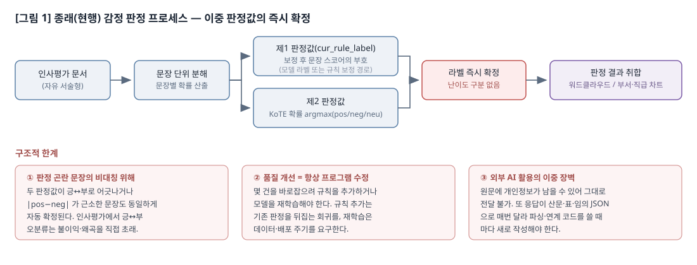
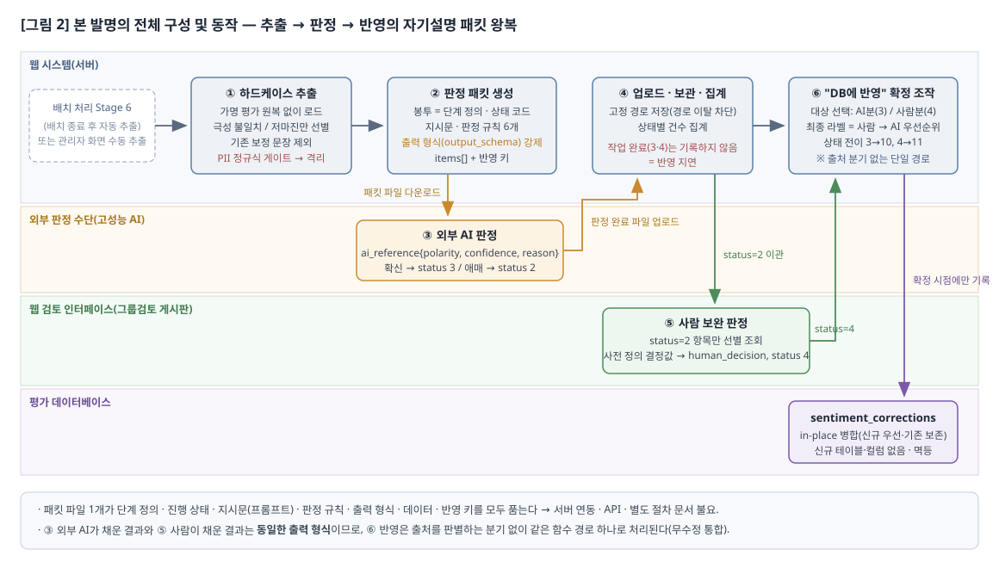
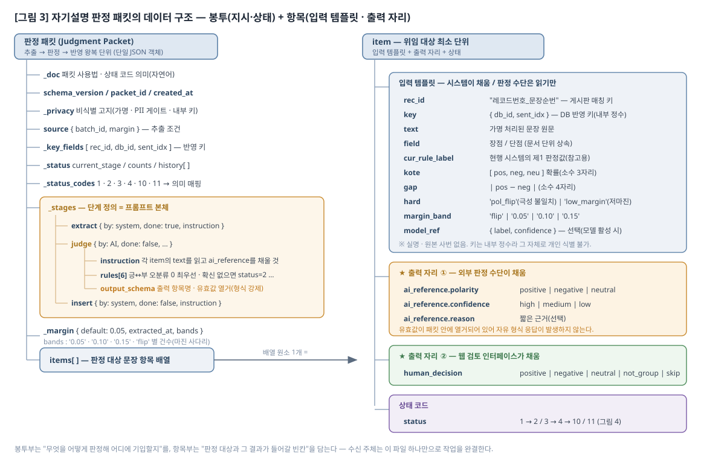
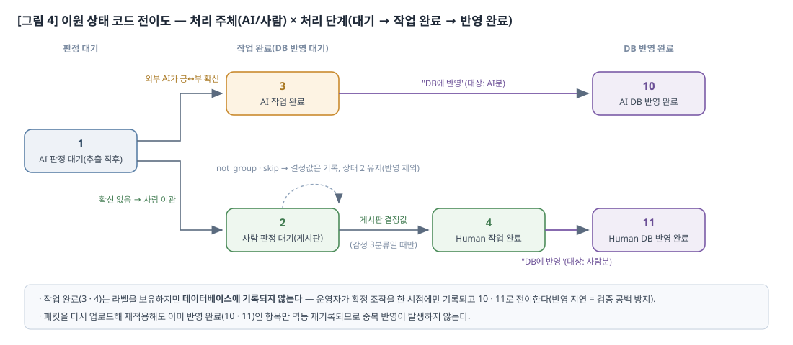
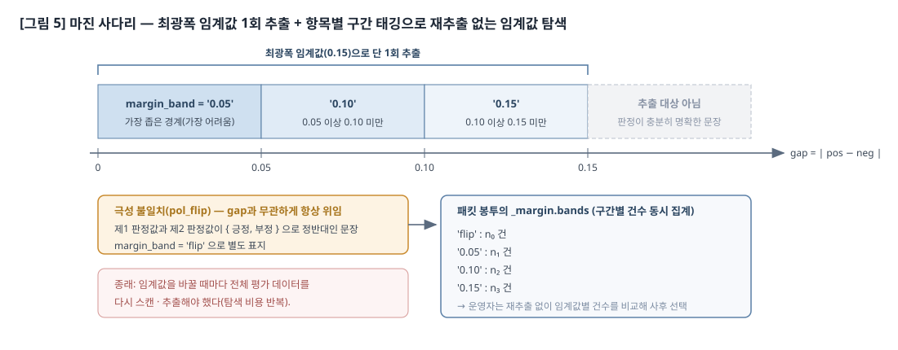
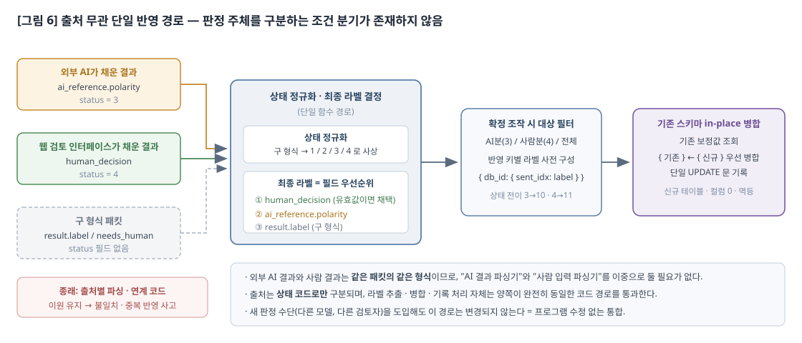

> ⚠️ **폐기 — 이 파일은 구판이다(260727 최초 발행본).** 정본은 [`rev_version/발명신고서_260727_수정안.md`](rev_version/발명신고서_260727_수정안.md) 이다. 무엇이 바뀌었는지는 그 파일 머리말의 개정 이력 절에 있다. 인쇄·제출·인용은 정본으로 한다. (`.clinerules/common/core/22-doc-numbering.md` NUM-9 RV-3)

발명신고서

 1. 발명의 명칭
  □ 감정 판정 곤란 문장의 외부 AI 위임 처리를 위한 자기설명 판정 패킷 기반 방법 및 시스템

  ※ 관련 출원(자기 인용) : 본 출원인은 "다면평가 처리를 위한 통합 인사데이터 프레임워크 설계 방법 및 시스템"을 선출원·등록하였다. 선행 발명은 인사평가 데이터를 기본 인사데이터·통합 인사데이터의 이원 JSON 구조로 통합 관리하고, 그 안의 emotion_analysis_results 객체에 감정 라벨·확신도를 저장하는 프레임워크에 관한 것이다. 본 발명은 그 emotion_analysis_results 를 채우는 과정에서 발생하는 '판정 곤란 문장'을 외부 판정 수단에 위임하고 그 결과를 프로그램 수정 없이 흡수하는 별개의 구성에 관한 것으로, 선행 발명에는 위임 판정·자기설명 패킷·출처 무관 통합에 관한 기재가 없다.

 2. 종래 기술의 설명 및 문제점
  □ 현행 시스템 설명
○ 현행 시스템(선출원 발명)은 인사 다면평가의 자유 서술형 피드백을 기본 인사데이터 객체로 통합 관리하고, 한국어 특화 감정 분석 모델을 적용하여 문장별 감정 라벨과 확신도(confidence_score)를 산출한 뒤 그 결과를 emotion_analysis_results 에 기록한다. 기록된 감정 결과는 취합 단계를 거쳐 감정별 워드클라우드 및 부서·직급별 차트의 입력으로 사용된다.
○ 실제 운영 구현에서는 문장 단위 판정이 두 계통으로 산출된다.
 - 제1 판정값은 시스템이 실제로 채택·표시하는 문장 스코어의 부호(양수=긍정, 음수=부정, 0=중립)로부터 도출된다. 이 스코어는 도메인 파인튜닝된 감정 분류 모델이 활성화된 경우에는 그 모델의 문장 라벨에 좁은 범위의 고정밀 보정(요청 표지 화행으로 인한 긍정 오검출을 중립으로 내리는 보정으로서, 긍정↔부정을 새로 만들지 않는다)을 얹어 결정되고, 모델이 비활성이거나 추론에 실패한 경우에는 한국어 감정 분석 모델의 원 확률에 감정 사전·반전 표지어 등 규칙 보정을 적용하여 결정된다.
 - 제2 판정값은 한국어 감정 분석 모델이 문장별로 출력한 긍정·부정·중립 원 확률의 최댓값(argmax)으로부터 도출된다. 이 확률은 배치 처리 시점에 문장 단위로 저장된 값을 재사용하므로 판정 곤란 문장을 선별할 때 모델을 다시 추론시키지 않는다.
 - 두 계통의 판정 결과는 대부분의 문장에서 일치하며, 이 경우 판정 신뢰도가 높다.
○ 판정 결과를 사후에 수정할 필요가 있는 경우, 평가 레코드에 부속된 문장별 보정값 저장 필드(sentiment_corrections)에 문장 순번과 최종 라벨을 기록하여 원 판정을 덮어쓰는 방식으로 운영된다.

  □ 현행 시스템의 문제점
○ 현행 시스템은 대량의 평가 문서를 자동으로 처리하고 시각화까지 일관되게 연결한다는 큰 장점을 가지며 실무에서 지속적으로 사용되고 있다. 그러나 판정이 본질적으로 어려운 소수의 문장(이하 '판정 곤란 문장')을 처리하는 국면에서 다음과 같은 구조적 한계가 존재한다.
 - 판정 곤란 문장의 오분류와 그 비대칭적 위해성
  · 두 판정 계통의 결과가 서로 반대 극성으로 어긋나는 문장, 또는 긍정 확률과 부정 확률의 차이가 매우 작아 근소한 수치 차이로 극성이 뒤집히는 문장이 존재한다. 인사평가 도메인에서는 긍정을 부정으로, 부정을 긍정으로 잘못 판정하는 오류가 피평가자에게 직접적인 불이익 또는 왜곡된 피드백을 초래하므로, 중립과 긍정을 혼동하는 오류에 비해 위해성이 현저히 크다. 그럼에도 현행 자동 판정은 이러한 오류 유형을 구분하지 않고 일률적으로 최댓값 라벨을 확정한다.
 - 판정 품질 개선이 언제나 프로그램 수정을 요구함
  · 판정 곤란 문장을 바로잡으려면 규칙(감정 사전·표지어)을 추가하거나 모델을 재학습해야 하며, 이는 소스 코드 또는 학습 파이프라인의 변경을 수반한다. 규칙 추가는 이미 올바르게 판정되던 다른 문장의 결과를 뒤집는 회귀를 유발할 수 있고, 재학습은 데이터 축적·검증·배포 주기를 필요로 하여 즉시성이 없다. 즉 "몇 건의 어려운 문장"을 고치기 위해 "시스템 전체"를 건드려야 하는 비대칭이 발생한다.
 - 외부 고성능 AI를 활용하기 어려운 두 가지 장벽
  · 첫째는 개인정보 장벽이다. 인사평가 원문에는 개인 식별 가능 정보가 포함될 수 있어 외부 서비스에 그대로 전달할 수 없다.
  · 둘째는 출력 형식 장벽이다. 외부 AI에 자연어로 판정을 의뢰하면 응답이 산문·표·임의 JSON 등 매번 다른 형태로 반환되므로, 이를 시스템에 반영하려면 응답 형식마다 별도의 파싱 코드와 연계 코드를 새로 작성해야 한다. 결국 외부 AI를 한 번 쓸 때마다 프로그램을 수정해야 하므로, 위 두 번째 문제(프로그램 수정 요구)가 해소되지 않고 오히려 가중된다.
 - AI 판정 경로와 사람 판정 경로의 이원화
  · AI도 확신하지 못하는 문장은 결국 사람이 판단해야 한다. 그러나 AI가 반환한 결과와 사람이 입력한 결과는 형식이 서로 다르므로, 시스템은 "AI 결과를 읽어 반영하는 코드"와 "사람 입력을 읽어 반영하는 코드"를 각각 보유·유지해야 한다. 두 경로가 분기되면 반영 규칙의 불일치, 중복 반영, 한쪽 경로만 수정되는 유지보수 사고가 발생하기 쉽다.
 - 판정 결과의 즉시 반영으로 인한 검증 공백
  · 외부에서 받은 판정을 곧바로 데이터베이스에 기록하면, 판정 품질을 사람이 확인하기 전에 원본 데이터가 갱신되어 버린다. 어느 건이 AI 판정이고 어느 건이 사람 판정인지, 어느 건이 이미 반영되었는지를 사후에 구분할 수단도 없다.
 - 임계값 탐색의 반복 비용
  · 판정 곤란 문장을 "긍정 확률과 부정 확률의 차이가 임계값 미만인 문장"으로 정의할 때, 적정 임계값은 사전에 알기 어렵다. 임계값을 바꿀 때마다 전체 평가 데이터를 다시 스캔·추출해야 하므로 탐색 비용이 크다.

○ 이러한 한계는 현행 시스템의 자동 처리 성능을 유지하면서도, 판정이 어려운 소수 문장에 한하여 외부의 더 강력한 판정 능력과 사람의 최종 판단을 "프로그램 수정 없이" 끌어들일 수 있는 새로운 구조가 필요함을 시사한다.

**[그림 1] 종래(현행) 감정 판정 프로세스** — 문장별로 제1 판정값(보정 후 스코어 부호)과 제2 판정값(원 확률 argmax)이 산출되나, 두 값이 어긋나거나 확률 차이가 근소한 문장도 구분 없이 즉시 확정되어 취합·시각화로 흘러간다. 사후 수정이 필요한 경우에만 문장별 보정값 필드에 기록되어 원 판정을 덮어쓴다.

 3. 발명의 상세한 설명
  (1) 종래 기술의 문제점을 해결하기 위한 발명의 기술적 원리 요약
   □ 기술 원리
○ 본 발명에서 '판정 패킷(Judgment Packet)'이란 단순한 데이터 전달 파일과 달리, ① 처리 단계의 정의, ② 현재 진행 상태, ③ 판정 수단에게 내리는 지시문(프롬프트)과 판정 규칙, ④ 판정 결과가 기입되어야 할 출력 항목의 형식과 유효값, ⑤ 판정 대상 데이터와 그 반영 키를 하나의 JSON 객체에 결합하여, 이를 수신한 주체가 외부 문서나 별도 설명 없이 패킷 자체만 읽고 작업을 수행·반환할 수 있도록 구성한 자기설명(self-describing) 왕복 데이터 단위를 의미한다.
○ 본 발명의 핵심은 다음 두 가지이며, 전자가 후자를 가능하게 하는 인과 관계에 있다.
 - 핵심 1 : 요구 조건에 정확히 부합하는 출력을 강제하는 프롬프트 구성
  · 판정 대상 문장과 함께, 판정 시 준수해야 할 규칙 목록과 판정 결과를 기입할 출력 항목의 형식(항목명·유효값 열거)을 같은 파일 안에 결합한다. 외부 판정 수단은 자유 형식으로 응답하는 것이 아니라, 전달받은 파일 안의 지정된 자리에 지정된 값만 채워 넣는다. 그 결과 외부 판정 수단의 산출물은 시스템이 이미 알고 있는 단 하나의 형식을 항상 따르게 된다.
  · 규칙은 도메인 위해성 비대칭을 그대로 반영한다. 즉 "긍정↔부정 오분류 0을 최우선으로 하고, 확신이 없으면 확정하지 말고 사람 판정 대기 상태로 남길 것", "중립↔긍정 혼동은 허용하되 과도하게 부정으로 내리지 말 것" 등을 지시함으로써, 판정 수단이 스스로 자신의 불확실성을 신고하도록 만든다.
 - 핵심 2 : 프로그램 수정 없는 무수정 통합
  · 핵심 1에 의해 외부 판정 수단의 출력 형식이 사람 검토 인터페이스의 출력 형식과 동형(同形)으로 강제되므로, 시스템은 판정 결과의 출처가 외부 AI인지 검토 인터페이스인지 구분하는 별도의 분기 로직을 가질 필요가 없다. 결과적으로 운영자는 입력 데이터 파일을 그대로 외부 AI에게 넘겨 수정하게 하고, 수정된 파일을 그대로 다시 업로드하는 것만으로 웹 시스템의 데이터베이스를 갱신할 수 있다. 새 판정 수단(다른 모델, 다른 검토자)을 도입하더라도 시스템 코드는 변경되지 않는다.
○ 위 두 핵심을 실제 데이터 처리에서 성립시키기 위해 다음 보조 원리를 함께 사용한다.
 - 판정 곤란 문장의 선별 위임
  · 전체 문장을 외부에 위임하지 않고, ① 제1 판정값과 제2 판정값의 집합이 {긍정, 부정}과 정확히 일치하는 문장(극성 불일치 — 어느 한쪽이 중립이면 해당하지 않는다), 또는 ② 긍정 확률과 부정 확률의 차이가 임계값 미만인 문장(저마진)만을 골라 위임한다. 이미 사람 또는 이전 판정으로 확정되어 보정값을 보유한 문장 순번은 판별 이전에 제외한다. 이로써 위임 비용과 외부 전달 데이터량을 최소화한다.
  · 선별은 배치 처리의 마지막 단계에서 자동으로 1회 수행되어 패킷이 서버에 저장되며, 관리자 화면에서 조건을 지정해 수동으로 추출할 수도 있다. 자동 추출이 실패하더라도 배치 본 처리에는 영향을 주지 않는다.
 - 가명 데이터 및 개인정보 게이트
  · 데이터베이스에 이미 가명으로 저장된 텍스트를 원복하지 않고 그대로 사용하므로 패킷에는 실명·원본 식별자가 존재하지 않는다. 반영 키는 내부 정수(레코드 일련번호와 문장 순번)만을 사용하여 그 자체로 개인을 식별하지 않는다. 추가로 주민등록번호·전화번호·전자우편 주소·6자리 이상 연속 숫자에 대한 정규식 게이트를 적용하여, 적발된 문장은 패킷에 싣지 않고 격리 목록으로 분리한다.
 - 이원 상태 코드와 반영 지연
  · 각 문장 항목은 처리 주체(AI/사람)와 처리 단계(판정 대기 → 작업 완료 → 데이터베이스 반영 완료)의 조합에 대응하는 상태 코드로 관리된다. 작업이 완료되어도 데이터베이스에는 즉시 기록되지 않으며, 운영자가 "DB에 반영" 조작을 수행한 시점에 비로소 기록되고 상태 코드가 반영 완료로 전이한다. 이로써 검증 전 데이터 오염을 방지하고, 사후에 어느 건이 어느 주체에 의해 언제 반영되었는지 추적할 수 있다.
 - 마진 사다리(임계값 동시 태깅)
  · 복수의 임계값 중 가장 넓은 값으로 단 1회 추출하면서, 각 문장에 그 문장이 속하는 임계값 구간 표지를 함께 부여한다. 운영자는 재추출 없이 임계값별 건수를 비교하여 적정 임계값을 사후에 선택할 수 있다.
 - 기존 스키마 재사용에 의한 무침습 반영
  · 판정 결과는 신규 테이블·신규 컬럼을 만들지 않고, 기존 평가 레코드의 문장별 보정값 필드에 병합(merge) 방식으로 in-place 기록된다. 신규 판정을 우선하되 기존 인덱스는 보존하므로, 반복 반영에도 결과가 동일한 멱등성이 유지된다.

   □ 핵심 기술적 특징 요약
○ 자기설명 판정 패킷 구조
 - 단계 정의·진행 상태·지시문·판정 규칙·출력 항목 형식·데이터·반영 키를 단일 JSON 객체에 결합하여, 수신 주체가 파일 하나만으로 작업을 완결할 수 있게 한다. 서버 연결·API 연동·별도 지침 문서가 필요 없다.
○ 출력 형식 강제형 프롬프트
 - 판정 규칙과 출력 항목의 형식·유효값 열거를 데이터와 같은 파일 안에 배치하여, 외부 판정 수단이 자유 형식이 아닌 지정 형식으로만 응답하도록 구성한다.
○ 불확실성 자기 신고 규칙
 - 확신이 없는 항목은 판정을 확정하지 말고 사람 판정 대기 상태로 표시하도록 지시함으로써, 위해성이 큰 긍정↔부정 오분류를 구조적으로 억제한다.
○ 출처 무관 단일 반영 경로
 - 최종 라벨은 "사람 결정값이 있으면 그 값, 없으면 AI 판정값"이라는 필드 우선순위만으로 결정되며, 주체를 판별하는 조건 분기가 존재하지 않는다. AI 결과와 사람 결과는 완전히 동일한 함수 경로를 통과하여 데이터베이스에 병합된다.
○ 저확신 항목의 웹 검토 인터페이스 이관
 - 외부 판정 수단이 저확신으로 표시한 항목만을 웹 검토 게시판이 선별 조회하고, 사전 정의된 결정값 집합 중 하나만 입력받아 같은 패킷 파일에 기록한다.
○ 이원 상태 코드 및 반영 지연 커밋
 - 처리 주체 × 처리 단계의 2차원 상태 코드와, 운영자 확정 조작 시점에만 데이터베이스에 기록하는 지연 커밋으로 검증 공백과 추적 불가 문제를 해소한다.
○ 마진 사다리에 의한 1회 추출·다중 임계값 비교
 - 최광폭 임계값 1회 추출 + 항목별 구간 태깅으로 재추출 없는 임계값 탐색을 지원한다.
○ 비식별 왕복 및 경로 고정 보관
 - 가명 텍스트·내부 정수 키만으로 왕복하며, 패킷 파일은 배포 제외 폴더 하위의 고정 경로에만 저장되고 경로 이탈이 차단된다.

  (2) 발명의 구성 및 전반적인 동작원리에 대한 자세한 설명
    □ 시스템 개요
○ 본 발명은 인사평가 감정 판정 시스템에서 자동 판정이 곤란한 문장만을 선별하여 외부 판정 수단에 위임하고, 그 판정 결과와 사람의 보완 판정 결과를 프로그램 수정 없이 원 시스템에 통합하는 방법 및 시스템이다.
○ 전체 동작은 추출(extract) → 판정(judge) → 반영(insert)의 3단계 왕복으로 구성되며, 세 단계의 정의와 각 단계의 수행 주체·지시문·완료 여부가 패킷 내부에 함께 기록되어 이동한다. 따라서 운영자는 단계별 매뉴얼을 참조할 필요 없이 파일만 주고받으면 된다.
○ 판정 단계는 외부 판정 수단(고성능 자연어 처리 모델)이 수행하되, 해당 수단이 확신하지 못한 항목은 자동으로 웹 검토 인터페이스(그룹검토 게시판)로 이관되어 사람의 결정으로 보완된다. 두 경로의 산출물은 같은 형식으로 같은 파일에 기록되므로, 반영 단계는 하나의 처리 절차만을 가진다.

**[그림 2] 본 발명의 전체 구성 및 동작** — 추출 → 판정 → 반영의 3단계가 하나의 패킷 파일 왕복으로 이루어진다. 외부 AI가 저확신으로 표시한 항목만 웹 검토 인터페이스로 이관되며, 두 경로의 산출물은 같은 형식이므로 반영은 단일 경로로 처리된다. 업로드 시점에는 기록하지 않고 운영자의 확정 조작 시점에만 데이터베이스에 기록된다.

    □ 상세 설명
○ 본 발명의 데이터 구조는 '판정 패킷' 단일 객체이며, 다음과 같이 봉투(메타·지시)부와 항목(데이터)부로 구성된다.

**[그림 3] 자기설명 판정 패킷의 데이터 구조** — 봉투부는 단계 정의·진행 상태·지시문·판정 규칙·출력 항목 형식을, 항목부는 입력 템플릿(시스템이 채우고 판정 수단은 읽기만 하는 필드)과 두 개의 출력 자리(외부 판정 수단용·웹 검토 인터페이스용)를 담는다. 판정 수단이 채워야 할 항목명과 유효값이 같은 파일 안에 열거되어 있으므로 자유 형식 응답이 발생하지 않는다.

○ 봉투부(메타·지시) 필드 명세 — 패킷 1개당 1회 존재한다.

| 필드 | 자료형 | 내용 |
|---|---|---|
| `_doc` | 문자열 | 패킷 사용법 자연어 설명(상태 코드 의미·진행 방법) |
| `schema_version` | 문자열 | 패킷 스키마 버전 |
| `packet_id` | 문자열 | 패킷 식별자(추출 조건 + 생성 시각 기반) |
| `created_at` | 문자열 | 생성 시각(UTC ISO8601) |
| `_privacy` | 문자열 | 비식별 고지(가명·PII 게이트·내부 키·in-place 반영) |
| `source` | 객체 | 추출 조건 — `batch_id`(배치 식별자), `margin`(임계값) |
| `_key_fields` | 배열 | 반영 키 필드명 목록(`rec_id`, `db_id`, `sent_idx`) |
| `_status` | 객체 | 진행 상태 — `current_stage`, `counts`(extracted/judged/inserted/quarantined/human_decided), `history`(단계·주체·시각·건수 이력) |
| `_status_codes` | 객체 | 상태 코드 → 의미 매핑(1, 2, 3, 4, 10, 11) |
| `_stages` | 객체 | **단계 정의 = 프롬프트 본체** — `extract`{by, done, instruction} / `judge`{by, done, instruction, rules[ ], output_schema} / `insert`{by, done, instruction} |
| `_margin` | 객체 | 마진 사다리 요약 — `default`, `extracted_at`, `bands`(임계값 구간별 건수, flip 포함) |
| `items` | 배열 | 판정 대상 문장 항목 배열 |

○ 항목부(item) 필드 명세 — 위임 대상 최소 단위이며, 입력 템플릿과 출력 자리로 나뉜다.

| 구분 | 필드 | 자료형 | 내용 |
|---|---|---|---|
| 입력 | `rec_id` | 문자열 | 게시판 매칭 키("레코드번호_문장순번") |
| 입력 | `key` | 객체 | 데이터베이스 반영 키 — `db_id`(평가 레코드 내부 일련번호, 개인 식별정보 아님), `sent_idx`(문서 내 문장 순번) |
| 입력 | `text` | 문자열 | 가명 처리된 문장 원문 |
| 입력 | `field` | 문자열 | 평가 항목 구분(장점/단점, 문서 단위 상속) |
| 입력 | `cur_rule_label` | 문자열 | 현행 시스템의 제1 판정값(참고용) |
| 입력 | `kote` | 배열 | [긍정, 부정, 중립] 확률(소수 3자리) |
| 입력 | `gap` | 수치 | \|긍정 확률 − 부정 확률\|(소수 4자리) |
| 입력 | `hard` | 문자열 | 위임 사유 — `'pol_flip'`(극성 불일치) \| `'low_margin'`(저마진) |
| 입력 | `margin_band` | 문자열 | 임계값 구간 표지 — `'flip'` \| `'0.05'` \| `'0.10'` \| `'0.15'` |
| 입력 | `model_ref` | 객체 | (선택) 파인튜닝 모델의 캘리브레이션 신뢰도 {label, confidence} |
| **출력 ①** | `ai_reference` | 객체 | ★ 외부 판정 수단이 채우는 자리 — `polarity`(positive\|negative\|neutral), `confidence`(high\|medium\|low), `reason`(짧은 근거, 선택) |
| **출력 ②** | `human_decision` | 문자열 | ★ 웹 검토 인터페이스가 채우는 자리 — positive\|negative\|neutral\|not_group\|skip |
| 상태 | `status` | 수치 | 상태 코드(1→2/3→4→10/11) |

○ 상태 코드 체계는 처리 주체와 처리 단계의 2차원으로 정의된다.

 - 1 : AI 판정 대기        (추출 직후 초기값)
 - 2 : 사람 판정 대기      (외부 판정 수단이 확신하지 못해 이관한 상태 / 그룹검토 게시판 노출 대상)
 - 3 : AI 작업 완료        (판정값 보유, 데이터베이스 반영 대기)
 - 4 : Human 작업 완료     (사람 결정값 보유, 데이터베이스 반영 대기)
 - 10 : AI 판정 데이터베이스 반영 완료
 - 11 : Human 판정 데이터베이스 반영 완료

**[그림 4] 이원 상태 코드 전이도** — 추출 직후 모든 항목은 1이며, 외부 판정 수단이 확신 여부에 따라 3 또는 2로 나눈다. 2는 웹 검토 인터페이스에서 4로 올라가고, 3·4는 운영자의 확정 조작 시점에만 각각 10·11로 전이하면서 데이터베이스에 기록된다. 검토자가 감정 3분류가 아닌 결정값(비대상·보류)을 선택한 항목은 결정값만 기록되고 상태는 2로 유지되어 반영 대상에서 빠진다.

○ 본 시스템은 다음 모듈로 구성되며, 모든 모듈은 위 단일 패킷 구조를 매개로 상태와 결과를 공유한다.
 - 하드케이스 추출 모듈
  · 가명 저장된 평가 레코드를 원복 없이 로드하고, 문장 단위 스코어·확률을 산출하여 극성 불일치 또는 저마진에 해당하는 문장만 항목으로 적재한다. 확률은 배치 시점에 저장된 문장 단위 값을 재사용하므로 모델 재추론이 발생하지 않으며, 저장된 값이 없는 구 데이터에 대해서만 즉석 계산으로 대체한다. 이미 보정값이 존재하는 문장은 제외하며, 개인정보 게이트에 적발된 문장은 격리 목록으로 분리한다. 평가 한 건을 입력으로 항목 목록과 격리 목록을 반환하는 부분은 데이터베이스 접속 없이 동작하는 순수 함수로 분리되어 있어 단위 검증이 가능하다.
 - 배치 연동 모듈
  · 배치 처리의 마지막 단계에서 방금 처리된 배치 식별자를 조건으로 패킷을 자동 생성하여 지정 라벨 폴더에 저장하고, 추출 건수와 임계값 구간별 건수를 배치 진행 상태로 노출한다. 이 단계에서 예외가 발생해도 경고만 남기고 배치 본 처리는 정상 종료되므로, 위임 기능이 기존 처리의 가용성을 낮추지 않는다.
 - 패킷 골격 생성 모듈(프롬프트 결합 모듈)
  · 단계 정의·상태 코드 사전·판정 지시문·판정 규칙 목록·출력 항목 형식을 결합한 봉투를 생성한다. 본 발명의 핵심 1에 해당하는 구성으로, 여기서 생성되는 출력 항목 형식이 이후 모든 판정 주체의 산출물 형식을 강제한다.
 - 모델 신뢰도 부착 모듈
  · 파인튜닝된 감정 분류 모델이 활성화되어 있는 경우에 한하여, 각 항목에 온도 스케일링으로 눈금이 보정된 확률에서 얻은 예측 라벨과 신뢰도를 참고값으로 부착한다. 온도 스케일링은 최댓값의 위치를 바꾸지 않으므로 라벨 자체는 변하지 않고 신뢰도 수치만 보정된다. 모델이 비활성·부재·실패이거나 반환 개수가 항목 수와 다른 경우에는 아무것도 부착하지 않고 정상 진행하므로, 기존 처리에 영향을 주지 않는 선택적 보조 신호로 동작한다. 이 값은 최종 판정을 결정하지 않으며 이관 판단의 참고로만 사용된다.
 - 외부 판정 위임 인터페이스
  · 생성된 패킷을 파일로 내려받아 외부 판정 수단에 전달하고, 판정 결과가 기입된 파일을 그대로 업로드받는다. 입력은 파일 업로드, 요청 본문에 실린 패킷, 이미 서버에 보관된 패킷의 경로 지정 중 어느 방식이든 동일하게 처리된다. 업로드된 패킷은 서버의 고정 경로에 보관되어, 남은 사람 판정 대기 항목을 웹 검토 인터페이스가 이어서 처리할 수 있게 한다. 보관에 실패하더라도 집계·반영 처리는 그대로 진행된다.
 - 웹 검토 인터페이스(그룹검토 게시판)
  · 검토 대상 파일 목록에 보관된 패킷을 함께 노출하되, 각 패킷의 표시 건수는 '사람 판정 대기' 항목 수로 산출한다. 선택된 패킷에서 상태 코드가 '사람 판정 대기'인 항목만을 선별 조회하여 문장 원문·평가 항목 구분·현행 판정값·외부 판정 수단의 참고 판정과 함께 화면에 표시하고, 사전 정의된 결정값 집합 중 하나만 선택하여 저장받는다. 저장은 여러 행을 한 번의 읽기-수정-쓰기로 처리하여 동시 저장 시의 갱신 유실을 방지한다.
 - 반영 모듈
  · 항목의 상태와 최종 라벨을 정규화하고, 반영 대상만을 모아 기존 문장별 보정값 필드에 병합한다. 최종 라벨 결정과 병합 처리에는 판정 주체를 구분하는 분기가 존재하지 않는다.
 - 상태·감사 모듈
  · 보관된 패킷 목록과 상태 코드별 분포(AI 대기·사람 대기·AI 작업완료·Human 작업완료·AI 반영완료·Human 반영완료)를 집계하여 제공하고, AI 반영 직후 사람 이관분이 남아 있는 경우 검토 게시판으로 유도한다.
 - 경로 방어 모듈
  · 패킷을 저장할 때와 외부에서 지정된 패킷 파일을 읽을 때 모두, 경로가 사전 지정된 보관 루트 하위의 확장자 일치 파일인지를 검사하여 그 밖의 경로는 거부한다. 저장 시에는 경로 구성 요소의 구분자·특수문자를 치환하고, 조회 시에는 루트 하위 화이트리스트로 상위 디렉터리 탈출을 차단한다.

  (3) 구현 방법
   본 발명은 자기설명 판정 패킷을 매개로 판정 곤란 문장을 외부 판정 수단 및 웹 검토 인터페이스에 위임하고, 그 결과를 프로그램 수정 없이 원 시스템에 반영하는 것을 특징으로 한다. 이하에서는 하나의 바람직한 실시 예를 중심으로 각 단계의 구현 방법을 상세히 설명한다. 본 예시는 실제 구현 형태를 기반으로 작성되었으며, 본 발명의 기술적 사상을 벗어나지 않는 범위 내에서 다양한 변형이나 수정이 가능하다.

□ 하드케이스 추출 단계
  ○ 대상 로드
 - 평가 레코드를 배치 식별자 조건으로 조회하되(조건 미지정 시 전체), 가명으로 저장된 텍스트를 원복하지 않고 그대로 사용한다. 레코드의 내부 일련번호와 기존 문장별 보정값을 함께 읽어들이며, 문서 본문이 없는 레코드나 저장 형식이 손상된 레코드는 건너뛴다.
  ○ 문장 분해 및 이중 판정값 산출
 - 평가 문서를 문장 단위로 분해하고, 각 문장에 대해 보정 후 스코어와 감정 모델의 긍정·부정·중립 확률을 산출한다. 확률은 배치 시점에 문장 단위로 저장해 둔 값을 우선 사용하고, 없을 때만 즉석 계산한다. 스코어의 부호로부터 제1 판정값을, 원 확률의 최댓값으로부터 제2 판정값을 각각 도출한다. 평가 항목 구분(장점/단점)은 문서 단위로 결정되어 각 문장에 상속되며, 모델 추론 시 학습 시점과 동일한 접두 표기로 전달되어 학습·서비스 정합이 유지된다.
  ○ 하드케이스 판별
 - 제1 판정값과 제2 판정값의 집합이 {긍정, 부정}과 일치하면 극성 불일치로, 긍정 확률과 부정 확률의 차이가 임계값 미만이면 저마진으로 판별한다. 둘 중 어느 것에도 해당하지 않는 문장은 위임하지 않는다. 이미 보정값이 존재하는 문장 순번, 그리고 분해 결과가 빈 문자열인 항목은 판별 이전에 제외한다.
  ○ 개인정보 게이트
 - 주민등록번호·전화번호·전자우편 주소·6자리 이상 연속 숫자의 네 가지 고신뢰 정규식으로 문장을 검사하여, 하나라도 적발되면 해당 문장을 패킷에 싣지 않고 레코드 일련번호·문장 순번·적발 유형과 함께 격리 목록에 기록한다. 이 정규식 집합은 학습 데이터 반출 경로에 적용되는 것과 동일한 정책을 사용한다.
  ○ 항목 생성
 - 통과한 문장에 대해 게시판 매칭 키("레코드 일련번호_문장 순번"), 반영 키(레코드 일련번호·문장 순번), 가명 문장 원문, 평가 항목 구분, 현행 판정값, 확률 3종(소수 3자리), 확률 차이(소수 4자리), 위임 사유, 임계값 구간 표지, 비어 있는 출력 자리(판정 결과·사람 결정값), 초기 상태 코드 1을 필드로 갖는 항목을 생성한다.

□ 패킷 생성 단계 (프롬프트·입출력 양식 결합)
  ○ 봉투 생성
 - 상태 코드의 의미를 자연어로 서술한 안내문, 스키마 버전, 패킷 식별자, 생성 시각, 비식별 고지, 추출 조건, 반영 키 필드명 목록, 진행 상태 및 이력, 상태 코드 사전을 생성한다.
  ○ 단계 정의 및 지시문 삽입
 - 추출 단계에는 수행 주체가 시스템이고 이미 완료되었음을, 판정 단계에는 수행 주체가 외부 AI이며 미완료임을, 반영 단계에는 수행 주체가 시스템이며 운영자 확정 조작 시 수행됨을 각각 기록한다. 판정 단계의 지시문은 "각 항목의 문장을 읽고 판정 결과 자리에 극성·확신도·근거를 채우되, 긍정↔부정에 확신이 있으면 상태를 3으로, 애매하면 상태를 2로 두고, 상태 1은 남기지 말 것"을 내용으로 한다.
  ○ 판정 규칙 삽입
 - 판정 단계에 다음 규칙 목록을 함께 기록한다. ① 긍정↔부정 오분류 0이 최우선이며 확신이 없으면 상태를 2로 둘 것, ② 중립↔긍정 혼동은 허용하되 과도하게 부정으로 내리지 말 것, ③ "보완점 없음/단점 없습니다" 등 약점 부재 선언은 중립으로 볼 것, ④ "~필요/요구/했으면 좋겠" 등 건설적 비판은 부정으로 볼 것, ⑤ 항목에 실린 현행 판정값은 시스템 추정치이므로 맹신하지 말고 문장 자체로 판정할 것, ⑥ 모델 참고 신뢰도가 낮은 항목은 사람 판정 대기 쪽으로 보수적으로 처리할 것.
  ○ 출력 형식 삽입
 - 판정 결과 자리의 형식을 극성(positive|negative|neutral), 확신도(high|medium|low), 근거(짧은 문자열, 선택)로 명시하고, 상태값의 의미를 "3=확신(작업 완료, 이후 버튼으로 반영) | 2=애매(사람 게시판)"으로 명시한다. 이 형식 명시가 외부 판정 수단의 산출물 형식을 단일화하는 강제 수단이 된다.
  ○ 마진 사다리 집계
 - 임계값이 지정되지 않은 경우 사전 정의된 임계값 집합(0.05·0.10·0.15) 중 가장 넓은 값으로 추출하고, 각 항목의 확률 차이가 속하는 최소 구간을 표지로 부여한 뒤 구간별 건수를 집계하여 봉투에 기록한다. 극성 불일치 항목은 확률 차이와 무관하게 위임되므로 별도 표지로 구분한다. 봉투에는 기본 임계값과 이번 추출에 실제 사용된 임계값이 함께 기록되어 사후 재현이 가능하다.

**[그림 5] 마진 사다리** — 가장 넓은 임계값으로 한 번만 추출하면서 각 항목에 구간 표지를 부여하고 구간별 건수를 함께 집계하므로, 운영자는 데이터를 다시 스캔하지 않고 임계값별 결과를 비교하여 적정 임계값을 사후에 선택할 수 있다.

  ○ 파일화
 - 완성된 패킷은 첨부 파일 형태로 내려받게 하며, 서버 보관 시에는 배포 제외 폴더 하위의 고정 루트에 라벨·배치 식별자로 구성된 경로로 저장한다. 경로 구성 요소는 구분자·특수문자를 치환하여 안전화하고, 최종 절대경로가 고정 루트를 벗어나면 예외를 발생시켜 저장을 거부한다. 같은 라벨·배치 식별자로 다시 저장하면 같은 파일을 덮어써 사본이 늘어나지 않는다.

□ 외부 AI 판정 단계
  ○ 운영자는 내려받은 패킷 파일을 외부 판정 수단에 그대로 전달한다. 패킷은 가명 텍스트와 내부 정수 키만을 포함하므로 별도의 비식별 처리가 필요하지 않다.
  ○ 외부 판정 수단은 패킷 내부의 지시문·규칙·출력 형식만을 근거로 각 항목의 판정 결과 자리를 채우고, 확신 여부에 따라 상태값을 3 또는 2로 설정한 동일 파일을 반환한다. 시스템은 어떤 프롬프트를 별도로 관리하거나 응답을 파싱하기 위한 코드를 보유하지 않는다.
  ○ 반환된 파일은 파일 업로드, 요청 본문 전달, 서버 보관 패킷의 경로 지정 중 어느 방식으로도 입력될 수 있다. 시스템은 항목 배열의 존재만을 형식 요건으로 검사한 뒤 고정 경로에 보관하고 상태별 집계를 산출한다. 이때 실제 데이터베이스 기록은 이미 반영 완료 상태(10·11)인 항목의 멱등 재기록에 한정되고, 작업 완료 상태(3·4)는 집계만 수행하여 반영을 지연시킨다. 보관에 실패한 경우에도 경고만 남기고 집계는 정상 반환된다.

□ 사람 보완 판정 단계 (웹 검토 인터페이스)
  ○ 게시판은 지정된 파일이 보관 루트 하위의 패킷인지 먼저 판별하고, 패킷이면 상태 코드가 2인 항목만을 선별하여 페이지 단위(시작 위치·건수)로 조회한다. 조회 결과에는 문장 원문, 평가 항목 구분, 현행 판정값, 외부 판정 수단의 참고 판정, 현재 결정값이 포함되며, 패킷이 아닌 일반 검토 파일과 동일한 행 형식으로 변환되어 같은 화면이 두 종류의 입력을 함께 다룬다.
  ○ 검토자는 사전 정의된 결정값 집합(긍정·부정·중립·비대상·보류)에서 하나를 선택하여 저장한다. 집합에 없는 값은 저장 요청 단계에서 거부된다.
  ○ 저장 시 감정 3분류에 해당하는 결정값은 사람 결정 자리에 기록되고 상태가 4(Human 작업 완료)로 전이되며, 비대상·보류는 결정 자리에는 기록하되 상태를 2로 유지하여 데이터베이스 반영 대상에서 제외한다. 반영 키와 봉투는 그대로 보존된다.

□ 데이터베이스 반영 단계
  ○ 상태 정규화
 - 반영 처리는 먼저 각 항목의 상태를 정규 코드로 변환한다. 상태 필드가 없는 구 형식 항목은 사람 요청 표시 여부와 라벨 보유 여부에 따라 2 또는 3·1로 사상되며, 구 형식에서 사람 결정값을 가진 상태 3은 4로 재사상된다. 이로써 신·구 패킷이 동일한 반영 절차를 공유한다.
  ○ 최종 라벨 결정
 - 최종 라벨은 사람 결정값이 유효하면 그 값을, 없으면 외부 판정 수단의 극성값을, 그마저 없으면 구 형식의 라벨을 사용한다. 즉 판정 주체를 식별하는 조건 분기 없이 필드 우선순위만으로 결정된다.
  ○ 확정 조작 및 상태 전이
 - 운영자가 "DB에 반영"을 수행하면 대상 범위(외부 AI 판정분만, 사람 판정분만, 또는 양쪽)에 해당하는 작업 완료 항목만을 필터링하여 반영 키별 라벨 사전을 구성하고, 반영 후 상태를 3→10 또는 4→11로 전이시킨다. 대상 필터와 사후 상태 표기를 제외한 라벨 추출·병합 처리는 양쪽에 대해 동일한 단일 코드 경로이다. 실제 운영에서는 판정 결과 반영 화면의 버튼이 외부 AI 판정분을, 검토 게시판의 버튼이 사람 판정분을 각각 대상으로 지정하여, 같은 처리 절차를 두 화면이 나누어 호출한다.
  ○ 병합 기록
 - 반영 키의 레코드 일련번호로 기존 문장별 보정값을 조회하여 신규 판정을 우선하되 기존 인덱스를 보존하는 방식으로 병합하고, 단일 갱신 문으로 기록한다. 신규 테이블·컬럼을 생성하지 않으며 반복 실행 시 결과가 동일하다. 라벨이 유효값이 아니거나 반영 키가 결손된 항목은 기록하지 않고 건너뜀으로 집계한다.

**[그림 6] 출처 무관 단일 반영 경로** — 외부 AI가 채운 값과 검토자가 채운 값, 그리고 구 형식 패킷의 값이 모두 같은 정규화·우선순위 결정 함수를 통과한 뒤 동일한 병합 처리로 기록된다. 출처는 상태 코드로만 구분될 뿐, 라벨을 꺼내 기록하는 처리 자체에는 주체를 판별하는 조건 분기가 없다.

  ○ 패킷 재저장 및 유도
 - 반영이 완료된 패킷은 같은 경로에 그대로 덮어써 보관되어 감사 증적이 된다. AI 반영이 완료되었고 사람 판정 대기 항목이 남아 있으며 사람 반영이 아직 없는 경우, 시스템은 검토 게시판으로 이동하도록 안내한다.

□ 운영 및 감사 단계
  ○ 보관 루트를 순회하여 패킷 목록과 각 패킷의 상태 코드별 건수(AI 대기·사람 대기·AI 작업완료·Human 작업완료·AI 반영완료·Human 반영완료)를 조회하여, 어느 패킷의 어느 단계가 남았는지를 상시 파악한다. 이 집계는 반영 처리와 같은 상태 정규화 함수를 사용하므로 구 형식 패킷도 같은 기준으로 계수된다.
  ○ 화면은 이 집계로부터 다음 조작을 결정한다. 작업 완료 건수가 0이면 확정 버튼이 노출되지 않으며, 사람 판정분이 남아 있으면 검토 게시판 쪽 버튼에 그 건수가 표시된다.
  ○ 모든 처리 단계는 관리자 인증을 요구하며, 추출·반영·확정 조작마다 배치 식별자·건수·격리 건수·대상 파일이 로그로 기록된다.

 4. 발명의 효과
□ 본 발명은 자동 감정 판정이 곤란한 소수 문장에 한하여, 외부의 더 강력한 판정 능력과 사람의 최종 판단을 프로그램 수정 없이 원 시스템에 결합하는 방법 및 시스템이다. 판정 규칙과 입출력 양식을 데이터와 함께 하나의 자기설명 패킷에 담아 왕복시킴으로써, 종래에 "외부 AI를 한 번 쓸 때마다 연계 코드를 새로 만들어야 했던" 구조적 비용을 제거하고, 판정 품질 개선을 코드 변경이 아닌 데이터 왕복으로 달성할 수 있게 한다.
 ○ 프로그램 수정 없는 판정 품질 개선
 - 판정 규칙·출력 양식이 패킷 안에 있으므로, 규칙을 강화하거나 다른 판정 수단으로 교체하더라도 시스템 소스 코드는 변경되지 않는다. 종래에는 판정 곤란 문장 몇 건을 바로잡기 위해 감정 규칙을 추가하거나 모델을 재학습해야 했고 그로 인해 기존 판정이 뒤집히는 회귀 위험을 감수해야 했으나, 본 발명은 해당 문장에 대한 보정값만 in-place로 병합하므로 다른 문장의 판정에 영향을 주지 않는다.
 ○ 출처 무관 단일 통합 경로에 의한 유지보수 비용 절감
 - AI가 채운 결과와 사람이 채운 결과가 동일한 출력 형식을 가지므로, 시스템은 "AI 결과 파싱기"와 "사람 입력 파싱기"를 이중으로 보유할 필요가 없다. 최종 라벨은 필드 우선순위만으로 결정되고 병합 처리는 단일 함수 경로를 통과하므로, 한쪽 경로만 수정되어 발생하는 불일치 사고가 구조적으로 제거된다.
 ○ 위해성 비대칭을 반영한 오분류 억제
 - 긍정↔부정 오분류를 최우선으로 억제하고 확신이 없으면 스스로 사람 판정 대기로 이관하도록 규칙화함으로써, 인사평가에서 가장 치명적인 오류 유형이 자동 확정되는 것을 방지한다. 판정 수단이 불확실성을 신고하는 구조이므로, 사람의 검토 자원은 실제로 어려운 항목에만 집중된다.
 ○ 개인정보 노출 없는 외부 AI 활용
 - 가명 저장 데이터를 원복 없이 사용하고 반영 키를 내부 정수로 한정하며, 정규식 게이트로 잔존 개인정보 의심 문장을 사전 격리함으로써, 외부 판정 수단을 활용하면서도 원본 식별 정보가 외부로 전달되지 않는다. 반영이 동일 레코드 in-place 수정이므로 가명 원복·재가명 절차 자체가 불필요하다.
 ○ 검증 전 데이터 오염 방지 및 감사 추적성 확보
 - 작업 완료와 데이터베이스 반영을 상태 코드로 분리하고 운영자 확정 조작 시점에만 기록함으로써, 검증되지 않은 판정이 원본 데이터를 오염시키는 것을 방지한다. 반영 이후에도 각 항목이 AI 판정분인지 사람 판정분인지, 반영이 완료되었는지가 상태 코드로 남아 사후 감사가 가능하다.
 ○ 임계값 탐색 비용의 제거
 - 최광폭 임계값 1회 추출과 항목별 구간 태깅으로 임계값별 건수를 동시에 산출하므로, 적정 임계값을 찾기 위해 전체 데이터를 반복 스캔·추출할 필요가 없다.
 ○ 운영 절차의 단순화
 - 운영자는 패킷 파일을 내려받아 전달하고, 되돌아온 파일을 업로드한 뒤 확정 버튼을 누르는 세 가지 조작만 수행하면 된다. 단계 정의·현재 상태·다음 할 일이 패킷 안에 기록되어 이동하므로 별도의 절차 문서나 API 연동이 필요하지 않다.
 ○ 확장성
 - 다른 도메인(예: 리더십 특성 분류, 문장 유형 분류)으로 확장할 때에도 패킷의 판정 규칙과 출력 항목 형식만 교체하면 되며, 추출·반영·게시판 경로는 그대로 재사용된다. 판정 결과를 저장하는 스키마 역시 기존 필드를 재사용하므로 신규 스키마 정의가 필요 없다.
