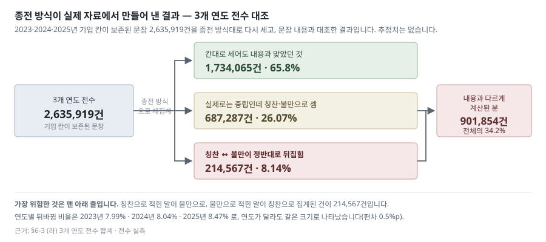
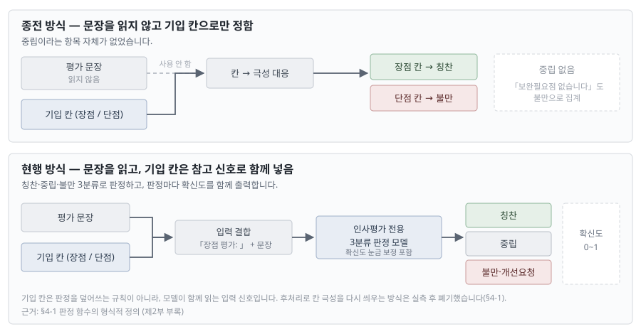
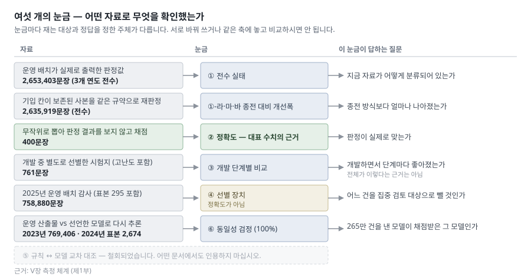

# 다면평가 서술형 의견 분석 시스템 구축 결과 상세 보고서

> 최초 보고일 2026-07-28 · **최종 개정 2026-08-11 — 판번호 `rev-260811-03`** · 보고 대상 인사처 · 기준 시점 **2026-07-08 최종 모델 확정** · 상태 **기록 보존**
> 📦 **기록 보존본 — 내용 정본은 〈주제별 보고서 세트〉다 (2026-08-11 발행 완료).** 결과·근거·한계를 확인하실 때는 **[세트 안내서](../../../../../../report/보고서세트_260811/00_안내서_260811.md)** 부터 여십시오. 본 문서는 **폐기하지 않고 기록으로 보존**하며, **15판에 걸친 개정 경위와 원 근거가 이 안에만 있으므로** 그 확인이 필요할 때 열람합니다. 대체 범위와 결정 근거는 **§10-7 개정 이력** 의 `rev-260811-02`·`rev-260811-03` 행에 있다.
> ⚠️ **본 문서의 수치를 새로 인용하지 말 것** — 세트가 확정한 표기(검증셋 「파일 762행 중 채점 761건」, 대안 성적 앙상블 보정판)와 **다른 자리가 있다.** 차이의 내역은 세트의 [개정 이력](../../../../../../report/보고서세트_260811/06_개정이력_260811.md) §4.
> 📖 **읽는 순서** — **제1부(Ⅰ~Ⅸ)만으로 결과와 조치를 확인하실 수 있습니다.** 수식·검정·표본 적격성·개발 경위는 **제2부 기술 부록**으로 옮겼고, **장·절 번호는 개정 전과 동일**합니다.
> 📌 **판번호 규약** — 파일명(`_260728`)은 **최초 발행일 고정 식별자**이며 개정해도 바꾸지 않는다(외부 참조 20곳 이상이 이 이름을 가리킨다). **개정 회차는 이 줄의 `rev-YYMMDD-NN`**(당일 N번째 개정)으로만 표시하고, 무엇이 바뀌었는지는 **§10-7 개정 이력**에 기록한다. 원페이퍼처럼 판마다 파일을 새로 내는 산출물은 파일명 자체에 `-NN` 을 붙인다.
> ⚠️ **판 ID `260807` 은 날짜가 아니라 식별자다.** 이 개정의 **실제 작성·검증 수행일은 2026-08-10**(폴더 내 전 파일 수정시각 실측 — 08-07~08-09 에 수정된 파일은 0건). 채번 시점에 08-07 로 붙었을 뿐이며, 외부 참조가 이 ID 를 가리키므로 **ID 자체는 바꾸지 않고 본문 날짜만 실제 수행일로 정정**했다(2026-08-10 회귀 점검).
> 요약본(**정본**): `원페이퍼_1장_260807-06.md` — 구판 `원페이퍼보고_260728.md`·`원페이퍼_1장_260805.md`·`260806-00~05` 는 폐기 · 기술 상세(**구판 — 폐기·인용 금지, 참조용 열람만**): `구축완료보고서_260727.md`
> 참조 지침: `.clinerules/common/core/16-report-writing.md`(보고서 공통 규칙) · `.clinerules/common/core/17-hallucination-prevention.md`(원본 검증) · `.clinerules/common/core/27-document-output-standard.md`(인쇄·제출 규격)

> 🔴 **통합 고지 (2026-07-31 신설 · 5개 산출물 공통 · 각 문서 최상단 배치)**
> 본 문서의 **대표 성능 수치(무작위 400건 93.50% 등)의 정답 기준은 사람이 아니라 AI 판독**이며, **자체 점검과 문서 작성의 주체도 동일 계열 AI**임. 사람이 표기한 라벨은 **누적 라벨 일부(1,511건)** 와 **검증셋 761건 중 161건**에 한정됨. 사람 기준 확정은 **조치 요청 사항으로 상신**되어 있음(§2-2 4번).
> 또한 본 산출물에 대한 **발주기관·공인기관의 인수검수나 적합 판정은 존재하지 않음.** 본 문서가 "검수"라 적은 것은 모두 **사내 가상 검수 에이전트에 의한 자체 점검**임(Ⅸ-23 · §4-10 (10)).

---

## 목차

**제1부 — 결과** *(보고 받으시는 데 필요한 것)*

| 장 | 제목 |
|---|---|
| Ⅰ | 보고 개요 |
| Ⅱ | 결론 및 조치 요청 |
| Ⅲ | 추진 배경 — 종전 방식의 구조적 한계 |
| Ⅴ | 측정 체계 — 눈금의 정의와 역할 (①~⑥) |
| Ⅵ | 측정 결과 |
| Ⅶ | 오류 분석 |
| Ⅸ | 한계 (정직 고지) |

**제2부 — 기술 부록** *(근거·검증 과정·개발 경위)*

| 장·절 | 제목 |
|---|---|
| Ⅳ | 정량적 정당성 (수식·검정) |
| §6-4-1 | 채점 표본 400건의 적격성 근거 |
| §6-5 | 단계별 개선 추이 |
| §3-4 | 장점/단점 라벨의 반입·보존 경위 |
| Ⅷ | 대안 검토 결과 |

**참고 자료**

| 장 | 제목 |
|---|---|
| Ⅹ | 용어 · 근거 자료 · 재현 절차 · 재발 방지 조항 · 측정 재현 조건 · 규칙 엔진 진화 · 참고 문헌 |

> **장·절 번호는 개정 전과 같습니다.** 외부 문서가 `§4-7`·`§6-3` 같은 번호로 이 문서를 인용하고 있어 **배치만 바꾸고 번호는 유지**했습니다. 용어 풀이는 **§10-1**에 있습니다.


## Ⅰ. 보고 개요

| 항목 | 내용 |
|---|---|
| 사업명 | 다면평가 서술형 의견 감정 분석·워드클라우드 시스템 구축 |
| 처리 대상 | 2023~2025년도 다면평가 서술형 의견 — 배치 산출 **2,653,403문장**(절 단위 분해분 포함 시 2,705,461행) |
| 완료 기준 시점 | 2026-07-08 최종 모델 확정(`hr-sentiment-v1.0`, 학습일 2026-07-08) |
| 종전 방식 | 평가자가 기입한 **라벨(장점/단점)을 그대로 최종 극성으로 확정**. 문장 미판독, 중립 항목 부재 |
| 개선 방식 | 문장 문맥 판독 기반 **3분류(칭찬·중립·불만)**. 인사평가 전용 판정 규칙 + 확정 라벨 4,016행(고유 3,685건 — 사람 1,262 · 기계 529 · 출처 미표기 1,894) 학습 (§6-4-1) |
| 개인정보 조치 | **가명처리 방식 채택** — 대상자 식별자를 `PseudonymManager` 로 가명 치환(멱등)하고, 학습·평가·본 보고서는 **가명처리 완료본만** 사용함. 원천 식별자 비보관, `plans/` 는 배포 제외 폴더. **처리방식을 가명처리로 확정함** — **처리방식 확정이며 적합성(적법성) 판정이 아님.** 확정의 형식·주체·일자를 기록한 **서면 증적은 보유하지 않으며**, 근거 법령·고시 원문 대조도 **수행하지 않았음**. ⚠️ 「개인정보 보호법」상 **가명정보는 여전히 개인정보**이므로 재식별 금지·분리보관·접근통제 의무는 유지됨 → §10-6 |

**시스템 구성** *(구판 기술본 §3-3 흡수 · 2026-08-10)*

| 구분 | 규모 |
|---|---|
| 백엔드 | Python 3.10 + Flask, Blueprint 12개 |
| Python 소스 | 67파일 / 19,521줄 (venv·build·plans·vendor 제외) |
| 화면 템플릿 | 37파일 / 19,435줄 |
| 프론트엔드 스크립트 | JS 15파일 / 5,183줄, CSS 5파일 |
| 분석 모듈 | 19개 (`src/modules/`) |
| 감정 모델 | KoTE(KcELECTRA 기반, 1.1억 파라미터) 인사평가 3분류 파인튜닝 |
| 배포 버전 | system 1.1.0 / model `hr-sentiment-v1.0` / 학습일 2026-07-08 |
| 개발 이력 | 계획 문서 103건 (Done 64 · Pre-Done 14 · Doing 8 · Todo 12 · Hold 2 · Drop 3) |

> 주요 모듈: `hr_sentiment.py`(파인튜닝 모델 추론) · `emotion_analysis.py`(KoTE 44감정) · `hr_context_lexicon.py`(도메인 어휘) · `sentence_emotion.py` · `leadership_analysis.py` · `profanity_filter.py` · `pseudonym_manager.py`(가명화) · `wordcloud_generator.py`
> ⚠️ 이 표의 규모 값은 **2026-07-27 시점 실측**이며 본 개정에서 재측정하지 않았다. 인용 시 측정 시점을 함께 밝힐 것.

- 본 보고서의 모든 수치는 **2026-07-27~29 재측정값**이며, 과거 문서의 기록을 전재한 것이 아님
- 🔴 **2026-07-29 개정 2건** — ① 2023년 장점/단점 라벨 재추출로 **종전 추정치를 전수 확정값으로 교체**함(§6-3, Ⅳ-2·3, Ⅸ-2-1). ② 연도별 판정 분포를 재판정값이 아닌 **운영 배치 산출물 기준**으로 정정함(§6-1·6-2, Ⅸ-3). **이 보고서에 추정에 의존한 값은 정답률 계열(표본 기반)뿐이며, 전수 항목에는 없음**
- 🔴 **2026-07-30 개정(6건)** — ① 채점 기준의 **판정 주체 서술을 정정**하고 채점 표본 400건의 적격성 역검정을 **§6-4-1** 로 신설함. ② 적용 방법론의 **표준 대조표 §4-10** 을 신설함(**동일자 2차 개정 — **사내 가상 검수 에이전트에 의한 자체 점검**에서 자평 과대가 지적되어 준수 6 → 준수 3 / 부분 미비 5 / 미비 3 / 미확인 1 로 전면 재산정**). ③ 신뢰구간 산식을 정규근사 → **Wilson 정본**으로 교체함(§4-7). ④ 결론 5(연도 간 성능 동일성)를 **자기 채점 근거이므로 재기술**함. ⑤ 성능 수치 **표기 규약**을 제정함(아래). ⑥ 재발 방지 계약 조항 **§10-4**(9개 조)를 신설함. ⑦ Wilson 산출 스크립트를 신설하고 **정답 정의를 통일한 상한 재검증 §4-2-1** 을 추가함
  - 성능 수치(93.50% · 뒤바뀜 4건 · McNemar 통계량 등)는 재계산 결과 **전부 변동 없음**이며, 바뀐 것은 ⓐ 그 수치가 무엇을 기준으로 한 값인지에 대한 표기와 ⓑ 신뢰구간 산식임(Ⅸ-1-1·6·6-1·6-2·14·15)
- 🔴 **2026-07-30 3차 개정 — §4-10 미비 항목에 실제 조치를 적용함**(대응 9 · 부분 준수 3 · **미비 0**). 신규 산출물 7종: 판독자 간 신뢰도 **κ=0.967**(`irr_kappa_260730.py`) · 누출 배제 재계산 **93.88%**(`leakage_free_metric_260730.py`) · 라벨 출처 대장 **12,924행 미기록 0건**(`build_provenance_record_260730.py`) · 눈가림 반증 시험 **4/4**(`verify_blinding_260730.py`) · 표본 추출기 정본과 **증량 표본 1,610건**(`sample_frame_260730.py`) · **모델 카드**(`MODEL_CARD_260730.md`) · 운영 모니터링 계획(**§10-5**). **성능 수치는 이번에도 변동 없음** — 바뀐 것은 기록·증적의 존재 여부임
  - 🔴 **동시에 §4-10 (10) 을 신설해 "이 판정이 근거로 삼은 문건"을 사실대로 밝힘** — 본 사업에는 **과업지시서·계약서가 없고**, 인수검수 기준은 **사내 정의서**이며, 인용한 규범 표준 2건은 **원문 미대조**임. **§4-10 을 대외에 "표준 준수"로 인용하는 것을 금지함**
- 채점에 사용한 모델의 가중치 지문(SHA-256) `620faad6…`이 배포 버전 선언값과 **일치**함을 확인함

**성능 수치 표기 규약 (2026-07-30 제정 — 본 사업 전 문서 공통)**

> 본 사업의 대표 성능값은 아래 형식으로만 표기하며, `93.5%` 단독 인용을 금지함.
>
> **AI 판독 기준 일치율 93.5%** *(95% CI **90.4~95.7** · 2024년 자료 n=400 · `n_eff` 340 · 판독자 1인·비인간 · 학습 중복 8건 포함)* — 🔴 **2026-08-05 구간 확정**: 표기 규약의 구간은 **표본설계 보정값**으로 통일함. 보정 전(n=400 독립 가정) 90.7~95.5 는 비교 병기 전용(§4-7)
>
> | 금지 표기 | 사유 |
> |---|---|
> | "정답률 93.5%" | 기준이 사람이 확정한 정답이 아님 — "일치율"이 정확함 |
> | "사람이 직접 판독한 93.5%" | 판독 주체가 사람이 아님(§6-4-1 (1)) |
> | "뒤바뀜 1.0%" 단독 | 관측 4건 기반이라 구간(**0.4~2.7%** · 표본설계 보정) 병기 필수(§6-4-1 (5)) |
> | "12,924건을 사람이 판독" | 사람 표기는 1,511건임 — **누적 판정 라벨** 로 지칭할 것 |
>
> 지면상 축약이 불가피한 경우 최소 **"AI 판독 기준 · n=400 · 2024년"** 세 요소는 반드시 유지함.

---

## Ⅱ. 결론 및 조치 요청

### 2-1. 결론



1. **종전 방식은 3개 연도 2,635,919문장 중 901,854건(34.2%)을 실제 내용과 다르게 계산하고 있었음.** 그중 가장 위험한 칭찬↔불만 뒤바뀜이 **214,567건(8.1%)**이었음(2023년 33.7%·8.0% / 2024년 33.7%·8.0% / 2025년 35.6%·8.5%). **3개 연도 모두 전수 실측이며 추정치는 없음**(2026-07-29 2023년 라벨 재추출로 확정)
2. **현행 시스템은 AI 판독 기준 일치율 93.5%(95% CI 90.4~95.7 · 2024년 자료 n=400 · `n_eff` 340 · 판독자 1인·비인간 · 학습 중복 8건 포함), 칭찬↔불만 뒤바뀜 1.0%(95% CI 0.4~2.7)를 기록함**(구간은 표본설계 보정 기준 · 미보정값 90.7~95.5 / 0.4~2.5 는 §4-7 병기). 종전 대비 일치율 +30.2%p, 뒤바뀜 −87%임. 이 400건의 적격성 역검정과 주장 가능 범위는 **§6-4-1** 에 제시함
   - ✅ **(2026-07-30 3차 개정 보강)** 학습에 노출된 **8건을 배제해 다시 채점하면 93.88%(Wilson 91.1~95.9)로 오히려 올라감.** 배제된 8건의 모델 일치는 6/8(75%)로 평균보다 낮았음 → **학습 중복이 성능을 부풀린 것이 아님**이 실측으로 확인됨(§4-10 (4))
3. **라벨만 사용하는 방식은 어떤 방법을 쓰더라도 정확도 72.85%를 넘을 수 없음이 전수 자료로 확정됨**(Ⅳ-2). 문장 판독은 성능 향상 수단이 아니라 **요구 성능 달성의 필요조건**임
4. 개선 효과는 통계적으로 유의함(McNemar **p≈4.3×10⁻²⁶**)
5. 🔴 **(2026-07-30 재기술)** 세 개 연도(2023·2024·2025) 전수 판정 결과가 전 항목 **1.0%p 이내로 일치**함. **단 이는 모델 자신이 출력한 분포가 연도 간에 안정적이라는 뜻이며, 연도별 정확도가 동일하다는 근거가 아님.** 세 값 모두 채점자가 없는 자기 산출물이므로, 분포가 일치한다는 사실은 **같은 모델이 비슷한 자료에 같은 방식으로 반응했다**는 것 이상을 말하지 않음. **기준 자격이 있는** 외부 검증 표본이 존재하는 연도는 **2024년(n=400)뿐**임 — 🔴 **2026-08-05 표현 정정**: 이전 판의 "2023·2025년은 0건"은 **성격이 다른 두 축을 한 문장으로 합친 서술**이었음. **2023년은 표본이 아예 없고**, **2025년은 감사 표본 295건이 존재하나 판정 주체가 미확정**이라 기준 자격이 없는 것임(§6-4-1 (5) · Ⅸ-4). 따라서 **향후 반입 자료의 성능은 이 항목으로 보장되지 않으며**, 연도별 외부 기준 표본 확보로만 확인 가능함(조치 요청 6번 · §6-4-1 (5))
   - 이전 판의 "동일 성능을 기대할 근거를 확보함"이라는 서술은 **§6-4-1이 지적한 자기 채점 오류를 결론 항목에서 반복한 것**이므로 철회함
6. 🔴 **(2026-07-30 3차 개정 신설)** **채점 기준의 재현성을 처음으로 측정함** — 400건 중 100건(25%)을 1차 라벨을 가린 채 재판독한 결과 **Cohen κ = 0.967**(단순 일치 98.0%), **판독자 간 긍↔부 역전 0건**임. 불일치 2건은 모두 중립↔긍정임. **단 두 판독자가 동일 계열 모델이므로 독립 판독자가 아니며, κ는 상한 추정치임**(§4-10 (9)). 사람 2인 재판독은 여전히 조치 요청 4번임
7. 🔴 **(2026-07-30 3차 개정 신설)** **본 보고서의 방법론 자기 점검(§4-10)은 공적 적합성 판정이 아님.** 본 사업에는 과업지시서·계약서가 없고, 인수검수 기준은 사내 정의서이며, 인용한 규범 표준 2건은 원문 미대조임. **"표준 준수"로 대외 인용하는 것을 금지함**(§4-10 (10))

### 2-2. 조치 요청 사항

| 순위 | 요청 사항 | 사유 | 소요 |
|---|---|---|---|
| **완료** | 2023·2025년도 라벨 반영분 재분류 | **2026-07-29 종결.** 원천 자료는 3개 연도 모두 장점/단점으로 분리 제출되었고 라벨은 원본에 정상 보존되어 있었음. 라벨이 빠진 것은 **학습용으로 별도 추출한 코퍼스 사본 단계**에 한정됨(Ⅲ-4). 2025년은 07-28, **2023년은 07-29 칸별 재추출로 해소**되어 3개 연도 전수 대조가 모두 확정됨(§6-3) | 완료 — 재학습 없었음 |
| **완료** | 개인정보 조치 증적 제출 | **2026-07-30 종결 — 단 종결의 범위는 「처리방식 확정」이며 「법적 적합 판정」이 아님.** 처리방식을 **가명처리로 확정**함. 처리 대상·모듈·멱등성·원천 식별자 비보관은 **§10-6** 에 명시. ⚠️ 확인의 형식·주체·일자를 기록한 **서면 증적 미보유**, 근거 법령·고시 **원문 미대조**(§10-6 · Ⅸ-20). §7-3 4번 예시의 직위 표현은 **2026-07-31 마스킹 완료**(원문은 비공개 별첨 분리). 법적 적합성 확인은 **외부 법률 검토**(§2-4 1번) | 완료 |
| 2 | 검토 후보 5,596건 확인 절차 승인 | 추출 완료 상태. 반영 여부는 인사처 확인 후 진행 | 인사처 일정에 따름 |
| 3 | 중립 경계 구간 추가 투자 보류 | 데이터 증량·모델 확대 두 축 모두 실측 기각(2회 독립 확증) | — |
| **4** | **채점 표본 400건 사람 재판독 승인** | 현재 채점 기준의 판정 주체가 사람이 아님. **재현성(κ)은 2026-07-30 AI 2차 판독으로 선행 측정 완료(κ 0.967·역전 0건)** 되었으나, 두 판독자가 동일 계열 모델이라 **독립성이 없음** — 사람 기준선 확정은 여전히 미이행 (§4-10 (9)) | **약 2시간** |
| 5 | 뒤바뀜 지표 정밀화용 표본 증량(→1,610) **판독 승인** | 현행 n=400에서 뒤바뀜 95% CI가 **0.4~2.7%**(표본설계 보정)로 넓음. ✅ **표본 1,610건 추출 완료** — **남은 것은 판독뿐**. **4번 결과를 본 뒤 결정 권고** | 6~7시간 |
| | | 🔴 **2026-08-04 표본 교체** — 구판 `sample_round2s_1610_20260730.jsonl` 은 출현빈도 가중이라 실측 deff 1.7665, `n_eff` 911 로 **전량 판독해도 목표 반폭 0.5%p 에 미달**(실제 0.68%p)함. 고유문장 균등추출로 재추출한 **`sample_round2u_1610_20260804.jsonl`(deff 1.0000 · `n_eff` 1,610 · 반폭 0.499%p)** 이 채택본임. **판독 공수는 동일**하며, 이 표본은 운영 구성을 재현하지 않으므로 **뒤바뀜 정밀화 전용**임(§6-4-1 (5)) | |
| **6** | **2025년 자료 무작위 표본 200건 이상 신설 승인** | 🔴 **사유 정정(2026-08-05)** — 2025년에 **표본이 없는 것이 아니라**(감사 표본 **295건** 보유 · §6-5 ④) **그 295건의 판정 주체가 미확정**이라 기준으로 쓸 수 없음. 채점 표본이 아예 없는 연도는 **2023년**임. 따라서 이 조치는 "없는 표본을 새로 만드는 것"이 아니라 **판정 주체가 확정된 표본을 확보하는 것**이 목적임 | 2~3시간 |
| **7** | **유지보수 계약에 재발 방지 9개 조 반영** | 본 개정의 원인 3건(출처 미표기 43.8% · 추출 코드 부재 · 학습 중복 미검출)이 모두 절차 미비에서 발생함. 조항 문안은 **§10-4**. ✅ **제2·3·5·9조는 2026-07-30 자기적용 완료**(추출기·배제 재계산·이중 판독 25%·판독 절차 기록) | 계약 갱신 시 |

### 2-3. 내부 확정이 필요한 사항

**본 사업에는 발주기관·과업지시서·계약서가 없다.** 내부 팀이 기획·구축·검증을 모두 수행한 작업이다. 따라서 "외부 확인을 받아 공적 정당성을 얻는" 경로는 **존재하지 않는다.** 이전 판(2026-07-31)이 1순위 결론으로 요청했던 **발주기관 확인서 9종은 요청할 상대가 없어 폐기**한다(경위 §10-7).

폐기의 의미는 "문제가 없어졌다"가 아니다. **해소 경로를 사실에 맞게 다시 잡은 것**이다. 아래 **9건**(D-8·D-9 는 2026-08-05 재채점으로 신설)은 **내부에서 정하면 실제로 닫힌다** — 각 항목에 "누가 정하면 끝나는가"까지 적었다.

| # | 확정 대상 | 확정 방법 | 확정되면 닫히는 것 | 우선순위 |
|---|---|---|---|---|
| **D-1** | **종전 업무방식의 정의** | **구축에 참여하지 않은 팀원**이 도입 이전 실무를 확인하고 기록 | **Ⅲ·Ⅳ장 전체의 기준선.** 34.2% · 8.1% · 상한 72.85% 가 전부 이 정의 위에 서 있는데, 지금은 **정의한 쪽과 비판하는 쪽이 같아** 자기참조다. 제3자 확인 한 줄이 이 고리를 끊는다 | **최우선** |
| D-2 | 자료 반입 경위 | 3개 연도 2,653,403문장의 **반입 일자·이용 목적·보유기간·파기 시점**을 내부 대장에 기록 | 자료 이용 근거의 문서 공백 | 높음 |
| D-3 | 개인정보 처리방식 기록 | 가명처리 채택·처리 항목·재식별 금지·접근권한자 범위를 문서화(§10-6 을 정식 기록으로 승격) | **서면 증적 공백.** ⚠️ **법적 적합성은 이것으로 닫히지 않는다** — §2-4 1번 | 높음 |
| **D-4** | **개인 단위 열람 정책** | `web/templates/wordcloud.html` **433~437행**의 개인별 표시를 **유지할지 차단할지** 결정 | **모델 카드 §2 금지 용도와 실제 화면의 모순**(Ⅸ-21). 차단으로 정해지면 **코드 수정만으로 닫히는 유일한 항목**이다 | **높음 · 즉시 집행 가능** |
| D-5 | 성능 수치 표기 규약 | Ⅰ장 표기 규약을 **내부 인용 규칙**으로 채택 | 대표 수치 오인용("정답률 93.5%" 단독 인용 등) | 보통 |
| D-6 | 예시 원문 노출 재개 여부 | §7-3 4번 직위 표현은 2026-07-31 마스킹 완료. 남은 결정은 **재개 여부뿐** | 증적 파일 3종의 원문 잔존분 반출 범위(§10-6) | 보통 |
| D-7 | 재발 방지 9개 조의 지위 | §10-4 조항을 **유지보수 계약**이 아니라 **내부 작업 규칙**으로 채택 | 이번 개정의 원인이 된 절차 미비의 재발 | 보통 |
| 🔴 **D-8** | **2026-07-15 교정 라벨 62건의 판정 기준 채택 여부** *(신설 2026-08-05 · = §6-4-1 (6) **조치 9번**)* | 62건의 라벨 기준을 **채택**할지(→ 재학습 재시도 대상) **폐기**할지(→ 지표에서 제외) 결정 | **§6-4-1 (2) 의 42.05% 를 만든 실체.** 이 묶음은 *재학습 시 칭찬↔불만이 늘어* 학습에서 뺀다고 기록해 둔 라벨이라, 기준 미결 상태로 지표에만 남아 있다. 정하면 이 격차가 **성능 문제인지 기준 차이인지**가 문서상 확정된다 | **높음** |
| 🔴 **D-9** | **칸(`field`) 값이 없는 라벨의 채점 규약** *(신설 2026-08-05 · = §6-4-1 (6) **조치 10번**)* | 칸을 **복원**할지, 채점에서 **제외**할지 규약화(신규 라벨은 `field` 필수 기록) | 88건 중 26건이 운영에서 반드시 붙는 프리픽스 없이 채점됐다. 복원 가능한 것은 **7건뿐이며 그중 1건은 장점·단점이 상충**한다(`verify_field_recovery_260805.py`) | 보통 |

> 📎 **채번 대응(2026-08-05)** — 본 표의 **D-8·D-9** 는 §6-4-1 (6) 후속 조치 표의 **9번·10번**과 동일 사항이며, 원페이퍼보고 Ⅴ-A 의 **D-8·D-9** 와도 같다. 세 곳 중 어디를 인용해도 같은 항목을 가리킨다.

**폐기 2건** — 이전 판의 A-5(요구사항 확인서)·A-6(인수검수 주체·기준 확인서)은 **확인해 줄 상대가 존재하지 않으므로 성립하지 않는다.** 없는 문서를 기다리는 대신 아래로 대체한다.

- **A-5 대체** — 착수 시 합의된 성공기준은 **없었다**(소급 불가, §2-4 7번). 이 시스템이 충족하려 한 목표는 Ⅰ장에 적되 **사후 자기 기술임을 명시**한다
- **A-6 대체** — 본 산출물에 대한 **인수검수는 존재하지 않는다.** 확인서로 만들어내는 대신, 본 보고서 어디에도 "검수를 받았다"고 쓰지 않는 것으로 처리한다. 수행한 것은 **자체 점검**이며 그 주체가 동일 계열 AI 라는 사실도 그대로 적는다(Ⅸ-23)

### 2-4. 해소 경로가 없는 항목 (정직 고지)

> 📌 **본 절이 미해소 항목의 정본이다.** 인사처본 §8-B · 원페이퍼 Ⅴ-B · 모델 카드의 한계 서술은 모두 이 표의 요약이며, 어긋날 경우 본 절을 따른다. 항목별 상세는 Ⅸ.

아래는 **문안 수정으로도, §2-3 의 내부 확정으로도 닫히지 않는다.** 해소 경로가 있는 것과 없는 것을 구분해 적는다.

| # | 항목 | 상태 | 해소 경로 |
|---|---|---|---|
| 1 | 개인정보 **법적 적합성** | 근거 법령·고시 **원문 대조 0건**, 외부 법률 검토 없음 | 외부 전문가 검토 — **내부 단독 불가** |
| 2 | 규범 표준 2건(KS Q ISO 2859-1 · ISO/IEC 25012) | **원문 미대조** — 사본 미보유·열람 기록 없음 | 원문 입수 후 재대조 |
| 3 | **"표준 준수" 대외 표기** | **불가** — §4-10 은 자기 점검임 | 공인기관 판정 필요 |
| 4 | 2026-07-27 원 400건 **추출 재현** | **영구 불가**(추출 코드 부재) | 없음 — 이후 표본만 `sample_frame_260730.py` 로 고정 |
| 5 | 학습 라벨 **출처 43.8% 복원** | **영구 불가**(원 기록 부재) | 없음 — `unknown` 확정 기록까지만 가능 |
| 6 | **눈가림 순서 직접 증명** | 불가 — 반증 시험 4/4 는 "복사본이 아니다"까지만 보임 | 없음 — 이후 판독은 §10-4 제9조로 기록 |
| 7 | **착수 시 성공기준 합의** | **소급 불가** — 내부 작업이라 합의할 상대 자체가 없었음 | 없음 — 이후 작업은 착수 시 기준을 먼저 적는다 |
| **8** | **사람 기준 채점의 우회** | 🔴 **불가로 확정**(2026-08-04 실측 · 2026-08-05 보강). 좁은 정의로는 사람 확정 라벨 1,392건 중 **1,372건이 이미 학습·시험에 쓰여** 잔여가 **20건뿐**이다. 넓은 정의로 잔여를 **88건**까지 넓혀 실제로 채점해 봤으나(§6-4-1 (2)), 그 88건은 **학습에서 뺀다고 기록해 둔 교정 라벨 62건 + 칸 값이 없어 운영 조건과 다른 26건**의 합이라 **일반화 지표로 쓸 수 없음이 확인됐다.** 두 정의 모두 잔여가 같은 260715 묶음에 지배된다 | 없음 — **조치 요청 4번(400건 사람 재판독) 외 경로 없음** |

> 8번 근거: `plans/2026/08/04_02_human-holdout/`. 라벨 파일 117개 224,609행을 전수 대조한 결과이며, 필드명 `human_decision` 이 사람을 뜻하지 않아(`decision_source` 로만 판별 가능) 사람 확정분은 애초 **1,554행**(고유 (칸,문장) 키 기준 **1,392건**)뿐이었다. **기존 자료를 재활용해 사람 기준 채점을 만들어내는 우회로는 없다.**

---

## Ⅲ. 추진 배경 — 종전 방식의 구조적 한계

### 3-1. 종전 방식의 정의

- 평가자가 **장점 라벨**에 기입 → 칭찬 1건으로 집계
- 평가자가 **단점 라벨**에 기입 → 불만 1건으로 집계
- 문장의 내용은 판독하지 않았으며, **중립이라는 항목 자체가 존재하지 않았음**



### 3-2. 가정이 깨지는 실제 사례

| 기입 내용 | 기입 라벨 | 종전 집계 | 실제 의미 |
|---|---|---|---|
| "보완필요점에 대해서는 특별히 없음" | 단점 | 불만 1건 | 흠잡을 데 없다는 취지 |
| "항상 열정적이며 문제해결 능력이 탁월함" | 단점 | 불만 1건 | 명백한 칭찬 |
| "연결점이 없어서 평가 불가" | 장점 | 칭찬 1건 | 판단 보류 |
| "업무 무관심, 의전특화형" | 장점 | 칭찬 1건 | 명백한 비판 |

### 3-3. 한계의 성격

- **표기 오류가 아니라 설계상 한계임.** 라벨이 곧 결론이므로 재검토 대상을 선별할 근거가 생성되지 않으며, 오류를 발견할 방법이 원리적으로 존재하지 않음
- 라벨이 2종이므로 산출 극성도 2종에 고정됨. 실제로 중립인 문장 약 22만 건이 **한 건도 빠짐없이** 칭찬 또는 불만으로 배정되었고, 그중 20.8만 건이 불만 쪽으로 쏠렸음
- 그 결과 "보완필요점 없음"류가 불만 워드클라우드의 상위 단어로 표시되는 왜곡이 발생했음

> 📎 **§3-4(장점/단점 라벨의 반입·보존 경위)는 제2부 부록으로 옮겼습니다.**

## Ⅴ. 측정 체계 — 눈금의 정의와 역할 (①~⑥)

수치마다 **측정 대상**과 **정답 산출 주체**가 다르므로 상호 치환하여 사용할 수 없음.



| 눈금 | 규모 | 자료 | 정답 산출 주체 | 역할 |
|---|---:|---|---|---|
| **①-가 2025년 전수(최신)** | **758,880** | 2025년 운영 배치 산출물 | **배치가 실제로 출력한 판정값**(재판정 아님) | 최신 실태 |
| ①-나 2024년 전수 | 868,889 | 2024년 운영 배치 산출물 | 〃 | 연도 간 재현 확인 |
| ①-다 2023년 전수 | 1,025,634 | 2023년 운영 배치 산출물 | 〃 | 〃 |
| **①-라 2024년 전수(라벨 보존판)** | **870,367** | 06-24 배치(장점 `_1`·단점 `_0`) | 시스템 argmax(20분) + 라벨 결합 | **종전 대비 개선폭** |
| **①-마 2025년 전수(라벨 보존판)** | **739,918** | 06-22·23 배치 5건(장점 2·단점 3) | 〃 (16분) + 라벨 결합 | **종전 대비 개선폭 — 2026-07-28 신규** |
| **①-바 2023년 전수(라벨 보존판)** | **1,025,634** | **07-29 칸별 재추출본**(장점 521,817·단점 503,817) | 〃 (21분) + 라벨 결합 | **2023년 종전 대비 개선폭 — 2026-07-29 전수 확정. 07-28의 이관 추정 286,062건을 대체** |
| **② 무작위 표본 판독** | 400 | ①-라에서 무작위 추출(빈도 가중) | **모델 출력 미열람 상태의 독립 선판정** — 판정 주체·적격성은 §6-4-1 | ①의 외부 기준 정합 확인 |
| ③ 개발용 검증셋 | 761 *(출처 대장 집계분 **760**)* | 개발 중 별도 선별 | 사전 확정 라벨(사람 161 · 기계 72 · 미표기 527 = **760**, 고난도 포함) | 단계별 성능 비교 |
| ④ 2025년 실배치 감사 | 758,880 | 2025년 운영 배치 | 시스템 전수 + 표본 295(**판정 주체 미확정** — 아래 주) | 실운영 결과 |
| ⑤ 규칙↔모델 전건 교차 대조 **— 철회, 인용 금지** | (철회된 값이므로 기재하지 않음) | — | — | 🔴 **2026-07-29 철회 · 2026-08-06 철회 유지 (아래 주)** |
| **⑥ 배치 산출물 재현 검정** | 2023 **769,406** · 2024 표본 **2,674** | 운영 산출물 vs **선언 모델 재추론** | 정답 없음 — **동일성 검정** | 265만 건이 검증한 그 모델의 출력임을 확인 |

> 🔴 **⑤ 는 철회 상태이며 08-06 재확인 결과 철회를 유지한다 — 인용 금지.** 2026-08-06 개정 작업 중 ⑤ 를 "모델과 규칙엔진의 독립 합치도(86.69% · 87.06%)"로 **되살려 기재한 판이 있었으나 오류다.** 산출 스크립트(`measure_year_census_260727.py`)를 재확인한 결과, ⑤ 의 두 축은 ⓐ 학습용 사본 `weak_export_260714.jsonl` 의 파이프라인 라벨과 ⓑ **필드 프리픽스를 주입하지 않고** 재추론한 파인튜닝 모델 출력(`field_available=False`)이다. **ⓑ 의 전제(“배치가 프리픽스 없이 실행됐다”)는 §Ⅴ 유의점에서 이미 거짓으로 확정**됐고, ⓐ 의 분포 또한 운영 산출물과 다르다(2023년 칭찬 ⓐ 609,481 vs 운영 579,252). 즉 **양쪽 모두 운영 조건이 아니어서, 이 값은 운영 결과에 대한 검증값이 아니다.** 불일치의 최대 구성이 **칭찬 → 중립 74,106건(7.2%)** 인 것도 프리픽스 제거의 알려진 효과와 방향이 같아, 두 방식의 실력 차로 읽을 수 없다. **재측정 전까지 어떤 문서에서도 86.7~87.1% 를 인용하지 않는다**(§6-2 철회 주와 동일 결론).
> 🔴 **④ 의 74.6% 는 정확도가 아니다 (2026-08-06 신설).** 3방식이 모두 일치한 비율이며, 나머지 25.4%를 **집중 검토 대상으로 자동 격리하는 선별 장치**로 쓴 값이다. 정확도(②③)와 **같은 축에 놓고 비교하면 안 된다** — 갈렸다는 것은 어느 한쪽이 틀렸다는 뜻일 뿐 어느 쪽인지 말해주지 않는다.
> 🔴 **⑥ 은 성능이 아니라 동일성 검정이다 (2026-08-06 신설).** 2023년은 칸이 유일하게 결정되는 **769,406문장에서 100.0000% 일치**(`prefix_regime_2023_260729.json`), 2024년은 **stride 표본 2,996행** 중 프리픽스 3변형 합의가 성립한 **2,674건이 100%**(판별 가능분 2,674/2,996 = 89.2% · `batch_verify_260710.md`). 과거 구버전 혼입 의심 사례가 있었으므로, **②에서 채점한 모델과 265만 건을 낸 모델이 같다**는 연결 고리를 이 눈금이 담당한다. 100%는 "판정이 옳다"가 아니라 **"산출물이 선언한 모델의 출력이 맞다"**는 뜻이다.

> 🔴 **④ 표본 295건의 판정 주체 — 미확정(2026-07-31 정정).** **판정 주체가 사람으로 확정된 것은 아님**(원 감사보고서는 사람 판독으로 기술하나, 채점 표본 400건에서 동일한 기술이 사실과 달랐던 전례가 있어 미확인으로 둔다). 2026-07-31 편집 과정에서 일시적으로 "AI 판독 표본(사람 판정 아님)"으로 적은 판이 있었으나, **그 역시 증적이 없는 반대 방향 단정**이므로 철회하고 미확인 형태로 통일함. **어느 쪽으로도 확정하지 않음.**

**측정 체계 설계상 유의점**

- ①-가·나·다의 합계는 **2,653,403건**임. ①-라·마·바는 ①-가·나·다와 **동일 연도의 다른 사본**이므로 합산 대상이 아님
- 🔴 **2026-07-29 정정 — ①-가·나·다의 성격이 바뀜.** 이전 판에서는 학습용 사본의 문장을 **라벨을 빼고 다시 판정**한 값을 썼음("실제 배치가 라벨 없이 실행됐다"는 전제). 이 전제는 **거짓으로 확정**됐음 — 2023년 배치 산출물의 판정값이 **라벨을 넣은 재판정과 769,406문장에서 100.0000% 일치**(칸별 불일치 0건)했고, 2024·2025년 산출물의 분포(칭찬 56.38% / 56.58%)도 라벨을 넣은 조건과 맞고 뺀 조건(51.94% / 52.50%)과는 4%p 이상 어긋남. 따라서 ①-가·나·다는 재판정이 아니라 **배치 산출물 자체**를 세는 것으로 바꿨으며, 이것이 시스템이 실제로 내놓은 값임
- ①-라·마·바는 칸별 대조를 위해 **동일 규약으로 재판정**한 값임(라벨 주입). ①-가~다와 대상 사본이 달라 문장 수가 0.7% 차이 남(2,653,403 vs 2,635,919) — 각 표 안에서는 분모가 일관됨
- ①-마의 연도 확정 근거: 06-22·23 배치 5건의 문장이 2025년 코퍼스에 **99.5~99.9% 포함**되는 반면 2023·2024년 코퍼스에는 21~47%만 포함됨(상용구 중복분). 입력 칸 배정은 데이터셋 누적 로그(2026-06-23행)의 파일명 대응과 약점부재 선언 비율(장점 1.3~1.5% vs 단점 31.8~39.6%)이 **5건 모두 일치**함
- **①-바는 전수임(2026-07-29 교체).** 07-28 판의 ①-바는 "다른 연도에도 같은 문장이 있는 것"만 걸러낸 27.95% 부분집합이라 반복 상용구에 쏠려 있었고, 편향계수 보정을 거쳐도 실제와 어긋났음(§6-3 (다-1)). 재추출본으로 교체해 **부분집합·보정·추정이 모두 제거**됨
- ③(761건)은 고난도 문장을 의도적으로 포함한 **시험지**이므로 "전체가 이렇다"는 근거가 아님. 전체 규모 판단은 ①·②·④에 근거함
- ②의 판독은 시스템 판정을 **보지 않은 상태에서 선행**함. 결과를 본 뒤 정답을 정하면 시스템에 유리하게 기울기 때문임. 이 순서는 지켜졌으나, **판정 주체가 사람이 아니라는 점**과 학습셋과 8건 중복된다는 점은 §6-4-1 (3)③ 에 고지함

---

## Ⅵ. 측정 결과

### 6-1. 최신 2025년 자료 전수 판정 (n = 758,880)

> 아래는 **운영 배치가 실제로 출력한 결과 파일**을 그대로 센 값임(재판정 아님). 2026-07-29 정정 사유는 §Ⅴ 유의점 참조.

| 현행 시스템 판정 | 건수 | 비율 |
|---|---:|---:|
| 칭찬 | 429,382 | 56.58% |
| 중립 | 199,833 | 26.33% |
| 불만·개선요청 | 129,665 | 17.09% |
| **계** | **758,880** | 100% |

**약점 없음 선언의 규모**

| 항목 | 값 |
|---|---|
| "보완필요점 없습니다"류 문장 | **143,609건 (전체의 18.92%)** |
| 서로 다른 표현 가짓수 | 13,189가지 |
| 현행 시스템이 중립으로 분리 | **137,935건 (96.05%)** |

- 최신 자료에서도 문장 5건 중 1건 가까이가 "지적할 점이 없다"는 선언임. 종전 방식이었다면 이 14.4만 건이 전량 불만 워드클라우드에 집계되었을 것임
- 최다 반복 문장 상위 10개 중 **8개가 "보완할 점 없다"** 계열이며, 시스템은 이들에 중립 확신도 **0.99**를 부여함

### 6-2. 3개 연도 전수 대조 — 결과의 재현성

| 항목 | 2023년 | 2024년 | **2025년(최신)** | 최대 편차 |
|---|---:|---:|---:|---:|
| 문장 수 | 1,025,634 | 868,889 | 758,880 | — |
| 칭찬 비율 | 56.48% | 56.38% | **56.58%** | 0.2%p |
| 중립 비율 | 25.66% | 25.56% | **26.33%** | 0.8%p |
| 불만 비율 | 17.86% | 18.06% | **17.09%** | 1.0%p |
| 약점 없음 선언 비율 | 18.03% | 18.07% | **18.92%** | 0.9%p |
| └ 중립으로 분리한 비율 | 95.72% | 95.81% | **96.05%** | 0.3%p |
| **합계** | **2,653,403건** | | | |

- 서로 다른 3개 연도 265만 문장에서 **전 항목이 1.0%p 이내로 일치**함. 특정 연도의 특성이 아니라 인사평가 자료의 구조적 특성임
  - ⚠️ **"편차 1.0%p 이내"는 표 전체의 최대값 기준**임(불만 비율 1.0%p). 칭찬 행 단독값 0.2%p 를 전체 편차로 인용하지 말 것(2026-08-05 정정 ⑧). **"≤0.6%p" 는 어느 행에도 해당하지 않는 값이므로 사용 금지**(2026-08-06 신설 — 원페이퍼 구판에서 발견)

**3개 연도 합계 — "지적할 점 없음" 선언 (2026-08-06 신설 · 출처 `yearcensus_prod_260729.json` → `total.no_weakness`)**

| 항목 | 값 |
|---|---|
| "보완필요점 없습니다"류 문장 | **485,523건 (전체 2,653,403의 18.3%)** |
| 현행 시스템이 중립으로 분리 | **465,359건 (95.85%)** |
| 칭찬으로 판정 | 12,344건 (2.54%) |
| 불만으로 판정 | 7,820건 (1.61%) |

- 이 표는 **운영 배치 산출물(`data/*.csv` 의 `y`)을 그대로 센 전수 확정값**이며 재추론이 아님. 종전 방식이었다면 이 48.6만 건 중 단점 칸에 기입된 분량 전부가 불만으로 집계되었을 것임
- 연도별 분해는 위 §6-2 표(18.03% / 18.07% / 18.92%)와 §6-1(2025년 상세)에 있음
- 최다 반복 문장 1~3위도 3개 연도 모두 "보완필요점 없습니다" 계열로 동일함(2023년 15,421회 · 2024년 14,092회 · 2025년 13,622회)

> **2026-07-29 철회 항목** — 이전 판 이 표에 있던 "규칙 방식과의 일치율(86.69~87.13%)"·"규칙과 칭찬↔불만 충돌(1.23~1.35%)" 두 행은 **철회함**. 두 값은 학습용 사본의 판정값과 **라벨을 뺀 재판정**을 대조해 얻은 것인데, 라벨을 뺀 재판정이 운영 조건과 다름이 확인되어 무엇과 무엇을 비교한 값인지가 불분명해졌기 때문임. 재측정 전까지 인용하지 말 것. 이 두 행은 개선폭 근거(Ⅱ·§6-3)에 사용되지 않으므로 다른 수치에는 영향이 없음

### 6-3. 종전 대비 개선폭 — 3개 연도 라벨 대조 (**전수 실측 2,635,919 · 추정치 없음**)

**측정 정의**

```
종전 값   = 장점 라벨 → 칭찬,  단점 라벨 → 불만   (종전 방식의 정의를 그대로 적용)
실제 내용 = 배포 모델(seed45) argmax,  배포와 동일한 라벨 결합 규약 적용
불일치    = 두 값이 다른 건수 / 정반대 = 칭찬↔불만으로 뒤집힌 건수
```

**(가) 2024년 (n = 870,367, 고유 388,794)**

| 기입 라벨 | 문장 수 | 라벨대로 맞음 | **불일치** | └ 실제 중립 | └ **정반대** |
|---|---:|---:|---:|---:|---:|
| 장점 | 443,637 | 424,242 (95.63%) | 19,395 (4.37%) | 15,068 | 4,327 |
| **단점** | 426,730 | 152,635 (**35.77%**) | **274,095 (64.23%)** | 208,460 | **65,635** |
| **계** | **870,367** | 576,877 (66.28%) | **293,490 (33.72%)** | 223,528 | **69,962 (8.04%)** |

**(나) 2025년 (n = 739,918, 고유 318,511)** — 2026-07-28 신규 측정, 추론 939.6초

| 기입 라벨 | 문장 수 | 라벨대로 맞음 | **불일치** | └ 실제 중립 | └ **정반대** |
|---|---:|---:|---:|---:|---:|
| 장점 | 367,869 | 351,196 (95.47%) | 16,673 (4.53%) | 12,863 | 3,810 |
| **단점** | 372,049 | 125,465 (**33.72%**) | **246,584 (66.28%)** | 187,715 | **58,869** |
| **계** | **739,918** | 476,661 (64.42%) | **263,257 (35.58%)** | 200,578 | **62,679 (8.47%)** |

**(다) 2023년 — 전수 실측 (n = 1,025,634, 고유 (칸,문장) 430,220)** — 2026-07-29 라벨 재추출 후 신규 측정, 추론 1,253.7초

2023년은 장점·단점을 한 배치로 묶어 처리해 결과에 칸 정보가 남지 않았음(§3-4 (4) ㉯). **2026-07-29 원본에서 칸별로 나눠 재추출**해 이 제약이 해소됐고, 2024·2025년과 **완전히 동일한 규약**으로 전수 측정함.

**입력 정합성 검증** (측정 전 선행 확인)

| 확인 항목 | 결과 |
|---|---|
| 재추출본 행 수 | 장점 521,817 + 단점 503,817 = **1,025,634** |
| 합본 `23.csv` 행 수 | **1,025,634** — 일치 |
| 문장 집합 교집합 | 고유 421,527 / 421,527 = **양방향 100%** |
| 라벨 항목(`f`) 기록 | 장점 521,817건 / 단점 503,817건 — **결측 0** |
| 재추출본의 판정값 vs 재추론 | 1,025,440 / 1,025,634 = **99.98% 일치**(차이 194건) |

| 기입 라벨 | 문장 수 | 라벨대로 맞음 | **불일치** | └ 실제 중립 | └ **정반대** |
|---|---:|---:|---:|---:|---:|
| 장점 | 521,817 | 501,517 (96.11%) | 20,300 (3.89%) | 16,109 | 4,191 |
| **단점** | 503,817 | 179,010 (**35.53%**) | **324,807 (64.47%)** | 247,072 | **77,735** |
| **계** | **1,025,634** | 680,527 (66.35%) | **345,107 (33.65%)** | 263,181 | **81,926 (7.99%)** |

**(다-1) 폐기된 추정치와의 대조 — 추정이 얼마나 빗나갔는가 (정직 고지)**

2026-07-28 판에서는 재추출 전이라, 2024·2025년에서 같은 문장의 칸을 이관해 27.95%(286,062건)만 실측하고 나머지를 편향계수로 보정해 추정했음. 그 추정과 실제를 대조하면 다음과 같음.

| 항목 | 07-28 추정 | 당시 제시 범위 | **07-29 실측** | 오차 | 판정 |
|---|---:|---|---:|---:|---|
| 불일치율 | 32.1% | 31.6 ~ 32.6% | **33.65%** | **+1.55%p** | 범위 **밖**(과소) |
| **정반대(뒤바뀜)** | 4.4% | 4.31 ~ 4.50% | **7.99%** | **+3.59%p** | 범위 **밖**(실제의 55% 수준) |
| 종전 방식 라벨 일치율 | 67.9% | 67.4 ~ 68.4% | **66.35%** | −1.55%p | 범위 **밖**(과대) |

- **세 항목 모두 제시했던 신뢰 범위를 벗어났음.** 추정은 종전 방식의 문제를 **실제보다 작게** 잡았음
- 원인은 이관으로 걸러진 27.95% 구간이 **반복 상용구에 쏠려** 있었기 때문임. 상용구는 중립으로 갈 뿐 칭찬↔불만으로 뒤집히는 일이 드물어, **뒤바뀜 편향계수(0.636)가 특히 크게 어긋났음**. 불일치 편향계수(1.9293)는 비교적 근사했음(오차 1.55%p)
- **방법론 교훈**: 편향계수가 두 연도에서 3.1% 이내로 일치했다는 사실은 **그 계수의 안정성**을 보여줄 뿐, **추정 대상 지표 전반의 타당성**을 보장하지 않았음. 지표별로 편향의 방향과 크기가 다르므로, 계수 안정성만으로 신뢰 범위를 제시한 것은 과신이었음
- 원 추정 산출물(`field_census_2023_260728.json` · `transfer_bias_260728.json`)은 이력 보존을 위해 남기되, **인용 대상은 전수 실측본(`field_census_2023_full_260729.json`)**임

**(라) 3개 연도 전수 합계 (n = 2,635,919)** — 전부 실측값이며 추정치는 포함되지 않음

| 항목 | 2023년 | 2024년 | 2025년 | **합계** | 연도 간 편차 |
|---|---:|---:|---:|---:|---:|
| 대조 문장 수 | 1,025,634 | 870,367 | 739,918 | **2,635,919** | — |
| 불일치 | 345,107 (33.65%) | 293,490 (33.72%) | 263,257 (35.58%) | **901,854 (34.21%)** | 1.9%p |
| └ 실제 중립 | 263,181 | 223,528 | 200,578 | **687,287 (26.07%)** | — |
| └ **정반대** | 81,926 (7.99%) | 69,962 (8.04%) | 62,679 (8.47%) | **214,567 (8.14%)** | 0.5%p |
| 종전 방식 라벨 일치율 | 66.35% | 66.28% | 64.42% | **65.79%** | 1.9%p |
| 라벨 단독 이론 상한 | 72.99% | 72.69% | 72.83% | **72.85%** | 0.3%p |

**칸별 3개 연도 합계**

| 기입 라벨 | 문장 수 | 라벨대로 맞음 | └ 실제 중립 | └ **정반대** |
|---|---:|---:|---:|---:|
| 장점 | 1,333,323 | 1,276,955 (95.77%) | 44,040 (3.30%) | 12,328 (0.92%) |
| **단점** | 1,302,596 | 457,110 (**35.09%**) | 643,247 (**49.38%**) | 202,239 (**15.53%**) |

**분석**

1. 라벨만 신뢰할 경우 264만 건 중 **90.2만 건(34.2%)이 실제 내용과 다르게 계산**됨
2. 문제는 **단점 라벨에 집중**됨. 장점 라벨은 세 연도 모두 95.5% 내외가 실제 칭찬이나, 단점 라벨은 **33.7~35.8%만 실제 불만**임. 단점 라벨의 **49.0~50.5%가 중립**, 15.4~15.8%가 칭찬임
3. 칭찬↔불만 뒤바뀜은 2023년 81,926건(7.99%) · 2024년 69,962건(8.04%) · 2025년 62,679건(8.47%), 합계 **214,567건(8.14%)**임. 연도 간 편차 0.5%p
4. 단점 라벨은 중복률이 높음(2023년 50.4만 → 고유 17.4만 / 2024년 42.7만 → 고유 15.9만 / 2025년 37.2만 → 고유 13.4만). **불일치가 소수의 상용구에 집중**되어 있어, 이 유형만 교정해도 전수 오류가 크게 감소함 — 단점 라벨 불일치 중 중립으로 가야 할 비중이 2023년 76.1%(247,072 / 324,807) · 2024년 76.1%(208,460 / 274,095) · 2025년 76.1%(187,715 / 246,584)로 **세 연도가 소수점 첫째 자리까지 동일**함
5. **서로 다른 자료·서로 다른 연도에서 전 항목이 2%p 이내로 재현됨.** 라벨 단독 이론 상한은 **0.3%p 차이로 일치**함(72.99% / 72.69% / 72.83%) — 특정 연도의 우연이 아니라 인사평가 자료의 구조적 특성임이 **264만 건**으로 확증됨
6. 2026-07-28 판의 최대 미해결 항목이었던 2023년 추정이 해소되어, **본 보고서의 라벨 대조 값은 전부 전수 실측**임

**단점 라벨 최다 반복 문장 상위 10** (전수 집계 — **2024년 ①-라 라벨 보존분 단점 426,730문장 기준**. 3개 연도 합계 아님)

| 순위 | 문장 | 출현 | 판정 | 중립 점수 |
|---:|---|---:|---|---:|
| 1 | 보완필요점 없습니다 | 14,081 | 중립 | 1.00 |
| 2 | 보완필요점이 없습니다 | 10,673 | 중립 | 1.00 |
| 3 | 보완필요점은 없습니다 | 6,373 | 중립 | 1.00 |
| 4 | 보완할 점이 없습니다 | 2,937 | 중립 | 0.99 |
| 5 | 보완 필요점이 없습니다 | 2,306 | 중립 | 1.00 |
| 6 | 특별한 보완필요점 없음 | 2,176 | 중립 | 0.99 |
| 7 | 보완 필요점 없음 | 2,154 | 중립 | 1.00 |
| 8 | 보완 필요점 없습니다 | 2,120 | 중립 | 1.00 |
| 9 | 보완할점이 없습니다 | 1,441 | 중립 | 0.99 |
| 10 | 보완 필요사항 없음 | 1,380 | 중립 | 1.00 |

- 상위 20개 중 19개가 동일 취지의 문장이며, 이 20개 합계만 **55,261건**임. 종전 방식은 이를 전량 불만으로 집계했음
- 단점 라벨 전체로는 약점 없음 선언이 **172,362건(단점 라벨의 40.4%)**임
- 시스템은 이들에 중립 점수 **0.99~1.00**을 부여함. 경계에 걸친 판정이 아니라 명확한 판정임
- 11위 "신중한 성격으로 중요한 결정을 할때 심사숙고함"(1,346회)은 단점 라벨 기입이나 **칭찬 점수 0.99**임. 이 유형이 단점 라벨에 65,635건 존재함

### 6-4. 무작위 400문장 블라인드 판독 (n = 400)

동일 자료에서 400건을 무작위 추출하고, 시스템 결과를 보지 않은 상태에서 원문만으로 정답을 선판정한 뒤 양측을 채점함. **판정 주체는 사람이 아니라 별도 판독 절차이며**, 이 기준의 적격성·한계는 §6-4-1 에 별도 검증하여 제시함. ⚠️ **추출 절차 자체의 재현은 영구 불가**(추출 스크립트 미보존 — §2-4 4번·§10-8). 결과물의 적격성만 `verify_sample_400_260730.py` 로 사후 역검정됨.

| 판정 방식 | AI 판독 기준 일치율 (95% CI, Wilson · **미보정**) | **칭찬↔불만 뒤바뀜** (95% CI, Wilson · **미보정**) |
|---|---|---|
| 종전 — 라벨만 사용 | **63.3%** (58.4~67.8) | **31건 (7.8%)** (5.5~10.8) |
| **현행 — 7/8 확정본** | **93.5%** (90.7~95.5) | **4건 (1.0%)** (0.4~2.5) |
| 개선폭 | **+30.2%p** | **−27건 (−87%)** |

> 🔴 **구간 표기 주의 (2026-08-06 신설).** 위 표의 구간은 **표본설계 미보정값**(n=400 독립 가정)이다. **대외 인용의 정본은 Ⅰ장 표기 규약의 보정값 — 일치율 90.4~95.7 · 뒤바뀜 0.4~2.7** 이며(deff 보정, §4-7), 위 미보정값은 **§4-7 비교 병기 전용**이다. 원페이퍼·요약본에는 **보정값만** 쓴다.

| 기입 라벨 | 문장 수 | 종전 | **현행** |
|---|---:|---:|---:|
| 장점 | 204 | 93.1% | **96.6%** |
| **단점** | 196 | **32.1%** | **90.3%** |

- **단점 라벨 32.1% → 90.3%**가 본 사업이 실제로 해결한 문제를 가장 직접적으로 보여주는 값임
- 누적 판정 라벨 총량은 **12,924건**이며, 그중 **4,016행(고유 3,685건)**을 학습에 사용함. 판정 주체별 내역과 채점 표본과의 분리 상태는 **§6-4-1**에 별도로 제시함

**분류별 성능 (2026-08-06 신설 · 산출 `measure_per_class_400_260806.py` → `per_class_400_260806.json`)**

전체값과 칸별값만 실으면 **본 사업이 신설한 중립 분류의 성능이 드러나지 않으므로** 세 분류를 각각 산출함. 유리한 항목만 고르지 않기 위한 것임.

| 정답 분류 | 문장 수 | 종전 재현율 | **현행 재현율** | 현행 정밀도 | 현행 F1 |
|---|---:|---:|---:|---:|---:|
| 칭찬 | 219 | 86.76% | **96.80%** | 95.93% | 0.964 |
| **중립** | 116 | **0.00%** | **87.07%** | 93.52% | 0.902 |
| 불만 | 65 | 96.92% | **93.85%** | 85.92% | 0.897 |
| **macro F1** | 400 | **0.460** | **0.921** | | |

- **중립 재현율 87.07%로 세 분류 중 가장 낮음.** 신설 분류이자 가장 어려운 판단이므로 이를 감추지 않고 명시함. 다만 중립 오판 15건의 내역은 **칭찬 8 · 불만 7**로, **칭찬↔불만 뒤바뀜에는 기여하지 않음**(설계 제1원칙 §4-5 와 정합)
- **현행 불만 정밀도 85.92%가 세 값 중 가장 낮음** — 불만으로 판정한 것 중 약 14%는 실제로 중립임. 즉 **잔여 위험은 여전히 "중립을 불만으로 미는" 방향**이며, 이는 §7-1 잔여 오류 구성과 같은 방향임
- **종전 중립 재현율 0.00%는 측정 오류가 아니라 구조적 결과**임(종전에는 중립 분류가 존재하지 않음). macro F1 0.460 → 0.921 의 개선폭 대부분이 여기서 나옴
- 종전 **불만 정밀도 32.14%** 는 위 표의 「단점 라벨 32.1%」와 **동일한 값을 정밀도 관점에서 표현한 것**임(별개 측정 아님). 해석: 종전 방식이 불만으로 집계한 문장 중 실제 불만은 **3분의 1 미만**이므로, **종전 불만 통계는 약 3배 부풀려져 있었음**

> 📎 **§6-4-1(채점 표본 400건의 적격성 근거)과 §6-5(단계별 개선 추이)는 제2부 부록으로 옮겼습니다.**

### 6-6. 검증셋 761건 슬라이스별 결과

| 슬라이스 | 문장 수 | 성격 | 종전 | **현행** | 뒤바뀜 |
|---|---:|---|---:|---:|---|
| 대표 문장셋 | 398 | 실제 분포 근사 | 82.4% | **97.7%** | 23 → **0** |
| 혼합·고난도셋 | 140 | 칭찬·비판 혼재 | 47.1% | **90.7%** | 17 → **0** |
| 중립 경계셋 | 149 | 회색지대 | 66.4% | **76.5%** | 7 → **0** |
| 개선요청 표현셋 | 74 | 완곡 표현 | 78.4% | **83.8%** | 1 → **0** |
| **계** | **761** | | **72.4%** | **90.9%** | **48 → 0** |

- 실운영 성능에 가장 가까운 값은 **대표 문장셋 97.7%**임
- 중립 경계셋 76.5%는 사람 간에도 판정이 갈리는 문장만 모은 **최저선 측정치**임
- **네 슬라이스 전부에서 칭찬↔불만 뒤바뀜 0건**임

**혼동 행렬 (n = 761)**

| 종전 · 실제 \ 판정 | 칭찬 | 불만 | 중립 | | **현행 · 실제 \ 판정** | 칭찬 | 불만 | 중립 |
|---|---:|---:|---:|---|---|---:|---:|---:|
| 칭찬 (358) | 317 | **41** | 0 | | 칭찬 (358) | **347** | **0** | 11 |
| 불만 (241) | **7** | 234 | 0 | | 불만 (241) | **0** | **212** | 29 |
| 중립 (162) | 33 | 129 | **0** | | 중립 (162) | 11 | 18 | **133** |

> 현행 시스템의 오류는 전부 **극성↔중립 경계**에 있고, 칭찬↔불만 대각 반대편은 **완전히 비어 있음.** 이것이 본 시스템의 핵심 성질임.

### 6-7. 주요 운영 지표 (검증셋 761 실측)

| 지표 | 정의 | 값 |
|---|---|---:|
| 재분류율 | 라벨과 판정이 다른 건수 ÷ 전체 | 216 / 761 = **28.38%** |
| 재해석 정확도 | 재분류가 타당한 건수 ÷ 재분류 건수 | 173 / 216 = **80.09%** |
| 방향성 일치율 | 라벨과 판정이 같은 건수 ÷ 전체 | 545 / 761 = **71.62%** |
| └ 일치 구간의 정확도 | | **95.23%** |
| 유해 재분류 | 라벨이 옳았는데 시스템이 변경 | 32건 (전체의 **4.20%**), **칭찬↔불만 방향 0건** |
| 평균 확신도 | | **0.8529** (저확신 <0.6 비율 6.44%) |
| 처리 성능 | | **2.32ms/문장, 430.1문장/초** (개발 장비 GPU 기준) |

- 시스템이 라벨을 따를 때의 정확도는 95.23%로, **라벨이 옳은 경우에는 그대로 존중**함
- 라벨을 뒤집을 때는 **10회 중 8회(80.09%) 시스템이 옳았음**
- 재분류 216건의 내역: 단점→중립 143 · 단점→칭찬 37 · 장점→중립 30 · 장점→불만 6. 최다 유형인 143건이 "단점 라벨 기입이나 지적할 것이 없다는 취지"의 문장이며, 워드클라우드 왜곡의 최대 원인이었음

### 6-8. 2025년 실배치 감사 (2026-07-16 별도 수행, n = 758,880)

| 항목 | 값 | 성격 |
|---|---:|---|
| 전체 문장 | 758,880 | 전수 집계 |
| 정상 분류 | 약 96% | **표본 295건 기반 추정** — 단순 일치율이 아니라 **패턴 그룹별 표본 일치율을 그룹 크기로 가중해 전수에 외삽**한 값임(`prod25_audit_260716.md` §5) |
| 칭찬↔불만 뒤바뀜 | 0.5% 미만 | 표본 기반 추정 |
| 고유 문장 | 325,054 | 전수 집계 |
| 중복 문장 | 475,784 (62.7%) | 전수 집계 |
| 검토 후보 추출 | 5,596 | 전수 집계 |

- 검증셋 성적과 **모순되지 않는 수준**임이 실배치 76만 건 표본 감사에서 확인됨 — 다만 이 값은 **표본 295건의 그룹가중 외삽**이므로 전수 실측과 동렬로 놓지 말 것
- 중복률 62.7%이므로 실제 검토 대상 고유 문장은 32.5만 건임. **반복 상용구 1건을 교정하면 수백~수천 건이 동시에 교정**되는 구조임

### 6-9. 규모별 종합

| 측정 | 규모 | 정답 산출 주체 | 종전 | **현행** |
|---|---:|---|---:|---:|
| 2025년 전수(최신) | 758,880 | 시스템 | 아래 라벨 보존판으로 대조 | 약점 없음 선언 18.9%를 96.1% 중립 분리 |
| 2024년 전수 | 868,889 | 시스템 | 아래 라벨 보존판으로 대조 | 〃 18.1% / 95.8% |
| 2023년 전수 | 1,025,634 | 시스템 | 아래 라벨 보존판으로 대조 | 〃 18.0% / 95.7% |
| 2024년 전수(라벨 보존) | 870,367 | 시스템 | 불일치 **33.7%**, 뒤바뀜 8.0% | — |
| **2025년 전수(라벨 보존)** | **739,918** | 시스템 | 불일치 **35.6%**, 뒤바뀜 **8.5%** | — |
| **2023년 전수(라벨 보존)** | **1,025,634** | 시스템 | 불일치 **33.7%**, 뒤바뀜 **8.0%** *(07-29 재추출 확정)* | — |
| 2023년 라벨 이관 추정 **— 폐기, 인용 금지** | (폐기된 추정치이므로 기재하지 않음) | — | *2026-07-29 전수 실측으로 대체(§6-3 다-1)* | — |
| 무작위 표본 판독 *(2024년 자료)* | 400 | **AI 블라인드 선판정**(§6-4-1) | **63.3%** (58.4~67.8) | **93.5%** (90.4~95.7 · 표본설계 보정) |
| 검증셋 — 대표 | 398 | 사전 확정 라벨 | 82.4% | **97.7%** |
| 검증셋 — 전체 | 761 | 사전 확정 라벨 | 72.4% | 90.9% |
| 2025년 실배치 감사 | 758,880 | 표본 295 | — | 약 **96%** *(그룹가중 외삽 · 전수 실측 아님)* |

> 서로 다른 시점·자료·판독 절차로 측정한 세 값(93.5% · 97.7% · 약 96%)이 **93~98% 구간에 수렴**함. 이 수렴이 성능 주장의 근거임.
>
> ⚠️ **다만 이 수렴을 과대 해석하지 말 것.** 세 값 모두 **판정 주체가 사람으로 확정된 것이 아니며**, 그중 무작위 표본(93.5%)만이 모집단을 대표함 — 대표셋 398건은 개발 중 선별한 시험지이고, 2025년 감사의 "약 96%"는 표본 295건 기반 추정임. 즉 **세 값이 서로 완전히 독립인 측정은 아님.** 사람 기준 확정은 §6-4-1 (6) 1·2번의 재판독으로 수행하며, 그 결과가 현행값과 다르면 재판독값을 정본으로 채택함.

### 6-10. 운영 처리 실적

| 항목 | 건수 | 비율 |
|---|---:|---:|
| 총 처리 행 | **2,705,461** | 100% |
| 정상 판정 | **2,672,909** | **98.8%** |
| 판정 보류(빈칸·무의미 입력·과단문) | 32,552 | 1.2% |
| ├ 칭찬 | 1,603,013 | 59.3% |
| ├ 중립 | 625,578 | 23.1% |
| └ 불만·개선요청 | 444,318 | 16.4% |

> **분모 주의** — 이 표는 학습용 코퍼스의 **처리 행** 기준이며 **절 단위로 쪼갠 행(56,611)이 포함**되어 있어, 문장 기준인 §6-2(2,653,403)와 분모가 다름. **극성 분포를 인용할 때는 배치 산출물 기준인 §6-2를 쓸 것.** 이 표는 처리량·보류율(98.8% / 1.2%)의 근거로만 사용함

---

## Ⅶ. 오류 분석

### 7-1. 현행 시스템 잔여 오류의 구성 (검증셋 761, 오답 69건)

| 오류 유형 | 건수 |
|---|---:|
| 칭찬 → 중립 | 11 |
| 불만 → 중립 | 29 |
| 중립 → 칭찬 | 11 |
| 중립 → 불만 | 18 |
| **칭찬↔불만 뒤바뀜** | **0** |

> 오답 69건 **전부가 중립 경계 오류**이며, 방향이 뒤집힌 사례는 없음.

### 7-2. "0건"의 여유 검사 — 경계 근접도

뒤바뀜이 0건이어도 반대편 점수가 0.49였다면 우연히 피한 것이므로, 슬라이스별로 **반대편 확률의 최대값**을 조사함.

| 슬라이스 | 문장 수 | 뒤바뀜 | 반대편 점수 최대값 | 판정 |
|---|---:|---:|---:|---|
| 대표 문장셋 | 398 | 0 | **0.027** | 여유 통과 |
| 혼합·고난도셋 | 140 | 0 | **0.080** | 여유 통과 |
| 중립 경계셋 | 149 | 0 | **0.445** | 통과(최근접) |
| 개선요청 표현셋 | 74 | 0 | **0.026** | 여유 통과 |

> 네 슬라이스 중 세 개는 반대편 점수가 0.08을 넘은 문장이 전무함. 최근접 사례인 중립 경계셋 0.445도 판정이 뒤집히지는 않았음.

### 7-3. 무작위 표본 잔여 뒤바뀜 4건 — 전건 공개

| # | 라벨 | 문장 | 판독 | 시스템 | 칭찬 | 중립 | 불만 |
|---:|---|---|---|---|---:|---:|---:|
| 1 | 단점 | 업무에 대해 너무 꼼꼼함 | 칭찬 | 불만 | 0.00 | 0.03 | **0.97** |
| 2 | 단점 | 엄무에 너무 집중적임 | 칭찬 | 불만 | 0.00 | 0.01 | **0.99** |
| 3 | 단점 | 일을 너무 열심히 하는게 단점 | 칭찬 | 불만 | 0.00 | 0.16 | **0.83** |
| 4 | 단점 | **[직위 마스킹]**임에도 불구하고 먼저 솔선수범을 행동으로 보여주시어 직원들이 부담스러워 함 | 불만 | 칭찬 | **0.97** | 0.02 | 0.01 |

- 1~3번은 "너무 ~하다" 구문임. 단점 라벨 기입 + 과함 표지로 인해 시스템은 불만으로 판정했고, 판독자는 내용이 칭찬이라 보았음. **사람 간에도 판정이 갈릴 수 있는 유형**이며, 3번은 작성자 본인이 "단점"이라 명시한 사례임
- 4번은 **시스템의 명백한 오류**임. 선행 절의 "솔선수범"에 이끌려 칭찬으로 판정했으나 결론은 "부담스러워 함"으로 불만이 맞음. 후행 절에서 극성이 뒤집히는 구조를 포착하지 못한 것이며 향후 과제로 상정함

- 🔒 **4번 문장의 직위 표현은 2026-07-31 마스킹함**(대외본 재식별 위험 차단). 마스킹 이전 원문은 **비공개 별첨** `별첨A_비공개_예시원문_260731.md` 에만 보존하며 본 보고서·요약본·인사처본·기술본에는 싣지 않음. **결정을 기다리는 동안 노출 상태를 유지하지 않기 위해 선조치**한 것이며, **원문 노출 재개 여부만** 내부 결정 사항임(§2-3 D-6). 마스킹은 직위 표현 1개소에 한정했고 문장의 극성·판정 근거는 변경되지 않음

> **정직 고지**: 4건은 확신도 0.83~0.99의 **강한 확신 상태의 오류**임. 따라서 "확신도 낮은 문장만 검토하면 오류를 전부 잡을 수 있다"는 운용은 성립하지 않음. 확신도 기반 선별은 **중립 경계 오류에 대해서만 유효**하며, 뒤바뀜 감소 수단은 재학습뿐임.

### 7-4. 종전 방식과의 구조적 차이

| 항목 | 종전 — 라벨만 사용 | 현행 — 문장 판독 |
|---|---|---|
| 무작위 400건 뒤바뀜 | **31건** | **4건** |
| 판정 확신도 | **전건 100% 고정**(라벨=결론이므로 의심 근거 없음) | 문장별 0~1 점수 산출 |
| 오류 발견 가능성 | **없음** — 검토 대상 선별 방법 부재 | 저확신 문장 자동 선별 가능 |
| "보완필요점 없음" 5.5만 건 | 전량 불만 집계 | 전량 중립(0.99~1.00) 집계 |

> 종전 방식의 더 큰 문제는 뒤바뀜 31건 자체가 아니라, **그 31건을 찾아낼 방법이 존재하지 않았다는 점**임.

---

## Ⅸ. 한계 (정직 고지)

1. **전수 센서스의 "실제 내용"은 시스템 판정값임.** 264만 건을 전부 판독할 수 없어, 외부 기준 정합은 **채점 전용 블라인드 400건**으로 확인함(일치율 93.5% · **95% CI 90.4~95.7**, 보정 기준). 🔴 **2026-08-05 정정** — 이전 판의 `±4.7%p` 는 ⓐ Wilson 구간이 비대칭이라 배제하기로 한 `±` 표기이고 ⓑ 값 자체도 **종전 방식(63.25%)의 정규근사 반폭**이어서 현행값의 정밀도로 오독될 수 있었음(현행값 미보정 반폭은 ±2.42). 정밀도 제고 수단은 **채점 표본 확대가 유일**함
1-1. 🔴 **2026-07-30 정정 — 판정 주체 관련 서술을 바로잡음.** 이전 판은 누적 라벨 12,924건과 블라인드 400건을 "사람 판독"으로 서술했으나, 원자료 `decision_source` 전수 분류 결과 12,924건은 **사람 표기 1,511 · 기계 표기 5,758 · 출처 미표기 5,655**이며 블라인드 400건의 정답 칸도 사람 판정이 아님. 또한 400건은 **누적 12,924건의 부분집합이 아니라 별도 추출분**임(중복 13건). 수치 자체(93.50% · 뒤바뀜 4건 · 검정 통계량)는 재계산 결과 **모두 정확하며 변동 없음**이나, 이 값들은 "사람 기준"이 아니라 **모델과 독립인 블라인드 기준**으로 읽어야 함. 근거·후속 조치는 §6-4-1
2. **종전 대비 비교는 3개 연도 모두 전수 실측이며, 추정치는 남아 있지 않음**(2023년 1,025,634 · 2024년 870,367 · 2025년 739,918 = 2,635,919). 이전 판의 "2023·2025년 자료에는 라벨 정보가 남아 있지 않다"는 서술은 파생 사본 한 곳의 상태를 자료 전체로 잘못 확대한 오기였고, 2025년은 07-28, 2023년은 07-29 재추출로 각각 해소됨
2-1. 🔴 **이전 판의 2023년 추정치는 실제와 어긋났음(경위 보존).** 불일치 32.1%(제시 범위 31.6~32.6%) → 실측 **33.65%**, 뒤바뀜 4.4%(범위 4.31~4.50%) → 실측 **7.99%**. **두 지표 모두 제시 범위를 벗어났고 문제를 실제보다 작게 잡았음.** 원인은 이관 구간이 반복 상용구에 쏠려 뒤바뀜 편향계수가 크게 어긋난 것임. 교훈: **편향계수가 연도 간에 일치한다는 사실은 그 계수의 안정성만 보여줄 뿐, 추정 지표 전반의 타당성을 보장하지 않음**(§6-3 (다-1))
2-2. **2023년 칸 정보 복원 가설 5건은 모두 기각됐고**(§3-4 (4-1)), 결국 **원본에서 칸별로 다시 뽑는 것**이 유일한 해법이었음. 같은 상황이 재발하면 우회 복원을 시도하지 말고 곧바로 재추출할 것
3. 🔴 **이전 판이 밝힌 "연도 간 추론 조건 상이"는 잘못된 전제였음(2026-07-29 정정).** ①-가·나·다를 라벨 미주입으로 재판정한 것은 "실제 배치가 라벨 없이 실행됐다"는 전제 때문이었으나, 이 전제는 **거짓으로 확정**됨 — 2023년 배치 산출물의 판정값이 라벨 주입 재판정과 **769,406문장 100.0000% 일치**함. 현재 ①-가·나·다는 재판정이 아니라 **배치 산출물 자체**를 집계한 값이며, 이 정정으로 연도별 분포가 칭찬 52%대 → **56%대**로 바뀜(§6-2). 개선폭 근거(①-라·마·바, ②, ③)는 영향받지 않음
4. **2023년은 외부 기준 검증 미실시.** 외부 기준 채점은 2024년 무작위 400건·검증셋 761건과 2025년 감사 표본 295건에서 수행함. ⚠️ **2025년 감사 표본 295건은 판정 주체가 사람으로 확정된 것이 아님**(원 감사보고서는 사람 판독으로 기술하나, 400건에서 동일한 기술이 사실과 달랐던 전례가 있어 미확인으로 둠 — Ⅴ장 ④ 주)
5. **"약 96%"는 표본 기반 추정치임.** 건수·중복률·판정 분포는 전수 집계한 정확한 값임
6. **무작위 400건의 판독자는 1인이며 사람이 아님.** 판독자 간 재현성은 측정하지 않았음. 누적 라벨과 겹친 13건 중 **4건이 서로 다른 라벨**이었고(n=13, 참고치), 뒤바뀜 4건 중 3건이 "너무 ~하다" 구문인 점은 이 구간이 판독자에 따라 갈릴 수 있음을 시사함. 해소 방안은 §6-4-1 (6) 1·2번
6-1. **뒤바뀜 1.0%는 관측치 4건에 기반한 값으로 정밀도가 낮음**(95% CI **0.36~2.73%** · 표본설계 보정. 미보정 0.39~2.54 는 §4-7 비교 병기 전용). 방향별로는 불만→칭찬 1/65, 칭찬→불만 3/219로 셀이 희소하여 방향별 주장은 성립하지 않음. **단일 값으로 인용하지 말 것**(§6-4-1 (5))
6-2. **400건 중 8건(2.0%)이 학습셋과 중복되며, 문장만 일치하는 건은 15건(3.8%)임.** "학습에 한 건도 사용하지 않았다"는 이전 판 서술은 사실과 다름. 중복분 제외 시 일치율은 93.50% → 93.88%로 오르나 **n=8로는 오염의 방향을 판정할 수 없으므로, 점수를 부풀리지 않았다고 주장하지 않음**(§6-4-1 (3)③). 보수적 인용이 필요한 경우 392건 기준 93.88%를 병기할 것
7. **잔여 뒤바뀜은 저확신 필터로 걸러지지 않음**(7-3)
8. **후행 절 극성 반전 미포착**이 남은 기술적 약점임. 절 단위 판정이 후보 해법이며 절별 정답 검증 후 승격이 필요함
9. **중립 경계는 환원 불가능한 한계에 근접함**(76.5%). 데이터 추가·모델 확대로 개선되지 않음이 2회 실측 확인됨
10. **유해 재분류 32건(4.20%)이 존재함.** 전부 극성↔중립 경계이며 칭찬↔불만 방향은 0건임
11. **§6-3(87만 건, 2024년)과 §6-8(75.9만 건, 2025년)은 서로 다른 자료이므로 합산 금지**
12. **처리 성능은 개발 장비 GPU 기준**이며 내부망 운영 환경의 하드웨어에 따라 달라짐
13. **검증셋 761건은 실분포가 아님.** 고난도 슬라이스가 포함되어 있어 90.93%는 난이도 편중 표본의 값임. 운영 근사치는 무작위 표본 93.50%(AI 판독 기준·2024년·n=400)와 대표셋 97.74%임
14. 🔴 **기준 자격이 있는 외부 검증이 2024년 자료에만 존재함.** 채점 표본 400건은 rec_id 전건이 `batch_20260624` 계열로 전량 2024년분임. 🔴 **2026-08-05 표현 정정** — 이전 판의 "2023·2025년 외부 기준 표본 0건"은 **두 축을 합친 잘못된 서술**이었음. 실제로는 **2023년 = 표본 없음**, **2025년 = 감사 표본 295건 있으나 판정 주체 미확정**(Ⅸ-4 · §6-5 표 ④)이며, **한 문장으로 합쳐 "0건"이라 적지 말 것**(§6-4-1 (5)). 특히 현행 운영이 도는 연도가 2025년이라는 점에서 이것이 본 보고서의 **가장 큰 미해소 공백**임. 연도 간 성능 동일성을 뒷받침하던 결론 5는 2026-07-30 판에서 재기술함(Ⅱ-1 결론 5 · §6-4-1 (5) · 조치 요청 6번)
15. 🔴 **적용 방법론 대조(§4-10)의 초판 자평이 과대였고, **사내 가상 검수 에이전트에 의한 자체 점검**에서 지적받아 전면 재산정함.** 준수 6 → **준수 3 · 부분 미비 5 · 미비 3 · 미확인 1**(2차). *(3차 개정: 미비 항목에 실제 조치를 적용해 **대응 9 · 부분 준수 3 · 미비 0** 이 되었으나, 남은 3항목 ⑤⑥⑨ 는 **본 수행사가 단독 해소할 수 없는 것들**이며 해소된 9항목은 대부분 **기록·산출물의 부재를 메운 것**이지 성능 개선이 아님)* 특히 ① 약지도 학습은 **학습 투입 기계 라벨을 5,758건으로 적었으나 실제는 529건**이었고, 대량 자동 라벨링은 오히려 **실측 기각한 대안**(Ⅷ 대안 B)이었음 — 결론이 뒤집힌 서술이었으므로 ❌로 정정함(§4-10 (3))
16. **학습 파일 13종 내부에 판정 주체가 기록된 행은 4,016행 중 38행(0.95%)뿐임.** *(3차 개정: 별도 대장 `training_provenance_260730.jsonl` 로 12,924행 전체의 출처 상태를 확정 기록해 **미기록 0건**으로 만들었으나, **원 기록이 복원된 것은 아님** — 아래 서술은 그대로 유효함)* 본 보고서가 인용하는 "학습 라벨 중 사람 1,262건"은 **다른 파일과 대조해 사후 귀속시킨 관대 추정치**이며(사람 표식이 하나라도 있으면 사람으로 계수), 학습 파일이 스스로 증명하는 값이 아님(§4-10 (5))
17. **채점 표본 400건의 판독 절차 기록(코드·프롬프트·시각)이 없어 "모델 출력을 보기 전에 판정했다"는 순서 자체가 미확인 상태임.** 이전 판은 이를 "순서는 준수"로 단정했으나 증적이 없으므로 철회함(§4-10 (6))
    - *(3차 개정)* 소급 위조가 불가능한 **반증 시험 4종을 모두 통과**했으나(라벨 파일에 모델 칸 없음 · 모델과 93.5%만 일치 · 절차 기록된 2차 판독과 더 가까움 · 생성시각 라벨이 10초 먼저), 이는 **"복사본이 아니다"를 보인 것이지 판독 순서를 직접 증명한 것이 아님.** 다른 경로에서의 사전 채점 가능성은 배제되지 않음
18. 🔴 **판독자 간 신뢰도 κ 0.967은 상한 추정치임.** 두 판독자가 **동일 계열 모델**이라 독립 판독자가 아니며, 사람 2인 재판독 시 낮아질 수 있음. 다만 **긍↔부 역전 0건**, 불일치 2건이 모두 중립↔긍정인 점은 제1원칙 관점에서 안정적임(§4-10 (9))
19. 🔴 **본 보고서의 방법론 대조·인수검수 판정은 어떤 공적 문건에도 근거하지 않음.** ⓐ 과업지시서·제안요청서·계약서가 저장소에 없음 ⓑ 인수검수 기준은 사내 문서 `다면평가_구축검증_서브에이전트_정의서.md` 이며, 그 체크리스트는 **다면평가 시스템 구축**(평가자 매핑·가중치·UAT·PIA)을 전제해 본 사업(감정 분석 모델)과 **부분만 겹침** ⓒ 인용한 규범 표준 2건(KS Q ISO 2859-1 · ISO/IEC 25012)은 **원문 미대조** ⓓ 한국 공공 SW 사업에 실제 효력을 갖는 법령·고시(소프트웨어 진흥법령, 정보시스템 구축·운영 지침, 감리 기준, 개인정보 보호법 및 가명정보 관련 고시, 국가계약법령 검사·검수 규정)는 **하나도 근거로 사용하지 않았고 조문·현행 여부를 확인한 기록도 없음**(§4-10 (10))
20. **개인정보는 삭제가 아니라 가명처리 방식임.** 처리방식을 가명처리로 확정했으나, 🔴 **이는 처리방식 확인이지 적합성(적법성) 판정이 아님**(2026-07-31 표현 정정). ⓐ 확인의 **형식·주체·일자를 기록한 서면 증적을 보유하지 않으며** ⓑ 근거 **법령·고시 원문 대조를 수행하지 않았음**. 가명정보는 법적으로 여전히 개인정보이며 **자유서술 본문 자체가 재식별 단서**가 될 수 있음. §7-3 4번 예시의 직위 표현은 **2026-07-31 마스킹 완료**(원문은 비공개 별첨으로 분리)이며, **원문 노출 재개 여부만** 내부 결정 사항임(§10-6 · §2-3 D-3·D-6)
21. 🔴 **모델 카드가 금지한 용도가 납품 화면에 구현되어 있음**(2026-07-31 신설). `MODEL_CARD_260730.md` §2 는 **개인 단위 평가·인사 조치의 근거 사용을 금지**한다고 적었으나, 납품 화면 `wordcloud_project/web/templates/wordcloud.html` **433~437행**은 **직원 ID · 총 평가 수 · 전체 감정 · 신뢰도**를 **개인 단위로 표시**함(원본 직접 확인). 즉 **문서상 금지한 용도가 화면에서는 열람 가능한 상태**임. **구현되어 있는 통제**(원본 직접 확인)는 다음 4종임 — ① 전역 관리자 인증 게이트(`web/templates/base.html` 263행 `#globalAuthOverlay`, 위 화면이 1행에서 `` 로 상속) ② 세션 상태 주입(`web/app.py` 79~81행 `inject_auth_state`) ③ 관리자 라우트 서버측 가드(`src/routes/admin_routes.py` 23행 `admin_required`) ④ 가명 매핑 암호화 저장(`src/modules/pseudonym_manager.py` — PBKDF2-HMAC-SHA256 10만 회 → Fernet)가 **이미 구현되어 있음.** 정확한 잔여는 **워드클라우드 계열 라우트 3종**(`wordcloud_data_routes.py` · `wordcloud_routes.py` · `wordcloud_preview_routes.py`)에 **서버측 세션 가드가 없어 API 직접 호출 경로가 차단되지 않는다는 점**과 **열람 로그 미확인** 두 가지임. 개인 단위 오류율은 산출한 적이 없으므로(모델 카드 §2), 이 화면의 값을 인사 조치 근거로 사용하면 **성능 근거가 없는 판단**이 됨. 정책적 해소는 **D-4 개인 단위 열람 정책**(§2-3)이며 결정만 나면 **코드 수정으로 즉시 닫힌다** — **본 보고서는 이 모순이 해소되었다고 주장하지 않음**
22. 🔴 **"누가 다시 해도 같은 값"의 범위 한정**(2026-07-31 신설). §10-3 재현 절차가 성립하는 것은 **내부망 원데이터 · 배포 모델 가중치(SHA-256 `620faad6…`) · GPU 접근을 모두 갖춘 실행자**에 한함. **제3자 감사인은 현재 재현할 수 없음** — 원데이터는 내부망 전용이고, 모델 가중치와 학습 코퍼스는 본 산출물에 동봉되지 않았으며, 추론이 불요한 스크립트도 입력 JSON·JSONL 이 있어야 실행됨. 따라서 본 보고서의 재현성 주장은 **"동일 환경에서 결정적"** 까지이며 **"제3자 독립 검증 가능"** 이 아님
23. 🔴 **자체 점검과 문서 작성의 주체가 동일 계열 AI 임**(2026-07-31 신설). 본 보고서의 방법론 대조(§4-10)·한계 목록·정정 사항을 도출한 검수 주체는 사내 문서 `다면평가_구축검증_서브에이전트_정의서.md` 가 정의한 **가상 의뢰인 에이전트**이며, 그 정의서 3행이 스스로 **"인사처(발주기관) 관점에서 검증하기 위한 가상 의뢰인 에이전트"** 라고 규정하고 있음(원문 직접 확인). **본 산출물을 인수검수한 제3자는 존재하지 않음.** 따라서 본 문서의 어떤 판정도 **제3자 검증 결과로 인용할 수 없음.** 🔴 **이 항목에는 해소 경로가 없다** — 본 사업에 발주기관이 없으므로 확인서로 전환할 상대가 없고(§2-3 폐기 2건), **자체 점검이라는 사실을 그대로 적는 것 외에 할 수 있는 것이 없음**

24. 🔴 **학습·평가 라벨 자체에 상충이 남아 있음**(2026-08-04 실측). 흩어진 라벨 파일을 고유 (칸,문장) 단위로 통합한 결과 13,493키 중 **195키에 서로 다른 라벨이 달려 있고, 그중 20키는 긍정↔부정 정면 충돌**임(`plans/_datasets/kote_finetune/eval/label_master_260804.jsonl`). 20키는 **설계 제1원칙(긍↔부 오분류 방지)에 직결되므로 사람 판정이 필요**하며, 본 보고서는 이 20키가 정리되었다고 주장하지 않음. 다만 규모(전체의 0.15%)상 대표 성능 수치를 되돌릴 만한 크기는 아님
25. **누적 라벨의 절반 이상이 출처 불명이라 근거로 쓸 수 없음**(2026-08-04 실측). 통합 13,493키를 `decision_source` 로 분류하면 **사람 확정 1,392 · 출처 미기재 6,689 · AI·규칙 5,412** 임. 출처 미기재분은 수량이 많지만 **사람인지 AI인지 판별할 수 없으므로 사람 기준 근거로 인용 금지**임(Ⅸ-16 과 같은 사유)

---

---

## 제2부. 기술 부록 — 근거·검증 과정·개발 경위

> 제1부는 **결과와 조치**만으로 읽으실 수 있습니다. 아래는 그 결과가 어떻게 산출되고 검증되었는지의 근거이며, **장·절 번호는 원래대로 유지**했습니다.

| 부록 | 내용 | 원래 위치 |
|---|---|---|
| Ⅳ | 정량적 정당성 — 판정 함수 · 정확도 상한 · McNemar 검정 · 신뢰구간 · 방법론 표준 대조 | Ⅲ장 뒤 |
| §6-4-1 | 채점 표본 400건의 적격성 근거 | §6-4 뒤 |
| §6-5 | 단계별 개선 추이 (개발 경위) | §6-4-1 뒤 |
| §3-4 | 장점/단점 라벨의 반입·보존 경위 | Ⅲ장 안 |
| Ⅷ | 대안 검토 결과 | Ⅶ장 뒤 |

---

## Ⅳ. 정량적 정당성 (수식·검정)

> 본 장은 개선의 정당성을 **정의·수식·검정**으로 제시함. 모든 값은 `result/measure_formal_metrics_260728.py` 재실행으로 동일하게 재현되며, 원자료는 `result/formal_metrics_260728.json`임.

### 4-1. 판정 함수의 형식적 정의

문장을 `x`, 기입 라벨을 `f ∈ {장점, 단점}`, 극성을 `y ∈ {칭찬(pos), 중립(neu), 불만(neg)}`으로 둠.

```
[종전 방식 S0]   ŷ_S0 = g(f),        g(장점) = pos,  g(단점) = neg
                 ⇒ ŷ_S0 는 문장 x 에 전혀 의존하지 않음 (∂ŷ/∂x = 0)

[현행 방식 S10]  ŷ    = argmax_y  P(y | x, f)
                 P(y | x, f) = softmax( z(x, f) / T ) ,  T = 1.6
                 z(·) = KoTE 파인튜닝 3분류 모델의 로짓
                 입력 결합 규약:  x' = "{장점|단점} 평가: " ⊕ x
```

- 라벨 `f`는 하드룰이 아니라 **입력에 결합되어 모델이 조건부로 학습한 신호**임. 후처리에서 라벨 극성을 재적용하는 방식은 실측 후 폐기함(4슬라이스 긍↔부 오류 +2, 정확도 급락)
- 온도 `T`는 argmax를 바꾸지 않고 확률 눈금만 보정하는 상수임

### 4-2. 종전 방식의 정확도 상한 — 전수 자료로 확정

라벨만 보는 임의의 결정규칙 `g`의 정확도는 다음과 같이 전개됨.

```
Acc(g) = Σ_f  P(f) · P( Y = g(f) | F = f )
       ≤ Σ_f  P(f) · max_y P( y | F = f )        ≡  Acc_max      (등호는 g = g* 일 때)
```

**3개 연도 라벨 보존 전수 자료(n = 2,635,919)**에서 조건부 분포를 전수 집계한 결과는 다음과 같음(2026-07-29 2023년 확정분 반영).

| 기입 라벨 | 건수 | P(칭찬\|f) | P(중립\|f) | P(불만\|f) | 최대 확률 라벨 |
|---|---:|---:|---:|---:|---|
| 장점 | 1,333,323 | **95.77%** | 3.30% | 0.92% | 칭찬 (95.77%) |
| 단점 | 1,302,596 | 15.53% | **49.38%** | 35.09% | **중립 (49.38%)** |

```
Acc_max = (1,333,323 × 0.9577 + 1,302,596 × 0.4938) / 2,635,919 = 0.7285
Acc(S0) = (1,333,323 × 0.9577 + 1,302,596 × 0.3509) / 2,635,919 = 0.6579
```

**연도별 상한** — 2023년 **72.99%** · 2024년 **72.69%** · 2025년 **72.83%**. 서로 다른 3개 연도에서 **0.30%p 이내로 일치**함.

**해석**

1. **라벨만 사용하는 모든 방식의 정확도 상한은 72.85%임.** 규칙을 아무리 정교하게 다듬어도, 라벨 외 정보를 쓰지 않는 한 이 값을 넘을 수 없음
2. 현행 시스템의 무작위 표본 일치율 **93.50%(90.37~95.66 · 표본설계 보정)는 이 상한을 20.65%p 초과**함(구간 하한 기준으로도 17.52%p 초과). 즉 개선의 본질은 "규칙 개선"이 아니라 **정보원의 추가(문장 판독)**임
3. 종전 방식 65.79%는 상한 72.85%에도 미달함. 단점 라벨에 대한 최적 배정은 **중립(49.38%)**인데 종전 방식은 불만(35.09%)을 택했기 때문임. 즉 **종전 방식은 자신이 가진 정보 안에서조차 최적이 아니었음**

#### 4-2-1. 동일 기준 재검증 — 상한과 현행값의 정답 정의를 맞춘 계산

🔴 **위 2번은 정답 정의가 서로 다른 두 값을 뺀 것이었음**(**사내 가상 검수 에이전트에 의한 자체 점검** 지적). 상한 72.85%는 **모델이 정답을 정한 전수 센서스** 기준이고, 93.50%는 **블라인드 판독이 정답을 정한 400건** 기준임. 기준이 다르면 차이를 그대로 개선폭이라 부를 수 없음.

**따라서 블라인드 400건 하나만으로 상한과 현행값을 다시 계산함.**

| 항목 | 값 (n=400, 정답 = 블라인드 판독) |
|---|---|
| 입력 라벨 단독 상한 — 칸별 최적 배정 | **73.50%** (294/400, Wilson 68.97~77.59) |
| └ 장점란: 최적 배정 = 칭찬 | 190/204 = 93.14% |
| └ **단점란: 최적 배정 = 중립** | 104/196 = **53.06%** *(불만은 63건뿐)* |
| 실제 종전 규칙(장점=칭찬·단점=불만) | 63.25% (253/400) |
| 현행 시스템 | **93.50%** (374/400) |
| **동일 기준 개선폭** | **+20.00%p** |

- **전수 센서스 기준 상한 72.85% 와 블라인드 400 기준 상한 73.50% 가 0.65%p 안에서 일치함.** 정답을 정한 주체가 서로 다른데도 상한이 같은 자리에 나온다는 것이, 이 사업 최대 주장(**라벨만으로는 요구 성능에 도달할 수 없음**)의 가장 강한 근거임
- 개선폭도 20.65%p → **20.00%p** 로 사실상 변하지 않음. 즉 **정답 정의를 통일해도 결론은 유지됨**
- 단점란의 최적 배정이 **불만이 아니라 중립**이라는 점이 종전 방식의 구조적 오류를 그대로 보여줌 — 단점란에 실제로 적힌 것의 최빈값은 "보완필요점 없습니다"류의 중립임
- 산출: `compute_wilson_ci_260730.py` [4]

### 4-3. 정보량 분해 — 라벨이 설명하는 몫의 정량화

```
I(Y; F) = H(Y) − H(Y | F)
H(Y)     = − Σ_y P(y) log₂ P(y)
H(Y | F) = Σ_f P(f) · [ − Σ_y P(y|f) log₂ P(y|f) ]
```

3개 연도 전수(n = 2,635,919) 기준임. 괄호 안은 2024년 단독값(이전 판 게재치).

| 항 | 값 | 의미 |
|---|---:|---|
| `H(Y)` | **1.4167 bit** (1.4160) | 극성의 전체 불확실성 |
| `H(Y\|F)` | **0.8606 bit** (0.8605) | 라벨을 알고도 남는 불확실성 |
| `I(Y;F)` | **0.5561 bit** (0.5556) | 라벨이 설명하는 몫 |
| `I/H` | **39.26%** (39.24%) | 라벨의 설명력 |
| `H(Y\|F)/H(Y)` | **60.74%** (60.76%) | **라벨만으로는 해소되지 않는 몫** |

- 3개 연도로 확장해도 이전 판(2024년 단독)과 **0.02%p 이내**로 같음. 연도별 설명력은 2023년 40.00% · 2024년 39.24% · 2025년 38.28%로 **1.7%p 폭 안에** 들어옴 — 라벨의 설명력이 특정 연도의 성질이 아님을 뜻함

> **판단 근거**: 라벨은 극성 정보의 39.3%만 담고 있으며, 나머지 **60.7%(0.861비트)는 라벨 외의 정보원을 추가해야만 해소됨.** 본 사업이 택한 정보원이 문장 판독이며, 그것이 유일한 선택지임을 주장하는 것은 아님. 이것이 감정 분석 도입의 정량적 필요조건임. 동시에 라벨이 0.556비트의 실질 정보를 담고 있다는 사실은 **라벨을 버리지 않고 모델 입력에 결합해야 하는 근거**이며, 실제로 단계 7→8 비교 실험에서 라벨 주입만으로 치명 오류가 11건 → 2건으로 감소하여 이 예측이 검증됨(Ⅵ-4).
>
> ⚠️ 본 절의 `Y` 는 배포 모델의 출력이므로 **§4-2 와 동일한 순환 한계**를 가짐. `I/H` 는 정보이론의 불확실성 계수(Theil's U)에 해당함. (2026-08-04 수식 감사 — 해석 범위 정정)

### 4-4. 성능 지표의 정의와 실측값

```
Accuracy  = (Σ_y n(y,y)) / N
Precision(y) = n(y,y) / Σ_a n(a,y)
Recall(y)    = n(y,y) / Σ_b n(y,b)
F1(y)        = 2·P·R / (P + R)
macro-F1     = (1/3) Σ_y F1(y)
    n(a,b) = 실제 a, 판정 b 인 건수
```

**검증셋 761건 실측**

| 클래스 | 종전 P | 종전 R | 종전 F1 | 현행 P | 현행 R | 현행 F1 |
|---|---:|---:|---:|---:|---:|---:|
| 칭찬 | 0.8880 | 0.8855 | 0.8867 | **0.9693** | **0.9693** | **0.9693** |
| 불만 | 0.5792 | 0.9710 | 0.7256 | **0.9217** | 0.8797 | **0.9002** |
| 중립 | 0.0000 | 0.0000 | 0.0000 | **0.7688** | **0.8210** | **0.7940** |
| **macro-F1** | | | **0.5374** | | | **0.8878** |

> 종전 방식의 불만 재현율 0.9710은 성능이 아니라 **단점 라벨 전체를 불만으로 배정한 결과**임. 정밀도 0.5792가 그 대가이며, 불만으로 집계된 문장의 42.1%가 실제로는 불만이 아니었음. 중립 F1이 0.0000인 것은 **중립을 산출할 수 없는 구조**였음을 지표로 확인해 주는 값임.

**일치도 (Cohen's Kappa)** — 우연 일치를 제거한 지표임.

```
κ = (Po − Pe) / (1 − Pe)
Po = 관측 일치율,  Pe = Σ_y P_사람(y)·P_시스템(y)  (우연 일치 기대값)
```

| 측정 대상 | Po | Pe | **κ** | 통상 해석 |
|---|---:|---:|---:|---|
| 무작위 400 · 종전 | 0.6325 | 0.3589 | **0.4268** | moderate |
| 무작위 400 · **현행** | 0.9350 | 0.4096 | **0.8899** | **almost perfect** |
| 검증셋 761 · 종전 | — | — | 0.5485 | moderate |
| 검증셋 761 · **현행** | — | — | **0.8571** | **almost perfect** |

### 4-5. 오류 비용 함수 — 설계 제1원칙의 정량적 근거

인사 자료에서 오류의 무게는 균등하지 않음. 비용 행렬을 다음과 같이 정의함.

```
C(a, b) = 0                     (a = b)
        = 1                     ({a,b} = {칭찬, 불만})   ← 방향이 뒤집힘
        = w  (0 < w < 1)        (극성 ↔ 중립)            ← 양이 틀림

E[C] = (1/N) Σ_{a,b} n(a,b) · C(a,b)
```

| 가중치 | 검증셋 761 종전 | 검증셋 761 **현행** | 표본 400 종전 | 표본 400 **현행** |
|---|---:|---:|---:|---:|
| w = 0.10 | 0.0844 | **0.0091** | 0.1065 | **0.0155** |
| w = 0.25 | 0.1163 | **0.0227** | 0.1500 | **0.0238** |
| w = 0.50 | 0.1695 | **0.0453** | 0.2225 | **0.0375** |

> **가중치를 0.1~0.5 어느 값으로 두어도 기대비용이 73~89% 감소함.** 결론이 특정 가중치 선택에 의존하지 않는다는 뜻이며, 이를 **민감도 확인**이라 함. 본 시스템의 설계 제1원칙 "정확도를 일부 손해 보더라도 칭찬↔불만 뒤바뀜은 만들지 않는다"는 이 비용 구조에서 도출된 것임.

### 4-6. 통계적 유의성 — McNemar 대응표본 검정

동일 문장을 두 방식이 각각 판정했으므로 독립표본 검정이 아닌 **대응표본 검정**을 적용함.

```
        현행 정답   현행 오답
종전 정답    a           b
종전 오답    c           d

χ² = ( |b − c| − 1 )² / ( b + c )        (연속성 보정, 자유도 1)
```

**① 정확도 (무작위 표본 400)**

| 구분 | 건수 |
|---|---:|
| 양쪽 정답 (a) | 249 |
| 종전만 정답 (b) | **4** |
| **현행만 정답 (c)** | **125** |
| 양쪽 오답 (d) | 22 |

```
χ² = (|4 − 125| − 1)² / (4 + 125) = 111.63 ,  p ≈ 4.31 × 10⁻²⁶
```

**② 칭찬↔불만 뒤바뀜 (무작위 표본 400)**

```
종전에서만 뒤바뀜 b = 28 ,  현행에서만 뒤바뀜 c = 1
χ² = (|28 − 1| − 1)² / 29 = 23.31 ,  p ≈ 1.38 × 10⁻⁶
```

**③ 검증셋 761 (대응 원자료 미보유 — 부등식으로 하한 산출)**

```
종전 오답 210건, 현행 오답 69건  ⇒  c − b = 141,  b + c ≤ 279
χ² ≥ (141 − 1)² / 279 = 70.3 ,  p ≤ 5.22 × 10⁻¹⁷
```

> **판단**: 정확도 개선과 치명 오류 감소 모두 통상 유의수준(0.05)을 20자리 이상 밑돌아, **표본 우연으로 설명될 여지가 없음.** ③은 대응 원자료가 없어 정확한 χ²를 계산할 수 없으므로 **수학적으로 보장되는 하한값**을 제시한 것이며, 실제 값은 이보다 큼.

### 4-7. 표본 추정의 신뢰구간

**두 가지 산식을 병기함**(2026-07-30 개정 — 근거는 §4-10 ⑧).

```
정규근사   p̂ ± z·√( p̂(1 − p̂) / n )                                   z = 1.96 (95%)
Wilson     [ p̂ + z²/2n ± z·√( p̂(1−p̂)/n + z²/4n² ) ] / ( 1 + z²/n )
```

| 추정 대상 | p̂ | n | 정규근사 95% 구간 | **Wilson 95% 구간** | 비고 |
|---|---:|---:|---|---|---|
| 종전 일치율 | 63.25% | 400 | 58.53 ~ 67.97 (±4.72) | **58.42 ~ 67.83** | 두 산식 거의 동일 |
| **현행 일치율** | 93.50% | 400 | 91.08 ~ 95.92 (±2.42) | **90.65 ~ 95.53** | 하한이 **0.43%p 더 낮음** |
| 종전 뒤바뀜률 | 7.75% | 400 | 5.13 ~ 10.37 (±2.62) | **5.51 ~ 10.79** | — |
| **현행 뒤바뀜률** | 1.00% | 400 | 0.02 ~ 1.98 (±0.98) | **0.39 ~ 2.54** | **상한이 0.56%p 더 높음** |

- **정규근사는 p̂이 0에 가까울 때 신뢰할 수 없음.** 현행 뒤바뀜률에서 정규근사 하한은 **0.02%** 로 사실상 0에 붙는데, 이는 관측치가 4건뿐인 상황에서 실제보다 훨씬 낙관적인 값임. Wilson 구간은 **0.39 ~ 2.54%** 로, 상한이 점추정의 **2.5배**임
- 따라서 **본 보고서는 Wilson 구간을 정본으로 채택**하며, 정규근사값은 이전 판과의 대조를 위해서만 남김. 이전 판이 뒤바뀜을 "1.0% ± 0.98"로 표기한 것은 **위험을 과소 표시한 것**이므로 정정함
- 병기 이유: 정규근사는 실제 구간 포함률이 명목 95%에 미치지 못하며 특히 p가 0·1에 가깝거나 n이 작을 때 그 괴리가 큼(§4-10 ⑧ 참조 문헌)

**표본설계 보정 (2026-08-04 신설)** — 본 표본은 출현 빈도에 비례해 추출했으므로(§6-4-1 (3)②) 동일 문장이 반복 포함됨. 동일 문장은 판정이 결정론적으로 같아 **독립 베르누이 시행이 아님.** 400행 중 고유 문장은 386개이며 중복 6종 20행(초과 14행)임.

- 급내상관 **ρ = 1** 을 실측으로 확정함 — 중복 6그룹 전건에서 그룹 내 판정이 모두 동일했음(불일치 그룹 **0개**, `verify_icc_within_dupgroup_260804.py`). 따라서 설계효과 `deff = Σmᵢ²/n = 1.1750`, 유효표본 `n_eff = n/deff = 340` 임
- 위 표는 `n = 400` 을 그대로 Wilson 산식에 넣은 값이라 **구간이 실제보다 좁음.** 아래 `n_eff` 기준 보정 구간을 **병기하며, 본 보고서는 정밀도를 논할 때 보정 구간을 읽을 것을 권고함**

| 추정 대상 | p̂ | Wilson (n=400) | **Wilson (n_eff=340, 보정)** | 반폭 변화 |
|---|---:|---|---|---|
| 종전 일치율 | 63.25% | 58.42 ~ 67.83 | **58.01 ~ 68.20** | 4.70 → 5.10%p |
| **현행 일치율** | 93.50% | 90.65 ~ 95.53 | **90.37 ~ 95.66** | 2.44 → 2.65%p |
| 종전 뒤바뀜률 | 7.75% | 5.51 ~ 10.79 | **5.36 ~ 11.09** | 2.64 → 2.86%p |
| **현행 뒤바뀜률** | 1.00% | 0.39 ~ 2.54 | **0.36 ~ 2.73** | 1.08 → 1.18%p |

- **점추정은 전부 불변**(93.50% · 374/400 · 뒤바뀜 4건). 바뀌는 것은 구간 폭뿐임
- 🔴 **운영 규모 환산(2026-08-05 산식 정본화)** — 뒤바뀜 보정 구간(미반올림 **0.3618~2.7331%**)을 2024년 배치 전수 **870,367문장**에 적용하면 예상 건수는 **3,149 ~ 23,788건 → 약 3,100~23,800건**임(보정 전 0.3895~2.5427% 기준 3,390~22,131 → 약 3,400~22,100건). ⚠️ **2026-08-05 하한 정정** — 구판이 적은 "3,200"은 반올림 오류이며 **3,100** 이 맞음. **"약 8,700건" 같은 단일 값으로 인용하지 말 것.** 이 환산의 **산식 정본은 본 항**이며 원페이퍼 Ⅱ 는 그 요약임
- 보정 후에도 **§4-2 의 결론은 유지됨** — 현행 일치율의 보정 하한 **90.37%** 는 라벨 단독 상한 73.50% 를 여전히 **16.87%p 초과**함
- 이 보정은 §4-7 이 정규근사를 "위험 과소 표시"라며 정정한 것과 **동일한 성격의 잔여**임. 산식(Wilson)은 옳았으나 **분모 n 의 성격을 재검토하지 않았던 것**을 바로잡은 것임. 산출: `plans/2026/08/04_01_formula-audit/test/compute_deff_ci_260804.py`

#### 4-7-1. 민감도 분석 — 중복 제거(고유 386건) 기준 재산출

위 보정의 대안으로, **중복 초과 14행을 집계에서 제외해 고유 386건만으로 재채점**하면 어떤 값이 나오는지 실측함. 재판독은 하지 않았음 — 기존 판독 라벨(`blind_judged_400.jsonl`)과 불일치 26건 원자료(`blind_sample_260727.json`)로 모델 판정을 전건 복원했으며, **복원된 일치 374/400 이 게재값과 일치**함을 게이트로 확인함.

| 지표 | 현행 400건 (deff 1.175) | **중복 제거 386건 (deff 1.000)** | 차이 |
|---|---|---|---|
| 현행 일치율 | 93.50% (Wilson 90.65~95.53) | **93.26%** (90.31~95.36) | −0.24%p |
| 현행 뒤바뀜률 | 1.00% (0.39~2.54) | **1.04%** (0.40~2.63) | +0.04%p |
| 종전 일치율 | 63.25% (58.42~67.83) | **65.28%** (60.41~69.86) | +2.03%p |
| 종전 뒤바뀜률 | 7.75% (5.51~10.79) | **8.03%** (5.72~11.17) | +0.28%p |
| 라벨 단독 상한 | 73.50% (68.97~77.59) | **72.54%** (67.88~76.75) | −0.96%p |
| 상한 대비 개선폭 | +20.00%p | **+20.72%p** | +0.72%p |

- **표본 구성을 바꿔도 결론이 유지됨** — 어느 기준에서든 현행 일치율은 라벨 단독 상한을 20%p 이상 초과함
- 중복을 제거하면 라벨 단독 상한이 **72.54%** 가 되어, 별도 기준인 **전수 센서스 상한 72.85%(§4-2)와의 차이가 0.65%p → 0.31%p 로 수렴**함. 두 기준이 더 가깝게 만나므로 "라벨만으로는 도달 불가"라는 §4-2 의 주장 근거가 오히려 강해짐
- **본문 정본은 400건(출현빈도 가중)을 유지함.** 그 표본이 §6-4-1 이 밝힌 대로 "운영에서 실제로 마주치는 구성"을 반영하기 때문이며, 위 386건 값은 **민감도 확인용**임. 원본 400행은 삭제하지 않고 그대로 보존함
- 산출: `plans/2026/08/04_01_formula-audit/test/measure_dedup_option_260804.py`

**전수 집계값과 표본 추정값의 교차 검증** — 87만 건 전수 측정값이 400건 표본의 신뢰구간 안에 들어오는지 확인함.

| 항목 | 전수 집계(870,367) | 표본 400의 95% 구간 **(Wilson — 2026-07-30 2차 개정)** | *(구판 정규근사)* | 판정 |
|---|---:|---|---|---|
| 전체 불일치율 | 33.72% | **32.17 ~ 41.58%** | 32.03 ~ 41.47% | 구간 내 ✔ |
| 장점 라벨 불일치율 | 4.37% | **4.13 ~ 11.19%** | 3.39 ~ 10.33% | 구간 내 ✔ |
| 단점 라벨 불일치율 | 64.23% | **61.03 ~ 74.00%** | 61.32 ~ 74.40% | 구간 내 ✔ |

- 산식을 바꿔도 **세 항목의 판정은 모두 동일함**(구간 내). 산출: `compute_wilson_ci_260730.py` [2]

> 전수 측정의 "실제 내용"은 시스템이 판정한 값이므로 그 자체로는 자기 채점임. **세 항목이 모두 블라인드 표본의 구간 안에 들어온 것**이 자기 채점의 순환을 끊는 근거임. 표본의 적격성 검증은 §6-4-1.

### 4-8. 신뢰도 눈금 보정 (온도 스케일링)

```
P(y|x) = softmax( z(x) / T ) ,  T = 1.6  (2026-07-08 적합)
ECE = Σ_m ( |B_m| / n ) · | acc(B_m) − conf(B_m) |
    B_m = 예측 확률을 m개 구간으로 나눈 묶음
```

| 항목 | 보정 전 | **보정 후** |
|---|---:|---:|
| ECE (기대 보정 오차) | 0.090 ~ 0.113 | **0.047 ~ 0.088** |

> `T`는 argmax를 바꾸지 않으므로 **판정 결과는 불변**이고, "확신도 0.9"가 실제로 90% 적중을 의미하도록 눈금만 맞춘 조치임. 확신도를 검토 대상 선별에 사용하려면 이 보정이 선행되어야 함.

### 4-9. 인사평가 전용 규칙의 형식화

규칙 엔진은 공개 모델이 인사평가 문장을 오독하는 지점을 좁게 교정함. 핵심 장치인 **부정어의 부정** 규칙의 형식은 다음과 같음.

```
N_neg      = {강요, 고압, 권위의식, 독단, 수직적, 잔소리, …}      부정 표지 집합
N_negation = {않, 없, 아니, "안 ", 안한, 안하, 않으, 못하, 지마, "지 마"}
W          = 14                                                    탐색 창(문자)

∃ i, j :  t_i ∈ N_neg  ∧  t_j ∈ N_negation  ∧  0 < pos(j) − pos(i) ≤ W
          ⇒  극성 반전 (불만 → 칭찬)
```

- 근거: 실제 평가 문장 475건 조사 결과, 부정 표지가 포함된 문장 11건 중 **진짜 불만은 4건뿐**이었고 나머지는 "고압적인 태도를 보이지 않음"류의 칭찬이었음. 부정 단어만 보고 자르는 방식의 위험을 실측으로 확인한 값임
- 규칙 4갈래: ① 평가 불가·무응답 → 중립 ② 부정어의 부정 → 칭찬 ③ 개선 요청 표현 → 불만 ④ 인사평가 표현 목록(칭찬 표지 30여 개 / 불만 표지 20여 개)
- 규칙 단계의 실측 기여: 공개 모델이 저지른 칭찬↔불만 뒤바뀜 55건 중 **36건을 규칙 단계에서 교정**함
- 규칙의 원리적 한계: 앞뒤 맥락으로 뜻이 정해지는 문장은 형식으로 기술할 수 없음. 이것이 3단계 이후 **학습 기반**으로 전환한 사유임

### 4-10. 적용 방법론의 표준 대조

본 절의 목적은 채택한 절차가 확립된 방법론에 대응하는지를 **자기 점검**하는 것임.
개정 경과: 초판(1차) 준수 6 자평 → **사내 가상 검수 에이전트에 의한 자체 점검** 지적으로 **2차 전면 재산정**(준수 3 · 부분 미비 5 · 미비 3 · 미확인 1) → **3차(본 판)에서 미비 항목에 실제 조치를 적용**하고 조치 후 등급을 다시 매김.

#### (0) 이 등급표의 성격 — 먼저 밝힐 것

🔴 **이 표는 준법성 점수가 아니며, 어떤 공인기관의 적합성 판정도 아님.** 근거 문건의 성격과 본 판정의 지위는 **(10)** 에 사실대로 정리했으며, **(10) 을 읽지 않고 이 표만 인용하는 것을 금지함.**

#### (1) "표준"과 "논문"은 다름

적합/부적합을 판정할 수 있는 **규범 문서(normative standard)** 와 **참조 문헌**은 성격이 다르며, 후자에는 애초에 "준수" 판정이 성립하지 않음.

| 구분 | 해당 항목 | 판정 가능 여부 |
|---|---|---|
| **규범 표준** — 적합성 판정 대상 | ⑨ KS Q ISO 2859-1 · ⑤ ISO/IEC 25012 | ⭕ 판정 가능. 단 **⑨는 적용 전제(검사수준·AQL 합의)가 없어 판정 자체가 성립하지 않음** — (7) |
| 참조 문헌 — 유사성 진술만 가능 | ①②③④⑥⑦⑧⑩⑪⑫ | ❌ "준수/위반"이 아니라 **"같은 계열의 기법을 썼는가"** 로만 읽어야 함 |

#### (2) 항목별 대조 — 조치 후

| # | 본 사업에서 한 일 | 대응 방법론 | 1차 | 2차 | **3차(조치 후)** | 조치 산출물 |
|---|---|---|---|---|---|---|
| ① | 다신호 합의로 라벨을 집계하고, 검증으로 라벨 소스를 채택/기각 | 약지도 학습 / 프로그래매틱 라벨링 (Ratner et al., VLDB 2017) | ⭕ | ❌ | **⭕ 대응** — (3) 서술 정정 완료 | §4-10 (3) |
| ② | 모델·규칙 불일치분과 저확신분만 사람 확인 큐로 올림 | 능동 학습 — 불확실성 표집 (Lewis & Gale 1994) | ⭕ | ⭕ | **⭕ 대응** | `gold_active_260707_c1~c5` |
| ③ | 단계별 성능을 재실행 측정하며 반복 | CRISP-DM 1.0 (2000) | ⭕ | ⚠️ | **⭕ 대응(전향적)** — §10-5 운영 모니터링 계획 신설로 6단계 대응. **단 착수 단계 성공기준 합의는 소급 불가(영구 잔여)** | §10-5 |
| ④ | 학습 자료와 채점 자료의 분리 | 데이터 누출 통제 (Kapoor & Narayanan, Patterns 2023) | ⚠️ | ⚠️ | **⭕ 대응** — 검출·정량화·**배제 재계산 완료**. (4) | `leakage_free_metric_260730.py` |
| ⑤ | 라벨 생성 주체 기록 | 데이터 출처 문서화 (Gebru et al. 2021 / **ISO/IEC 25012**) | ❌ | ❌ | **⚠️ 부분 준수** — 대장 신설로 **미기록 0건**. 단 원 기록 복원은 불가. (5) | `training_provenance_260730.jsonl` |
| ⑥ | 모델 출력을 보기 전에 정답을 먼저 확정 | 눈가림 기준검사 (STARD 2015) | ⚠️ | ❓ | **⚠️ 부분 준수** — 반증 시험 4/4 통과(복사 가설 기각). **순서의 직접 증명은 아님.** (6) | `verify_blinding_260730.py` |
| ⑦ | 같은 표본에서 두 방식을 짝지어 비교 | McNemar 대응표본 검정 (McNemar 1947) | ⭕ | ⭕ | **⭕ 대응** — 2차가 지적한 경계 조건을 **정확검정으로 해소**. (8) | (8) 표 |
| ⑧ | 비율 지표를 Wilson 구간으로 표기 | 이항 비율 구간추정 (Wilson 1927) | ⭕ | ⭕ | **⭕ 대응** | `compute_wilson_ci_260730.py` |
| ⑨ | 87만 로트를 표본으로 검사 | 계수형 샘플링 검사 (**KS Q ISO 2859-1**) | ❌ | ❌ | **⚠️ 지표별 분리 판정** — 일치율 충족 / 뒤바뀜 미충족. 증량 표본 **1,610건 추출 완료(판독 대기)**. 2026-08-04 `n_eff` 기준 미달이 확인되어 고유문장 균등추출로 **재추출**함. (7) | `sample_round2u_1610_20260804.jsonl` (**채택본**) · `sample_round2s_1610_20260730.jsonl`(구판·보존) |
| ⑩ | 우연 일치를 보정한 일치도 | Cohen κ (1960) / Landis & Koch 1977 | ⚠️ | ⚠️ | **⭕ 대응** — **판독자 간 κ = 0.967** 신규 측정(400건의 25% 이중 판독). (9) | `irr_kappa_260730.py` |
| ⑪ | 모델 버전·학습일·지문 문서화 | Model Cards (Mitchell et al., FAT\* 2019) | ⭕ | ⚠️ | **⭕ 대응** — 모델 카드 신설. **분해 평가(클래스·칸·연도)와 미측정 축을 모두 수록** | `MODEL_CARD_260730.md` |
| ⑫ | 수치마다 재실행 스크립트 대응 | 계산 재현성 | ⚠️ | ⚠️ | **⭕ 대응(전향적)** — 추출기 정본 신설(모집단 SHA-256·시드·구성검정 매니페스트). **원 400건 추출 재현 불가는 영구 잔여** | `sample_frame_260730.py` |

**3차 재산정: 대응 9 · 부분 준수 3 · 미비 0.**

> ⚠️ **이 숫자를 "9개 준수"로 인용하지 말 것.** 남은 3항목(⑤⑥⑨)은 **가장 중요한 것들**이며, 각각 ⓐ 원 기록 복원 불가 ⓑ 판독 순서 직접 증명 불가 ⓒ 사람 판독 인력 필요 로 **본 수행사가 단독으로 해소할 수 없는 항목**임. 조치로 해소된 9항목은 대부분 **기록·산출물의 부재를 메운 것**이지 성능이 좋아진 것이 아님.

#### (2-1) 문헌 대응 보강 — 미기재 항목

(2) 표의 12항목 외에, 본 사업의 **핵심 설계 판단** 중 대응 문헌이 기재되지 않았던 항목을 아래에 추가함. **(1) 의 구분에 따라 전부 참조 문헌이므로 "준수" 판정 대상이 아니며, "같은 계열의 기법을 썼는가"로만 읽어야 함.**

| # | 본 사업에서 한 일 | 대응 문헌 | 이 문헌이 뒷받침하는 것 |
|---|---|---|---|
| ⑬ | 기반 모델로 KoTE(한국어 44감정) 채택 | KOTE: Korean Online Comments Emotions Dataset (Jeon·Lee·Kim, arXiv:2205.05300, 2022) | 기반 모델의 출처·레이블 체계. **본 보고서 전체가 이 모델 위에 서 있음에도 원 출처가 미기재였음** |
| ⑭ | 긍↔부 뒤바뀜만 절대 금지, 중립↔긍정은 허용 (§4-5 오류 비용 함수) | 비용민감 학습 (Elkan, IJCAI 2001) | **오류의 종류마다 비용이 다르면 정확도가 아니라 비용을 최소화해야 한다**는 원칙. 본 사업 설계 제1원칙의 문헌 근거 |
| ⑮ | 3분류에서 중립을 가장 어려운 클래스로 취급 | SemEval-2017 Task 4 (Rosenthal·Farra·Nakov) | 3분류 감정 과제에서 **중립 클래스 성능이 구조적으로 최저**라는 것은 본 사업의 관찰이 아니라 공표된 반복 결과임 |
| ⑯ | 신뢰도 눈금 보정 (§4-8 온도 스케일링) | On Calibration of Modern Neural Networks (Guo et al., ICML 2017) | 온도 스케일링의 출처. 현대 신경망이 **과확신**한다는 문제 정의 포함 |
| ⑰ | 혼합문을 절로 쪼개 독립 판정 | SemEval-2014 Task 4 Aspect Based Sentiment Analysis (Pontiki et al.) | 문장 하나에 상반된 극성이 공존할 때 **판정 단위를 문장 아래로 내리는 것**이 확립된 접근임 |
| ⑱ | 채점 표본의 라벨을 재판독해 검증 | Pervasive Label Errors in Test Sets… (Northcutt·Athalye·Mueller, NeurIPS D&B 2021) | **채점셋 자체에 라벨 오류가 있으면 순위가 뒤집힌다** — 재판독을 조치 요청 4번으로 유지하는 근거 |
| ⑲ | 정규근사를 폐기하고 Wilson 구간을 정본 채택 (§4-7) | Interval Estimation for a Binomial Proportion (Brown·Cai·DasGupta, Statistical Science 2001) | **p̂이 0에 가까울 때 정규근사(Wald)를 쓰지 말라**는 판단의 정본 근거. Wilson 1927은 산식의 출처일 뿐 이 선택의 근거가 아님 |
| ⑳ | 두 방식을 같은 표본에서 McNemar로 비교 | Approximate Statistical Tests for Comparing Supervised Classification Learning Algorithms (Dietterich, Neural Computation 1998) | McNemar 1947은 원 검정이고, **분류기 두 개를 같은 표본에서 비교할 때 McNemar를 쓰라**는 적용 근거는 이 문헌임 |
| ㉑ | κ와 단순 일치를 함께 보고 | Inter-Coder Agreement for Computational Linguistics (Artstein & Poesio, CL 2008) | 일치도 보고 시 **우연 보정 지표와 원 일치율을 병기**하고 판독자 독립성을 밝히는 규범 |
| ㉒ | 수치마다 재실행 스크립트를 대응시킴 (⑫) | Improving Reproducibility in Machine Learning Research (Pineau et al., JMLR 2021) | 재현성 체크리스트의 근거 문헌 |

🔴 **인용 검증 상태 — 원문 미대조.** 위 10건은 **서지사항 수준에서 기재한 것이며 원문을 열어 대조하지 않았음.** 인용의 정확성(저자 표기·연도·수록 지면)과 본문 주장과의 정확한 대응은 **미검증**이며, 대외 인용 전 원문 확인이 필요함. 이는 (10) 및 §2-4 의 「ISO 원문 미대조」와 동일한 성격의 잔여임.

> ⑭·⑲·⑳ 세 항목의 성격은 나머지와 다름 — **이미 내린 판단을 문헌이 사후에 뒷받침하는 자리**임. 특히 ⑲는 2차 개정에서 정규근사를 "위험 과소 표시"로 정정한 판단이, ⑳은 McNemar 채택이, ⑭는 긍↔부 비대칭 비용 설계가 각각 독자적 판단이 아니라 **확립된 문헌과 같은 결론**임을 보임.

#### (3) ① 서술 정정 — 실제로 한 일로 다시 씀

2차에서 확인된 사실: 초판의 "기계 표기 5,758건을 학습에 투입"은 분모 오류였고(**실제 학습 투입 기계 라벨 529건**, 전체 학습 3,685건의 14.4%), 대량 프로그래매틱 라벨링(Ⅷ장 대안 B, 2,024건)은 **채택이 아니라 뒤바뀜 9건 발생으로 실측 기각**된 것이었음.

**정확한 서술 = 실제로 대응하는 기법.**

| 실제로 한 일 | 약지도 학습 문헌에서의 대응 개념 |
|---|---|
| 3신호(모델·규칙·사전) 합의로 라벨 후보를 만들고 **소규모 522행만** 학습에 남김 | 라벨 집계(label aggregation)의 **다수결/합의 방식** — Snorkel 논문의 기준선(baseline) 구성 |
| 대량 패턴 라벨 2,024건을 **검증으로 채점해 기각** | 라벨링 함수 평가·게이팅 — 라벨 소스를 **성능으로 채택/기각**하는 절차 |

- 즉 본 사업은 이 계열 기법을 **썼고, 그중 위험한 변형을 자료로 기각**했음. 이는 정직하게 쓰면 방어 가능한 설계이며, 초판의 잘못은 **하지 않은 것을 했다고 쓴 서술**에 있었음
- 🔴 **`ensemble_eval_r8_260708.py`(배포 학습 경로)에 `silver` 문자열 0건** — 대량 합의 silver 코퍼스는 배포 모델에 들어가지 않았음. 이 사실을 등급의 근거로 유지함

#### (4) ④ 누출 통제 — 검출에서 **배제 재계산**까지 완료

누출 통제의 요건은 '누출 0'이 아니라 **검출 → 정량화 → 배제 후 재보고**임. 2차 시점에는 검출·정량화까지만 되어 있었으므로 배제본을 산출함.

| 구간 | n | 일치율 (Wilson 95% CI · **미보정** — 행 간 비교 전용) | 긍↔부 뒤바뀜 |
|---|---:|---|---:|
| 전체 | 400 | 93.50% (90.65~95.53) | 4건 1.00% |
| **학습 노출 8건 배제** | **392** | **93.88% (91.05~95.85)** | 4건 1.02% |
| *(대조)* 도입 이전 방식 · 배제본 | 392 | 64.03% (59.16~68.62) | 28건 7.14% |

- **배제하면 값이 올라감**(93.50 → 93.88). 배제된 8건에서 모델 일치는 **6/8 = 75%** 로 전체 평균보다 낮았음 → **누출은 성능을 부풀린 것이 아니라 오히려 낮추는 방향으로 작용**했음
- 동일 기준 개선폭도 배제 전후가 +30.25%p / +29.85%p 로 **0.40%p 차이**에 그침
- "학습셋" 정의 확정: 본 보고서의 "학습 3,685건(파일 4,016행)"은 **현재 파일 목록 기준**임. 배포 시점(2026-07-08) 기준으로는 3,978행(고유 3,647건)이며, 누출 검사는 **더 큰 집합**을 대상으로 하여 보수적임
- 산출: `leakage_free_metric_260730.py` → `leakage_free_260730.json`

#### (5) ⑤ 출처 문서화 — 대장을 만들되, 등급은 ⚠️ 로만 올림

원본 코퍼스는 append-only 이므로 소급 수정이 금지됨. 따라서 **별도 대장(sidecar)** 을 생성해 행별 출처를 확정 기록함.

| 항목 | 조치 전 | 조치 후 |
|---|---|---|
| 출처 상태가 기록된 행 | 38 / 4,016 (0.95%) | **12,924 / 12,924 (100%)** — `training_provenance_260730.jsonl` |
| 판별 불가분의 처리 | 기록 없음 | **`unknown` 으로 확정 기록**(5,655건 43.8%) |
| 귀속 근거 구분 | 없음 | `direct` 5,713 / `cross_file` 1,556 / `none` 5,655 |
| 귀속 규칙 공개 | 스크립트 주석에만 | 대장 각 행의 `origin_rule` 에 문자열로 수록 |
| 개인정보 | — | 원문 대신 **`key_sha1`(조인 키)만 수록** |

- 🔴 **등급을 ⭕ 로 올리지 않는 이유**: 기록 요건은 충족했으나 **원 기록이 복원된 것은 아님.** "학습 라벨 중 사람 1,262건"은 여전히 **사람에게 관대한 교차 매칭 추정치의 상한**이며, 이 성격은 대장·모델 카드·본 절에 모두 명시함
- 산출: `build_provenance_record_260730.py` → `training_provenance_260730.jsonl` · `provenance_summary_260730.json`

#### (6) ⑥ 눈가림 — 절차 기록 대신 **반증 시험**으로 대체하고, 등급은 ⚠️ 까지만

판독 시각·프롬프트 기록은 소급 생성할 수 없음(생성하면 그 자체가 위조임). 대신 **소급 위조가 불가능한 흔적**으로 "판독 기준이 모델 출력의 복사본"이라는 가설을 검사함.

| 시험 | 결과 | 판정 |
|---|---|---|
| 1. 라벨 파일에 모델 출력 칸이 있는가 | 칸 = `no/rec_id/field/text/claude_judgment` — **없음** | 통과 |
| 2. 라벨이 모델의 복사본인가 | 모델과 **374/400 = 93.50%** 일치(복사본이면 100%), 분포도 다름 | 복사 가설 기각 |
| 3. 절차 기록이 완비된 2차 판독과의 거리 | 판독1↔판독2 **98.0%** > 판독1↔모델 **95.0%** (+3.0%p) | 판독자처럼 행동 |
| 4. 생성시각 선후(`st_ctime`) | 라벨 `2026-07-27 17:14:41` → 채점 산출물 `17:14:52` (**+10초**) | 라벨이 먼저 |

- 🔴 **네 시험을 다 통과해도 "순서를 지켰다"가 증명되는 것은 아님.** 다른 경로에서 사전 채점을 했을 가능성은 배제되지 않으므로 **⚠️ 까지만 올림**
- 전향적 강제: §10-4 **제9조**(판독 지시문·코드·시각 기록) + 추출기가 **정답 칸 없는 파일만 생성**(§10-4 제2조 자기적용)
- 2차 판독(오늘)은 표본 추출 → 판독 → 대조의 **전 절차를 기록**했음(`irr_kappa_260730.py` 머리말)
- 산출: `verify_blinding_260730.py` → `blinding_evidence_260730.json`

#### (7) ⑨ 샘플링 검사 — "미비"가 아니라 **적용 전제 미성립**으로 재분류

2차에서 초판의 "규정 시료 수 2,000 / 규정의 20%" 및 "2,000과 1,522의 독립 수렴" 논증을 철회했음. 3차에서 등급 자체를 다시 봄.

- **ISO 2859-1은 발주자·수행자가 검사수준과 AQL을 합의해야 비로소 시료 수가 정해지는 규격임.** 본 사업에는 그 합의가 없음 → **합의가 없으면 "규격 미달"이라는 판정도 성립하지 않음.** 초판·2차의 ❌ 는 존재하지 않는 기준에 대한 자기 감점이었음
- 대신 **본 사업이 스스로 정한 목표 정밀도**로 판정함. 지표마다 답이 다르므로 **분리 판정**함.

| 지표 | 목표 반폭 | 현행 400건 실측 반폭 *(**미보정** 기준 — 필요 n 역산이 이 값에 종속)* | 판정 | 필요 n(Wilson) |
|---|---|---|---|---|
| 일치율 93.5% | ±3%p | **±2.4%p** (90.65~95.53) | ✅ 충족 *(보정 반폭 2.65%p 로도 충족 유지)* | 약 250 |
| 긍↔부 뒤바뀜 1.0% | ±0.5%p | **0.39~2.54%** (반폭 ≈1.1%p) | ❌ 미충족 | `n_eff` **약 1,606** |

- 조치: 증량 표본 **1,610건을 추출 완료**함. **판독은 미수행** — 조치 요청 5번 승인 시 진행
  - 🔴 **2026-08-04 재추출** — 2026-07-30 판(`sample_round2s_1610_20260730.jsonl`, 출현빈도 가중)은 실측 deff 1.7665 로 `n_eff` 가 911 에 그쳐 **판독해도 목표 미달**임이 확인됨. 고유문장 균등추출로 다시 뽑아 **`sample_round2u_1610_20260804.jsonl`(deff 1.0000 · `n_eff` 1,610 · 반폭 0.499%p)** 를 채택본으로 함(칸 비례배분 층화, 시드 20260804, 모집단 SHA-256 기록). 구판은 병존 보존함. 상세 사유는 §6-4-1 (5) 참조
- ⚠️ 단순 무작위로 먼저 뽑았을 때 칸 구성 z = ±1.96(경계)이 나와 **층화추출로 전환**했음. 전환 사실과 사유를 여기에 기록함(세 산출물 모두 보존: `sample_round2_*` 무층화 · `sample_round2s_*` 층화·출현빈도 가중·**구판** · **`sample_round2u_1610_20260804.jsonl` 층화·고유문장 균등·채택본**) — 🔴 **2026-08-05 정정**: 이 괄호가 `round2s` 를 채택본으로 적고 있었으나, 바로 위 항목과 §6-4-1 (5)·§10-2·§10-3 이 확정한 채택본은 **`round2u`** 임
- ⚠️ KS Q ISO 2859-1 원문은 **여전히 미대조**임. 향후 이 규격을 근거로 쓰려면 원문 확인과 검사수준·AQL 합의가 선행되어야 함

#### (8) ⑦ McNemar — 경계 조건을 정확검정으로 해소

2차는 "b+c=29 로 정확검정 권장 경계"라고 지적했음. 이항 정확검정을 병기함.

| 대상 | b | c | χ²(연속성 보정 없음) | **이항 정확검정 p** | 결론 |
|---|---:|---:|---|---|---|
| 정확도(400건) | 4 | 125 | 111.63 | **3.3e-32** | 동일 |
| 뒤바뀜(400건) | 28 | 1 | 23.31 | **1.1e-07** | 동일 |

→ 두 지표 모두 근사·정확 어느 쪽으로도 결론이 바뀌지 않음.

#### (9) ⑩ 판독자 간 신뢰도 — 신규 측정

400건 중 **100건(25%)** 을 1차 라벨을 가린 상태로 재판독하고 Cohen κ를 산출함. §10-4 **제5조가 요구하는 20%를 초과**함.

| 항목 | 값 |
|---|---|
| 단순 일치 | **98/100 = 98.00%** (Wilson 93.00~99.45) |
| 우연 일치 기대 Pe | 0.3926 |
| **Cohen κ** | **0.967** (95% CI **0.915~1.000** — percentile 부트스트랩 20,000회 정본, 정규근사 절단값 0.922~1.000 은 대조용. 아래 각주) — Landis & Koch **almost perfect** |
| **판독자 간 긍↔부 역전** | **0건** ← 제1원칙 지표 |
| 불일치 2건 | 모두 **중립 ↔ 긍정** (`#126 타부서를 아우르는 협업` · `#178 경영 목표를 명확하게 전달하고 각인` — 둘 다 단점란에 적힌 칭찬문) |

- 🔴 **한계**: 두 판독자는 **동일 계열 모델**이므로 독립 판독자가 아님. κ 0.967은 **상한 추정치**이며, 사람 2인 재판독 시 낮게 나올 수 있음(조치 요청 4번)
- 다만 불일치 2건이 **둘 다 중립↔긍정**이고 **긍↔부 역전이 0건**인 것은, 본 사업 제1원칙(긍↔부 오분류 방지) 관점에서 판독 기준이 안정적임을 뜻함
- 절차 기록(표본 추출 시드·판독 기준·대조 시각)은 `irr_kappa_260730.py` 머리말에 수록 — **제9조 자기적용 1호**
- ⚠️ **κ 신뢰구간 산식 개정(2026-08-04).** κ 는 정의상 1 을 초과할 수 없어 표본분포가 좌편향하므로, 대칭 정규근사 `κ ± 1.96·SE` 는 경계 근처에서 적합하지 않음(산출값 상한 **1.012** 가 그 증상). 본 보고서는 **percentile 부트스트랩(20,000회, 시드 20260804) 구간 `0.915 ~ 1.000` 을 정본으로 채택**하고, 정규근사 절단값(0.922 ~ 1.000)은 대조용으로만 남김. **점추정 0.967 은 변동 없고 "almost perfect(≥0.81)" 판정도 불변**임. 이는 §4-7 이 이항비율에 대해 내린 "경계 근처에서 정규근사를 쓰지 않는다"는 결정을 κ 에 동일하게 적용한 것임(산출 `plans/2026/08/04_01_formula-audit/test/compare_kappa_ci_260804.py`, `irr_kappa_260730.json` 원값은 그대로 보존)
  - 구판 표기(2026-07-31)는 상한 1.012 를 **1.000 으로 절단**하는 방식이었음. 절단은 상한만 고쳤을 뿐 **하한의 낙관 편의는 남았음** — 부트스트랩 하한 0.915 는 절단 표기의 하한 0.922 보다 낮음
  - SE 산식 자체는 결함이 아님. 보고서의 단순 SE(0.0230)와 정식 Fleiss–Cohen–Everitt 점근분산(0.0231)이 소수 4자리에서 일치함

#### (10) 🔴 이 판정이 근거로 삼은 문건 — 사실 그대로

**대외 인용 전에 반드시 읽을 것.** 아래는 확인한 사실이며 추정을 섞지 않았음.

| 질문 | 사실 |
|---|---|
| 본 사업에 **과업지시서·제안요청서(RFP)·계약서**가 있는가 | **저장소에 없음.** 수행 과정에서 제공된 적도 없음. 따라서 "과업 범위 100% 이행" 류의 판정은 **본 보고서 어디에서도 성립하지 않음** |
| 그러면 인수검수 판정은 무엇을 기준으로 했는가 | `D:\dev\wordcloud\다면평가_구축검증_서브에이전트_정의서.md` — **본 프로젝트 내부에서 작성된 사내 문서**임. 판정 등급(90%/70% 기준), "5-2 평가체계·5-5 보안은 조건부 완료도 불허" 규칙이 모두 이 문서 §6·§9 에서 나옴 |
| 그 정의서는 공적 효력이 있는가 | **없음.** 공표된 표준·고시·지침이 아니라 검수 역할을 모사하기 위해 만든 내부 정의서임 |
| 정의서의 체크리스트가 본 사업에 그대로 맞는가 | **부분만 맞음.** 정의서는 **다면평가 시스템 구축**(평가자 매핑·가중치·UAT·PIA)을 전제하나, 본 산출물은 **자유서술 감정 분석 모델**임. 평가자군·가중치·문항 설계 항목은 **본 사업 범위 밖**임 |
| 인용한 규범 표준 2건의 확인 수준 | **KS Q ISO 2859-1 · ISO/IEC 25012 모두 원문 미대조.** 저장소에 사본이 없고 본 작업에서 열람하지 않았음. 따라서 이 두 건에 대한 어떤 등급도 **적합성 판정이 아니라 자기 점검**임 |
| 나머지 인용 문헌 10건 | 학술 논문(Snorkel·STARD·Model Cards·Datasheets·Cohen·McNemar·Wilson·Lewis & Gale·Kapoor & Narayanan)과 업계 프로세스 모델(CRISP-DM 1.0)임. **공적 구속력 없음**, "준수" 판정 대상이 아님. 서지사항도 통상 알려진 것과 일치한다고 판단할 뿐 **원문 대조 기록은 없음** |
| 한국 공공 SW 사업에 **실제로 공적 효력을 갖는** 문건은 무엇인가 | 소프트웨어 진흥법령, 행정안전부의 정보시스템 구축·운영 관련 고시·지침, 정보시스템 감리 기준, 개인정보 보호법 및 가명정보 처리 관련 고시·가이드라인, 국가계약법령의 검사·검수 규정 등이 해당함. ⚠️ **본 보고서는 이 중 어느 것도 근거로 사용하지 않았으며, 조문·고시번호·현행 여부를 확인한 기록도 없음** |

> **결론**: 본 절의 등급은 **수행사의 자기 점검 결과**이며, 공인기관·법령·공공 표준에 의한 적합 판정이 아님. 대외 문서에 "표준 준수"로 인용하는 것을 금지함. 공적 판정이 필요하면 ⓐ 과업지시서·계약서 제시 ⓑ 상기 법령·고시의 원문 대조 ⓒ 필요 시 정보시스템 감리 수행 이 선행되어야 함.

#### (11) 남은 조치

| 잔여 항목 | 성격 | 대응 |
|---|---|---|
| ⑤ 출처 미표기 43.8% | **소급 복원 불가** | 신규 라벨은 §10-4 제1조로 차단 |
| ⑥ 판독 순서 직접 증명 | **소급 증명 불가** | 신규 판독은 제9조로 기록 강제 |
| ⑨ 뒤바뀜 지표 정밀도 | **사람 판독 인력 필요** | 조치 요청 4·5번(표본 1,610건 추출 완료 — 2026-08-04 `sample_round2u_1610_20260804.jsonl` 로 교체, 판독 대기) |
| ③ 착수 시 성공기준 합의 | **소급 불가** | 차기 사업 착수 시 §10-5 서식 사용 |
| ⑫ 원 400건 추출 재현 | **소급 불가** | 사후 적격성 검정으로 방어, 이후 추출은 `sample_frame_260730.py` 로 고정 |

---

### 6-4-1. 채점 표본 400건의 적격성 근거

§6-4의 400건은 본 보고서 성능 주장의 **유일한 독립 기준점**임. 따라서 (1) 왜 이 400건이 기준이어야 하는지, (2) 이 400건이 편향 없이 뽑혔는지, (3) 이 400건으로 어디까지 주장할 수 있는지를 원자료 실측으로 검증하여 아래에 제시함.

> **표준 방법론 대조**: 이 절의 검정 항목은 §4-10의 표준 체크리스트 ④(누출 통제) · ⑥(눈가림 기준검사) · ⑨(시료 수) · ⑩(판독자 간 신뢰도) · ⑫(추출 재현성)에 대응함. 아래 결함은 임의로 고른 것이 아니라 **그 체크리스트에서 도출된 것**임.

#### (1) 400건이 기준일 수밖에 없는 이유 — 나머지 자료는 모두 자기 채점임

본 사업에서 성능을 말할 수 있는 자료는 넷이나, 셋은 채점 기준이 될 수 없음.

| 자료 | 규모 | 정답의 산출 주체 (실측) | 기준 가능 여부 |
|---|---:|---|---|
| 전수 센서스 | 870,367 | **배포 모델 자신** | ❌ 자기 채점 (§1-2·Ⅸ-1에서 기 고지) |
| 학습 라벨 | 3,685 | 사람 1,262 · 기계 529 · 출처 미표기 1,894 | ❌ 학습에 사용한 자료로는 채점 불가 |
| 개발 검증셋 | 760 | 사람 161 · 기계 72 · 출처 미표기 527 | ❌ 고난도 편중 — 모집단 대표성 없음 |
| **무작위 400** | 400 | 모델 출력 미열람 상태의 선판정 | ⚠️ **현존 유일 — 단 독립성은 미검증** |

- **모집단을 대표하면서 모델 출력에 노출되지 않은 라벨은 400건이 전부임.** 누적 12,924건은 규모가 32배이나 이 두 조건을 동시에 만족하지 못하므로 400건을 대체할 수 없음
- 🔴 **다만 이 400건의 "독립성"은 모델 출력 미열람만을 뜻하며, 판정 정책 계열의 독립까지 확인된 것이 아님.** 학습 라벨 3,685건 중 **1,894건(51.4%)의 판정 주체가 기록되지 않아**, 채점자와 학습 라벨 생성자가 동일 판정 정책 계열인지 배제할 자료가 없음. 따라서 위 표의 판정은 "검증된 독립"이 아니라 **"현재 확보된 것 중 유일"** 로 읽어야 함
- 12,924건의 판정 주체를 `decision_source` 필드로 전수 분류하면 **사람 표기 1,511건(11.7%) · 기계 표기 5,758건(44.6%) · 출처 미표기 5,655건(43.8%)**임. 따라서 "12,924건이 모두 사람 판독"이라는 서술은 성립하지 않으며, 본 보고서는 이를 **누적 판정 라벨**로 지칭함

> 🔴 **라벨 총량 두 계열의 정의 차이(2026-08-05 확인 · 모순 아님).** 본 보고서에는 **12,924 / 사람 1,511** 과 **13,493 / 사람 1,392**(Ⅸ-25 · §2-2 조치 8번) 두 계열이 병존함. **집계 범위와 "사람" 의 정의가 다른 값**이며, 어느 한쪽이 폐기값이 아님.
>
> | 계열 | 집계 범위 | "사람" 판정 기준 | 사람 | 기계 | 미표기 | 합계 |
> |---|---|---|---:|---:|---:|---:|
> | **12,924** | `eval/` + `eval/review/` | `decision_source` 가 `human*` 또는 `user_agreed` (**넓음**) | 1,511 | 5,758 | 5,655 | **12,924** |
> | **13,493** | 라벨 보유 파일 **90종 전수**(대형 5종 제외) | `decision_source == "human"` **완전일치** (**좁음**) | 1,392 | 5,412 | 6,689 | **13,493** |
>
> - 범위를 넓히고 사람 기준을 좁혔으므로 **모집단이 커지면서 사람 라벨은 줄어드는 것이 정상**이며, 두 계열 모두 내부 합이 정확히 맞음(1,511+5,758+5,655 = 12,924 / 1,392+5,412+6,689 = 13,493)
> - 인용 시 **반드시 계열을 함께 밝힐 것.** 산출: `verify_provenance_260730.py`(12,924) · `plans/2026/08/04_02_human-holdout/result/s1_summary.json`(13,493 총계)
> - ⚠️ **13,493 계열의 3분할(1,392 / 5,412 / 6,689)은 `s1_summary.json` 에 없고 `s1_human_labels.jsonl` 재집계로만 나옴.** 재현하려면 **집계 규칙**이 필요함 — 같은 `(칸, 문장)` 키에 여러 행이 있을 때 **`decision_source` 가 `human` 인 행이 있으면 사람으로, `(미기재)` 행이 하나라도 있으면 미기재로 배정**한다(다른 우선순위를 쓰면 6,110/5,991 이 나옴). 이 규칙을 명시하지 않은 인용은 재현되지 않음
> - ⚠️ `s2_summary.json` 의 티어 집계(B 8,063 · C 6,388)는 **중복을 허용한 구분**이라 합계가 13,493 을 넘음. Ⅸ-25 의 배타 배정값과 직접 비교하지 말 것

#### (2) 표본 선정이 결론을 바꾼다는 실증

동일한 배포 모델(SHA `620faad6…`)을 두 표본에서 채점한 결과임.

| 표본 | n | 일치율 (95% CI, Wilson · **미보정** — 행 간 비교 전용) | 칭찬↔불만 뒤바뀜 (95% CI · **미보정**) |
|---|---:|---|---|
| 고난도 표본 (사람 표기 라벨, **학습만** 제외분) | 249 | **65.86%** (59.77~71.47) | **9.24%** (6.23~13.48) |
| └ 그중 **개발 검증셋과 겹치는 분** | 161 | 78.88% (71.94~84.48) | 6.21% (3.41~11.05) |
| └ 그중 **순수 미노출분**(학습·검증 모두 제외) | 88 | **42.05%** (32.28~52.48) | **14.77%** (8.84~23.65) |
| **무작위 400** | 400 | **93.50%** (90.65~95.53) | **1.00%** (0.39~2.54) |

> 🔴 **249건 재채점 완료 — 조치 8번 이행(2026-08-05).** 구판은 249건을 "학습 미노출"로 적었으나 **개발 검증셋이 제외되지 않은 값**이었음. 원인은 `score_human_only_260730.py` 가 13행에서 `TEST_SETS` 를 `import` 하고도 43행 제외식이 `if k not in tr`(학습 파일 13종만)이어서 검증셋 4종을 빼지 않은 것임. 신규 `score_human_clean_260805.py` 로 재산출했으며, **구값 65.86%·뒤바뀜 9.24%가 소수점까지 그대로 재현**되어 스크립트와 모델 동일성이 확인됨(구 스크립트는 무결성 보존을 위해 수정하지 않고 그대로 둠).
>
> **① 249건의 구성 — 전량 기계 분해됨**
>
> | 구분 | n | 일치율 (Wilson) | 성격 |
> |---|---:|---|---|
> | 개발 검증셋 겹침 | **161** | 78.88% | 모델 **선택(시드·체크포인트)** 에 쓰인 자료 — 성적을 **높이는 쪽**으로 작용 |
> | 순수 미노출 | **88** | **42.05%** | 학습에도 검증에도 쓰이지 않은 **잔여** |
> | 합계 | 249 | 65.86% | 위 두 값의 가중평균 |
>
> 겹침분과 미노출분의 차이는 **36.83%p**이며, 이것이 65.86% 에 섞여 있던 낙관 편향의 실제 크기임. 161건은 §Ⅰ 통합 고지의 "검증셋 761건 중 사람 표기 161건"과 동일 집합임.
>
> ✅ **이 161/88 분할은 재채점과 무관한 별도 산출물이 독립 확인함** — 2026-07-30 작성된 출처 대장 요약 `provenance_summary_260730.json` 의 `by_split` 이 **`eval_only.human = 161` · `not_promoted.human = 88` · `train.human = 1,262`** 이며 **합이 1,511** 로 정확히 맞음. 서로 다른 날짜·다른 스크립트가 같은 값을 냈으므로 분할 자체는 재채점 결과에 의존하지 않음.
>
> **② 88건은 무작위 표본이 아니라 '선택 탈락 잔여'임 — 일반화 성능으로 읽으면 안 됨**
>
> 학습셋과 검증셋은 모두 **골라서** 만든 것이므로, 그 여집합인 88건은 정의상 **골라지지 않은 것들**임. 출처를 전수 추적한 결과 구성이 균질하지 않음.
>
> | 출처 | n | 일치율 (Wilson) | 칭찬↔불만 | 내용 |
> |---|---:|---|---:|---|
> | **260715 교정 묶음**(`gold_corrected_260715` · `gold_corrected_t1_260715` · `hard_labeling_260715`) | **62** | **32.26%** (21.95~44.63) | **13** | `finetune_sentiment.py` 주석에 **회수(2026-07-15) — 재학습 기각**으로 기록된 라벨. 기각 사유는 A/B 대조에서 **목표 슬라이스 이득 0 · `8c_hard` −2.1%p · `baseline399` 에 칭찬↔불만 2건 유입**(배포본은 5시드 전부 0)이었음 ※ **2026-08-05 귀속 정정** — 이전 판이 적은 "칭찬↔불만 9건"은 같은 주석의 **다른 구성(`full`+A~D패턴)** 의 값이며 이 62건 단독 구성의 값이 아님. **기각이라는 결론은 동일** |
> | `hard_silver_260707` 유래 · **칸 값이 비어 있는 행** | **26** | 65.38% (46.22~80.59) | **0** (0.00~12.87) | 전량 칭찬 라벨. 오답 9건은 **전부 칭찬→중립**이며 칭찬↔불만은 0건 |
>
> - 🔴 **62건은 "모델이 처음 보는 문장"이 아니라 "모델과 불일치한다는 사실이 이미 확인되어 학습에서 뺀 문장"임.** 이 묶음으로 재학습했을 때 오히려 칭찬↔불만이 늘어 기각한 기록이 남아 있음. 따라서 이 62건 위의 32.26% 는 **모델의 일반화 실패가 아니라 이미 문서화된 라벨 정책 격차의 크기**로 읽어야 함. 88건 전체의 칭찬↔불만 13건은 **전량 이 62건에서 나옴**
> - 🔴 **26건은 칸(장점/단점) 값이 비어 있어 학습·추론 규약인 필드 프리픽스 `"{칸} 평가: {문장}"` 이 적용되지 않은 상태로 채점됨.** 운영에서는 모든 문장이 장점·단점 칸에서 오므로 이 조건은 **운영과 다름**. 데이터셋 하위 `.jsonl` **153개 전수**(대형 `weak_export` 계열 포함)를 훑어도 칸이 복원되는 것은 26건 중 **7건뿐이며, 그중 1건은 장점·단점 양쪽에 출현해 상충**함. 따라서 칸을 부여한 재채점은 불가함(`verify_field_recovery_260805.py` → `verify_field_recovery_260805.json`). ⚠️ 이전 판의 "5건"은 스캔 범위가 좁았던 값이며 **7건으로 정정**함
> - 판정 주체별로도 갈림 — `decision_source` 가 `human*` 인 45건은 **71.11%**, `user_agreed` 인 43건은 **11.63%** 임. 후자는 우연 수준(33%)보다 낮아 **성능 지표가 아니라 라벨 정책 차이의 지표**임(43건 전량이 위 62건 안에 있음)
> **③ 좁은 정의 계열과의 교차검증 — 독립적으로 같은 결론**
>
> (1)의 두 계열 중 **좁은 정의**(라벨 보유 90종 전수 · `decision_source == "human"`, 1,392건)로 같은 분리를 하면 잔여가 **20건**임(`plans/2026/08/04_02_human-holdout/result/s2_summary.json` — 학습 1,218 · 검증 154 · 잔여 20). 그 20건의 출처는 **`hard_labeling_260715.jsonl` 19건 + `hardsample_pn_review_260713.jsonl` 1건**임.
>
> - 즉 **넓은 정의(88건)와 좁은 정의(20건) 양쪽 모두 잔여가 260715 묶음에 지배됨.** 서로 다른 집계 범위·사람 기준으로 독립 산출했는데 같은 곳을 가리키므로, ②의 해석(잔여 = 학습에서 뺀 교정 라벨)은 우연이 아님
> - 두 계열의 잔여 건수가 다른 이유는 ⓐ 사람 기준(`human*`+`user_agreed` vs `human` 완전일치) ⓑ 집계 범위(`eval/`+`eval/review/` vs 90종 전수, 대형 5종 제외) ⓒ 읽는 라벨 필드(`human_decision` 단독 vs `gold`·`sentiment_gold` 포함) 세 가지가 모두 다르기 때문임. **두 값을 섞어 인용하지 말 것**(§6-4-1 (1) 각주와 동일 규약)
> - 본 항의 결론은 §2-4 8번("사람 기준 채점의 우회 불가")과 **모순되지 않음.** 8번은 좁은 정의 20건으로는 채점이 성립하지 않는다는 뜻이고, 본 항의 88건은 넓은 정의로 채점은 되나 **표본 성격상 일반화 지표로 쓸 수 없다**는 뜻임. 두 경로 모두 **조치 요청 4번(400건 사람 재판독) 외의 우회로가 없다**는 결론으로 수렴함
>
> - 산출: `score_human_clean_260805.py` → `score_human_clean_260805.json` · 건별 기록 `score_human_clean_260805.jsonl`(재추론 없이 재검증 가능)

- 모델·코드·판정 규약이 모두 같은데 **표본을 바꾸면 27.6%p가 벌어지며 두 신뢰구간이 겹치지 않음**(순수 미노출 88건 기준으로는 **51.5%p**)
- **다만 이 격차의 상당 부분은 2026-08-05 재채점으로 원인이 특정됨.** 249건은 ⓐ 모델 선택에 이미 쓰인 161건(78.88%), ⓑ 재학습에서 기각된 교정 라벨 62건(32.26%), ⓒ 칸 없이 채점된 26건(65.38%)의 합성이며, **세 층 모두 무작위 표본이 아님**. 400건과의 비교는 "같은 모델의 두 성적"이 아니라 **"모집단 대표 표본 vs 선택된 잔여"** 의 비교임
- **분해되지 않는 잔여도 있음** — 두 표본은 판정 주체(사람 표기 vs 블라인드 판독)도 **동시에** 다르므로, 격차 중 판독자 효과의 몫은 여전히 분리되지 않음. 따라서 ⓑ **본 보고서의 채점 기준은 판독자가 바뀌면 흔들릴 수 있다**는 해석은 배제되지 않으며, 그 분리는 §6-4-1 (6) 1번(동일 표본 재판독)으로만 가능함

#### (3) 표본 적격성 역검정 3종 — 2종 합격, 1종 결함

추출 절차 서술을 신뢰하지 않고 데이터로 역검정함.

**① 모집단 대표성 — 합격**

| 입력 라벨 | 모집단(①-라) | 기대 표본수 | 관측 | z |
|---|---:|---:|---:|---:|
| 장점 | 443,637 | 203.9 | **204** | +0.01 |
| 단점 | 426,730 | 196.1 | **196** | −0.01 |

칸 구성이 모집단과 사실상 완전히 일치하여 편중 추출의 흔적이 없음. 다만 기대값에 정확히 일치한 점은 단순 무작위보다 **칸별 비례할당**을 사용했을 가능성을 시사함(방법론적으로는 더 엄격한 설계이므로 결함 아님).

**② 출현 빈도 가중 — 합격**

400행 중 고유 문장은 386개이며 중복 6종 **20행**(초과 14행)이 존재함(최다 `[단점] 보완필요점 없습니다` 7회). ※ 2026-08-04 정정 — 구판은 "중복 6종 14행"으로 적어 **중복에 속한 행 수(20)와 초과 행 수(14)를 혼동**했음. 고유 386·중복 6종은 그대로임(실측 `plans/2026/08/04_01_formula-audit/test/measure_dedup_option_260804.py`). 이는 문장 **종류**가 아니라 **출현 횟수**에 비례해 추출했다는 지문이며, 따라서 본 절의 수치는 운영에서 실제로 마주치는 구성을 반영한 값임.

**③ 학습 미노출 — 결함(고지 누락), 단 점수 영향 없음**

| 항목 | 실측 |
|---|---:|
| 400건 ∩ 학습셋 — (입력 라벨, 문장) 동시 일치 | **8건 (2.0%)** |
| 400건 ∩ 학습셋 — **문장만 일치**(칸이 반대인 7건 포함) | **15건 (3.8%)** |
| 400건 ∩ 검증셋 | 1건 |
| 겹친 8건 중 모델 오답 | 2건 |
| 겹친 8건 제외 시 일치율 | 93.88% (368/392) — 원값 대비 +0.38%p |

- 이전 판의 "400건은 학습에 **한 건도** 사용하지 않았음" 서술은 **사실과 다름**. 본 판에서 정정함
- 판정에 사용하는 입력이 `"{칸} 평가: {문장}"` 이므로 엄밀한 노출 건수는 8건이나, **문장만 일치하는 15건도 함께 기재함**(칸이 반대인 7건은 모델이 반대 칸에서 해당 문장을 학습했다는 뜻이므로 영향이 0이라 단정할 수 없음)
- ⚠️ **오염의 방향은 판정할 수 없음.** 제외 시 일치율이 0.38%p 오르나 **n=8로는 통계적으로 아무것도 결정되지 않음.** "점수를 부풀리지 않았다"고 주장하지 않으며, 보수적으로 채점하려면 392건 기준 93.88%를 병기할 것

#### (4) 판정 난이도 — 표면 단서로 대체 불가능함

| 지표 | 실측 | 함의 |
|---|---|---|
| 입력 라벨과 판정이 **다른** 문장 | **147건 (36.8%)** | 3문장 중 1건 이상에서 "단점란의 칭찬" 같은 역전을 판별해야 함 |
| 문장 길이 중앙값 | **17자** (최장 96자) | 문맥이 희박한 상태에서 극성을 확정해야 함 |
| 판정 라벨 분포 | 칭찬 219 · 중립 116 · **불만 65** | 불만이 가장 희소하나 가장 중요함 |
| 판독자 간 재현성 | **측정 완료(2026-07-30)** — 400건 중 100건(25%) 이중 판독, **일치 98.0% · Cohen κ 0.967**(95% CI 0.915~1.000, 부트스트랩) · 칭찬↔불만 역전 **0건** | **§4-10 (9)** 가 정본. ⚠️ 두 판독자가 **동일 계열 모델**이라 독립 판독자가 아니므로 **상한 추정치**임(Ⅸ-18). 참고로 누적 라벨과 겹친 13건 중 4건이 상이했음(n=13, 참고치) |

**36.8%**가 핵심 지표임 — 판독자가 "장점란=칭찬"이라는 표면 단서를 3분의 1 이상에서 의도적으로 뒤집어야 하므로, 이 과업은 자동화·외주가 어렵고 **판정 주체가 수치만큼 중요함.**

#### (5) 400건으로 주장 가능한 범위와 불가능한 범위 (결정적)

| 주장 | 점추정 | 95% 신뢰구간 (Wilson) | 판정 |
|---|---:|---|---|
| 일치율 | 93.50% (374/400) | **90.37 ~ 95.66%** *(보정)* | ⭕ n=400으로 충분 |
| **칭찬↔불만 뒤바뀜** | 1.00% (4/400) | **0.36 ~ 2.73%** *(보정)* | ❌ **상한이 점추정의 2.7배** |
| └ 불만→칭찬 방향 | 1.54% (1/65) | 0.27 ~ 8.21% | ❌ 사실상 결정 불가 |
| └ 칭찬→불만 방향 | 1.37% (3/219) | 0.47 ~ 3.95% | ⚠️ 근거 약함 |

- **본 사업 설계 제1원칙이 칭찬↔불만 오분류 방지(Ⅳ-5)인데, 정작 그 지표가 n=400으로는 확정되지 않음.** 뒤바뀜 관측치가 4건뿐이라 표본을 다시 뽑으면 값이 배로 변동할 수 있음
- 따라서 본 보고서는 뒤바뀜을 **"1.0%(95% CI 0.4~2.7%)"** 로 구간 표기하며, 단일 값으로 인용하지 않을 것을 권고함 *(표본설계 보정 기준. 미보정 0.4~2.5 는 §4-7 비교 병기 전용)*
- ⚠️ **연도 적용 범위 한정** — 400건은 rec_id 전건이 `batch_20260624` 계열로 **전량 2024년 자료**임. 연도별 채점 표본의 보유 상태는 아래와 같음(🔴 **2026-08-05 정정** — 이전 판의 "2023·2025년 외부 기준 검증 **0건**"은 §6-5 표 ④·Ⅸ-4 의 **2025년 감사 표본 295건**과 충돌했음. **2023년만 0건**이 정확함).

| 연도 | 채점 표본 | 판정 주체 | 기준 자격 |
|---|---|---|---|
| 2023년 | **없음(0건)** | — | ❌ 외부 기준 검증 미실시 |
| **2024년** | 무작위 400 · 검증셋 761 | 모델 출력 미열람 상태의 블라인드 판독(사람 아님) | ⚠️ **현존 유일** |
| 2025년 | **감사 표본 295건** | 🔴 **미확정** — 사람으로 확정된 바 없음(§6-5 ④ 주) | ⚠️ 참고치 — 기준으로 쓸 수 없음 |

  - 즉 **"표본이 아예 없는 것"(2023년)과 "표본은 있으나 판정 주체가 미확정인 것"(2025년)은 서로 다른 축**이며, 한 문장으로 합쳐 "0건"이라 적지 말 것
  - 어느 연도에도 **사람이 확정한 기준**은 존재하지 않음 — 이 점에서는 세 연도가 동일함
  - 연도 간 성능 동일성은 **모델 자신의 출력 분포가 일치한다는 사실**에 근거하고 있으므로 외부 기준 근거가 아님(Ⅸ-1)

| 목표 정밀도 | 필요 **유효표본** `n_eff` | 실표본 |
|---|---:|---|
| 일치율 반폭 ≤2.5%p | 약 **340** | 현행 400(유효 340)으로 충족 |
| **뒤바뀜 반폭 ≤0.5%p** | 약 **1,606** | **출현빈도 가중(deff 1.77) 시 약 2,840건** / **고유문장 균등추출 시 1,610건** |
| *(참고)* 같은 목표의 정규근사 역산 | 1,522 — **폐기 산식이므로 참고치** |  |

- ⚠️ **Wilson 구간은 비대칭이므로 "±x%p" 표기가 엄밀하지 않음** — 위 값은 **구간 반폭** 기준임. 산출: `compute_wilson_ci_260730.py` [3]
- 🔴 **2026-08-04 수식 감사 정정 — 필요표본은 `n` 이 아니라 `n_eff` 로 읽어야 함.** 구판의 "약 1,610"은 **표본이 독립 베르누이 시행이라는 가정**의 역산값이었음. 실제 추출은 출현빈도 가중이라 중복 문장이 들어가므로 `n = n_eff` 가 성립하지 않음
- 2026-07-30 에 추출해 둔 `sample_round2s_1610_20260730.jsonl` 은 실측 **deff = 1.7665**(고유 1,456/1,610)이며 `n_eff = 911` 에 그침. **전량 판독해도 반폭은 0.68%p** 로 목표 0.5%p 에 미달함 — 즉 판독 인력 6~7시간을 투입한 **뒤에야** 목표 미달이 확인되는 구조였음
- **조치(2026-08-04)**: 고유문장 균등추출로 **재추출을 완료**함 → `sample_round2u_1610_20260804.jsonl` (`--n 1610 --seed 20260804 --weight unique --stratify`). 실측 **deff = 1.0000 · n_eff = 1,610 · 반폭 0.499%p 로 목표 충족**함. 판독 공수는 종전 계획과 동일한 6~7시간임
- ⚠️ **이 재추출 표본은 운영 구성을 재현하지 않음.** 고유 문장 기준이라 칸 구성이 장점 952 / 단점 658 로, 운영 구성(장점 821 / 단점 789)과 다름. 오류가 단점란에 집중되므로 이 표본의 뒤바뀜률은 **운영 실제보다 낮게 나올 수 있음.** 따라서 **뒤바뀜 지표의 정밀화 전용**으로만 인용하고, 운영 구성 추정에는 기존 400건 표본을 계속 씀
- ⚠️ 구판 표본 `sample_round2s_1610_20260730.jsonl` 은 **삭제하지 않고 병존 보존**함(§10-4 제2조)
- 🔴 초판이 근거로 든 "샘플링 검사 표준의 규정 시료 수 2,000"과 "두 계산의 독립 수렴" 논증은 **철회함**(§4-10 (7))

#### (6) 후속 조치 권고

⚠️ **(3)①②가 검정한 것은 주변 구성(칸 비율)과 중복 구조뿐이며, 칸 내부에서 무작위로 뽑혔는지는 검정하지 못함.** rec_id 확인 결과 장점 204건은 전량 `_1` 배치, 단점 196건은 전량 `_0` 배치에서 나와 **칸별 층화는 확인되나 층 내부 무작위성은 증적이 없음**(추출 코드 부재, §10-3). z=±0.01의 일치는 비례할당과도 임의 선별과도 양립하므로 이것만으로 무작위성을 입증할 수 없음. **재추출 여부는 내부 판단 사항**으로 남기며, 본 보고서는 재추출 불요를 주장하지 않음.

아래는 재추출 여부와 무관하게 필요한 보강임.

| # | 조치 | 목적 | 소요 |
|---|---|---|---|
| 1 | 기존 400건 **재판독** (원문·입력 라벨만 제시, 기존 판정 비공개) | 판정 주체를 확정하고 기준선을 고정 | 1.5~2시간 |
| 2 | 그중 100건을 **제2 판독자**가 중복 판정 | 판독자 간 재현성(κ) 최초 측정 — Ⅸ-6 해소 | 30분 |
| 3 | 뒤바뀜을 **구간으로 표기** | 즉시 적용 가능, 비용 없음 | 즉시 |
| 4 | **`sample_round2u_1610_20260804.jsonl` 판독**(고유문장 균등추출 1,610건, 추출 완료) | 뒤바뀜 반폭 ≤0.5%p 확정 — **Wilson·`n_eff` 기준**(§4-10 (7)). 구판 표본은 deff 1.77 로 목표 미달이라 대체함 | 6~7시간 |
| 5 | 학습 중복 8건 고지 + 392건 기준값 병기 | (3)③ 결함 해소 | 즉시 |
| **6** | **2025년 자료 무작위 표본 200건 이상 신설** | 🔴 **사유 정정(2026-08-05)** — 2025년 감사 표본 **295건은 존재**하나 **판정 주체 미확정**이라 기준 자격이 없음. 표본이 0건인 연도는 **2023년**임 | 2~3시간 |
| **7** | 향후 전 라벨 `decision_source` 필수 기록 + **표본 추출 스크립트 산출물 동시 보존** | (1)의 출처 미표기 43.8%와 §10-3의 추출 재현 불가를 구조적으로 차단 | 계약 조항(§10-4) |
| 8 | 순수 미노출 88건 재채점 | ✅ **2026-08-05 이행 완료** — `score_human_clean_260805.py` 신설로 88건 **42.05%**(32.28~52.48) 확정, 249건을 161+62+26 세 층으로 전량 분해. 결과는 (2) 참조 | 실소요 약 5분 |
| 🔴 **9** *(= §2-3 **D-8**)* | **88건 중 62건(260715 회수 교정 묶음)의 라벨 정책 재확정** | 재채점으로 드러난 32.26% 는 성능이 아니라 **라벨 정책 격차**임. 이 묶음의 판정 기준을 채택할지 폐기할지가 미결이라 격차가 지표로 남아 있음 | 판정 기준 확정 1~2시간(재학습은 별건) |
| 🔴 **10** *(= §2-3 **D-9**)* | **칸(`field`) 값이 비어 있는 라벨 행의 칸 복원 또는 채점 제외 규약** | 88건 중 26건이 필드 프리픽스 없이 채점됨. 운영 조건과 달라 **성적을 그대로 인용할 수 없음**. 데이터셋 전수(153파일) 대조 결과 복원 가능한 것은 **7건뿐이며 그중 1건은 장점·단점이 상충**함(`verify_field_recovery_260805.py` → `.json`) | 규약 확정 즉시 · 나머지 19건 복원은 원자료 접근 필요 |

> 재현 스크립트: `verify_sample_400_260730.py`(적격성 역검정) · `verify_provenance_260730.py`(판정 주체 전수 분류) · **`score_human_clean_260805.py`(고난도 249건 3층 분해 채점 — 정본)** · `score_human_only_260730.py`(구판 249건 채점 — ⚠️ 검증셋 미제외 결함, 65.86% 의 재현 근거로만 보존). 산출 근거는 §10-2·10-3 참조.

### 6-5. 단계별 개선 추이 (눈금 ③ 대표셋 398건, 전 단계 재실행 측정)

| 단계 | 시점 | 조치 | 정답 | 정확도 | **뒤바뀜** |
|---|---|---|---:|---:|---:|
| **S0** | 도입 이전 | 라벨만 사용(문장 미판독) | 328 | 82.4% | **23** |
| S1 | — | 공개 감정 모델 그대로 적용 | 312 | 78.4% | **36** |
| S2 | 2026-06 | 인사평가 전용 규칙 추가 | 352 | 88.4% | 7 |
| S3 | 06-30 | 확정 라벨 학습 시작 | 367 | 92.2% | 1 |
| S4 | 06-30 | 고난도 문장 보강 | 371 | 93.2% | **0** |
| S5 | 07-01 | 정답 데이터 통합 | 369 | 92.7% | **0** |
| S6 | 07-07 | 최난도 유형 집중 학습 | 366 | 92.0% | 1 |
| S7 | 07-07 | (대조군) 라벨 **미사용** | 376 | 94.5% | **0** |
| **S8** | **07-07** | **라벨을 단서로 결합** | **382** | **96.0%** | **0** |
| S9 | 07-08 | 상습 오답 보강 | 385 | 96.7% | 1 |
| **S10** | **07-08** | **최종 확정(운영 중)** | **389** | **97.7%** | **0** |

**단계별 판단**

1. **공개 감정 모델의 단순 적용은 오히려 성능을 악화시킴(S1).** 정확도 82.4% → 78.4%, 치명 오류 23건 → 36건. 공개 모델은 인터넷 댓글 문체로 학습되어 인사평가 문어체를 다르게 읽음
   - 검증셋 761건 실측: 공개 모델 오답 **305건(40.1%)**. 유형별로 불만→중립 94, 칭찬→중립 76, 중립→불만 48, **불만→칭찬 40**, 중립→칭찬 32, **칭찬→불만 15**
   - 지배적 실패는 **개선 요청 문장을 칭찬으로 읽는 것(40건)**임. "전문지식이 더 필요함", "직원 간 화합이 필요"처럼 문장 안에 긍정 어휘가 포함되기 때문임
2. **인사평가 전용 규칙 투입으로 치명 오류가 36건 → 7건으로 감소함(S2).** 다만 규칙은 맥락 의존 문장을 처리하지 못함
3. **확정 라벨 학습으로 92%대에 진입함(S3 이후).** 이 시점 학습분은 1,579건이며 최종 4,016행까지 증량함(고유 3,685건, 판정 주체 내역 §6-4-1)
4. **라벨 결합이 최대 단일 개선 요인임(S7→S8).** 다른 조건을 모두 동일하게 두고 라벨만 넣고 뺀 대조 실험이며, 전체 검증셋 기준 치명 오류가 11건 → 2건으로 감소함. "어려움", "필요" 등 라벨에 따라 극성이 반대가 되는 어휘 문제가 이 단계에서 해소됨. Ⅳ-3의 정보량 분석이 예측한 결과와 일치함

> **정직 고지**: S4→S6 구간(93.2% → 92.0%)에서 본 표의 값이 일시 하락함. 고난도 문장 적합을 강화하면서 쉬운 문장을 일부 내준 구간이며, 동일 구간에서 고난도 슬라이스 성적은 상승함. 단일 지표만으로 개선 과정을 판단하면 오독의 소지가 있어 함께 기재함.

### 3-4. 장점/단점 라벨의 반입·보존 경위 (정정 사항)

**원천 자료는 3개 연도 모두 장점/단점으로 분리 제출되었으며, 시스템은 이를 정상적으로 보존하고 있음.** 본 보고서 이전 판(`인사처결과보고서_260727.md`·`구축완료보고서_260727.md`)에는 "2023·2025년 자료에는 장점/단점 라벨 정보가 남아 있지 않다"고 기재되어 있으나, **사실과 다르므로 아래와 같이 정정함.**

**(1) 원천 제출 형태 — 3개 연도 모두 분리 제출됨**

| 연도 | 원천 제출 파일 | 확인 근거 |
|---|---|---|
| 2023 | `23년_장점.csv` · `23_단점.csv` | 데이터셋 누적 로그(2026-06-23·24행) |
| 2024 | `24년 장점.csv` · `24년_단점.csv` | 데이터셋 누적 로그(2026-06-24행) |
| 2025 | `2025 다면평가송부_1차_장점.csv` 등 | 배치 작업지시 기록(`batch_work_orders` id=1) |
| 공통 | `장점_2차.csv`·`장점_3차.csv`·`단점_1차.csv`·`단점_2차.csv`·`단점_3차.csv` | 반입 원본 폴더에 파일 실물 존재 |

**(2) 시스템의 라벨 보존 구조 — 2026-07-07 이후 배치는 라벨을 레코드에 부착함**

- 장점/단점 컬럼이 반입 매핑에 지정되면, 처리기는 두 컬럼을 **각각 별도 평가 레코드로 분리 방출**하고 각 레코드에 라벨(`장점`/`단점`)을 부착함
- 즉 2026-07-07 이후 배치는 **하나의 배치 안에서** 라벨이 레코드 단위로 보존됨. 배치 식별자에 라벨이 드러나지 않는 것은 정상이며, 이를 근거로 "라벨이 없다"고 판단한 것은 **잘못된 추론이었음**

**(3) 실제 보존 여부 — 확인된 범위에서 정상 보존됨**

| 대상 | 확인 결과 |
|---|---|
| 2024년 06-24 배치 | **보존 — 칸별 분리 처리**(장점 443,637 / 단점 426,730). ①-라(870,367)의 근거, 대조 **완료** |
| **2025년 06-22·23 배치** | **보존 — 칸별 5개 배치로 분리 처리**(장점 367,869 / 단점 372,049). ①-마(739,918)의 근거, 대조 **완료**(2026-07-28) |
| **2023년 07-13 배치** | **결과 파일에는 미보존 — 장점·단점을 한 배치로 묶어 처리**했기 때문임. **2026-07-29 칸별 재추출로 해소**(장점 521,817 / 단점 503,817, 합 1,025,634 = 합본과 100% 일치). 대조 **완료**(§6-3 (다)) |
| 2024·2025년 07월 배치 | 내부망 데이터베이스에서만 조회 가능하여 본 보고 시점 미확인. **구조상 보존됨**(위 (2)) |

**(4) 실제 누락 지점 — 두 가지가 겹쳤음**

| # | 누락 원인 | 영향 범위 |
|---|---|---|
| ㉮ | **학습용 코퍼스 추출 기능에 라벨 기록 항목이 2026-07-14에야 추가**됨. 그 이전 판으로 만든 파일에는 라벨 항목이 없음 | `23.csv`·`24.csv`·`25.csv` 3건 |
| ㉯ | **2023년 처리 시 장점·단점을 한 번에 묶어 실행**함. 2024·2025년은 칸별로 나눠 실행해 처리 단위 자체가 칸을 구분함 | 2023년 결과 전체 |

- `23.csv`·`24.csv`·`25.csv`는 **처리의 입력이 아니라 처리의 산출물**임(각 파일 머리글에 자신을 생산한 배치 식별자가 07-13 / 07-09 / 07-14로 기록돼 있음). 2026-07-08 확정 모델로 3개 연도를 판정한 **결과물**이며, 본 보고서의 Ⅲ-1 전수 집계가 이 결과에 기반함
- ㉮만 있었던 2024·2025년은 ㉯가 없어 처리 단위(칸별 분리 실행)로 라벨을 복원해 **전수 대조를 완료**했음
- ㉯가 겹친 2023년은 결과물만으로 복원이 불가능했음. 2026-07-28 시점에는 **다른 두 연도에서 같은 문장의 칸을 이관**해 27.95%만 실측하고 나머지를 추정했으나, **2026-07-29 칸별 재추출로 전수 확정값을 얻어 추정을 폐기**함(§6-3 (다))
- ㉮에 대한 보완 기록: 추출 기능에 항목이 추가된 것은 2026-07-14이나, **실제로 값이 기록된 첫 산출물은 2026-07-29 재추출본**임. 그 이전 학습용 코퍼스 12종을 전수 조사한 결과 **기록 건수 0건**이었음(연도 불문). "기능이 있다"와 "값이 남아 있다"는 별개이므로 인용 전 파일에서 직접 확인해야 함
- 어느 경우든 **원본 데이터베이스에는 라벨이 정상 보존**되어 있었으며, 복구는 처리 재실행 없이 **재추출만으로 가능**했음(실제로 그렇게 해소됨)

**(4-1) 2023년 라벨 복원 시도 — 기각한 가설(재조사 방지 기록)**

> 아래는 **합본 결과 파일만 가지고 칸을 복원하려던 시도**의 기록임. 전부 기각됐고, 결국 **원본에서 칸별로 다시 뽑는 것**이 유일한 해법이었음(2026-07-29 완료). 같은 상황이 재발하면 이 가설들을 재시도하지 말고 곧바로 재추출할 것.

| 가설 | 검정 방법 | 결과 |
|---|---|---|
| 결과 파일에 라벨 항목이 남아 있다 | 3개 연도 전 파일 키 전수 집계 | **기각** — 2023년분 0건 |
| 레코드 순번이 장점·단점 교대다 | 1,023,402건 전수, 규칙 유형별 홀짝 분포 | **기각** — 홀수 비중 49.3~52.2%(무작위) |
| 원본 행 번호의 홀짝이 칸을 가른다 | 판정 작업파일 171,872건 대조 | **기각** — 짝수 단점 75,367 / 홀수 74,969 (50:50) |
| 2023년 칸별 분리 원천 파일이 남아 있다 | 저장소 전체 파일명 검색 | **기각(당시)** — 검색 시점에는 없었음. **2026-07-29 새로 추출해 확보**함 |
| 판정 작업파일로 대체한다 | 추출 조건 확인 | **기각** — 판정이 어려운 문장만 고른 16.5% 편향 표본 |

**(5) 수치 영향**

- 개선폭의 근거인 ①-라(870,367)·②(400)·③(761)은 전부 라벨이 보존된 자료에서 산출되었으므로 **정정 전후로 바뀌지 않음**
- 신규·교체된 측정: **①-마(2025년 739,918 전수, 07-28)** · **①-바(2023년 1,025,634 전수, 07-29 — 07-28의 286,062 이관 추정을 대체)** · **①-사(연도별 판정 분포를 배치 산출물 기준으로 재집계, 07-29)**
- 바뀐 것은 **① 원인 설명**(자료 결손 → 추출 누락 ㉮ + 묶음 처리 ㉯), **② 조치의 성격과 비용**(원천 재투입 → 재추출, 실제로 재추출로 해소), **③ 연도별 비교 가능성**(3개 연도 전부 전수 대조 완료, 추정치 소멸)임

---

## Ⅷ. 대안 검토 결과

동일 검증셋·동일 학습 조건(seed45, 라벨 결합 on)에서 대안을 실측 비교함.

| 후보 | 대표셋 | 혼합 | 중립경계 | 개선요청 | 뒤바뀜 | 판정 |
|---|---:|---:|---:|---:|---:|---|
| **현 모델(7/8 배포본)** | **97.7** | **90.7** | **76.5** | **83.8** | **0** | ✅ 채택 |
| 대안 A — 검수 데이터 추가(312건) | 96.2 | 86.6 | 74.0 | 82.4 | 일부 seed 2 | ❌ 이득 0·불안정 |
| 대안 B — 규칙패턴 대량추가(2,024건) | 94.0 | 85.7 | 75.2 | 74.3 | **9** | ❌ 실격 |
| 대안 C — 3배 큰 모델 | 96.7 | 83.6 | 75.2 | 83.8 | **4** | ❌ 열세 |
| 대안 D — 큰 모델 + 대량 커리큘럼 | 94.0 | 82.9 | **66.4** | 78.4 | **4** | ❌ 붕괴 |

> **정답 데이터를 늘리는 축(A·B)과 모델을 키우는 축(C·D)이 모두 실측에서 기각됨.** 성능 천장이 2회 독립적으로 확증되어 배포본을 동결함. 현 방식의 우위는 대안을 만들지 못해서가 아니라 **실제로 만들어 비교한 결과**임.

---

## Ⅹ. 용어 · 근거 자료 · 재현 절차 · 재발 방지 조항

### 10-1. 용어

| 용어 | 설명 |
|---|---|
| 칭찬 / 불만 / 중립 | 좋게 평가하는 말 / 문제를 지적하거나 개선을 요구하는 말 / 어느 쪽도 아닌 사실 서술·판단 보류 |
| 입력 라벨(장점/단점) | 평가자가 의견을 기입한 라벨. 종전에는 이것만으로 극성을 확정했음 |
| 검증셋 | 정답을 미리 확정해 둔 문장. **학습에 사용하지 않고 채점 전용**으로 운용함(판정 주체 내역은 §6-4-1) |
| 대표 문장셋 | 실제 자료 분포에 가깝게 구성한 398건. 실운영 성능에 가장 근접한 기준 |
| 고난도셋 | 칭찬·비판 혼재 또는 경계 문장만 모은 묶음. **성능 최저선** 측정 용도 |
| 칭찬↔불만 뒤바뀜 | 방향이 정반대로 뒤집히는 최악의 오류 |
| 재분류 | 시스템이 입력 라벨과 다르게 판정한 것 |
| 전수 집계 | 표본이 아닌 전량 집계. 오차 없음 |
| 오차 범위(±) | 표본 추정에 따르는 불확실성. "93.5%(90.4~95.7)"는 실제 값이 그 구간에 있을 가능성이 95%라는 뜻(구간은 **표본설계 보정값** — Ⅰ장 표기 규약) |
| 정규근사 / Wilson 구간 | 비율의 신뢰구간을 구하는 두 산식. 비율이 0에 가까울 때는 정규근사가 지나치게 낙관적이므로 **본 보고서는 Wilson을 정본으로 사용**함(§4-7·§4-10 ⑧) |
| ECE | 확신도 눈금의 정확성. "0.9라고 말할 때 실제로 90% 맞는가"의 오차 |
| κ (카파) | 우연 일치를 제거한 일치도. 0.81 이상이면 통상 almost perfect로 해석(Landis & Koch 1977). ⚠️ 본 보고서의 κ 0.890은 *판독 기준 대 모델* 값이며 **판독자 간 신뢰도가 아님**(Ⅸ-6) |
| 약지도 학습 | 사람이 문장마다 라벨을 다는 대신 규칙으로 잡음 있는 라벨을 대량 생성해 학습하는 기법(§4-10 ①) |
| 능동 학습 | 모델이 헷갈리는 문장만 골라 사람에게 확인받는 기법. 라벨링 예산을 효율 배분함(§4-10 ②) |
| 눈가림(블라인드) 판독 | 채점 대상의 결과를 **보지 않은 상태에서** 정답을 먼저 정하는 절차. 사후 판독의 확증 편향을 막음(§4-10 ⑥) |
| 데이터 누출 | 채점에 쓸 자료가 학습에 섞여 들어가 성능이 실제보다 좋게 나오는 현상(§4-10 ④) |
| 판독 주체 표기(`decision_source`) | 각 라벨을 누가·무엇이 확정했는지 기록하는 항목. 현재 누적 라벨의 43.8%에 이 값이 없음(§6-4-1 (1)) |

### 10-2. 근거 자료

| 구분 | 파일 |
|---|---|
| **정량적 정당성(Ⅳ장) 원자료** | `result/field_census_3y_260729.json` (3개 연도 합계·상한·정보량) · `result/formal_metrics_260728.json` (검정·비용, 2024년 기준값) |
| 2024년 라벨 보존 전수 센서스 | `result/field_census_260727.json` |
| 2025년 라벨 보존 전수 센서스 | `result/field_census_2025_260728.json` |
| **2023년 라벨 보존 전수 센서스** | `result/field_census_2023_full_260729.json` ← **정본** |
| **연도별 판정 분포(배치 산출물 기준)** | `result/yearcensus_prod_260729.json` ← **정본** |
| **라벨 주입 조건 검정** | `result/prefix_regime_2023_260729.json` (769,406문장 100.0000% 일치) |
| *(폐기)* 2023년 라벨 이관 실측·편향계수 | `result/field_census_2023_260728.json` · `result/transfer_bias_260728.json` — **이력 보존용, 인용 금지**(§6-3 다-1) |
| 최신 2025년 전수 센서스 | `result/prod25_census_260727.json` |
| *(구판)* 2023·2024년 전수 센서스 | `result/yearcensus_2023_260727.json` · `result/yearcensus_2024_260727.json` — 라벨 미주입 조건. **인용 금지**(§Ⅸ-3) |
| 무작위 400건 채점·판독 라벨 | `result/blind_sample_260727.json` · `result/blind_judged_400.jsonl` |
| **채점 표본 400건 적격성 역검정** | `result/verify_sample_400_260730.py` (모집단 대조·빈도가중·오염·정밀도) ← **§6-4-1 근거** |
| **누적 라벨 판정 주체 전수 분류** | `result/verify_provenance_260730.py` (12,924건 `decision_source` 분류) ← **§6-4-1 (1) 근거** |
| **고난도 249건 3층 분해 채점** | `result/score_human_clean_260805.py` → `score_human_clean_260805.json` · `score_human_clean_260805.jsonl` (161 겹침 / 88 미노출 / 62·26 층화) ← **§6-4-1 (2) 정본 근거** |
| (구판) 고난도 249건 채점 | `result/score_human_only_260730.py` — ⚠️ 검증셋 미제외 결함. **65.86% 의 재현 근거로만 보존**하며 신규 인용 금지 |
| **신뢰구간·필요표본·동일기준 상한 산출** | `result/compute_wilson_ci_260730.py` (Wilson/정규근사 대조 · Wilson 기준 필요 n · 블라인드 400 기준 라벨 단독 상한 73.50%) ← **§4-2-1 · §4-7 · §4-10 (7) 근거. 2026-07-30 2차 개정 신설** |
| **판독자 간 신뢰도(κ 0.967)** | `result/irr_kappa_260730.py` → `irr_kappa_260730.json` · 표본 `irr_subset_260730.jsonl` · 2차 판독 `irr_reader2_260730.jsonl` ← **§4-10 (9) 근거. 3차 개정 신설** |
| **누출 배제 재계산(93.88%)** | `result/leakage_free_metric_260730.py` → `leakage_free_260730.json` ← **§4-10 (4) 근거. 3차 개정 신설** |
| **라벨 출처 대장(12,924행·미기록 0)** | `result/build_provenance_record_260730.py` → `training_provenance_260730.jsonl` · `provenance_summary_260730.json` ← **§4-10 (5) 근거. 3차 개정 신설** |
| **눈가림 반증 시험(4/4)** | `result/verify_blinding_260730.py` → `blinding_evidence_260730.json` ← **§4-10 (6) 근거. 3차 개정 신설** |
| **표본 추출기 정본 · 증량 표본** | `result/sample_frame_260730.py` → **`sample_round2u_1610_20260804.jsonl`(고유문장 균등·층화·채택본)** · `sample_round2s_1610_20260730.jsonl`(출현빈도 가중·층화·구판 보존) · `sample_round2_1610_20260730.jsonl`(무층화·보존) + 각 `.manifest.json` ← **§4-10 (7) · §10-4 제2조. 3차 개정 신설, 2026-08-04 재추출** |
| **설계효과·유효표본·κ 구간·중복 민감도 산출** | `plans/2026/08/04_01_formula-audit/test/` — `measure_design_effect_260804.py`(deff) · `verify_icc_within_dupgroup_260804.py`(ρ=1 반증 실험) · `compute_deff_ci_260804.py`(보정 구간) · `measure_dedup_option_260804.py`(386건 민감도) · `compare_kappa_ci_260804.py`(κ 부트스트랩) · `compute_wilson_residual_260804.py`(정규근사 잔존분 Wilson 대체) · `recompute_all_formulas_260804.py`(게재 수치 전건 재현) ← **§4-7 · §4-7-1 · §4-10 (9) 근거. 2026-08-04 수식 감사 신설** |
| **모델 카드** | `result/md/MODEL_CARD_260730.md` (용도·학습자료·**분해 평가**·한계·개인정보) ← **§4-10 ⑪. 3차 개정 신설** |
| 종전 대비 전 지표 | `result/before_after_metrics_260727.json` |
| 단계별 추이 | `result/stage_curve_260727.json` · `result/rule_stage_260727.json` |
| 확신도·뒤바뀜 근거 | `result/score_evidence_260727.json` |
| 공개 모델 실패 유형 | `result/s1_failures_260728.json` |
| 최다 반복 문장 전수 집계 | `result/top_repeated_260727.json` |
| 누적 판정 라벨 총량 | `result/human_labels_260727.json` — ⚠️ 이 산출물의 `summary.other`(8,147)는 중복제거값에서 행 수를 빼 산출한 값이라 **분모가 혼용됨**. 동일 기준 차집합은 **8,479**임(§6-4-1) |
| 재분류 216건 전수 | `result/reclass_cases_260727.json` |
| 원천 자료 반입 기록 | `plans/_datasets/kote_finetune/RUNBOOK.md` §누적 로그 |
| 모델 선정 근거 | `plans/_datasets/kote_finetune/result/MODEL_SELECTION_REPORT_260715.md` |
| 실배치 감사 보고서 | `plans/_datasets/kote_finetune/result/prod25_audit_260716.md` |
| *(구판)* 기술 상세 | `result/md/구축완료보고서_260727.md` — 🔴 **폐기·인용 금지.** 07-29·07-30 개정분 미반영. **2026-08-10 로 내용 흡수 완료** — 정본에 없던 4블록(시스템 구성 → Ⅰ장 · 측정 재현 조건 → §10-8 · 규칙 엔진 진화 → §10-9 · 참고 문헌 → §10-10)을 옮겼다. 기록 보존용이며 **더 이상 참조할 이유가 없다**(흡수 판정 근거 = 수치 토큰 대조 + 4블록 이설. 문장 단위 전수 대조는 미실시) |
| *(구판)* 인사처 결과 보고서 | `result/md/인사처결과보고서_260727.md` — 🔴 **폐기·인용 금지.** 정정 사항은 해당 문서 상단 고지표 참조. 대외 인용은 본 문서와 `원페이퍼_1장_260807-06.md` 로 할 것. **수치 토큰 대조 기준으로는 정본에 대응 없는 값 0종**(2026-08-05·08-07 · 토큰 752개). **853행 전수 대조는 미실시** — 문장 의미 단위의 고유 내용 유무는 미확정임 |
| **비공개 별첨** — 예시 문장 마스킹 전 원문 | `result/md/별첨A_비공개_예시원문_260731.md` — 🔒 **대외 배포 금지.** §7-3 4번 원문 보존용(§10-6) |
| ⚠️ **마스킹 전 원문이 남은 증적 파일 3종** | `result/blind_judged_400.jsonl` · `result/blind_sample_260727.json` · `result/score_evidence_260727.json` (각 1건, 2026-07-31 실측). **원자료 무결성 보존을 위해 수정하지 않음** — 이 3건의 **반출 범위는 내부 결정 사항(§2-3 D-6)**. 대외 문서만 마스킹해서는 **폴더 단위 납품에서 목적이 성립하지 않음**(별첨A §4) |

### 10-3. 재현 절차

```bash
cd D:\dev\wordcloud\wordcloud_project
python plans/2026/07/27_03_completion-report/result/measure_formal_metrics_260728.py   # Ⅳ장 전 수치(추론 불요, 즉시)
python plans/2026/07/27_03_completion-report/result/measure_prod25_census_260727.py    # 2025년 실배치 감사 (약 16분, GPU)
python plans/2026/07/27_03_completion-report/result/measure_year_census_prod_260729.py # 연도별 분포 265만건 — 추론 불요, 약 2분
python plans/2026/07/27_03_completion-report/result/measure_field_census_260727.py     # 2024년 라벨 보존 870,367건 (약 20분)
python plans/2026/07/27_03_completion-report/result/measure_field_census_2025_260728.py # 2025년 라벨 보존 739,918건 (약 16분)
python plans/2026/07/27_03_completion-report/result/measure_field_census_2023_full_260729.py # 2023년 라벨 보존 1,025,634건 (약 21분, 예측 캐시 있으면 즉시)
python plans/2026/07/27_03_completion-report/result/verify_2023_prefix_regime_260729.py # 라벨 주입 조건 검정 (추론 불요, 약 2분)
python plans/2026/07/27_03_completion-report/result/measure_field_census_3y_260729.py  # 3개 연도 합계·상한·정보량 (추론 불요, 즉시)
python plans/2026/07/27_03_completion-report/result/measure_blind_sample_260727.py     # 무작위 400건 채점
python plans/2026/07/27_03_completion-report/result/measure_before_after_260727.py     # 종전 vs 현행 전 지표
python plans/2026/07/27_03_completion-report/result/measure_stage_curve_260727.py      # 단계별 곡선
python plans/2026/07/27_03_completion-report/result/measure_s1_failures_260728.py      # 공개 모델 실패 유형
python plans/2026/07/27_03_completion-report/result/verify_provenance_260730.py        # 누적 12,924건 판정 주체 분류 (추론 불요, 즉시)
python plans/2026/07/27_03_completion-report/result/verify_sample_400_260730.py        # 채점 표본 400 적격성 역검정 (추론 불요, 즉시)
python plans/2026/07/27_03_completion-report/result/score_human_clean_260805.py        # 고난도 249건 3층 분해 채점 — 정본 (GPU, 약 1분)
python plans/2026/07/27_03_completion-report/result/score_human_only_260730.py         # (구판) 65.86% 재현 전용 — 검증셋 미제외 결함
python plans/2026/07/27_03_completion-report/result/compute_wilson_ci_260730.py        # Wilson 구간·필요표본·동일기준 상한 (추론 불요, 즉시)
# ── 2026-07-30 3차 개정 신설분 (전부 추론 불요·즉시) ──────────────────────
python plans/2026/07/27_03_completion-report/result/irr_kappa_260730.py                # 판독자 간 신뢰도 κ (100건 이중 판독)
python plans/2026/07/27_03_completion-report/result/leakage_free_metric_260730.py      # 학습 노출 8건 배제 재계산
python plans/2026/07/27_03_completion-report/result/build_provenance_record_260730.py  # 라벨 출처 대장 12,924행 생성
python plans/2026/07/27_03_completion-report/result/verify_blinding_260730.py          # 눈가림 반증 시험 4종
python plans/2026/07/27_03_completion-report/result/sample_frame_260730.py --n 1610 --seed 20260804 --weight unique --stratify --tag round2u  # 증량 표본 추출·채택본 (약 10초)
python plans/2026/07/27_03_completion-report/result/sample_frame_260730.py --n 1610 --seed 20260730 --stratify --tag round2s  # 구판(출현빈도 가중) 재현용
```

- 🔴 **추출 재현 불가(2026-07-30 확인).** 이전 판은 "시드 20260727이 고정되어 누가 실행해도 동일한 400건이 추출됨"이라 기재했으나, **표본을 생성하는 코드가 저장소에 존재하지 않음**(`blind_judged_400.jsonl` 을 읽는 스크립트만 있음). 시드·추출 방식은 주석 서술로만 남아 있어 제3자가 추출 절차를 재실행해 검증할 수 없음. 다만 추출 결과물의 적격성은 `verify_sample_400_260730.py` 로 **사후 역검정이 가능하며 모집단 대표성·빈도 가중 모두 합격**함(§6-4-1 (3)). 향후 표본은 **추출 스크립트를 산출물로 함께 보존할 것**
  - ✅ **2026-07-30 3차 개정 조치 완료** — 추출기 정본 `sample_frame_260730.py` 를 신설함. 모집단 SHA-256·행 수·고유 키 수·시드·구성 검정을 매니페스트로 남기고, **출력 파일에 정답·모델 예측 칸을 넣지 않아 눈가림을 구조로 강제**함. 이후 모든 채점 표본은 이 스크립트로만 추출함. **다만 2026-07-27 추출 400건의 재현 불가는 소급 해소되지 않음**
- 모델 가중치가 고정되어 있어 정확도·오류 건수는 **완전히 결정적**임. 처리 시간만 실행마다 미세 변동함(재현 2회: 430.1문장/초, 429.2문장/초)
- 🔴 **재현 가능 범위 한정(2026-07-31 명시).** 위 절차가 "누가 다시 해도 같은 값"을 내는 것은 **내부망 원데이터 · 배포 모델 가중치 · GPU 접근을 모두 갖춘 실행자**에 한함. **제3자 감사인은 현재 재현할 수 없음** — 원데이터는 내부망 전용이고, 모델 가중치·학습 코퍼스는 본 산출물에 동봉되지 않았으며, 가명처리 완료본이라도 반출 대상이 아님. 제3자 재현이 필요하면 **반출 범위·검증 환경 제공에 대한 내부 결정**이 선행되어야 함(Ⅸ-22)

### 10-4. 재발 방지 조항(안) — 내부 작업 규칙 채택용

본 개정(2026-07-30)이 필요했던 원인 세 가지는 모두 **기술적 결함이 아니라 절차 미비**였음. 동일 사안의 재발을 막기 위해 유지보수 계약 또는 작업 지시서에 아래 조항을 반영할 것을 권고함. 각 조항은 §4-10의 미비 항목에 1:1 대응함.

| 조항 | 문안(안) | 차단 대상 | 근거 |
|---|---|---|---|
| **제1조 (라벨 출처 기록)** | 수행자는 감정 판정 라벨을 생성·수정할 때 해당 라벨의 확정 주체(사람 판독 / 규칙 / 모델 / 외부 위탁)를 `decision_source` 항목에 **건별로 기록**하여야 하며, 이 항목이 비어 있는 라벨은 **학습·채점 어느 용도로도 사용할 수 없다.** | 출처 미표기 43.8% | §4-10 ⑤ · §6-4-1 (1) |
| **제2조 (표본 추출 재현성)** | 성능 채점용 표본을 추출하는 경우, 수행자는 **추출을 수행한 스크립트와 난수 시드를 표본 파일과 동시에 산출물로 제출**하여야 한다. 추출 결과만 제출된 표본은 성능 근거로 인정하지 아니한다. | 추출 코드 부재 → 재현 불가 | §4-10 ⑫ · §10-3 |
| **제3조 (채점 자료 분리 검증)** | 수행자는 채점용 표본을 확정하기 전, 해당 표본과 학습 자료의 중복 여부를 **(입력 라벨, 문장) 및 (문장) 두 기준 모두**로 검사하고 그 결과를 보고하여야 한다. 중복분이 존재하는 경우 중복 제외 기준값을 함께 제시한다. | 학습 중복 8건 미검출 | §4-10 ④ · §6-4-1 (3)③ |
| **제4조 (판독 주체 명시)** | 성능 수치를 제출할 때 수행자는 **채점 기준을 확정한 주체와 인원 수**를 수치와 함께 표기하여야 한다. 사람이 아닌 판독자가 확정한 기준은 "AI 판독 기준"으로 명시하며, "정답률"·"사람 판독" 등 사람이 확정했음을 함의하는 표현을 사용할 수 없다. | 판정 주체 오기 | §4-10 ⑥ · Ⅸ-1-1 |
| **제5조 (판독자 간 재현성)** | 사람 판독으로 기준을 확정하는 경우, 표본의 **20% 이상을 제2 판독자가 중복 판정**하고 Cohen κ를 산출하여 보고하여야 한다. | IRR 미측정 | §4-10 ⑩ · Ⅸ-6 |
| **제6조 (연도별 기준 표본)** | 신규 연도 자료를 반입하여 처리한 경우, 수행자는 해당 연도 자료에서 **무작위 표본 200건 이상**을 추출해 외부 기준 채점을 수행하여야 한다. 타 연도 표본의 성능값을 신규 연도에 전용할 수 없다. | 2023년 표본 없음 · 2025년 표본 295건이나 판정 주체 미확정 | Ⅸ-14 · §6-4-1 (5) |
| **제7조 (희소 지표 구간 표기)** | 칭찬↔불만 뒤바뀜 등 관측치가 30건 미만인 지표는 **점추정값 단독으로 표기할 수 없으며**, Wilson 95% 신뢰구간을 병기하여야 한다. | 뒤바뀜 1.0% 단독 인용 | §4-10 ⑧ · §4-7 |
| **제8조 (개인정보 처리 방식 명시)** | 수행자는 채택한 개인정보 처리 방식(**삭제 / 가명처리 / 익명처리**)을 산출물에 명시하고, 방식에 맞는 증적을 제출하여야 한다. 삭제 방식은 검사 스크립트·검출 건수를, **가명처리 방식은 처리 대상 항목·처리 모듈·멱등성·원천 식별자 비보관 여부**를 제출한다. 방식을 밝히지 않은 "전량 제거 완료" 류의 진술은 인수 요건 충족으로 인정하지 아니한다. | 방식 불명 진술 | **자체 점검 2차 지적** → **3차 개정: 가명처리 확정(§10-6)** |
| **제9조 (판독 절차 기록)** | 채점 기준을 확정하는 판독을 수행한 경우 **판독 지시문·수행 코드·수행 시각**을 기록으로 남겨야 한다. 기록이 없으면 "모델 출력을 보기 전에 판정했다"는 순서를 인정하지 아니한다. | 눈가림 순서 미확인 | §4-10 (6) |

> 제1·2·3조는 **본 사업 잔여 작업에도 즉시 적용 가능**하며 추가 비용이 없음. 제4·7조는 표기 규약(Ⅰ장)으로 이미 본 보고서에 적용함. 제5·6조는 조치 요청 4·6번 승인 시 이행됨.
>
> **2026-07-30 3차 개정 — 이행 현황**: 제2조(추출 재현성)는 `sample_frame_260730.py` 로, 제3조(분리 검증)는 `leakage_free_metric_260730.py` 로, 제5조(판독자 간 재현성 20%)는 **25% 이중 판독·κ 0.967** 로, 제9조(판독 절차 기록)는 `irr_kappa_260730.py` 머리말로 **각각 자기적용 완료**함. 제1조는 대장(`training_provenance_260730.jsonl`)으로 **신규 라벨부터** 적용됨. 제8조는 §10-6 으로 대체함.

### 10-5. 배포 후 운영 모니터링 계획

§4-10 ③ 이 "CRISP-DM 의 배포·모니터링 단계가 없다"는 지적을 받았음. 아래를 운영 절차로 둠. **착수 시점의 성공기준 합의는 소급할 수 없으므로**, 본 계획은 전향적 적용분임.

| 주기 | 점검 항목 | 임계값(재검토 발동) | 산출 |
|---|---|---|---|
| 배치 실행 시마다 | 모델 지문 SHA-256 대조 | `620faad6…` 불일치 시 **즉시 중단** | 배치 로그 |
| 배치 실행 시마다 | **칸 프리픽스 주입 여부** | 미주입 감지 시 **즉시 중단** | `verify_2023_prefix_regime_260729.py` 계열 |
| 배치 실행 시마다 | 3분류 분포(긍/중/부 비율) | 직전 배치 대비 **어느 클래스든 ±5%p 이탈** | `measure_year_census_prod_260729.py` |
| 신규 연도 반입 시 | 무작위 표본 200건 채점 | 일치율 **90% 미만** | §10-4 제6조 |
| 반기 | 판독자 간 신뢰도 재측정(표본 20%) | **κ 0.80 미만** | `irr_kappa_260730.py` |
| 연 1회 | 모델 카드 갱신 | 분해 평가 축 추가 여부 | `MODEL_CARD_260730.md` |

- **재학습 발동 조건**: 위 임계값 2개 이상 동시 이탈, 또는 긍↔부 뒤바뀜률이 표본에서 **2.5%(현행 상한 구간의 상단)** 를 넘을 때
- **재학습 경로 고정**: `ensemble_eval_r8` `--save-seed 45`. `finetune_sentiment.py`(seed 42)는 개발용이며 배포 기준선과 다름
- **금지**: 임계값 이탈 없이 gold 를 더 쌓아 재학습하는 것. 라벨 정합 A/B 2회에서 **이득 0**으로 종결되었음(천장 확증)

### 10-6. 개인정보 처리 — 가명처리 방식

본 사업의 개인정보 처리 **방식을 가명처리로 확정**함(내부 확정, §2-3 D-3). 종전 §10-4 제8조가 요구하던 "전량 제거·검사 증적"은 **삭제 방식을 전제한 요구**였으므로, 채택 방식과 맞지 않아 아래로 대체함.

> 🔴 **확정의 성격과 범위** — 위는 **처리방식 확정**이며 **적합성(적법성) 판정이 아님.** 종결된 것은 "처리방식 확정"이지 "법적 적합"이 아니다. 아래 두 가지는 **미보유·미수행 상태 그대로 고지**함.
> 1. 확인의 **형식·주체·일자를 기록한 서면 증적을 보유하지 않음**
> 2. 근거 **법령·고시 원문 대조를 수행하지 않았음**(관련 조문의 현행 여부 확인 기록도 없음)
>
> 법적 적합성 확인이 필요하면 **외부 법률 검토**가 선행되어야 함 — 내부 문서화(§2-3 D-3)로는 닫히지 않는 항목임(§2-4 1번).

| 항목 | 내용 |
|---|---|
| 채택 방식 | **가명처리**(삭제·비식별 완전제거 아님) |
| 적용 대상 | 대상자 식별자(`target_employee_id`) — 가명 치환 |
| 구현 | `PseudonymManager` · **멱등**(이중 가명화 금지) |
| 가명본 소재 | 운영 DB · 판정 패킷 · `plans/_datasets/` 코퍼스 |
| 원천 식별자 | **비보관** |
| 배포 격리 | `plans/` 는 배포 제외 폴더 — 학습·평가 자료를 이 폴더 밖에 두지 않음 |
| 본 보고서 | 예시 문장은 가명처리 완료본에서 인용 |

**유지되는 의무 (적합 판정으로 해제되지 않음)**

1. 「개인정보 보호법」상 **가명정보는 여전히 개인정보**임 — 재식별 시도 금지, 안전조치·접근통제·분리보관 의무가 유지됨
2. 가명처리는 **식별자 치환**이므로, **자유서술 본문 자체가 재식별 단서**가 될 수 있음(소규모 조직·특이 사건 서술). 보고서·화면에 원문을 노출할 때는 직위·부서·고유 사건 표현을 함께 점검할 것
   - ⚠️ **다만 마스킹은 대외 문서에 한정됨** — 증적 파일 3종(`blind_judged_400.jsonl` · `blind_sample_260727.json` · `score_evidence_260727.json`)에는 원문이 각 1건 남아 있으며(2026-07-31 실측), **원자료 무결성 보존을 위해 수정하지 않았음.** 이 3건은 §10-2 근거 자료로 **납품 대상**이므로 **반출 범위는 내부 결정 사항(§2-3 D-6)** 임
   - ✅ **조치 완료(2026-07-31)**: §7-3 4번 예시 문장의 직위 표현을 **마스킹**함. 마스킹 이전 원문은 **비공개 별첨** `별첨A_비공개_예시원문_260731.md` 로 분리 보관하며 대외 문서에는 싣지 않음. **결정을 기다리는 동안 노출 상태를 유지하지 않기 위해 선조치**했고, **원문 노출 재개 여부만** 내부 결정 사항임(§2-3 D-6)
3. 모델 출력의 **개인 단위 사용 금지** — 본 모델은 집계 통계용으로만 검증되었음(`MODEL_CARD_260730.md` §2)
   - 🔴 **미해소 모순(2026-07-31 신설)**: 위 금지와 달리, 납품 화면 `wordcloud_project/web/templates/wordcloud.html` **433~437행**은 **직원 ID · 총 평가 수 · 전체 감정 · 신뢰도**를 **개인 단위로 표시**함(원본 직접 확인). 🔴 **통제 상태(2026-08-05 정정)** — 관리자 인증 게이트·세션 주입·가명 매핑 암호화는 **이미 구현되어 있으며**, 잔여는 **워드클라우드 라우트 3종의 서버측 가드 부재**와 **열람 로그 미확인** 두 가지임(Ⅸ-21 정정 참조). 즉 **금지는 문서에만 있고 화면 기능 자체는 남아 있음.** 정책 근거 확정은 **D-4 개인 단위 열람 정책**(§2-3)이며, 본 보고서는 이 모순이 해소되었다고 주장하지 않음(Ⅸ-21)

---

### 10-7. 개정 이력

본문 각 절에 붙어 있던 개정 표시(`(2026-07-30 신설)` 등)를 이 절로 모은다. 절 제목은 **내용**을 가리키고, **언제 왜 바뀌었는지는 여기서** 확인한다.

| 일자 | 개정 내용 | 성능 수치 영향 |
|---|---|---|
| 2026-07-28 | 초판 | — |
| 2026-07-29 | 2023년 칸별 라벨 재추출 → 3개 연도 전수 대조 확정. "연도 간 추론 조건 상이" 전제가 거짓으로 확정되어 철회(Ⅸ-3) | 없음 |
| 2026-07-30 | 판정 주체 정정(사람 판독 → AI 블라인드 판독, Ⅸ-1-1) · 신뢰구간 Wilson 정본화 · §4-10 방법론 대조 재산정(자평 준수 6 → 준수 3) · 출처 대장 신설 | **없음**(재계산 결과 전건 동일) |
| 2026-07-31 | 미해소 항목 정직 고지 신설 · 예시 원문 직위 표현 마스킹 · 개인 단위 화면 모순 적시(Ⅸ-21) | 없음 |
| **2026-08-04** | **수식 감사 반영** — 표본설계 보정(deff) 신설 §4-7 · κ 부트스트랩 CI 교체 · 정규근사 잔존 0건화 · 상호정보량 해석 축소 · 뒤바뀜 정밀화 표본 재추출(deff 1.0000) | **없음**(93.50% 등 불변) |
| **2026-08-04** | **프레임 재정의** — 본 사업에 발주기관·과업지시서·계약서가 없다는 사실에 맞춰 §2-3 을 "발주기관 확인서 9종 요청"에서 **내부 확정사항 7건 + 폐기 2건**으로 재작성. 미해소 고지를 Ⅸ 정본 1곳으로 단일화. 사람 기준 채점 우회 불가를 실측으로 확정해 §2-4 8번 신설 | **없음** |
| **2026-08-05** | **문서 결함 11건 정정**(README §0) — ① "발주기관이 확인했다" 서술 삭제(발주기관 부재와 충돌) ② **"2023·2025년 0건" 을 두 축으로 분리**(2023=표본 없음 / 2025=295건·판정 주체 미확정) ③ κ "미측정" 잔존 제거(0.967 기측정) ④ 별첨A 폐지 채번 `A-8`→`D-6` ⑤ "통제 증적 없음" 과소진술 정정(구현 통제 4종 명시) ⑥ `deff` 보정 구간을 원페이퍼에 반영 ⑦ 758,880 ↔ 739,918 두 모집단 구분 ⑧ "연도 간 최대 편차 0.2%p" 를 칭찬 행 단독값으로 한정 ⑨ 계획서 후속 산출물 37종 등재 ⑩ 라벨 총량 2계열 각주 신설 ⑪ 249건 성격 정정 | **없음** |
| **2026-08-05** | **조치 8번 이행 — 249건 3층 분해 재채점.** `score_human_clean_260805.py` 신설로 구값 65.86%·9.24% 재현 후, **검증셋 겹침 161(78.88%) / 순수 미노출 88(42.05%)** 분리. 88건을 **260715 회수 교정 묶음 62(32.26%) + 칸 없음 26(65.38%)** 으로 층화하고, 좁은 정의 잔여 20건과의 교차검증을 §6-4-1 (2)③ 에 기재. 파생 **조치 9·10번**(=원페이퍼 D-8·D-9) 신설. 칸 복원 가능성은 `verify_field_recovery_260805.py` 로 별도 확정 | **없음** — 헤드라인 93.50% 불변. 42.05%는 **성능값이 아니라 잔여 표본의 성격 지표**임 |
| **2026-08-05** | **인수검수 지적 반영(2차)** — 정정 미전파 6건 폐쇄: "0건" 잔존 5곳 · 본 개정 이력 누락 · D-8·D-9 채번 이원화 · 표기 규약 구간 미보정/보정 혼용 · 증량 표본 채택본 표기(`round2s`→`round2u`) · 구판 §7-11 철회 표기. 칸 복원 건수는 **5건 → 7건(그중 1건 칸 충돌)** 으로 실측 정정 | **없음** |
| **2026-08-06 (제1차 · `rev-260806-01`)** | **질의 8건 반영** — ① §6-4 **분류별 성능** 표 신설(`measure_per_class_400_260806.py`): 중립 재현율 87.07%가 세 분류 중 최저이나 오판 15건은 칭찬 8·불만 7로 뒤바뀜 무관 · 종전 중립 0.00%는 구조적 · 종전 불만 정밀도 32.14% = 「단점 라벨 32.1%」의 동일값 다른 표현(불만 통계 약 3배 부풀림) ② §Ⅴ 눈금표에 지표 성격(정확도 / 합치도 / 선별) 명시 ③ 상세 3종 병존 해소 — **정본 = 본 문서**, 구축완료·인사처 결과보고서에 폐기 배너 부착 | **없음** |
| **2026-08-06 (제2차 · `rev-260806-02`)** | **정본↔원페이퍼 정합 검수 반영(5건)** — ① 🔴 **제1차에서 되살렸던 ⑤(86.69/87.06%)를 다시 철회.** 산출 스크립트 재확인 결과 두 축 모두 운영 조건이 아님(프리픽스 미주입 재추론 + 학습용 사본 라벨) → §Ⅴ ⑤ 행 취소선 처리, 원페이퍼 B① 교체 ② **⑥ 배치 산출물 재현 검정** 눈금 신설(2023년 769,406건 100.0000% · 2024년 2,674건 100%) ③ §6-4 구간에 **보정/미보정 정본 구분 주** 추가(대외 인용은 90.4~95.7 · 0.4~2.7) ④ §6-2 에 **3개 연도 "지적할 점 없음" 합계**(485,523건 18.3% · 중립 분리 95.85%) 신설 — 원페이퍼 헤드라인의 정본 근거 ⑤ **판번호 규약** 제정(파일명=최초 발행일 고정, 개정은 `rev-YYMMDD-NN`) 및 요약본 참조를 신 원페이퍼로 교체 | **없음** |
| **2026-08-10 (`rev-260807-01` · 당일 제1차)** | **감사 반영 13개 항목(①~⑦ 7개 묶음) + 구판 기술본 통합** — ① 미보정 신뢰구간이 §4-7 밖 **정본 자리에서 쓰이던 7개소** 정리(§4-2·§6-4-1 (5)·§6-9·Ⅸ-6-1·§10-1 은 보정값 90.37~95.66 / 0.36~2.73 으로 교체, §4-10 (4)·(7)·§6-4-1 (2) 표는 산술 종속이라 **「미보정 — 비교 전용」 표기**). §4-2 파생값 **17.80%p → 17.52%p** 재계산 ② §Ⅴ ③ 검증셋 761 ↔ 내역 합 760 병기 ③ 「사람 확정분 1,554**행**(고유 키 1,392건)」 단위 명시 ④ 단점 최다 반복 문장 표에 분모(2024년 426,730) 명시 ⑤ 2024년 재현 검정을 **stride 표본 2,996행 중 2,674건** 으로 정정 ⑥ §10-2 가 대외 인용처로 지정하던 **폐기본 원페이퍼 포인터 교체** ⑦ **구판 기술본 4블록 흡수** — 시스템 구성(→Ⅰ장) · 측정 재현 조건(→§10-8) · 규칙 엔진 진화(→§10-9) · 참고 문헌(→§10-10). 구판 2종은 이로써 **참조 이유가 소멸**하고 기록 보존용만 남는다 | **없음** |
| **2026-08-10 (`rev-260810-02` · 당일 제2차)** | **회귀 점검 반영 — 제1차 개정이 남긴 결함 15건.** ① 미보정 신뢰구간 **미라벨 3개소**(Ⅰ장 금지표기 표·조치 5번·§6-4-1 (5) 결론문) 보정값 교체 — 제1차가 표만 바꾸고 같은 절의 결론 문장을 남겼음 ② §6-4 **「시드 20260727 고정」 잔존 제거** — §2-4 4번(추출 재현 영구 불가)·§10-8 과 정면 충돌하던 서술 ③ §10-7 **개정 이력 표가 빈 줄로 두 동강** 나 08-06·08-10 행이 표로 렌더되지 않던 것 복구 ④ §10-2 「인사처본 **전량 흡수**」 → **수치 토큰 대조 기준(752개)** 으로 판정 범위 축소, 853행 전수 대조 미실시 명시 ⑤ §10-2 자료 경로 4개소 `result/` → `result/md/` ⑥ 구판 2종(구축완료·인사처)의 요약 정본 포인터가 **폐기본** `원페이퍼보고_260728.md` 를 가리키던 것 교체 ⑦ 구판 원페이퍼 6종 폐기 배너의 **시대착오 날짜**(08-06 배너가 08-10 발행 파일을 지시) 정정 ⑧ §6-8·§6-9 **「약 96%」 = 그룹가중 외삽** 명시(전수 실측과 동렬 배치 금지), 「검증셋 성적이 76만 건에서 재현」 표현 완화 ⑨ 모델카드 미보정 구간 3개소 라벨링 · README 대표 수치표 보정값 선두 게재 ⑩ 🔴 **판 ID `260807` 이 실제 수행일과 3일 어긋난 것 정정** — 폴더 내 파일 수정시각 실측 결과 08-07~08-09 수정 파일 0건, 전량 08-10. 본문 날짜 24개소를 실제 수행일로 교체하고 ID 는 외부 참조 보존을 위해 유지 | **없음** — 성능값 불변 |
| **2026-08-11 (`rev-260811-01`)** | **구성 개편 — 읽는 순서를 발주기관 기준으로 재배치.** ① 문서를 **제1부(결과)·제2부(기술 부록)** 로 나눔 — 수식·검정(Ⅳ) · 채점 표본 적격성(§6-4-1) · 단계별 개선 추이(§6-5) · 라벨 반입 경위(§3-4) · 대안 검토(Ⅷ)를 제2부로 이동. **장·절 번호는 전부 원래대로 유지**(외부 참조 보존)하고, 옮긴 자리에는 포인터 한 줄을 남김 ② 본문 **취소선 병기 7개소를 확정값으로 교체**(구값 삭제, 잔존 0건 확인) — §2-2 완료 2행 · §Ⅴ ⑤ 행 · §6-3 폐기 추정 행 · §6-4-1 (4) 판독자 간 재현성 · §6-4-1 (6) 조치 8번 · Ⅸ-21 통제 증적 ③ **흐름도 3종 신설**(SVG) — 판정 경로 비교(§3-1) · 종전 방식 오류 구조(§2-1) · 측정 체계 ①~⑥(Ⅴ) ④ 머리말에 읽는 순서 안내 추가, 목차를 제1부·제2부로 재작성. 근거 지침: `16-report-writing.md` §5·§2-10 | **없음** — 수치·분모·해석 문장 전부 불변(재배치이며 재측정 아님) |
| **2026-08-11 (`rev-260811-02` · 당일 제2차)** | 🔴 **주제별 세트로의 대체 결정 — 본 문서는 기록 보존.** ① **분할 확정**: 신설 지침 `30-report-insight-structure.md` INS-9 의 분할 임계 4종을 실측한 결과 **4종 전부 초과** — 본문 **1,645줄**(임계 600) · 장 **12개**(임계 8) · 독자 **3종 혼재**(인사처·내부 기술검증·감사) · 갱신 주기 **3종 상이**(성능=모델 교체 시 / 이력=개정 시 / 한계=결정 시). 규모보다 결정적인 것은 **편중과 번호 붕괴**다 — Ⅳ장 하나가 **756줄로 전체의 46.0%** 를 차지하고, **§6-4-1·§6-5·§3-4 는 6·3장 번호를 단 채 제2부(1125~1395행) 안에 있어** 목차대로 찾으면 나오지 않는다. 재배치(`rev-260811-01`)로는 닫히지 않는 구조 결함이므로 **문서를 나눈다** ② **대체 세트 7종**(안내서 / 결과 / 결과비교 / 기술 검토 / 시험데이터 산정 / 한계·미결 / 개정 이력) — 본 절은 **개정 이력 문서의 저본**이 되며, 세트 발행 후 이력 관리는 그쪽으로 옮긴다(INS-8: 이력·한계·조치요청은 결과 문서에 두지 않는다) ③ **본 문서는 폐기하지 않는다.** 구판 배너가 존재하지 않는 파일을 지목해 생긴 사고(README §0-B ⑦)를 되풀이하지 않기 위해, **세트가 실제로 발행될 때까지 본 문서가 내용 정본**이고 발행 시점에 머리말을 교체한다 ④ 🔴 **7/8 채택 근거의 사실 정정** — 원자료(`_datasets/kote_finetune/result/MODEL_SELECTION_REPORT_260715.md` §4 · `status_260715.md` §1-2)를 직접 대조한 결과, 7/8 배포본이 유지된 이유는 **재학습 1건 기각이 아니라 6종 전부 기각**이다. 검수 정답 **+312건**(사람23+동의55+규칙정제중립234)은 목표였던 중립 경계에서 **이득 0**이고 혼합·고난도가 **90.7 → 87.9**, 규칙 파생 **+2,024건**은 일반셋 **긍↔부 9건**으로 실격, **모델 3배 확대**(klue/roberta-large)는 긍↔부 4건·중립경계 66.4 붕괴. 종전에 「260715 교정 **62건** 재학습 기각」으로 기재·구술되던 것은 **홀드아웃 88건의 하위 층(62건·일치율 32.26%)** 이며 **A/B 대상이 아니다** — 결과비교 보고서에 이 정정본으로 싣는다 ⑤ **세트 작성 전 확정할 불일치 2건 적시** — 대표셋 크기가 본 문서 §6-5 **398건** ↔ 원자료 2종 **399건**, 사람 라벨 검증셋 합계 **761** ↔ **762**. 어느 쪽도 결론을 바꾸지 않으나 신 문서에 그대로 승계하지 않는다 | **없음** — 성능값·분모·해석 문장 전부 불변(구조 결정이며 재측정 아님) |
| **2026-08-11 (`rev-260811-03` · 당일 제3차)** | ✅ **주제별 세트 발행 완료 — 본 문서는 기록 보존본으로 전환.** ① `rev-260811-02` 가 예고한 대로 머리말을 「기록 보존본 — 정본은 세트 안내서」로 교체함. 세트 7종은 `보고서세트_260811/` 에 있음(안내서·결과·결과비교·기술 검토·시험데이터 산정·한계 미결·개정 이력). ② **세트 작성 중 본 문서와 다르게 확정된 자리 3곳** — ⓐ 검증셋 규모를 **「파일 762행 중 채점 761건」으로 병기**(본 문서는 761·398 단독 표기. **둘 다 맞으며 차이는 3분류 대상이 아닌 `not_group` 1건**. 원자료 파싱으로 확정) ⓑ 대안 A 성적의 정본을 **앙상블 보정판(96.2/86.6/74.0/82.4)** 으로 못 박음 — 본 문서 Ⅷ 과 동일하며 변경 아님, 단일 seed 값(80.5 등) 인용을 금지한 것 ⓒ **「62건 재학습 기각」 표현 금지** — 62건은 학습 A/B 대상이 아니라 채점 잔여 층이고 학습 투입분은 312건임(§6-4-1 (2) ② 와 모순 없음, 요약 표현만 정정). ③ 위 확정의 원자료 근거는 `result/_FACTS.md` **F-038~F-048 · C-011~C-014** 에 적립함 | **없음** — 성능값·분모·해석 문장 전부 불변(표기 규약 확정이며 재측정 아님) |

> **성능 수치는 어느 개정에서도 바뀌지 않았다.** 바뀐 것은 그 값이 **무엇을 기준으로 한 값인지에 대한 표기**, **신뢰구간 산식**, 그리고 **해소 경로의 프레임**이다.

### 10-8. 측정 재현 조건 (구판 기술본 §4-1 흡수 · 2026-08-10)

| 항목 | 값 |
|---|---|
| 측정 대상 모델 | `D:\dev\wordcloud\model\hr_sentiment_finetuned` |
| 가중치 SHA-256 | `620faad693039d1ee8290b9bd31f53e56e978b91361771997f187069eb00d032` |
| 무결성 대조 | `VERSION.json` 선언값과 **일치**(`model_trained: 2026-07-08`) |
| 온도(T) | 1.6 (`calibration.json`, 2026-07-08 적합) |
| 추론 조건 | `max_length` 64 · `batch` 64 · 배포와 동일한 **필드 프리픽스 규약** |
| 원데이터 행수 분해 | `weak_export_260624.jsonl` 원본 **889,465행** → 절 단위 중복행 **19,098** 제외 → **870,367문장**(①-라 라벨 보존분) |
| 필드 복원 방법 | 배치 id 규약 `_1-`=장점란 / `_0-`=단점란 (`scripts/field_conflict_review.py:field_of`) |

> 재현 가능 범위는 §10-3 이 정한 한정(내부망 원데이터 · 배포 모델 가중치 · GPU 접근을 모두 갖춘 실행자)을 그대로 따른다. **원 400건의 추출 절차 재현은 영구 불가**다(§2-4 4번).

### 10-9. 규칙 엔진 내부 진화 (구판 기술본 §4-7 흡수 · 2026-08-10)

> ⚠️ **이 표는 본 보고서의 다른 성능표와 벤치마크가 다르다.** 당시 규칙 트랙 자체를 재던 별도 눈금이므로 §Ⅵ 의 값과 **합치거나 나란히 비교하지 말 것.** 출처: `plans/_datasets/kote_finetune/result/accuracy_trend_260623.md` · `IMPROVEMENT_HISTORY.md`

| 차수 | 시점 | 조치 | 하드경계 93 정확 | 하드 긍↔부 | 무작위 70 정확 |
|---|---|---|---:|---:|---:|
| V0 | 2026-06-23 | KoTE 기준선(규칙 없음) | 77.4% | 4 | 81.4% |
| 1차 | 2026-06-23 | 긍부 negation 가드 | 74.2% | 9 | — |
| 2·3차 | 2026-06-23 | 소홀결함·건설적필요 가드 | 78.5% | 4 | — |
| — | 2026-06-23 | 약점 부재 중립화 | — | — | **91.4%** |
| 4차 | 2026-06-23 | rule3 긍→부 보강 | 83.9% | 4 | 91.4% |
| **5차** | **2026-06-24** | **단점 적대검증 + cons-guard** | **84.9%** | **3** | 91.4% |

> 4차의 의미: 당시 배포본이 장점 실데이터 **523,715행**을 **0.6% 정확도**로 전멸시키던 버그(한 줄짜리 칭찬을 끝문장 규칙이 부정으로 뒤집음)를 교정해 **94.5%**로 회복시켰다. 5차는 장점 데이터만 보던 4차의 거짓 자신감을 단점 **505,011행** 적대검증으로 교정해 부→긍 누수를 **11,039 → 8,802건**으로 줄였다.

### 10-10. 참고 문헌 (구판 기술본 §9 흡수 · 2026-08-10)

> 🔴 **본 절의 성격 — 철회 고지(2026-07-31, 흡수 시 그대로 승계).**
> 아래 5건은 **논문·사례이며 규범 문서가 아니다.** 따라서 본 절은 **"같은 계열의 기법·문제의식이 문헌에 존재한다"는 유사성 진술**에 그치며, **본 시스템의 타당성·성능·제도적 정당성을 뒷받침하는 근거가 아니다**(§4-10 (1) — "참조 문헌에는 준수·근거 판정이 성립하지 않는다"). ⓐ 이전 판의 **"학술적으로 뒷받침됨"** 표현을 **철회**한다. ⓑ 이전 판 말미의 **"본 보고서의 지표 설계와 문헌 대응"** 단락(방향성 일치율 71.62%를 문헌의 82.4%에 대응시킨 서술)을 **전량 철회**한다 — 두 값은 재는 대상이 다르고, 71.62%는 난이도 편중 검증셋 값이라 대외 대표값이 아니다(Ⅸ-13). ⓒ 아래 5건은 **원문 서지 대조 기록이 없으며**, 통상 알려진 서지사항으로 기재했을 뿐이다.

1. 신○○, 「기계학습을 이용한 Aspect-Based Sentiment Analysis 기반 전기차 요소별 사용자 감성 분석 및 예측 모델링」, 서울대학교 학위논문 — 문맥 기반 분류라는 **같은 계열의 접근**이 문헌에 존재함
2. Bhoi, A., & Joshi, S., *Various Approaches to Aspect-based Sentiment Analysis*, University of Illinois at Chicago (arXiv:1805.01984) — 한 문장 안에서도 항목(aspect)에 따라 상반된 감정이 공존할 수 있다는 문제의식
3. *Aspect Based Sentiment Analysis to Extract Meticulous Opinion Value*, arXiv:1405.7519 — 다수 평가자의 서술형 의견을 aspect 단위로 분석한 응용 사례
4. 「다면평가의 활용 방식에 따른 유형화 연구: 정부 및 민간사례를 중심으로」, 한국행정학회(KCI) — 제도적 배경 설명(정당성 근거 아님)
5. KcBERT/KcELECTRA 기반 한국어 감정 분석 파인튜닝 사례 (Hugging Face · AI Hub 한국어 감정 데이터셋) — 본 시스템의 KoTE 와 **동일 계열의 선례**

---

*저장 위치: `D:\dev\wordcloud\wordcloud_project\plans\2026\07\27_03_completion-report\result\md\상세결과보고서_260728.md` (판번호 `rev-260810-02`)*
