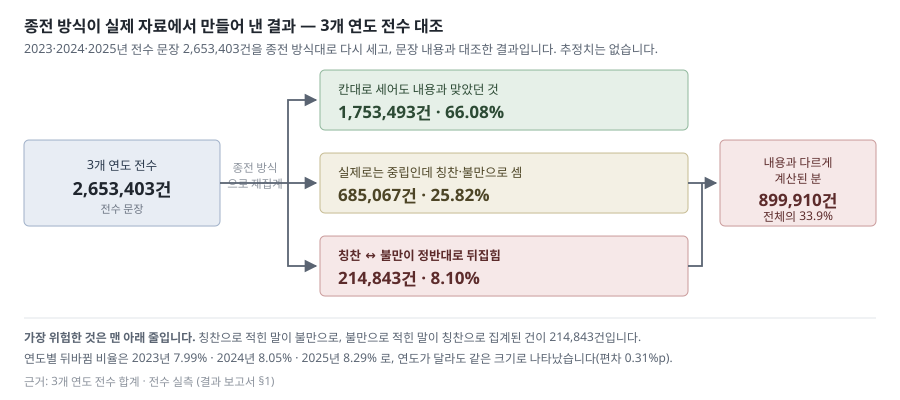

# 결과 보고서 — 다면평가 서술형 의견 분석 시스템

> 최초 발행 2026-08-11 · 판번호 `rev-260812-03` (제4판 — 양식 규격 적용) · 보고 대상 인사처 · 기준 시점 **2026-07-08 최종 모델 확정** · 상태 Done
> 📍 이 문서의 자리 — [세트 안내서](00_안내서_260811.md). 결과 판단에 필요한 내용은 이 문서에 모두 포함돼 있습니다.
> 🔴 **정답 기준 고지** — 대표 성능값(93.5%)의 **정답을 정한 주체는 사람이 아니라 AI** 이며, 이 문서를 작성한 것도 같은 계열 AI 입니다. 사람이 확정한 기준선은 아직 없습니다(§5 · [한계·미결](05_한계미결_260811.md) §1). 본 산출물에 대한 **외부 기관의 검수나 적합 판정은 존재하지 않습니다.**

---

## 1. 이전 시스템의 한계

**종전 판정 방식**: 문장 내용을 쓰지 않고 기입 칸만으로 칭찬·불만을 결정했음

3개 연도 전수 **2,635,919문장(약 264만)** 중 **34.2%가 실제 내용과 다르게 집계**됐다.

| # | 이전 시스템의 집계 결과 | 건수 | 비율 |
|---|---|---:|---:|
| ① | 내용과 일치한 분 | 1,734,065 | 65.8% |
| ② | 실제로는 중립인데 칭찬·불만으로 집계된 분 | 687,287 | 26.1% |
| ③ | **칭찬과 불만이 정반대로 뒤집힌 분** | **214,567** | **8.1%** |
| | **내용과 다르게 계산된 분 합계 (②+③)** | **901,854** | **34.2%** |

**발생 원인 (②③ 대응 — ①은 일치한 분이다)**

| # | 상세 |
|---|---|
| ② | **중립이라는 항목 자체가 없었다.** 칸이 장점·단점 둘뿐이라 판정도 둘뿐이었고, 실제로 중립인 문장은 전량 둘 중 하나로 배정됐다 |
| ③ | 「보완필요점 특별히 없음」이 단점 칸에 기입되면 **불만 1건**으로 집계됐다. 「업무 무관심」이 장점 칸에 기입되면 **칭찬 1건**이었다 |
| — | 담당자의 표기 실수가 아니라 **설계상 한계**다. 기입 칸이 곧 결론이므로 **오류를 발견할 수단이 없었다** |

- 3개 연도 모두 **전수 실측**이며 추정치가 포함돼 있지 않다.
- 「지적할 점이 없다」는 표현이 **불만 워드클라우드 상위 단어**로 집계되는 왜곡이 있었다.

---pb---

## 2. 위험 오류 해소

**뒤바뀜 오류**: 검증 자료 4종 761건 전부에서 0건임

칭찬을 불만으로, 불만을 칭찬으로 뒤집는 오류는 이 시스템에서 허용되지 않는 유일한 오류 유형이다.

| # | 검증 자료 | 문장 수 | 이전 뒤바뀜 | **현행 뒤바뀜** |
|---|---|---:|---:|---:|
| ① | 실제 분포에 가까운 문장 | 398 | 23 | **0** |
| ② | 칭찬·비판이 한 문장에 섞인 것 | 140 | 17 | **0** |
| ③ | 사람도 판단이 갈리는 경계 문장 | 149 | 7 | **0** |
| ④ | 완곡한 개선 요청 | 74 | 1 | **0** |
| | **계** | **761** | **48** | **0** |

**판정 여유도 점검 (①~④ 대응)**

| # | 반대편 점수의 최대값 | 판정 |
|---|---:|---|
| ① | 0.027 | 여유 통과 |
| ② | 0.080 | 여유 통과 |
| ③ | 0.445 | 통과 — 4종 중 최근접 |
| ④ | 0.026 | 여유 통과 |

- 반대편 점수가 0.5를 넘으면 판정이 뒤집힌다. 4종 중 3종은 최대값이 **0.08 미만**이다.
- 판단이 가장 어려운 경계 문장(③)에서도 뒤집힌 문장은 없다.

> ⚠️ **이 0의 측정 대상 — 함께 확인할 것**
>
> | 항목 | 내용 |
> |---|---|
> | 이 표의 근거 | **운영 중인 가중치 파일 자체**를 2026-07-27에 재판정한 실측(파일 지문 SHA-256 `620faad6…`). ③의 0은 오류 분포표가 **유일하게 결정**되어 산술로도 확인된다 |
> | 어긋나는 기록 1건 | 모델 개발 기록(`status_260715.md`)은 **같은 이름의 모델**에서 ③의 뒤바뀜을 **3건**으로 기재한다. 정확도는 76.5%로 동일하나 오류 분포가 다르다 |
> | 해석 | 두 측정은 **같은 가중치가 아니다.** 개발 기록은 같은 조건으로 **재학습한 판**이고, 이 표는 **실제 배포된 판**이다 |
> | ✅ **종결(2026-08-12)** | 승인을 받아 배포 가중치로 ③ 149건을 **재판정했다. 뒤바뀜 0건**(칭찬→불만 0 · 불만→칭찬 0), 정확도 76.51%. 오류 분포가 07-27 측정과 **전 항목 일치**한다. **이 표의 0 은 확정이다.** 재현: `result/verify_c3neu_flip_260812.py` |

---pb---

## 3. 정확도 개선

**도입 전후 정확도**: 동일 검증 자료로 측정해 82.4% → 97.7% 임

실제 자료 분포에 가장 가까운 검증 자료를 기준으로 한 값이다.

| # | 측정 | 이전 | **현행** |
|---|---|---:|---:|
| ① | 실제 분포에 가까운 검증 자료 (398건) | 82.4% | **97.7%** |
| ② | 무작위 추출 2024년 문장 (400건) | 63.3% | **93.5%** |
| ③ | 검증 자료 4종 전체 (761건) | 72.4% | **90.9%** |

**대표값 선정 근거와 한계**

| 항목 | 내용 |
|---|---|
| 대표값 | **AI 판독 기준 일치율 93.5%** (95% 신뢰구간 90.4~95.7 · 2024년 자료 400건) |
| 선정 근거 | ①③은 **개발 과정에서 선별해 구성한 자료**이고, ②만 무작위 추출이라 모집단을 대표한다 |
| ⚠ 한계 | ②의 정답을 정한 주체도 **사람이 아니다.** 「정답률 93.5%」·「사람이 판독한 93.5%」로 인용하지 않는다 |

- ③이 ①보다 낮은 것은 성능 저하가 아니라 **판단이 어려운 문장을 선별해 구성한 자료**이기 때문이다.
- 산식·신뢰구간 근거 → [기술 검토서](03_기술검토서_260811.md) §3

---pb---

## 4. 단계별 추진 현황

**추진 단계**: 4개 중 3개가 완료됐고 남은 1개는 기술 사항이 아니라 결재 사항임

| 단계 | 목표 | 결과 |
|---|---|---|
| **1** | 자료 정합 | ✅ 3개 연도 전수 확정 — **추정치 0** |
| **2** | 판정 체계 구축 | ✅ 중립 신설 · 뒤바뀜 **23 → 0** |
| **3** | 검증 | ✅ 세 측정이 **93~98% 구간에 수렴** |
| **4** | **기준 확정** | ⏳ **미완 — 결재 필요** |

**4단계 결재 대기 항목**

| # | 요청 | 사유 | 소요 |
|---|---|---|---|
| ① | 채점 표본 400건 **사람 재판독** | 현재 정답을 정한 주체가 사람이 아니다 | 약 2시간 |
| ② | 2025년 자료 표본 **200건 이상 신설** | 2025년 표본 295건은 판정 주체가 미확정이다 | 2~3시간 |
| ③ | 검토 후보 **5,596건** 확인 절차 승인 | 추출은 완료됐고 반영 여부만 남았다 | 인사처 일정 |
| ④ | 재발 방지 **9개 조** 채택 | 이번 개정의 원인 3건이 모두 절차 미비였다 | 계약 갱신 시 |

- ①이 최우선이다. **①의 결과에 따라 이 보고서의 대표값이 변경될 수 있다.**
- 이 표는 **4단계 관련 항목만** 추린 것이다. **결재 대기 전량의 정본은** [한계·미결](05_한계미결_260811.md) **§6** 이다.
- 중립 경계 성능 향상을 위한 추가 투자는 **보류를 권고**한다 — 두 방향 모두 실측으로 기각됐다([결과비교](02_결과비교보고서_260811.md) §2).

---pb---

## 5. 잔여 오류 분포

**잔여 오류 위치**: 69건 전부가 「중립이냐 아니냐」 경계에서 발생했고 칭찬↔불만 뒤집힘은 없음

오류의 존재보다 **발생 위치**가 판단 기준이다.

| # | 오류 유형 (검증 자료 **761건** 중) | 건수 |
|---|---|---:|
| ① | 불만을 중립으로 | 29 |
| ② | 중립을 불만으로 | 18 |
| ③ | 칭찬을 중립으로 | 11 |
| ④ | 중립을 칭찬으로 | 11 |
| ⑤ | **칭찬↔불만 뒤바뀜** | **0** |
| | **계** | **69** |

**무작위 표본에서 확인된 뒤바뀜 4건**

| # | 유형 | 건수 | 성격 |
|---|---|---:|---|
| ⑴ | 「너무 ~하다」 구문 | 3 | 단점 칸에 칭찬을 기입한 경우. **사람 간에도 판단이 갈리는 유형**이며 1건은 작성자 본인이 단점이라 명시했다 |
| ⑵ | 앞 절에 이끌린 판정 | 1 | **시스템의 명백한 오류.** 문장 뒤쪽에서 결론이 뒤집히는 구조를 놓쳤다 |

- 이 4건은 확신도 **0.83~0.99** 구간에서 발생했다. 따라서 **확신도가 낮은 건만 검토하는 운용은 성립하지 않는다.**
- 확신도 기반 선별은 **중립 경계 오류에만 유효**하며, 뒤바뀜을 줄이는 수단은 재학습뿐이다.

---pb---

## 6. 표본 규모별 일관성

**규모 간 일관성**: 400건 측정과 265만 건 측정이 같은 방향을 가리킴

작은 표본의 우연이 아니다.

| # | 측정 | 규모 | 값 |
|---|---|---:|---|
| ① | 무작위 표본 | 400 | 93.5% |
| ② | 개발용 검증 자료 (대표) | 398 | 97.7% |
| ③ | 2025년 실배치 감사 | 758,880 | 약 96% *(표본 295건 기반 추정)* |
| ④ | 3개 연도 전수 판정 분포 | **2,653,403 (약 265만)** | 전 항목 **1.0%p 이내 일치** |

**④의 해석 범위**

| | 내용 |
|---|---|
| ✅ 해당하는 것 | 서로 다른 3개 연도에서 칭찬·중립·불만 비율이 1.0%p 안에 들어왔다 → 특정 연도의 특성이 아니라 **인사평가 자료의 구조적 특성**이다 |
| ❌ 해당하지 않는 것 | **연도별 정확도가 같다는 뜻이 아니다.** 세 값 모두 채점자 없이 모델이 산출한 분포다. 기준 자격이 있는 외부 표본이 존재하는 연도는 **2024년뿐**이다 |

- ①②③이 **93~98% 구간에 수렴**한 것이 성능 주장의 근거다.
- ⚠ 다만 세 값 모두 정답을 정한 주체가 사람으로 확정되지 않았고, **서로 완전히 독립인 측정도 아니다.**

---pb---

## 7. 처리 실적과 분모 구분

**처리 실적**: 총 271만 행 중 98.8%에 판정이 부여됐고 보류 1.2%는 빈칸·무의미·과단문임

보류는 오류가 아니라 판정 대상이 아닌 것을 걸러낸 결과다.

| # | 항목 | 건수 | 비율 |
|---|---|---:|---:|
| ① | 총 처리 행 | **2,705,461 (약 271만)** | 100% |
| ② | 정상 판정 | 2,672,909 | **98.8%** |
| ③ | 판정 보류(빈칸·무의미·과단문) | 32,552 | 1.2% |
| ④ | ├ 칭찬 | 1,603,013 | 59.3% |
| ⑤ | ├ 중립 | 625,578 | 23.1% |
| ⑥ | └ 불만·개선요청 | 444,318 | 16.4% |

> ⚠ **분모 구분 — 이 보고서에는 크기가 다른 분모 3종이 나온다. 서로 바꿔 쓰지 않는다.**
>
> | 분모 | 값 | 집계 대상 | 사용 위치 |
> |---|---:|---|---|
> | 264만 | 2,635,919 | 문장 중 **기입 칸(장점/단점)이 남아 있는 것** — 이전 시스템과 대조가 가능한 범위 | §1 |
> | 265만 | 2,653,403 | 세 연도 **배치 산출 합계**(1,025,634 + 868,889 + 758,880). 264만보다 **17,484건 많고, 그 차이는 칸 대조가 불가능한 분**이다 | §6 |
> | 271만 | 2,705,461 | 문장을 절 단위로 분할한 **처리 행** | §7(이 표) |
>
> **비율 인용 시에는 §6의 문장 기준(265만)** 을 사용한다. 이 표는 처리량과 보류율의 근거로만 사용한다.

---pb---

## 8. 관련 문서

**문서 범위**: 이 문서는 결과만 다룸

근거·경위·한계는 아래 문서에서 확인한다.

| 확인 사항 | 문서 |
|---|---|
| 최신판이 아니라 7/8 판을 채택한 사유 | [결과비교 보고서](02_결과비교보고서_260811.md) |
| 수치의 신뢰성(산식·검정) | [기술 검토서](03_기술검토서_260811.md) |
| 채점에 사용한 자료 | [시험데이터 산정 보고서](04_시험데이터산정보고서_260811.md) |
| 미완 사항·해소 경로가 없는 사항 | [한계·미결](05_한계미결_260811.md) |
| 변경 내역과 사유 | [개정 이력](06_개정이력_260811.md) |
