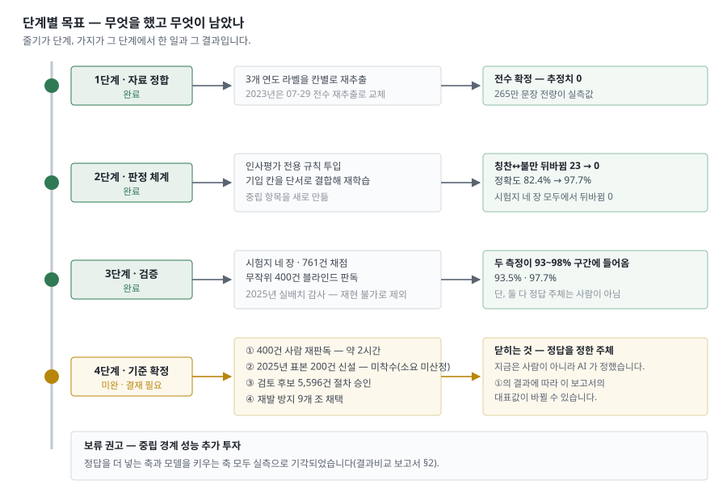

# 결과 보고서 — 다면평가 서술형 의견 분석 시스템

> 최초 발행 2026-08-11 · 판번호 `rev-260825-01` (제8판 — 보고 서술 기법 전면 적용) · 보고 대상 인사처 · 기준 시점 **2026-07-08 최종 모델 확정** · 상태 Done
> 📍 이 문서의 자리 — [세트 안내서](00_안내서_260811.md). 결과 판단에 필요한 내용은 이 문서에 모두 포함돼 있음.
> 🔴 **정답 기준 고지** — 대표 성능값(93.5%)의 **정답을 정한 주체는 사람이 아니라 AI** 이며, 이 문서를 작성한 것도 같은 계열 AI 임. 사람이 확정한 기준선은 아직 없으며, **사람 재판독이 이뤄지면 대표값 93.5%는 변경될 수 있음**([한계·미결](05_한계미결_260811.md) §1). 본 산출물에 대한 **외부 기관의 검수나 적합 판정은 존재하지 않음.**

---

## 1. 이전 시스템의 한계

□ **종전 판정 방식: 문장 내용을 보지 않고 기입 칸 위치만으로 칭찬·불만 결정**

○ **분석 데이터 규모**: 3개 연도 전수 **2,653,403문장**(약 265만 건)
○ **실제 오류율**: 전체 데이터 중 **33.9%** 가 실제 문장 내용과 다르게 오집계됨

▸ 종전 방식이 3개 연도 전수에서 만들어 낸 집계 결과

| 분류 (도메인) | 상세 (집계 성격) | 건수 | 비율 |
|---|---|---:|---:|
| 정상 판정 | ① 실제 문장 내용과 일치하게 집계된 분 | 1,753,493 | 66.1% |
| 단순 분류 오류 | ② 실제로는 중립이나 장점·단점으로 오집계된 분 | 685,067 | 25.8% |
| 치명적 판정 오류 | **③ 장점과 단점이 정반대로 뒤집혀 집계된 분** | **214,843** | **8.1%** |
| **총계 (오류 합계)** | **내용과 다르게 계산된 분 합계 (②+③)** | **899,910** | **33.9%** |

□ **오집계(②·③) 발생 원인**

▸ 원인별 발생 구조와 성격

| 분류 (도메인) | 상세 (발생 구조) |
|---|---|
| **중립 판정 부재** | 시스템에 중립 항목이 존재하지 않고 기입 칸이 장점·단점 이분법으로 구성되어, **실제 중립 문장 전량이 칭찬 또는 불만으로 강제 배정됨** |
| **라벨 기반 결론 도출** | 문장 내용 검증 없이 기입 칸 자체를 결론으로 처리함 · 예 1: 단점 칸에 「보완필요점 특별히 없음」 기입 시 **불만 1건**으로 오집계 · 예 2: 장점 칸에 「업무 무관심」 기입 시 **칭찬 1건**으로 오집계 |
| **구조적 설계 한계** | 작성자의 표기 실수가 아니라 기입 칸이 곧 최종 결론이 되는 **시스템 자체의 구조적 한계**이며, 사후에 오류를 검증·발견할 수단이 전무함 |

□ **분석 데이터의 신뢰성**

○ **추정치 배제 사유**: 표본 추출은 데이터 왜곡을 낳으므로 채택하지 않음
○ **실측 범위**: 통계적 추정 없이 3개 연도 전체를 예외 없이 전수 실측함

○ **대표적 왜곡 사례**: 「지적할 점이 없다」처럼 **불만이 없음을 뜻하는 표현**
- **오집계 결과**: 구조적 한계로 불만 워드클라우드 상위 단어에 오름

---pb---

## 2. 위험 오류 해소

□ **뒤바뀜 오류 발생 현황: 검증 자료 4종 761건 전수 조사 결과 '0건'**

○ **위험 오류의 정의**: 칭찬을 불만으로, 불만을 칭찬으로 뒤집는 오류임
- **허용 수준**: 본 시스템에서 허용되지 않는 유일한 오류 유형임

○ **평균 배제 사유**: 자료별 난이도가 달라 산술 평균은 왜곡을 낳음
○ **통계 산출 원칙**: 4종 결과를 **단순 평균한 「전체 정확도」 산출을 전면 배제**함

▸ 검증 자료 4종의 뒤바뀜 오류 발생 건수 (도입 전후 대조)

| 분류 (도메인) | 상세 (자료 성격) | 문장 수 | 이전 뒤바뀜 | **현행 뒤바뀜** | 비고 (판정) |
|---|---|---:|---:|---:|---|
| ① 대표성 | 실제 분포에 가까운 문장 | 398 | 23 | **0** | 대표 자료 |
| ② 혼합성 | 칭찬·비판이 한 문장에 섞인 것 | 140 | 17 | **0** | 한계 측정용 |
| ③ 난이도 | 사람도 판단이 갈리는 경계 문장 | 149 | 7 | **0** | 성능 하한 기준 |
| ④ 완곡성 | 완곡한 개선 요청 | 74 | 1 | **0** | 한계 측정용 |
| **총계** | **검증 자료 4종 전수 합계** | **761** | **48** | **0** | **위험 오류 완전 차단** |

□ **검증 자료 4종의 구성 사유**

○ **① 대표성**: 모집단을 반영하는 유일한 표준 자료임
○ **②·③·④ 한계 측정**: 판정이 까다로운 경계 문장만 선별한 측정 도구임
- **③의 지위**: 4종 중 **최저 성능 기준인 하한값**임
- **구성 사유 상세**: [시험데이터 산정 보고서](04_시험데이터산정보고서_260811.md) §1

□ **판정 안전성 (판정 여유도)**

○ **판정 여유도의 정의**: 판정된 문장에 반대편 극성이 얼마나 붙었는지의 값임
- **해석 방향**: 값이 작을수록 뒤바뀜에서 멂

○ **값의 실체**: 판정 모델이 문장마다 내는 세 확률 중 **반대편 극성의 확률**임
- **산출 주체**: 인사평가 전용으로 재학습한 판정 모델임
- **확률의 성질**: 칭찬·중립·불만 세 확률의 합은 1이고 판정은 가장 큰 쪽임
- **뒤집힘 조건**: **반대편 확률이 나머지 둘보다 커지는 순간** 판정이 뒤집힘

▸ 검증 자료별 반대편 점수 최대값과 안전성 판정

| 분류 (도메인) | 상세 (반대편 점수의 최대값) | 판정 (안전성) |
|---|---:|---|
| ① 대표성 | 0.027 | 여유 통과 |
| ② 혼합성 | 0.080 | 여유 통과 |
| ③ 난이도 | 0.445 | 통과 — 4종 중 최근접 |
| ④ 완곡성 | 0.026 | 여유 통과 |

○ **안전권 형성**: 4종 중 3종이 0.08 미만으로 뒤집힐 여지가 실질적으로 없음
- **체감 수준**: 칭찬으로 판정된 문장에 불만 쪽 확률이 0.03 남짓 붙는 정도임

○ **한계 상황 검증**: 경계 문장(③)에서 0.445까지 올라갔으나 뒤집히지 않음
- **뒤집히지 않은 이유**: 해당 문장도 칭찬 확률이 0.445보다 컸음
- **③의 성격**: 사람 간에도 판단이 갈리는 문장만 모은 자료라 **예상된 결과임**
- **재현 근거**: 배포 가중치로 ③ 149건을 재판정해 오류 분포가 전 항목 일치함(2026-08-12)
- **산출 절차**: 재현 스크립트는 [기술 검토서](03_기술검토서_260811.md) 참조

---pb---

## 3. 정확도 개선

□ **시스템 도입 전후 정확도: 모집단 대표 자료 기준 63.3% → 93.5%**

○ **선별 자료 배제 사유**: 개발 중 선별된 자료는 성능을 과대평가함
○ **대표값 선정 원칙**: **무작위 추출 자료(②)만을 대표값 산출 기준**으로 채택함
○ **산출 기준 데이터**: 2024년 실제 필드 문장에서 무작위 추출한 400건

▸ 검증 자료별 정확도 (도입 전후 대조)

| 분류 (도메인) | 상세 (측정 대상) | 이전 | **현행** |
|---|---|---:|---:|
| ① 성과 대표성 | 실제 데이터 분포에 가까운 개발용 검증 자료 (398건) | 82.4% | **97.7%** |
| ② 현업 범용성 | 무작위 추출한 2024년 최신 필드 문장 (400건) | 63.3% | **93.5%** |
| ③ 보수적 성능 하한 | 검증 자료 4종 합산 (761건) — 4종 중 측정값이 가장 낮은 하한선 지표 | 72.4% | **90.9%** |

○ **자료 간 포함 관계**: ③의 761건은 ①의 398건을 **포함한** 4종 합산값임
- **비교 제한**: ①과 ③을 서로 다른 자료로 비교하지 않음

○ **③ 산출 방식**: 90.9%는 761건을 **합산**해 산출한 값임
- **평균값과의 구별**: 4종 정확도를 평균하면 87.2%가 되나 이 값은 쓰지 않음
- **평균을 쓰지 않는 이유**: 고난도 자료 비중이 커져 성능을 과소평가함
○ **③이 ①보다 낮은 사유**: 성능 저하가 아니라 판단이 어려운 문장을 선별해 구성한 자료가 합산에 포함되었기 때문임

□ **대표값 선정 근거와 인용 한계**

▸ 대표 성능 지표의 근거·범위·인용 제한

| 분류 (도메인) | 상세 (내용) |
|---|---|
| **대표 성능 지표** | AI 판독 기준 일치율 **93.5%** · 통계적 신뢰도: 95% 신뢰구간 [90.4% ~ 95.7%] · 검증 데이터: 2024년 실제 필드 자료 무작위 추출 400건 |
| **대표값 선정 근거** | 다른 자료(①·③)는 개발 과정에서 특정 목적에 맞게 선별·구성된 데이터인 반면, **②번 자료는 유일한 무작위 추출 데이터로서 전체 모집단을 대변함** |
| **⚠ 데이터 활용 한계** | 비교 대상이 되는 정답(Ground Truth)의 판정 주체 역시 사람이 아닌 시스템이므로, 본 지표를 **「정답률 93.5%」 또는 「사람이 판독한 기준 93.5%」로 혼용·왜곡하여 인용하는 것을 전면 금지함** |

- **산식·신뢰구간 근거**: [기술 검토서](03_기술검토서_260811.md) §3

---pb---

## 4. 단계별 추진 현황

□ **추진 단계: 자료 정합·판정 체계 구축·검증 3개 단계 완료**

○ **단계 구성 원칙**: 앞 단계의 산출물이 뒤 단계의 입력이 되도록 구성함
- **단계 순서**: 자료 정합 → 판정 체계 구축 → 정량 검증

▸ 단계별 수행 과제와 달성 결과

| 단계 (도메인) | 상세 (수행 과제) | 달성 결과 및 의의 |
|---|---|---|
| **1단계: 자료 정합** | 3개 연도 전체 데이터의 기입 칸별 라벨 **원천 재추출** | · 통계적 추정치를 전면 배제한 **100% 전수 실측 데이터 확정**(추정치 0건) · 분석 자료의 정합성 확보 |
| **2단계: 판정 체계 구축** | **인사평가 전용 판정 규칙** 수립 및 AI 모델 **재학습** | · **중립 판정 체계 신설**로 기존 이분법 구조의 한계 해소 · 치명적 위험 오류(칭찬↔불만 뒤바뀜) **23건 → 0건 완전 해소** |
| **3단계: 성과 정량 검증** | 검증 자료 4종(761건)과 무작위 추출 문장(400건) **교차 검증** | · 두 측정치 모두 **93% ~ 98% 구간** 진입 확인 |

□ **후속 투자 판단 지침**

○ **기각된 두 축**: 정답을 더 넣는 축과 모델을 키우는 축 모두 실측으로 기각됨
○ **추가 투자 보류 권고**: 중립 경계 성능 향상을 위한 추가 투자는 **보류를 권고함**
- **근거 문서**: [결과비교](02_결과비교보고서_260811.md) §2

○ **결재 대기 항목의 정본**: [한계·미결](05_한계미결_260811.md) §6 이 정본임
- **본 문서의 범위**: 결과만 다루며 결재 항목을 중복 기재하지 않음

---pb---

## 5. 잔여 오류 분포

□ **잔여 오류 발생 현황: 칭찬↔불만 뒤바뀜 0건, 전량 중립 경계 구간에서만 발생(69건)**

○ **핵심 판단 기준**: 오류의 존재 여부가 아니라 **오류의 발생 위치**로 설정함
- **위치의 정의**: 중립 경계 구간에서 발생했는지 여부를 뜻함
○ **중립 경계 오류의 성격**: 중립 경계 오류는 값의 크기를 오판하지만 칭찬과 불만의 **방향은 뒤집지 않음**

▸ 중립 경계 오류의 세부 유형 (검증 자료 761건 대상)

| 분류 (도메인) | 상세 (오류 발생 유형) | 건수 | 비고 (판정) |
|---|---|---:|---|
| **① 소극적 불만 분류** | 실제 불만이나 시스템이 '중립'으로 오판정한 건 | 29 | 경계 오류 중 최다 발생 |
| **② 과적극적 불만 분류** | 실제 중립이나 시스템이 '불만'으로 오판정한 건 | 18 | 방향 오류 아님 |
| **③ 소극적 칭찬 분류** | 실제 칭찬이나 시스템이 '중립'으로 오판정한 건 | 11 | 방향 오류 아님 |
| **④ 과적극적 칭찬 분류** | 실제 중립이나 시스템이 '칭찬'으로 오판정한 건 | 11 | 방향 오류 아님 |
| **⑤ 치명적 판정 오류** | **칭찬과 불만이 정반대로 뒤바뀐 건** | **0** | **위험 오류 완전 차단** |
| **총계** | **잔여 경계 오류 합계** | **69** | 검증 자료 761건의 9.1% 수준 |

□ **무작위 표본 내 뒤바뀜 오류(4건)의 원인**

○ **측정 범위**: 무작위 추출 400건에서 확인된 뒤바뀜 4건이며, 위 검증 자료 761건과는 **별개 표본**임

▸ 뒤바뀜 4건의 원인 유형과 성격

| 분류 (도메인) | 상세 (오류 발생 원인) | 건수 | 성격 (판정) |
|---|---|---:|---|
| **⑴ 맥락적 모호성** | 「너무 ~하다」 구문을 단점 칸에 칭찬으로 기입 | 3 | · 사람 판독자 간에도 판단이 갈리는 난해한 유형 · 1건은 작성자가 단점 칸에 명시하여 모델 판정을 왜곡함 |
| **⑵ 구조적 문맥 상실** | 문장 앞 절의 표현에 판정 가중치가 쏠림 | 1 | · **시스템의 명백한 알고리즘 오류** · 후반부에서 결론이 뒤집히는 역접 구조를 인지하지 못함 |

□ **확신도 기반 시스템 운용 지침**

○ **선별 검토 불가**: 뒤바뀜 오류 4건 전량이 확신도 상위 구간(0.83~0.99)에서 발생함
- → 확신도가 낮은 데이터만 표본 검토하는 **수동 필터링 운용 방식은 원천적으로 성립 불가능함**

○ **기능적 한계 명시**: 확신도 점수 기반의 선별 방식은 **중립 경계 오류(69건) 제어에만 유효함**

○ **원천적 해결 방향**: 시스템 치명타인 정반대 뒤바뀜 오류를 근본적으로 제거할 필요가 있음
- → 수동 검토가 아닌 **추가 데이터 레이블링을 통한 모델 재학습**이 유일한 해결 수단임

---pb---

## 6. 표본 규모별 일관성

□ **규모 간 일관성: 400건 표본 측정과 265만 건 전수 측정이 동일 방향으로 수렴**

○ **교차 대조 사유**: 소규모 표본 측정값은 우연의 산물일 수 있음
○ **교차 측정의 구성**: 규모가 다른 세 측정을 같은 방향으로 대조함

▸ 측정 규모별 결과

| 분류 (도메인) | 상세 (측정 대상) | 규모 | 검증 결과 |
|---|---|---:|---:|
| **① 현업 범용성** | 무작위 표본의 정답 일치율 | 400 | **93.5%** |
| **② 성과 대표성** | 개발용 검증 자료의 정답 일치율 | 398 | **97.7%** |
| **③ 구조 안정성** | 3개 연도 전수 판정 분포의 연도 간 일치도 | 2,653,403 | **99.0%** |

○ **①②의 성격**: 정답과 대조한 일치율임
○ **③의 성격**: 연도 간 분포 편차(최대 0.98%p)를 일치도로 환산한 값임
- → **③은 연도별 정확도가 같다는 뜻이 아님**

□ **전수 판정 분포(③)의 정확한 해석 범위**

▸ 해석해도 되는 것과 해서는 안 되는 것

| 분류 (도메인) | 상세 (해석 지침) |
|---|---|
| ✅ **데이터 구조적 특성** | 서로 다른 3개 연도에서 칭찬·중립·불만 분포가 1.0%p 이내로 수렴한 것은, 특정 연도의 우연한 성과가 아니라 **인사평가 데이터 자체의 안정적인 구조적 특성**임을 뒷받침함 |
| ❌ **연도별 정확도 혼동 금지** | 해당 수렴 지표를 **연도별 정확도가 동일하다는 의미로 해석하는 것을 금지함** — 세 값 모두 정답 채점자 없이 모델이 자체 산출한 분포이며, 외부 기준 표본이 존재하는 연도는 **2024년이 유일함** |

□ **성능 주장의 근거 범위와 리스크 관리**

○ **핵심 성능 근거**: 표본 및 검증 지표(①·②)가 **93% ~ 98% 구간에 안정적으로 진입한 것**임
- → 해당 구간 도달이 시스템 성능을 뒷받침하는 핵심 근거임

○ **근거 제외 사항**: 과거 인용되던 **2025년 실배치 감사(약 96%)** 를 제외함
- **제외 사유**: 근거 표본 295건의 판독 원본이 어디에도 남아 있지 않음
- **확인 범위**: 파일시스템·형상관리 양쪽에서 부존재를 확인해 재현 불가로 판정함
- → 최종 성능 근거에서 **전면 제외함**([한계·미결](05_한계미결_260811.md) §5 ⑨)

○ **⚠ 잔여 해석 한계**: 남은 두 지표(①·②)에도 두 가지 제약이 남음
- **정답 주체**: 정답을 최종 확정한 주체가 사람으로 검증되지 않았음
- **측정 독립성**: 두 자료가 **서로 완전히 독립적인 측정을 수행한 것이 아님**

---pb---

## 7. 처리 실적

□ **전체 데이터 처리 실적: 3개 연도 전수 265만 문장 전량 판정 완료(보류 0건)**

○ **판정 완료 범위**: 3개 연도 전수 **2,653,403문장**(약 265만) 전량임
- **보류 건수**: **단 1건의 판정 보류도 발생하지 않음**

▸ 시스템 판정 분포 (단일 모집단 2,653,403건 기준)

| 분류 (도메인) | 상세 (판정 항목) | 처리 건수 | 구성 비율 |
|---|---|---:|---:|
| **① 총계** | 시스템 처리 대상 전체 문장 | **2,653,403** | **100.0%** |
| **② 긍정** | ├ 칭찬 및 수범 사례 | 1,498,517 | 56.5% |
| **③ 중립** | ├ 중립 표현 및 사실 기술 | 685,067 | 25.8% |
| **④ 부정** | └ 불만 표현 및 완곡한 개선 요청 | 469,819 | 17.7% |

○ **중립 판정의 의미**: ③의 685,067건은 **중립 신설로 회수된 건수**임
- **종전과의 대조**: 종전 방식이 오집계하던 분과 같은 규모임(§1 표 ②행)

○ **단일 모집단 원칙**: 문장 수 기준은 **2,653,403건 하나로 고정**함
- **동일 범위**: §1·§6과 완전히 동일한 모집단임
- **근거 데이터**: 판정 분포·문장 수 산출 근거와 원본 파일 목록은 [기술 검토서](03_기술검토서_260811.md) 참조

---pb---

## 8. 관련 문서

□ **문서의 범위 및 한계**

○ **본 문서의 범위**: 결과만 다루며, 근거·경위·한계는 아래 하위 문서에서 확인함

▸ 항목별 세부 참조 문서

| 분류 (도메인) | 상세 (확인 사항) | 연계 문서 |
|---|---|---|
| **버전 채택 사유** | 최신판이 아니라 7/8 판을 채택한 사유 | [결과비교 보고서](02_결과비교보고서_260811.md) |
| **수치 신뢰성** | 수치의 신뢰성(산식·검정) | [기술 검토서](03_기술검토서_260811.md) |
| **채점 기준 자료** | 채점에 사용한 자료 | [시험데이터 산정 보고서](04_시험데이터산정보고서_260811.md) |
| **미결 리스크** | 미완 사항·해소 경로가 없는 사항 | [한계·미결](05_한계미결_260811.md) |
| **이력 관리** | 변경 내역과 사유 | [개정 이력](06_개정이력_260811.md) |

---pb---

## 9. 개정 이력(이 문서)

□ **최신 변경 사항 요약 (`rev-260825-01` / 제8판)**

○ **핵심 개정 사항**: 보고 서술 기법을 전면 적용함
- **표 골격 통일**: `분류 (도메인) / 상세 (설명) / 비고 (판정)`
- **서술 기법**: 사유 선행(why-first) · 사실↔함의 분리 · 문말 명사형 통일
- **표 복원**: 해석 지침 대비표를 ✅/❌ 대비 형태로 복원함
- **줄 길이 상한**: 개조식 한 줄의 본문을 **50자 이내**로 제한함

○ **성능값 변동**: 없음 — §1~§7의 통계 수치와 판정 결과는 제7판과 동일함
○ **이력 관리 원칙**: 전체 이력의 정본은 [개정 이력](06_개정이력_260811.md)임
- **본 절의 범위**: 본 문서의 최신 변경점만 요약함(NUM-9 RV-4)

□ **세부 개정 내역 및 영향 범위**

▸ 개정 항목별 내역과 적용 범위

| 분류 (도메인) | 상세 (개정 내역) | 위치 |
|---|---|---|
| **표 골격 통일** | 전 표의 열 머리를 `분류 (도메인) / 상세 (설명) / 비고 (판정)` 로 통일하고, 첫 열이 번호 단독이던 표에 도메인 명사구를 병기함. 숫자만 두고 해석을 독자에게 넘기던 표에 **비고(판정) 열을 신설**함 | 전체 |
| **사유 선행 적용** | 배제·금지·선정·권고 문장에 **사유를 조치 앞으로** 이동함 — 평균 산출 배제(§2)·대표값 선정(§3)·추정치 배제(§1)·추가 투자 보류(§4) 4개소 | §1~§4 |
| **사실↔함의 분리** | 확신도 운용(§5)·성능 근거(§6)에서 사실 줄과 그로부터 도출되는 함의를 `-` 와 `→` 두 줄로 분리함 | §5·§6 |
| **해석 지침 대비표 복원** | 제7판이 「일관성」을 이유로 삭제했던 §6 해석 범위 표를 **✅ 허용 / ❌ 금지 대비표**로 복원하고, 무의미 라벨(「해당하는 것」)을 판단 대상 명사구로 교체함 | §6 |
| **표 리드인 신설** | 모든 표 앞에 그 표가 무엇을 확정하는지 밝히는 `▸` 도입 줄을 추가함 (고아 표 0건) | 전체 |
| **문말 통일** | 개조식 결론 줄의 문말을 명사형(`~함`·`~됨`·`~임`)으로 통일하고, 인용 제한 조항을 `~전면 금지함`으로 닫아 구속력을 부여함 | 전체 |
| **본문 내부 흔적 제거** | 파일 지문(SHA-256)·산출물 파일명·스크립트 경로를 본문에서 제거하고 [기술 검토서](03_기술검토서_260811.md) 포인터로 대체함 | §2·§7 |

▸ 제7판(`rev-260824-02`)에서 확정되어 본 판에 그대로 유지된 수치 개정

| 분류 (도메인) | 상세 (제7판 확정 내역) | 위치 |
|---|---|---|
| **분모 단일화** | §7 판정 분포를 §1·§6과 같은 원본·규약으로 재측정해 **2,653,403 단일 분모로 통일**함. 이에 따라 07-14 스냅샷(2,648,850)과의 4,553건(0.17%) 차이를 설명하던 각주가 소멸함 | §7 |
| **판정 분포 갱신** | 칭찬 1,582,635(59.7%) → **1,498,517(56.5%)** · 중립 625,578(23.6%) → **685,067(25.8%)** · 불만 440,637(16.6%) → **469,819(17.7%)** | §7 |
| **4단계 삭제** | 근거가 확인되지 않은 「2025년 표본 200건 신설」과 4단계(기준 확정) 블록을 본문·표·흐름도 세 곳에서 제거하고, 결재 대기 항목의 정본을 [한계·미결](05_한계미결_260811.md) §6 으로 이관함 | §4 |
| **판정 여유도 정의 정정** | 「반대편 점수 0.5 초과 시 뒤집힘」의 **0.5 는 원자료·산출 스크립트 어디에도 근거가 없는 창작값**(실측 최대 0.445의 올림)이었음. 실제 판정은 세 확률의 argmax 이므로 해당 기준선 서술을 삭제하고 값의 실체를 명시함 | §2 |
| **§6 단위 통일** | ③행이 ①②(93.5%·97.7%)와 달리 「1.0%p 이내 일치」로 단위가 달랐던 것을 **99.0%**(연도 간 분포 일치도)로 통일함 | §6 |
| **§3 대표값 정합** | 절 결론이 대표값(93.5%)이 아닌 최고값(97.7%)을 내세우던 것을 대표값 기준으로 교체하고, ①⊂③ 포함 관계와 90.9%가 합산값(평균 87.2% 아님)임을 명시함 | §3 |
