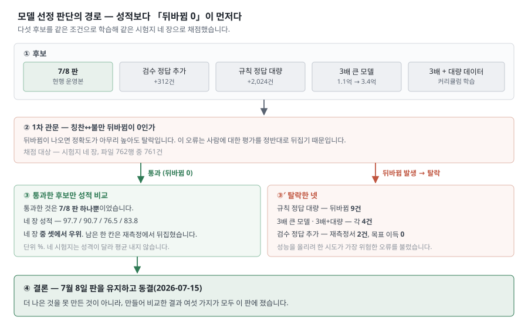

# 결과비교 보고서 — 7월 8일 판 채택 사유

> 최초 발행 2026-08-11 · 판번호 `rev-260825-01` (제6판 — 보고 서술 기법 전면 적용) · 종전 `rev-260819-01` (제5판 — 학습 코퍼스 규모 265만 정정) · 보고 대상 인사처 · 기준 시점 **2026-07-08 최종 모델 확정** · 상태 Done
> 📍 이 문서의 자리 — [세트 안내서](00_안내서_260811.md) · 성능 수치의 원 출처는 [`MODEL_SELECTION_REPORT_260715.md`](../../plans/_datasets/kote_finetune/result/MODEL_SELECTION_REPORT_260715.md) §4 이며 **본 문서는 인용만 하고 재계산하지 않는다.**
> 🔴 **정답 기준 고지** — 본 문서 성능값의 정답은 **사람이 표기한 검증 라벨**이다. 다만 대표 정확도 계열(93.5% 등 운영 표본값)은 AI 판독 기준이며, 그쪽은 [결과 보고서](01_결과보고서_260811.md)에서 다룬다.

---

## 1. 채택 결론

□ **채택 판: 대안 6종 중 넘어선 후보가 없어 2026년 7월 8일 판을 운영에 적용함**

○ **판단 순서**: 성적보다 칭찬↔불만 뒤바뀜 0 여부를 먼저 봄
- **실격 규칙**: 뒤바뀜이 발생한 후보는 성적과 무관하게 실격 처리함

○ **유일한 우위 항목**: 한 항목에서 앞선 것으로 보인 사례가 1건 있었음
- **재측정 결과**: 반복 측정에서 확인되지 않음(§4)

▸ 후보 5종을 같은 조건으로 학습해 검증 자료 4종으로 채점한 성적과 판정

| 후보 (도메인) | 일반 대표 | 혼합·고난도 | 중립 경계 | 개선요청 | **칭찬↔불만 뒤바뀜** | 비고 (판정) |
|---|---:|---:|---:|---:|---:|---|
| **① 현 모델 — 7/8 판(운영 중)** | **97.7** | **90.7** | 76.5 | **83.8** | **0** | ✅ **채택** |
| **② 사람 검수 정답을 더 넣은 판** | 96.5 | 87.9 | **80.5** ＊ | **83.8** | 0 | ❌ 기각 |
| **③ 규칙으로 자동 생성한 정답을 대량 투입한 판** | 94.0 | 85.7 | 75.2 | 74.3 | **9** | ❌ **실격** |
| **④ 3배 큰 모델로 바꾼 판** | 96.7 | 83.6 | 75.2 | **83.8** | **4** | ❌ 기각 |
| **⑤ 3배 큰 모델 + 대량 정제 데이터 판** | 94.0 | 82.9 | **66.4** | 78.4 | **4** | ❌ 기각 |

*(단위 %. 다섯 행 **전부 같은 조건**의 값임 — 학습 1회·같은 시드·같은 검증 자료. 네 개 열은 성격이 다른 검증 자료 4종이며 서로 대신하지 못함 → [시험데이터 산정 보고서](04_시험데이터산정보고서_260811.md) §1)*

- **＊ 표에서 ①보다 높은 항목**: 하나뿐이며 ②의 중립 경계 **80.5** 임
- **그 값의 성격**: §4 반복 측정에서 **우연히 높게 나온 값**임을 확인함

▸ 위 표에서 확정되는 판독 사항 4건

| 판독 사항 (도메인) | 상세 (내용) | 근거 |
|---|---|---|
| **⑴ 전 항목 열세** | ③④⑤는 **4종 어디에서도 ①을 넘지 못함**(개선요청 두 자리는 동률) | 표 |
| **⑵ 우위 1칸의 소멸** | ②만 한 칸(중립 경계)에서 앞섰고, **그 한 칸이 반복 측정에서 소멸**함 | §4 ① |
| **⑶ 뒤바뀜 신규 발생** | **③④⑤가 뒤바뀜을 새로 만듦.** ②는 이 표(단일 학습)에서는 0이었으나 **반복 측정에서 2건이 유입**됨 | §4 ③ |
| **⑷ 실격 사유** | ③은 **정확도가 아니라 뒤바뀜 9건 때문에** 성적과 무관하게 실격됨 | 표 |

○ **정리**: 7/8 판을 유지한 근거는 대안을 만들지 못한 데 있지 않음
- **실제 근거**: 대안 6종을 구축해 비교한 결과임
- **결정적 사실**: 유일하게 앞섰던 항목마저 재측정에서 소멸함

---pb---

## 2. 재학습 시도 6종과 기각 사유

□ **재학습 시도 결과: §1 표의 4종에 2종을 더한 총 6종이 전부 기각됨**

○ **표에 4종만 오른 이유**: 나머지 2종은 성적 산출 이전에 탈락해 §1 표에 오르지 않음

▸ 재학습 시도 6종의 변경 내용과 기각 사유

| 시도 (도메인) | 상세 (무엇을 바꿨나) | 비고 (기각 사유) |
|---|---|---|
| **② 사람 검수 정답 추가** | 정답 **312건** 추가 | 한 번 측정에서는 앞섰으나(§1 ＊) **반복 측정에서 이득 0** |
| **③ 규칙 생성 정답 대량 추가** | 정답 **2,024건** 추가 | 칭찬↔불만 **9건** 발생 |
| **④ 모델 용량 3배** | 1.1억 → 3.4억 파라미터 | 성적 열세 + 뒤바뀜 **4건** |
| **⑤ 용량 3배 + 대량 정제 데이터** | ④ + 커리큘럼 학습 | 중립 경계 **66.4** 로 붕괴 |
| **⑥ 시드 5개 추첨·앙상블** | 학습 난수만 교체 | 전 시드에서 뒤바뀜 **2~6건**, 0인 시드 없음 |
| **⑦ 2023년 자료 정답 4개 구성** | 학습 자료 구성 교체 | 전 구성에서 뒤바뀜 **4~6건** |

○ **시도 범위**: 변경 가능한 축은 3개이며 전부 시도함
- **세 축의 구성**: 정답 추가(②③⑦) · 모델 용량 확대(④⑤) · 학습 방식 변경(⑥)

○ **공통 결과**: 6종 전부에서 뒤바뀜이 발생함
- **③④⑤⑥⑦**: 한 번 학습에서 즉시 발생함
- **②**: 한 번 학습에서는 0이었으나 **반복 측정에서 2건** 발생함

- → 성능을 올리려 한 시도가 가장 위험한 오류를 불러들인 결과임

---pb---

## 3. 공개 모델 직접 적용 결과

□ **공개 모델 직접 적용: 이전 시스템보다도 성적이 낮아 실측으로 기각됨**

○ **기각 근거**: 이전 시스템보다 정확도가 **4.0%p 낮고** 뒤바뀜은 **13건 많음**
○ **비교 기준**: 도입 이전·공개 모델·현행 세 단계를 같은 자료로 채점함

▸ 세 단계의 정확도와 칭찬↔불만 뒤바뀜 건수

| 단계 (도메인) | 정확도 | **뒤바뀜** |
|---|---:|---:|
| **① 도입 이전 — 기입 칸만 보고 판정** | 82.4% | 23 |
| **② 공개 감정 모델을 그대로 적용** | **78.4%** | **36** |
| **③ 인사평가 전용으로 다시 학습(현행)** | **97.7%** | **0** |

*(대표 검증 자료 기준 — 파일 399행 중 채점 대상 398건)*

○ **원인**: 문체 차이임 — 공개 모델의 학습 자료는 인터넷 댓글이고, 인사평가 문장은 **완곡한 문어체**임

○ **최다 오류 유형**: **개선 요청을 칭찬으로 판정한 것(40건)** 임
- **발생 기제**: 「전문지식이 더 필요함」처럼 문장 안에 긍정 어휘가 섞임

○ **정리**: 성능을 만든 요소는 공개 모델 도입이 아니라 **인사평가 문체에 맞춘 재학습**임

---pb---

## 4. 대안 ② 우위 항목의 재측정

□ **대안 ② 우위 항목: 중립 경계 1개(80.5)뿐이었고 반복 측정에서 소멸함**

○ **투자 판단**: 우위가 재현되지 않았으므로 정답 자료를 추가 확보하는 방향의 투자를 중단함

▸ 대안 ②의 우위·열세 항목을 한 번 학습과 다섯 번 학습 평균으로 대조한 결과

| 재측정 항목 (도메인) | **한 번 학습**(§1 표) | **다섯 번 학습 평균** | 비고 (판정) |
|---|---|---|---|
| **① 중립 경계 — ②가 앞섰던 항목** | ① 76.5 vs ② **80.5** | ① **74.09**(±2.06) vs ② **74.0** | 이득 **0** |
| **② 혼합·고난도** | ① 90.7 vs ② 87.9 | ②가 **−2.1%p** | 후퇴 |
| **③ 칭찬↔불만 뒤바뀜(일반 대표)** | 양쪽 **0** | ① 전 회차 **0** / ② **2건 유입** | 안전성 후퇴 |

○ **반복 측정의 정의**: 「다섯 번 학습」은 학습 난수만 바꿔 같은 절차를 반복함
- **반복 사유**: 한 번 학습 값에 섞이는 우연(±2%p 내외)을 제거하기 위함임

○ **80.5의 성격**: 틀린 값이 아니라 **우연히 높게 나온 값**임
- **재현 여부**: 같은 절차를 반복하면 재현되지 않음
- **근거 위치**: 위 표 ① 의 두 번째 열임

○ **결정 요인**: ③임 — **한 번 학습에 없던 뒤바뀜이 반복 측정에서 확인**됨

- → 잔여 오차는 **사람도 판단이 갈리는 경계 영역**임
- → 정답을 추가해 줄일 수 있는 유형이 아님

---pb---

## 5. 모델 동결 결정과 재검토 조건

□ **동결 근거: 대안 6종이 전부 현행에 미달해 2026-07-15 자로 모델을 동결함**

○ **재검토 조건의 사전 확정**: 동결과 동시에 재검토를 개시하는 조건도 함께 정해 둠

▸ 동결 결정의 확정 사항과 재검토 개시 조건

| 항목 (도메인) | 상세 (내용) |
|---|---|
| **동결 확정일** | 2026-07-15 |
| **동결 사유** | 재학습 6종이 전부 현행에 패배(§2) |
| **재검토를 여는 조건** | 아직 해보지 않은 방법이 **하나** 남아 있음 — 정답이 아니라 **원문 약 265만 건으로 말투 자체를 먼저 익히게 하는 방식** |
| **그 방법이 다른 이유** | 부족한 것(정답 약 4천 건)이 아니라 **넘치는 것(원문)** 을 씀. 지금까지 막힌 축을 건드리지 않음 |
| **기대치** | 통상 0~3%p 수준이며 **보장된 개선이 아님**. 잔여 방안 중 기대값이 가장 높은 1건임 |

---pb---

## 6. 인용 시 주의사항

□ **인용 금지 표현: 아래 5종은 사용을 전면 금지함**

○ **금지 사유**: 이 문서의 수치는 어긋나는 지점이 정해져 있음
- **오독 위험**: 일부만 떼어 쓰면 결론이 반대로 읽힘

▸ 인용이 금지되는 표현 5종과 각각의 사유

| 금지 표현 (도메인) | 비고 (사유) |
|---|---|
| **대안 ②의 중립 경계 80.5 를 단독으로 인용** | 80.5 는 한 번 학습에서 **실제로 나온 값**임. 다만 반복 측정값(74.0 vs 74.09)을 빼고 인용하면 「대안이 더 낫다」로 읽히므로 **§1 ＊와 §4 ①을 함께** 인용할 것 |
| **대안 ②의 성적을 96.2 / 86.6 / 74.0 / 82.4 로 인용** | 이 넉 줄은 **여러 번 학습해 평균 낸 값**임. §1 표의 다른 행(한 번 학습)과 나란히 놓으면 **기준이 섞임** — 실제로 이 세트가 한 번 저지른 오류임 |
| **「재학습을 한 번 해보고 접었다」** | 사실이 아님. **여섯 가지**를 시도함(§2) |
| **「62건 재학습이 기각됐다」** | 그런 시험은 없었음. 62건은 학습 A/B 대상이 아니라 **채점 층**임 → [시험데이터 산정 보고서](04_시험데이터산정보고서_260811.md) §5 |
| **검증 자료 4종의 값을 평균** | 성격이 다른 자료임. 대표값은 **일반 대표 97.7%** 하나뿐임 |

---pb---

## 7. 개정 이력(이 문서)

□ **이 판에서 고친 것: 세트 서술 규범 전면 적용 — `rev-260825-01`(제6판)**

○ **정본 위치**: 전체 이력의 정본은 [개정 이력](06_개정이력_260811.md)임
- **이 절의 범위**: 이 문서 자신의 최신 변경만 요약함(NUM-9 RV-4)

▸ 제6판(`rev-260825-01`)에서 고친 내역

| 분류 (도메인) | 상세 (고친 내용) | 자리 |
|---|---|---|
| **3단 개조식 전환** | 절 첫 줄을 `□` 결론 줄로 세우고, 설명을 `○ **도메인**: 설명`, 부연을 `-` 로 내려 [결과 보고서](01_결과보고서_260811.md)와 같은 3단 구조로 재편함 | 전체 |
| **표 리드인 신설** | 표 앞에 그 표가 무엇을 확정하는지 밝히는 `▸` 도입 줄을 추가함(고아 표 0건) | 전체 |
| **표 첫 열 도메인화** | 첫 열이 일련번호(`#`)뿐이던 표를 **후보·시도·단계 등 판단 대상 명사구**로 교체하고 번호는 그 안에 병기함 | §1~§4 |
| **문말 명사형 통일** | 개조식 줄의 서술체 종결(`~다`·`~이다`)을 명사형(`~함`·`~됨`·`~임`)으로 통일하고, §6 인용 제한을 `~전면 금지함`으로 닫아 구속력을 부여함 | 전체 |
| **줄 길이 상한** | 개조식 한 줄의 본문을 **50자 이내**로 제한하고, 넘는 줄은 세부 주제를 뽑아 `○`·`-` 로 나눔 | 전체 |

▸ 제5판(`rev-260819-01`)에서 확정되어 본 판에 그대로 유지된 수치 개정

| 분류 (도메인) | 상세 (제5판 확정 내역) | 자리 |
|---|---|---|
| **학습 코퍼스 규모 정정** | §5 「재검토를 여는 조건」의 학습 코퍼스 규모를 **270만 → 265만** 으로 정정함. 종전 「270만·271만」은 265만 문장에 절 단위 보조 주석 5.7만 행이 겹쳐 부풀려진 값이었음([결과 보고서](01_결과보고서_260811.md) §7) | §5 |

○ **성능값 변동 없음**: 본 판은 서술 구조만 바꾸었고 수치·근거·링크는 변경하지 않음
